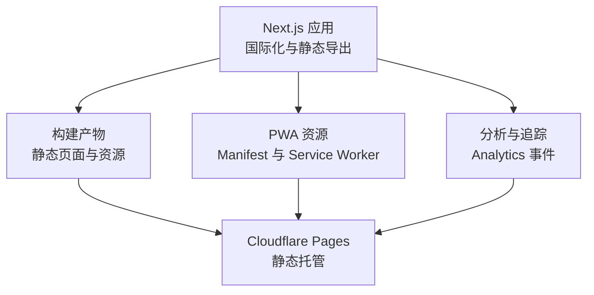
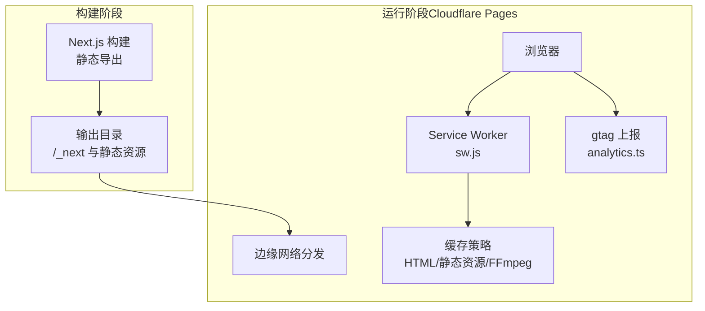
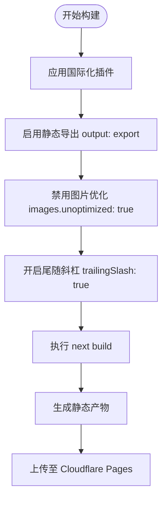
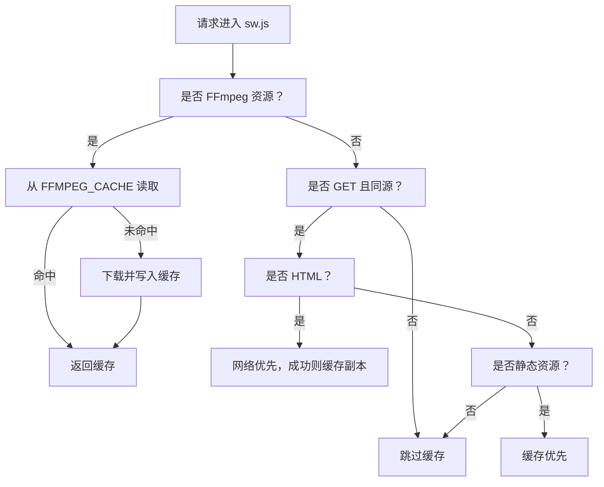
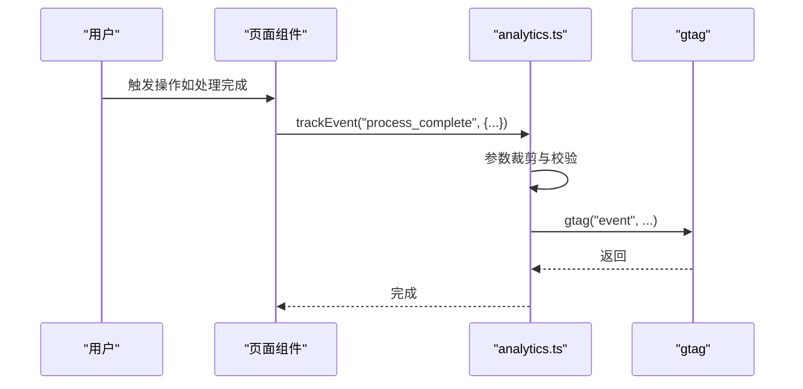
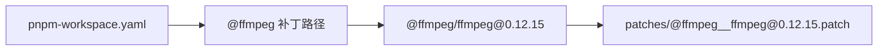
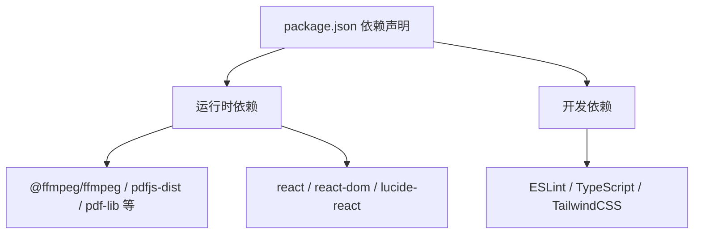

# 部署与维护

<cite>
**本文引用的文件**   
- [package.json](file://package.json)
- [next.config.ts](file://next.config.ts)
- [pnpm-workspace.yaml](file://pnpm-workspace.yaml)
- [patches/@ffmpeg__ffmpeg@0.12.15.patch](file://patches/@ffmpeg__ffmpeg@0.12.15.patch)
- [public/manifest.json](file://public/manifest.json)
- [public/sw.js](file://public/sw.js)
- [public/robots.txt](file://public/robots.txt)
- [src/lib/analytics.ts](file://src/lib/analytics.ts)
- [postcss.config.mjs](file://postcss.config.mjs)
- [tsconfig.json](file://tsconfig.json)
</cite>

## 目录
1. [简介](#简介)
2. [项目结构](#项目结构)
3. [核心组件](#核心组件)
4. [架构总览](#架构总览)
5. [详细组件分析](#详细组件分析)
6. [依赖分析](#依赖分析)
7. [性能考虑](#性能考虑)
8. [故障排除指南](#故障排除指南)
9. [结论](#结论)
10. [附录](#附录)

## 简介
本文件面向运维与开发团队，提供媒体工具箱在 Cloudflare Pages 上的静态部署与维护全栈指南。内容覆盖构建配置、PWA（Service Worker、Manifest、离线能力）、CI/CD 自动化部署策略、性能监控与错误追踪、维护与升级流程、故障排除与应急响应，以及日志与分析工具的使用建议。

## 项目结构
媒体工具箱采用 Next.js 16 应用，通过国际化插件增强多语言支持，并以静态导出模式构建为纯静态站点，适配 Cloudflare Pages 的无服务器静态托管特性。关键目录与文件如下：
- 构建与打包：package.json、next.config.ts、tsconfig.json、postcss.config.mjs
- PWA 资源：public/manifest.json、public/sw.js、public/robots.txt
- 依赖补丁：patches/@ffmpeg__ffmpeg@0.12.15.patch、pnpm-workspace.yaml
- 分析与追踪：src/lib/analytics.ts

**图表来源**
- [next.config.ts:6-12](file://next.config.ts#L6-L12)
- [public/manifest.json:1-29](file://public/manifest.json#L1-L29)
- [public/sw.js:1-93](file://public/sw.js#L1-L93)
- [src/lib/analytics.ts:106-137](file://src/lib/analytics.ts#L106-L137)

**章节来源**
- [package.json:1-45](file://package.json#L1-L45)
- [next.config.ts:1-13](file://next.config.ts#L1-L13)
- [tsconfig.json:1-35](file://tsconfig.json#L1-L35)
- [postcss.config.mjs:1-8](file://postcss.config.mjs#L1-L8)

## 核心组件
- 静态导出与国际化：通过 next.config.ts 启用 output: export 并集成国际化插件，确保多语言页面静态生成。
- PWA 能力：通过 public/manifest.json 提供应用元数据，public/sw.js 实现缓存策略与离线回退。
- 分析与追踪：src/lib/analytics.ts 定义事件参数与隐私裁剪逻辑，统一上报至 gtag。
- 依赖与补丁：pnpm-workspace.yaml 声明对 @ffmpeg/ffmpeg 的补丁路径，patches/@ffmpeg__ffmpeg@0.12.15.patch 修正 Web Worker 加载行为以兼容打包器。

**章节来源**
- [next.config.ts:6-12](file://next.config.ts#L6-L12)
- [public/manifest.json:1-29](file://public/manifest.json#L1-L29)
- [public/sw.js:1-93](file://public/sw.js#L1-L93)
- [src/lib/analytics.ts:106-137](file://src/lib/analytics.ts#L106-L137)
- [pnpm-workspace.yaml:1-3](file://pnpm-workspace.yaml#L1-L3)
- [patches/@ffmpeg__ffmpeg@0.12.15.patch:1-14](file://patches/@ffmpeg__ffmpeg@0.12.15.patch#L1-L14)

## 架构总览
媒体工具箱在 Cloudflare Pages 上的运行时架构由“静态构建 + PWA 缓存 + 分析上报”三部分组成。静态导出确保页面可直接分发；Service Worker 在客户端侧实现资源缓存与离线回退；分析模块在浏览器端收集用户行为并上报。

**图表来源**
- [next.config.ts:6-12](file://next.config.ts#L6-L12)
- [public/sw.js:30-92](file://public/sw.js#L30-L92)
- [src/lib/analytics.ts:106-137](file://src/lib/analytics.ts#L106-L137)

## 详细组件分析

### 静态构建与导出配置
- 关键点
  - output: export：生成静态页面，便于 Cloudflare Pages 直接托管。
  - images.unoptimized: true：禁用自动图像优化，避免运行时处理。
  - trailingSlash: true：为每个路由添加尾随斜杠，利于 CDN 缓存与重定向。
  - 国际化插件：通过 createNextIntlPlugin 包装 next.config，确保多语言路由与静态生成兼容。
- 影响范围
  - CI/CD：构建脚本需执行 next build，产物用于 Pages 部署。
  - PWA：静态资源命名与缓存键一致，便于 sw.js 缓存命中。

**图表来源**
- [next.config.ts:6-12](file://next.config.ts#L6-L12)

**章节来源**
- [next.config.ts:1-13](file://next.config.ts#L1-L13)

### PWA 配置与优化
- Manifest（应用元数据）
  - 字段：name、short_name、description、start_url、display、theme_color、background_color、icons、categories。
  - 作用：定义安装到主屏后的应用外观与启动行为。
- Service Worker（缓存与离线）
  - 缓存策略
    - FFmpeg 永久缓存：针对固定版本的 core/wasm 文件，首次加载后持久缓存。
    - HTML 网络优先：保持页面最新，失败时回退缓存。
    - 静态资源缓存优先：JS/CSS/字体/图片等，提升二次访问速度。
  - 清理策略：激活时清理旧缓存键，释放空间。
  - 跨域与非 GET 请求：跳过缓存，避免跨域风险与副作用。
- 离线能力
  - HTML 失败回退：网络异常时返回缓存页面。
  - 静态资源回退：缓存命中失败时返回空响应，避免破坏体验。

**图表来源**
- [public/sw.js:30-92](file://public/sw.js#L30-L92)

**章节来源**
- [public/manifest.json:1-29](file://public/manifest.json#L1-L29)
- [public/sw.js:1-93](file://public/sw.js#L1-L93)

### 性能监控与错误追踪
- 分析事件
  - 事件类型：文件上传、下载、复制、搜索、相关工具点击、FAQ 展开、主题切换、语言切换、分享、处理完成、处理错误等。
  - 参数结构：通过接口约束保证字段一致性；隐私保护：对长字符串进行截断，避免敏感信息上送。
- 上报机制
  - 依赖全局 gtag 可用性检测；若不可用则静默忽略，不阻塞页面。
  - 工具函数 createToolTracker 提供按工具维度的便捷封装。
- 建议
  - 在部署前注入正确的 Google Analytics 4 Tag ID 至前端环境。
  - 对错误事件增加本地日志采样与去重，避免风暴上报。

**图表来源**
- [src/lib/analytics.ts:106-137](file://src/lib/analytics.ts#L106-L137)

**章节来源**
- [src/lib/analytics.ts:1-138](file://src/lib/analytics.ts#L1-L138)

### 依赖与补丁管理
- pnpm 工作区
  - 声明 patchedDependencies，指向 @ffmpeg/ffmpeg 的补丁文件。
- 补丁内容
  - 修正 Web Worker 导入路径注释，避免打包器误判动态导入，确保 ESM 加载路径正确。
- 维护要点
  - 升级 @ffmpeg/ffmpeg 时同步检查补丁是否仍适用。
  - 使用 pnpm install 时确保补丁被应用。

**图表来源**
- [pnpm-workspace.yaml:1-3](file://pnpm-workspace.yaml#L1-L3)
- [patches/@ffmpeg__ffmpeg@0.12.15.patch:1-14](file://patches/@ffmpeg__ffmpeg@0.12.15.patch#L1-L14)

**章节来源**
- [pnpm-workspace.yaml:1-3](file://pnpm-workspace.yaml#L1-L3)
- [patches/@ffmpeg__ffmpeg@0.12.15.patch:1-14](file://patches/@ffmpeg__ffmpeg@0.12.15.patch#L1-L14)

## 依赖分析
- 构建与运行时
  - Next.js 16：框架与静态导出能力。
  - TypeScript：类型安全与编译配置。
  - Tailwind PostCSS 插件：样式管线。
- 媒体与工具库
  - @ffmpeg/ffmpeg：浏览器内音视频处理（配合补丁）。
  - pdfjs-dist、pdf-lib：PDF 处理。
  - react、react-dom：UI 基础。
- 开发与质量
  - ESLint、TailwindCSS、TypeScript：代码规范与样式体系。

**图表来源**
- [package.json:11-43](file://package.json#L11-L43)

**章节来源**
- [package.json:1-45](file://package.json#L1-L45)

## 性能考虑
- 构建期
  - 静态导出减少运行时渲染压力；禁用图片优化降低构建复杂度。
  - 尾随斜杠有助于 CDN 缓存命中与规范化链接。
- 运行期
  - Service Worker 缓存策略按资源类型分流，显著提升重复访问性能。
  - FFmpeg 资源永久缓存，避免频繁下载大体积 WASM。
- 监控与优化
  - 结合 Pages 边缘日志与 gtag 数据，识别慢页面与高错误率路径，针对性优化资源或算法。

[本节为通用指导，无需列出具体文件来源]

## 故障排除指南
- Service Worker 未生效
  - 检查 sw.js 是否随静态资源一起发布；确认浏览器已注册并处于激活状态。
  - 若更新缓存键或策略，请清除旧缓存或等待激活清理。
- FFmpeg 加载失败
  - 确认网络可达性与跨域策略；检查补丁是否正确应用。
- 分析事件未上报
  - 确认 gtag 注入与可用性；检查隐私裁剪是否导致关键字段缺失。
- 部署失败
  - 确认构建命令与产物路径；核对 Pages 设置中的构建命令与输出目录。

**章节来源**
- [public/sw.js:11-28](file://public/sw.js#L11-L28)
- [patches/@ffmpeg__ffmpeg@0.12.15.patch:1-14](file://patches/@ffmpeg__ffmpeg@0.12.15.patch#L1-L14)
- [src/lib/analytics.ts:106-137](file://src/lib/analytics.ts#L106-L137)

## 结论
媒体工具箱通过静态导出与 PWA 能力，在 Cloudflare Pages 上实现了高性能、可离线的用户体验。结合分析与监控，可持续优化性能与稳定性。建议在 CI/CD 中固化构建与测试流程，并定期评估依赖安全性与兼容性。

[本节为总结，无需列出具体文件来源]

## 附录

### Cloudflare Pages 部署清单
- 构建命令：next build
- 输出目录：out（由静态导出生成）
- 环境变量（示例）
  - NEXT_PUBLIC_GA_ID：Google Analytics 4 Tag ID
  - NEXT_PUBLIC_SITE_URL：站点基础 URL（用于 SEO 与分享）
- 域名配置
  - 添加自定义域名并在 DNS 中配置 CNAME 或记录类型。
  - 在 Pages 设置中启用自定义域名并配置 SSL。
- 备份与回滚
  - 保留最近几个版本的构建产物，以便快速回滚。

[本节为通用部署指引，无需列出具体文件来源]

### CI/CD 自动化部署策略
- 触发条件
  - 主分支推送、标签推送、PR 合并。
- 步骤建议
  - 依赖安装（pnpm install --frozen-lockfile）
  - 类型检查与 lint
  - 构建（next build）
  - 测试（可选）
  - 静态导出（由构建生成）
  - 推送至 Pages（通过 CLI 或平台集成）
- 安全与审计
  - 依赖扫描与漏洞报告
  - 代码签名与密钥轮换

[本节为通用流程建议，无需列出具体文件来源]

### 维护与升级流程
- 依赖升级
  - 优先升级小版本；对 @ffmpeg/ffmpeg 等底层库，先在本地验证补丁兼容性。
  - 更新 pnpm-lock.yaml 并重新构建测试。
- 漏洞修复
  - 使用 pnpm audit 或第三方工具扫描；按严重级别排序修复。
  - 发布前进行端到端回归测试。
- 版本发布
  - 语义化版本号；变更日志；灰度发布与监控指标对比。

[本节为通用流程建议，无需列出具体文件来源]

### 日志记录与分析
- 边缘日志
  - 利用 Pages 边缘日志定位 5xx、超时与缓存未命中。
- 前端分析
  - gtag 事件上报与转化追踪；结合 GA4 报表观察用户路径与留存。
- 错误追踪
  - 可选集成轻量级错误上报（如 Sentry SDK），仅上报必要上下文并遵循隐私要求。

[本节为通用指导，无需列出具体文件来源]