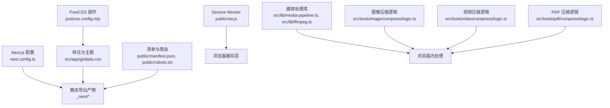
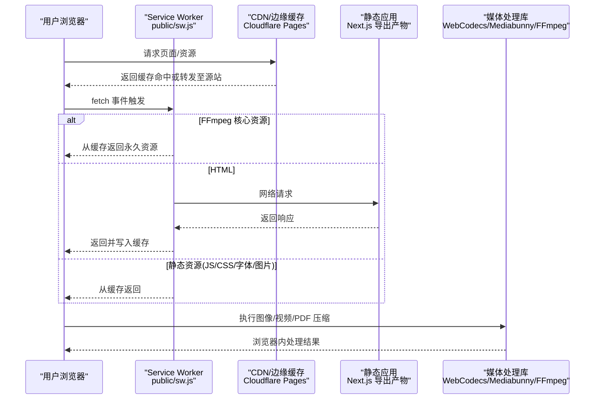
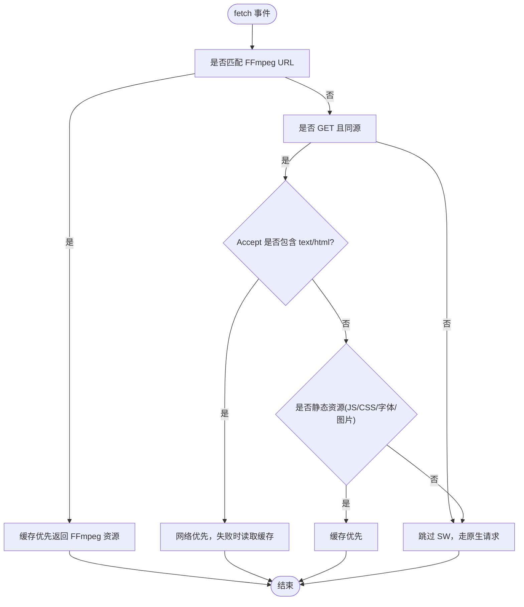
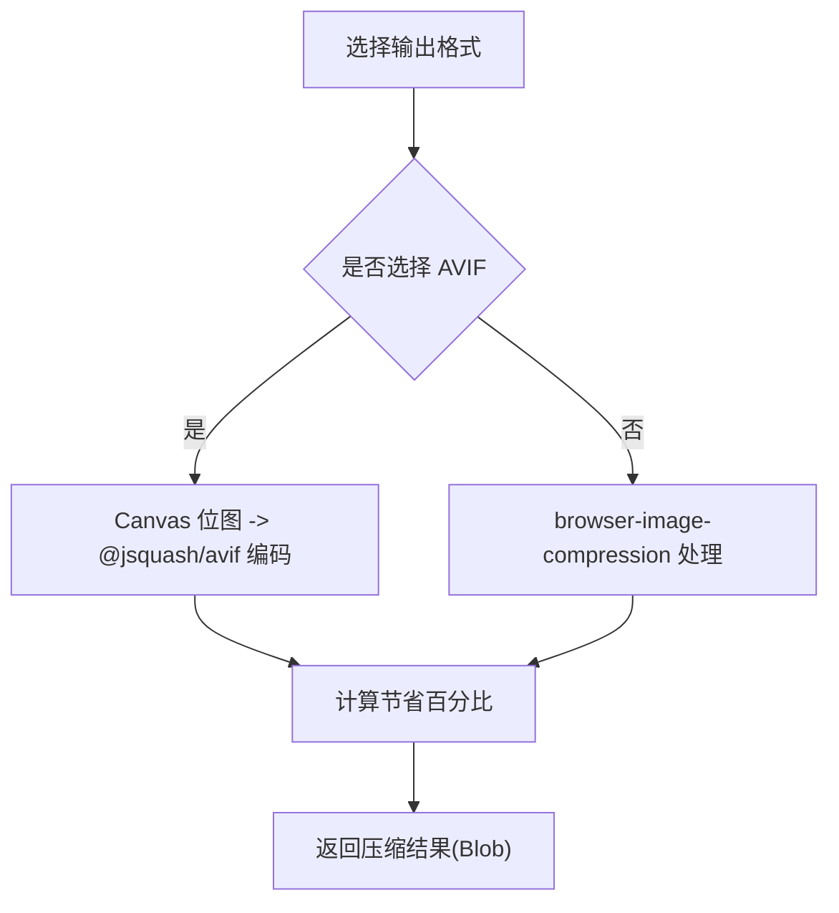
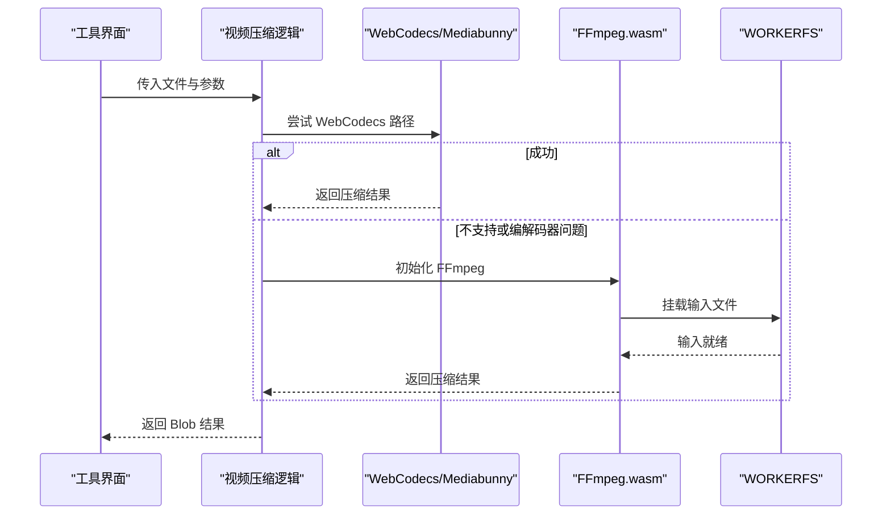
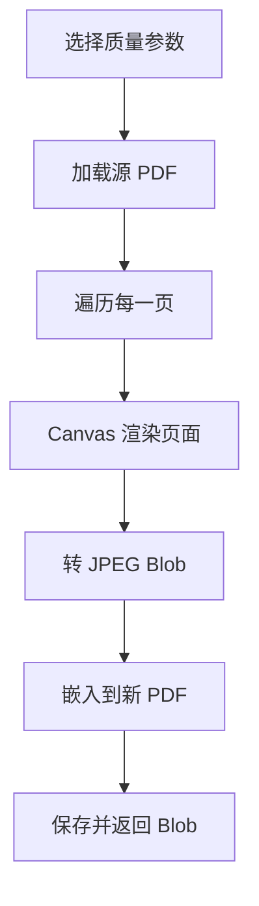
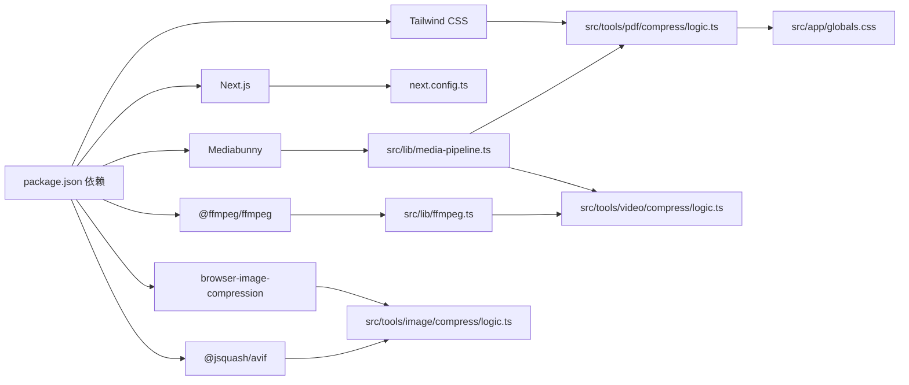

# CDN与静态资源

<cite>
**本文档引用的文件**
- [package.json](file://package.json)
- [next.config.ts](file://next.config.ts)
- [postcss.config.mjs](file://postcss.config.mjs)
- [src/app/globals.css](file://src/app/globals.css)
- [public/manifest.json](file://public/manifest.json)
- [public/robots.txt](file://public/robots.txt)
- [public/sw.js](file://public/sw.js)
- [src/lib/media-pipeline.ts](file://src/lib/media-pipeline.ts)
- [src/lib/ffmpeg.ts](file://src/lib/ffmpeg.ts)
- [src/tools/image/compress/logic.ts](file://src/tools/image/compress/logic.ts)
- [src/tools/video/compress/logic.ts](file://src/tools/video/compress/logic.ts)
- [src/tools/pdf/compress/logic.ts](file://src/tools/pdf/compress/logic.ts)
</cite>

## 目录
1. [简介](#简介)
2. [项目结构](#项目结构)
3. [核心组件](#核心组件)
4. [架构总览](#架构总览)
5. [详细组件分析](#详细组件分析)
6. [依赖关系分析](#依赖关系分析)
7. [性能考量](#性能考量)
8. [故障排除指南](#故障排除指南)
9. [结论](#结论)
10. [附录](#附录)

## 简介
本文件面向 PrivaDeck 媒体工具箱的 CDN 与静态资源优化，聚焦以下目标：
- 静态资源组织与优化：图片压缩、字体优化、代码分割
- CDN 集成方案：Cloudflare Pages 部署配置与资源缓存策略
- 静态导出模式下的资源处理：HTML、CSS、JavaScript 的优化
- 媒体文件的特殊处理：大文件传输优化与流式处理
- CDN 性能监控与故障排除、回退策略配置
- 资源版本控制与缓存失效机制

## 项目结构
PrivaDeck 使用 Next.js 16（静态导出模式），结合浏览器内媒体处理能力（WebCodecs/Mediabunny）与本地 FFmpeg.wasm 处理，强调“零上传、100% 本地处理”。关键静态资源与配置分布如下：
- 构建与导出配置：next.config.ts（静态导出、禁用图片优化、COOP/COEP）
- 样式与主题：postcss.config.mjs、src/app/globals.css（Tailwind 主题变量）
- 清单与爬虫：public/manifest.json、public/robots.txt
- 离线缓存：public/sw.js（Service Worker 缓存策略）
- 媒体处理：src/lib/media-pipeline.ts、src/lib/ffmpeg.ts
- 工具逻辑：各工具目录下的 compress/logic.ts（图像/视频/PDF）

图表来源
- [next.config.ts:1-30](file://next.config.ts#L1-L30)
- [postcss.config.mjs:1-8](file://postcss.config.mjs#L1-L8)
- [src/app/globals.css:1-128](file://src/app/globals.css#L1-L128)
- [public/manifest.json:1-29](file://public/manifest.json#L1-L29)
- [public/robots.txt:1-5](file://public/robots.txt#L1-L5)
- [public/sw.js:1-93](file://public/sw.js#L1-L93)
- [src/lib/media-pipeline.ts:1-105](file://src/lib/media-pipeline.ts#L1-L105)
- [src/lib/ffmpeg.ts:1-144](file://src/lib/ffmpeg.ts#L1-L144)
- [src/tools/image/compress/logic.ts:1-135](file://src/tools/image/compress/logic.ts#L1-L135)
- [src/tools/video/compress/logic.ts:1-257](file://src/tools/video/compress/logic.ts#L1-L257)
- [src/tools/pdf/compress/logic.ts:1-73](file://src/tools/pdf/compress/logic.ts#L1-L73)

章节来源
- [next.config.ts:1-30](file://next.config.ts#L1-L30)
- [postcss.config.mjs:1-8](file://postcss.config.mjs#L1-L8)
- [src/app/globals.css:1-128](file://src/app/globals.css#L1-L128)
- [public/manifest.json:1-29](file://public/manifest.json#L1-L29)
- [public/robots.txt:1-5](file://public/robots.txt#L1-L5)
- [public/sw.js:1-93](file://public/sw.js#L1-L93)

## 核心组件
- 静态导出与安全头
  - 配置静态导出、禁用 Next 图片优化、添加 COOP/COEP 安全头，确保在 Cloudflare Pages 上可稳定运行。
- Service Worker 缓存策略
  - 持久缓存 FFmpeg 核心资源；HTML 网络优先保持新鲜；静态资源（JS/CSS/字体/图片）缓存优先。
- 媒体处理管线
  - WebCodecs/Mediabunny 作为首选硬件加速路径；不支持时回退到 FFmpeg.wasm；严格校验编解码器兼容性。
- 图像/视频/PDF 压缩逻辑
  - 图像：支持 AVIF/WebP/JPEG/PNG，并提供多种预设；视频：基于 CRF/分辨率/FPS/码率的 WebCodecs 或 FFmpeg 路径；PDF：Canvas 渲染后转 JPEG 再嵌入生成新 PDF。

章节来源
- [next.config.ts:6-27](file://next.config.ts#L6-L27)
- [public/sw.js:1-93](file://public/sw.js#L1-L93)
- [src/lib/media-pipeline.ts:1-105](file://src/lib/media-pipeline.ts#L1-L105)
- [src/lib/ffmpeg.ts:1-144](file://src/lib/ffmpeg.ts#L1-L144)
- [src/tools/image/compress/logic.ts:1-135](file://src/tools/image/compress/logic.ts#L1-L135)
- [src/tools/video/compress/logic.ts:1-257](file://src/tools/video/compress/logic.ts#L1-L257)
- [src/tools/pdf/compress/logic.ts:1-73](file://src/tools/pdf/compress/logic.ts#L1-L73)

## 架构总览
下图展示从用户访问到静态资源加载、Service Worker 缓存与媒体处理的整体流程。

图表来源
- [public/sw.js:30-92](file://public/sw.js#L30-L92)
- [next.config.ts:6-27](file://next.config.ts#L6-L27)
- [src/lib/media-pipeline.ts:1-105](file://src/lib/media-pipeline.ts#L1-L105)
- [src/lib/ffmpeg.ts:1-144](file://src/lib/ffmpeg.ts#L1-L144)

## 详细组件分析

### 静态导出与资源组织
- 导出模式与图片优化
  - 启用静态导出，禁用 Next 图片优化，避免自动重写静态资源路径导致的 CDN 缓存不一致。
- 安全头设置
  - 设置 COEP/COOP，满足跨源隔离要求，使 SharedArrayBuffer 可用，提升多线程性能。
- 样式与主题
  - Tailwind 主题变量集中定义，全局 CSS 在构建时内联，减少额外请求。
- 清单与爬虫
  - PWA 清单与 robots.txt 提供 SEO 与安装元数据，便于 CDN 缓存与索引。

章节来源
- [next.config.ts:6-27](file://next.config.ts#L6-L27)
- [postcss.config.mjs:1-8](file://postcss.config.mjs#L1-L8)
- [src/app/globals.css:1-128](file://src/app/globals.css#L1-L128)
- [public/manifest.json:1-29](file://public/manifest.json#L1-L29)
- [public/robots.txt:1-5](file://public/robots.txt#L1-L5)

### Service Worker 与缓存策略
- 缓存命名与职责
  - 应用缓存、FFmpeg 永久缓存、静态资源缓存三套缓存，避免相互污染。
- FFmpeg 资源
  - 永久缓存（URL 包含版本号），网络失败时回退错误响应。
- HTML
  - 网络优先策略，保证页面内容最新；成功后写入缓存。
- 静态资源
  - 缓存优先策略，命中则直接返回，未命中再网络获取并写入缓存。
- 跨域与方法过滤
  - 仅对 GET 且同源请求生效，避免跨域风险。

图表来源
- [public/sw.js:30-92](file://public/sw.js#L30-L92)

章节来源
- [public/sw.js:1-93](file://public/sw.js#L1-L93)

### 图片压缩与字体优化
- 图片压缩
  - 支持 AVIF/WebP/JPEG/PNG 输出格式；提供高质量/均衡/小体积/自定义预设；可按最大尺寸或最长边缩放；保留 EXIF 可选。
  - AVIF 路径使用 Canvas + @jsquash/avif 进行像素级编码，适合高压缩比场景。
- 字体与图标
  - Tailwind 通过 CSS 变量注入字体族；图标来自 Lucide React，建议使用 WOFF2 以获得更佳体积与兼容性。
- 代码分割
  - Next.js 默认按路由拆分代码；工具页面按需加载，减少首屏 JS 体积。

图表来源
- [src/tools/image/compress/logic.ts:36-123](file://src/tools/image/compress/logic.ts#L36-L123)

章节来源
- [src/tools/image/compress/logic.ts:1-135](file://src/tools/image/compress/logic.ts#L1-L135)
- [src/app/globals.css:1-128](file://src/app/globals.css#L1-L128)
- [package.json:11-32](file://package.json#L11-L32)

### 视频压缩与流式处理
- 路径选择
  - 优先使用 WebCodecs/Mediabunny，自动硬件加速；若检测到不支持的视频编解码器（如 H.265/HEVC、VP9、AV1），抛出不可恢复错误，不再回退到 FFmpeg。
- 参数映射
  - CRF 映射为视频码率，结合分辨率进行像素比例缩放；音频码率与 FPS 可控；支持最大码率上限与缓冲区参数。
- FFmpeg 回退
  - 通过 WORKERFS 挂载输入文件，避免内存复制；串行队列执行，防止挂载点冲突；进度回调原子化设置/清理。
- 流式处理
  - 压缩过程在浏览器内完成，输出为 Blob；可直接下载或继续二次处理。

图表来源
- [src/tools/video/compress/logic.ts:85-201](file://src/tools/video/compress/logic.ts#L85-L201)
- [src/lib/ffmpeg.ts:99-143](file://src/lib/ffmpeg.ts#L99-L143)
- [src/lib/media-pipeline.ts:28-91](file://src/lib/media-pipeline.ts#L28-L91)

章节来源
- [src/tools/video/compress/logic.ts:1-257](file://src/tools/video/compress/logic.ts#L1-L257)
- [src/lib/ffmpeg.ts:1-144](file://src/lib/ffmpeg.ts#L1-L144)
- [src/lib/media-pipeline.ts:1-105](file://src/lib/media-pipeline.ts#L1-L105)

### PDF 压缩与大文件传输
- 处理流程
  - 使用 pdf-lib 与 pdfjs-dist 逐页渲染到 Canvas，按质量参数转 JPEG，再嵌入新 PDF；最后保存为 Blob。
- 大文件优化
  - 逐页处理，避免一次性加载整个 PDF；Canvas 渲染后及时释放宽高以回收 GPU 内存。
- 下载与传输
  - 输出 Blob 直接用于下载或后续处理，减少中间对象的内存占用。

图表来源
- [src/tools/pdf/compress/logic.ts:12-66](file://src/tools/pdf/compress/logic.ts#L12-L66)

章节来源
- [src/tools/pdf/compress/logic.ts:1-73](file://src/tools/pdf/compress/logic.ts#L1-L73)

### CDN 集成与缓存策略
- Cloudflare Pages 部署要点
  - 静态导出产物可直接部署；COOP/COEP 头确保跨源隔离，利于 SharedArrayBuffer 与多线程性能。
- 资源缓存策略
  - FFmpeg 永久缓存（URL 版本化）；HTML 网络优先；静态资源缓存优先；Service Worker 统一管理。
- 资源版本控制
  - FFmpeg URL 包含版本号，天然具备长缓存与失效控制；静态资源由 Next.js 导出时生成带哈希的文件名，实现强缓存与更新。

章节来源
- [next.config.ts:6-27](file://next.config.ts#L6-L27)
- [public/sw.js:33-49](file://public/sw.js#L33-L49)
- [src/lib/ffmpeg.ts:19-24](file://src/lib/ffmpeg.ts#L19-L24)

## 依赖关系分析
- 构建与样式
  - PostCSS 插件驱动 Tailwind；全局 CSS 注入主题变量，减少运行时开销。
- 媒体处理
  - WebCodecs/Mediabunny 与 FFmpeg.wasm 并行存在，按能力与编解码器兼容性动态选择。
- 工具模块
  - 各工具的 compress/logic.ts 仅依赖通用库与浏览器 API，降低耦合度。

图表来源
- [package.json:11-32](file://package.json#L11-L32)
- [next.config.ts:1-30](file://next.config.ts#L1-L30)
- [postcss.config.mjs:1-8](file://postcss.config.mjs#L1-L8)
- [src/app/globals.css:1-128](file://src/app/globals.css#L1-L128)
- [src/lib/media-pipeline.ts:1-105](file://src/lib/media-pipeline.ts#L1-L105)
- [src/lib/ffmpeg.ts:1-144](file://src/lib/ffmpeg.ts#L1-L144)
- [src/tools/image/compress/logic.ts:1-135](file://src/tools/image/compress/logic.ts#L1-L135)
- [src/tools/video/compress/logic.ts:1-257](file://src/tools/video/compress/logic.ts#L1-L257)
- [src/tools/pdf/compress/logic.ts:1-73](file://src/tools/pdf/compress/logic.ts#L1-L73)

章节来源
- [package.json:11-32](file://package.json#L11-L32)
- [next.config.ts:1-30](file://next.config.ts#L1-L30)
- [postcss.config.mjs:1-8](file://postcss.config.mjs#L1-L8)
- [src/app/globals.css:1-128](file://src/app/globals.css#L1-L128)
- [src/lib/media-pipeline.ts:1-105](file://src/lib/media-pipeline.ts#L1-L105)
- [src/lib/ffmpeg.ts:1-144](file://src/lib/ffmpeg.ts#L1-L144)
- [src/tools/image/compress/logic.ts:1-135](file://src/tools/image/compress/logic.ts#L1-L135)
- [src/tools/video/compress/logic.ts:1-257](file://src/tools/video/compress/logic.ts#L1-L257)
- [src/tools/pdf/compress/logic.ts:1-73](file://src/tools/pdf/compress/logic.ts#L1-L73)

## 性能考量
- 静态资源
  - 使用静态导出与 Service Worker 缓存，显著降低重复请求；字体采用 WOFF2 更优体积。
- 媒体处理
  - WebCodecs/Mediabunny 硬件加速优先；FFmpeg.wasm 通过 WORKERFS 减少内存拷贝；Canvas 渲染后及时释放内存。
- 编解码器兼容性
  - 对不支持的视频编解码器（如 H.265/HEVC、VP9、AV1）直接报错，避免低效回退路径。
- CDN 边缘缓存
  - FFmpeg 核心资源版本化 URL，HTML 网络优先，静态资源缓存优先，最大化命中率。

## 故障排除指南
- 页面空白或功能异常
  - 检查 COOP/COEP 头是否正确下发；确认浏览器支持 SharedArrayBuffer。
- FFmpeg 加载失败
  - 核对 CDN 对 @ffmpeg/core 的可达性；检查 Service Worker 是否缓存了旧版本。
- 视频处理卡顿或失败
  - 若出现“不受支持的视频编解码器”错误，提示用户更换视频格式或使用其他工具。
- 缓存命中异常
  - 清除浏览器缓存或禁用 SW 验证；确认静态资源文件名已更新（哈希变化）。

章节来源
- [next.config.ts:10-26](file://next.config.ts#L10-L26)
- [public/sw.js:11-28](file://public/sw.js#L11-L28)
- [src/lib/ffmpeg.ts:19-38](file://src/lib/ffmpeg.ts#L19-L38)
- [src/lib/media-pipeline.ts:48-53](file://src/lib/media-pipeline.ts#L48-L53)
- [src/tools/video/compress/logic.ts:96-107](file://src/tools/video/compress/logic.ts#L96-L107)

## 结论
通过静态导出、Service Worker 缓存与浏览器内媒体处理的组合，PrivaDeck 在保障隐私与性能的同时，实现了高效的 CDN 资源利用。建议在生产环境持续监控缓存命中率与处理成功率，并根据用户反馈优化预设参数与回退策略。

## 附录
- 关键配置与文件定位
  - 构建与导出：[next.config.ts:1-30](file://next.config.ts#L1-L30)
  - 样式与主题：[postcss.config.mjs:1-8](file://postcss.config.mjs#L1-L8)、[src/app/globals.css:1-128](file://src/app/globals.css#L1-L128)
  - 清单与爬虫：[public/manifest.json:1-29](file://public/manifest.json#L1-L29)、[public/robots.txt:1-5](file://public/robots.txt#L1-L5)
  - 离线缓存：[public/sw.js:1-93](file://public/sw.js#L1-L93)
  - 媒体处理：[src/lib/media-pipeline.ts:1-105](file://src/lib/media-pipeline.ts#L1-L105)、[src/lib/ffmpeg.ts:1-144](file://src/lib/ffmpeg.ts#L1-L144)
  - 工具逻辑：[src/tools/image/compress/logic.ts:1-135](file://src/tools/image/compress/logic.ts#L1-L135)、[src/tools/video/compress/logic.ts:1-257](file://src/tools/video/compress/logic.ts#L1-L257)、[src/tools/pdf/compress/logic.ts:1-73](file://src/tools/pdf/compress/logic.ts#L1-L73)