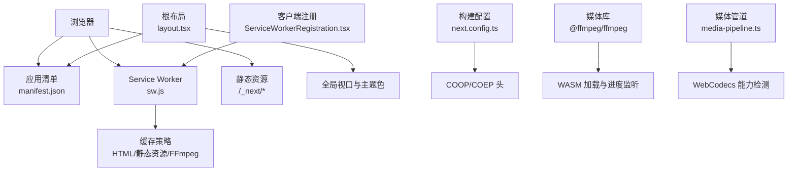
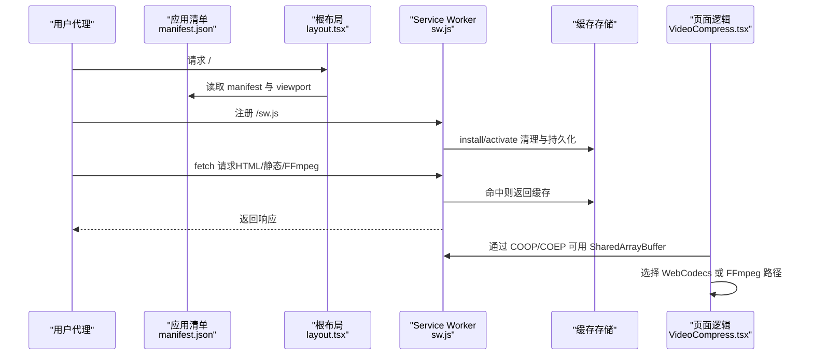
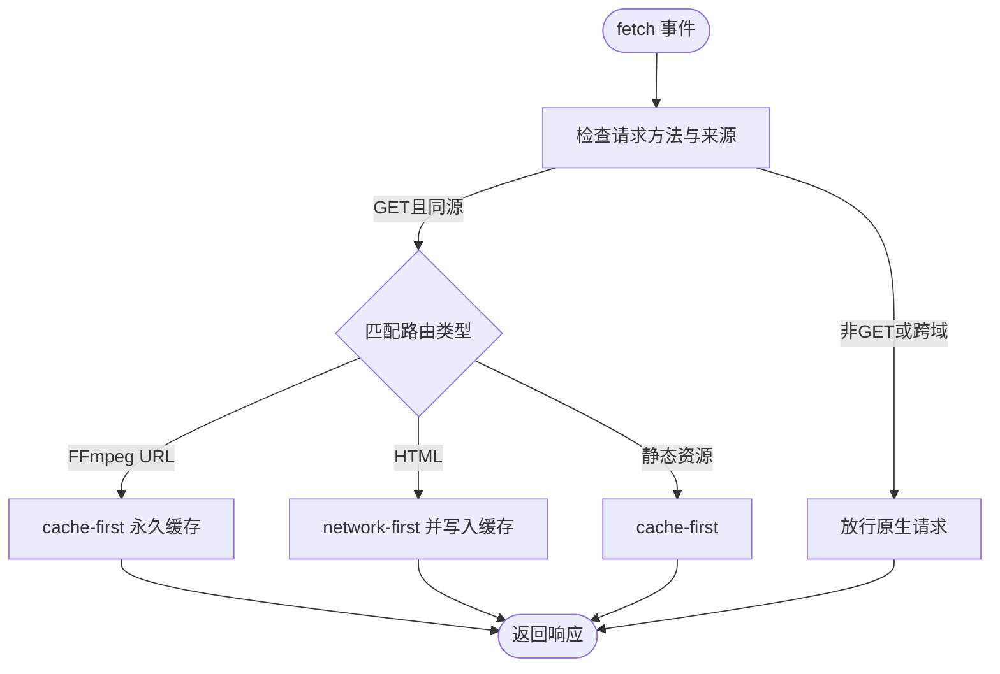
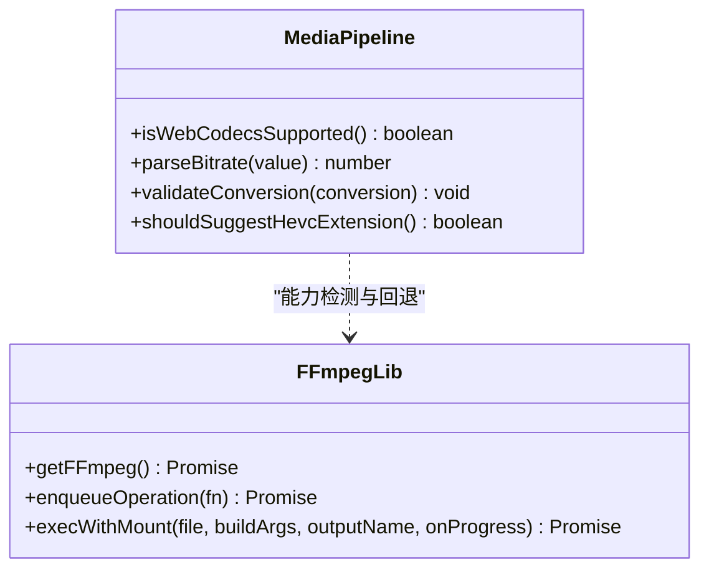
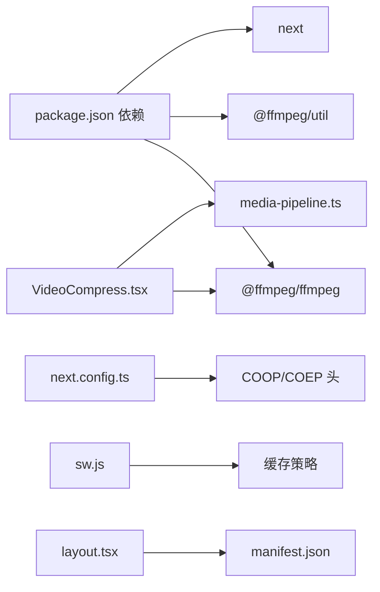

# PWA配置

<cite>
**本文引用的文件**
- [public/manifest.json](file://public/manifest.json)
- [public/sw.js](file://public/sw.js)
- [src/components/shared/ServiceWorkerRegistration.tsx](file://src/components/shared/ServiceWorkerRegistration.tsx)
- [next.config.ts](file://next.config.ts)
- [package.json](file://package.json)
- [src/lib/ffmpeg.ts](file://src/lib/ffmpeg.ts)
- [src/lib/media-pipeline.ts](file://src/lib/media-pipeline.ts)
- [src/tools/video/compress/VideoCompress.tsx](file://src/tools/video/compress/VideoCompress.tsx)
- [src/app/layout.tsx](file://src/app/layout.tsx)
- [src/components/shared/InstallPrompt.tsx](file://src/components/shared/InstallPrompt.tsx)
</cite>

## 目录
1. [简介](#简介)
2. [项目结构](#项目结构)
3. [核心组件](#核心组件)
4. [架构总览](#架构总览)
5. [详细组件分析](#详细组件分析)
6. [依赖关系分析](#依赖关系分析)
7. [性能考量](#性能考量)
8. [故障排查指南](#故障排查指南)
9. [结论](#结论)
10. [附录](#附录)

## 简介
本文件面向 PrivaDeck 媒体工具箱的 PWA 配置与实现，系统化阐述 Service Worker 的注册与缓存策略、应用清单（manifest.json）配置、PWA 功能在媒体处理场景中的特殊考虑（大文件、内存管理、体验优化）、与浏览器 API 的集成（文件系统访问、WebAssembly 支持），以及测试、调试与跨浏览器兼容性建议。

## 项目结构
PrivaDeck 使用 Next.js 构建静态导出（export 输出），PWA 相关资源集中于 public 目录与客户端组件中：
- 应用清单：public/manifest.json
- Service Worker：public/sw.js
- 客户端注册：src/components/shared/ServiceWorkerRegistration.tsx
- 全局元数据与视口：src/app/layout.tsx
- 构建配置与 COOP/COEP 头：next.config.ts
- 依赖与脚本：package.json
- 媒体处理能力检测与回退：src/lib/ffmpeg.ts、src/lib/media-pipeline.ts
- 视频压缩工具页面示例：src/tools/video/compress/VideoCompress.tsx
- 安装提示组件：src/components/shared/InstallPrompt.tsx

图表来源
- [public/manifest.json:1-29](file://public/manifest.json#L1-L29)
- [public/sw.js:1-93](file://public/sw.js#L1-L93)
- [src/components/shared/ServiceWorkerRegistration.tsx:1-16](file://src/components/shared/ServiceWorkerRegistration.tsx#L1-L16)
- [src/app/layout.tsx:1-48](file://src/app/layout.tsx#L1-L48)
- [next.config.ts:1-30](file://next.config.ts#L1-L30)
- [src/lib/ffmpeg.ts:1-144](file://src/lib/ffmpeg.ts#L1-L144)
- [src/lib/media-pipeline.ts:1-105](file://src/lib/media-pipeline.ts#L1-L105)

章节来源
- [public/manifest.json:1-29](file://public/manifest.json#L1-L29)
- [public/sw.js:1-93](file://public/sw.js#L1-L93)
- [src/components/shared/ServiceWorkerRegistration.tsx:1-16](file://src/components/shared/ServiceWorkerRegistration.tsx#L1-L16)
- [src/app/layout.tsx:1-48](file://src/app/layout.tsx#L1-L48)
- [next.config.ts:1-30](file://next.config.ts#L1-L30)
- [package.json:1-45](file://package.json#L1-L45)

## 核心组件
- 应用清单（manifest.json）
  - 包含应用名称、短名、描述、入口路径、显示模式、主题色、背景色、图标集合与分类等字段。
  - 图标包含 192×192、512×512 普通图标与一个可掩码（maskable）图标，满足现代浏览器安装与深色模式适配需求。
- Service Worker（sw.js）
  - 定义三个缓存命名空间：主应用缓存、FFmpeg 永久缓存、静态资源缓存。
  - 缓存策略：
    - FFmpeg 永久缓存：对指定版本的 @ffmpeg/core JS/WASM 进行 cache-first 永久缓存。
    - HTML：network-first，保持 Cloudflare Pages 内容新鲜。
    - 静态资源（JS/CSS/图片/WebFont 等）：cache-first。
  - 生命周期：install 时跳过等待；activate 时清理旧缓存并 claim 所有 clients。
- 客户端注册（ServiceWorkerRegistration.tsx）
  - 在浏览器支持的前提下，注册 /sw.js，失败静默处理。
- 全局元数据与视口（layout.tsx）
  - 设置 manifest、Apple WebApp 标志、主题色、viewport 等。
- 构建配置（next.config.ts）
  - 输出类型为 export，禁用图片优化，开启尾斜杠。
  - 设置 COOP/COEP 头以启用 SharedArrayBuffer，满足 FFmpeg WASM 的多线程需求。
- 媒体处理能力（ffmpeg.ts、media-pipeline.ts）
  - FFmpeg WASM 加载、进度事件绑定、队列串行执行、WORKERFS 直挂文件避免内存复制。
  - WebCodecs 能力检测与回退策略，针对不支持的编解码器抛出错误并引导安装扩展。

章节来源
- [public/manifest.json:1-29](file://public/manifest.json#L1-L29)
- [public/sw.js:1-93](file://public/sw.js#L1-L93)
- [src/components/shared/ServiceWorkerRegistration.tsx:1-16](file://src/components/shared/ServiceWorkerRegistration.tsx#L1-L16)
- [src/app/layout.tsx:1-48](file://src/app/layout.tsx#L1-L48)
- [next.config.ts:1-30](file://next.config.ts#L1-L30)
- [src/lib/ffmpeg.ts:1-144](file://src/lib/ffmpeg.ts#L1-L144)
- [src/lib/media-pipeline.ts:1-105](file://src/lib/media-pipeline.ts#L1-L105)

## 架构总览
下图展示 PWA 关键交互：浏览器加载页面 → 读取清单 → 注册 SW → SW 按策略缓存资源 → 页面通过 FFmpeg/WebCodecs 进行本地媒体处理。

图表来源
- [public/manifest.json:1-29](file://public/manifest.json#L1-L29)
- [src/app/layout.tsx:1-48](file://src/app/layout.tsx#L1-L48)
- [public/sw.js:1-93](file://public/sw.js#L1-L93)
- [src/tools/video/compress/VideoCompress.tsx:1-529](file://src/tools/video/compress/VideoCompress.tsx#L1-L529)
- [next.config.ts:1-30](file://next.config.ts#L1-L30)

## 详细组件分析

### Service Worker 实现与注册机制
- 注册流程
  - 客户端组件在挂载后调用 navigator.serviceWorker.register("/sw.js")，失败静默，不影响核心功能。
- 缓存策略
  - 主应用缓存（CACHE_NAME）：用于 HTML 的 network-first，保证页面内容最新。
  - FFmpeg 永久缓存（FFMPEG_CACHE）：对固定版本的 @ffmpeg/core JS/WASM 进行 cache-first，确保离线可用且稳定。
  - 静态资源缓存（STATIC_CACHE）：对 JS/CSS/图片/WebFont 等进行 cache-first，提升二次加载速度。
- 生命周期
  - install：skipWaiting，尽快接管新版本。
  - activate：删除旧缓存并 claim 所有 clients，确保新策略立即生效。
- 跨域与请求过滤
  - 非 GET 或跨域请求直接放行，避免对第三方资源产生意外行为。
- 更新处理
  - 通过 install/activate 阶段清理旧缓存，配合版本化的缓存命名实现平滑更新。

图表来源
- [public/sw.js:30-92](file://public/sw.js#L30-L92)

章节来源
- [src/components/shared/ServiceWorkerRegistration.tsx:1-16](file://src/components/shared/ServiceWorkerRegistration.tsx#L1-L16)
- [public/sw.js:1-93](file://public/sw.js#L1-L93)

### 应用清单（manifest.json）配置
- 必填与常用字段
  - name/short_name/description：品牌与用途说明。
  - start_url/display：入口路径与独立应用模式。
  - theme_color/background_color：主题与启动页背景色。
  - icons：包含 192×192、512×512 普通图标与 512×512 maskable 图标，适配不同设备与深色模式。
  - categories：工具类与生产力类别。
- 与 Next.js 集成
  - 根布局通过 manifest 字段指向 /manifest.json，确保浏览器正确识别 PWA 元数据。

章节来源
- [public/manifest.json:1-29](file://public/manifest.json#L1-L29)
- [src/app/layout.tsx:10-17](file://src/app/layout.tsx#L10-L17)

### PWA 与浏览器 API 集成
- SharedArrayBuffer 与 COOP/COEP
  - 构建配置设置 Cross-Origin-Opener-Policy 与 Cross-Origin-Embedder-Policy，使 SharedArrayBuffer 可用，从而支持 FFmpeg WASM 多线程加速。
- 文件系统访问
  - 工具页面通过 WORKERFS 将 File 对象直接挂载到虚拟文件系统，避免内存复制，降低峰值占用。
- WebAssembly 支持
  - FFmpeg 通过 @ffmpeg/ffmpeg 与 @ffmpeg/util 提供 WASM 加载与 Blob URL，结合进度事件回调提供良好体验。
- WebCodecs 能力检测
  - 在不支持 SharedArrayBuffer 或特定编解码器时，自动回退至 FFmpeg；同时对不支持的视频编解码器抛出明确错误并提示安装扩展。

图表来源
- [src/lib/media-pipeline.ts:1-105](file://src/lib/media-pipeline.ts#L1-L105)
- [src/lib/ffmpeg.ts:1-144](file://src/lib/ffmpeg.ts#L1-L144)

章节来源
- [next.config.ts:10-26](file://next.config.ts#L10-L26)
- [src/lib/ffmpeg.ts:99-144](file://src/lib/ffmpeg.ts#L99-L144)
- [src/lib/media-pipeline.ts:1-105](file://src/lib/media-pipeline.ts#L1-L105)

### 媒体处理场景的 PWA 特殊考虑
- 大文件处理
  - 使用 WORKERFS 直接挂载 File，避免两次内存拷贝；完成后及时释放 MEMFS 数据，降低峰值内存。
- 内存管理
  - 通过队列串行执行 FFmpeg 操作，避免并发冲突；在 finally 中清理挂载点与临时目录。
- 用户体验优化
  - 提供进度条与预览；在不支持 SharedArrayBuffer 或 WebCodecs 时给出降级提示；对不支持的视频编解码器提供安装扩展建议。
- 错误处理
  - 明确区分“可回退”的编解码器问题与“不可回退”的终端错误，指导用户采取相应措施。

章节来源
- [src/lib/ffmpeg.ts:75-144](file://src/lib/ffmpeg.ts#L75-L144)
- [src/tools/video/compress/VideoCompress.tsx:66-103](file://src/tools/video/compress/VideoCompress.tsx#L66-L103)
- [src/lib/media-pipeline.ts:28-53](file://src/lib/media-pipeline.ts#L28-L53)

### 安装提示与离线体验
- 安装提示（InstallPrompt）
  - 监听 beforeinstallprompt，延迟显示安装按钮，用户可随时关闭并持久记录。
- 离线体验
  - HTML 采用 network-first 策略，静态资源 cache-first，FFmpeg 永久缓存，保障核心功能在离线或弱网下可用。

章节来源
- [src/components/shared/InstallPrompt.tsx:1-71](file://src/components/shared/InstallPrompt.tsx#L1-L71)
- [public/sw.js:57-91](file://public/sw.js#L57-L91)

## 依赖关系分析
- 构建与运行
  - Next.js 导出模式（output: "export"），禁用图片优化（images.unoptimized: true），便于静态部署与 PWA 分发。
  - 依赖 @ffmpeg/ffmpeg 与 @ffmpeg/util 提供 FFmpeg WASM 能力。
- 浏览器能力要求
  - SharedArrayBuffer 需要 COOP/COEP 头；否则回退至单线程 WASM 或 WebCodecs 路径。
- 组件耦合
  - ServiceWorkerRegistration 仅负责注册，不直接参与业务逻辑，降低耦合度。
  - 媒体处理逻辑集中在工具页面与库函数中，通过能力检测与回退策略解耦浏览器差异。

图表来源
- [package.json:11-31](file://package.json#L11-L31)
- [next.config.ts:6-26](file://next.config.ts#L6-L26)
- [public/sw.js:1-93](file://public/sw.js#L1-L93)
- [src/app/layout.tsx:10-17](file://src/app/layout.tsx#L10-L17)
- [src/tools/video/compress/VideoCompress.tsx:1-529](file://src/tools/video/compress/VideoCompress.tsx#L1-L529)
- [src/lib/media-pipeline.ts:1-105](file://src/lib/media-pipeline.ts#L1-L105)

章节来源
- [package.json:1-45](file://package.json#L1-L45)
- [next.config.ts:1-30](file://next.config.ts#L1-L30)
- [public/sw.js:1-93](file://public/sw.js#L1-L93)
- [src/app/layout.tsx:1-48](file://src/app/layout.tsx#L1-L48)
- [src/tools/video/compress/VideoCompress.tsx:1-529](file://src/tools/video/compress/VideoCompress.tsx#L1-L529)
- [src/lib/media-pipeline.ts:1-105](file://src/lib/media-pipeline.ts#L1-L105)

## 性能考量
- 缓存策略
  - HTML network-first 保证内容新鲜；静态资源 cache-first 提升二次加载速度；FFmpeg 永久缓存确保关键依赖稳定可用。
- 内存与 CPU
  - WORKERFS 直挂文件避免内存复制；队列串行执行减少竞争；SharedArrayBuffer 启用后可利用多线程提升吞吐。
- 体积与加载
  - 图标与静态资源尽量压缩；按需加载工具页面与依赖，避免首屏阻塞。
- 体验指标
  - 进度反馈、预览对比、错误提示与安装引导，提升用户感知与留存。

## 故障排查指南
- Service Worker 未注册
  - 检查浏览器是否支持 serviceWorker；确认 /sw.js 路径可访问；查看控制台是否有 CORS 或网络错误。
- 缓存未命中或过期
  - 确认请求方法为 GET 且同源；检查缓存命名与版本号；在激活阶段确认旧缓存已被清理。
- FFmpeg 加载失败
  - 检查 COOP/COEP 头是否生效；确认 CDN 地址可达；查看 WASM 加载与 Blob URL 生成日志。
- SharedArrayBuffer 不可用
  - 确认部署环境已设置 COOP/COEP；若为本地开发，可在支持的浏览器中手动开启相关标志位。
- WebCodecs 回退频繁
  - 检查源视频编解码器是否受支持；根据提示安装 Windows HEVC 扩展；必要时切换到 FFmpeg 路径。
- 安装提示不出现
  - 确认 beforeinstallprompt 事件是否被触发；检查本地存储是否标记为“已关闭”。

章节来源
- [src/components/shared/ServiceWorkerRegistration.tsx:7-11](file://src/components/shared/ServiceWorkerRegistration.tsx#L7-L11)
- [public/sw.js:30-92](file://public/sw.js#L30-L92)
- [next.config.ts:16-22](file://next.config.ts#L16-L22)
- [src/lib/ffmpeg.ts:19-36](file://src/lib/ffmpeg.ts#L19-L36)
- [src/lib/media-pipeline.ts:98-104](file://src/lib/media-pipeline.ts#L98-L104)
- [src/components/shared/InstallPrompt.tsx:19-30](file://src/components/shared/InstallPrompt.tsx#L19-L30)

## 结论
PrivaDeck 的 PWA 配置围绕“离线可用、快速加载、隐私优先”展开：通过 manifest.json 明确应用身份，通过 sw.js 实施分层缓存策略，借助 next.config.ts 的 COOP/COEP 头启用 SharedArrayBuffer，结合 ffmpeg.ts 与 media-pipeline.ts 的能力检测与回退，确保在媒体处理场景下的稳定性与高性能。安装提示与进度反馈进一步优化用户体验。建议在生产环境中持续监控缓存命中率与加载时间，并根据浏览器生态变化调整回退策略与图标资源。

## 附录
- 测试与调试建议
  - 使用浏览器开发者工具的 Application/Service Workers/Cache Storage 标签页检查 SW 注册与缓存状态。
  - 使用 Lighthouse 或 WebPageTest 评估 PWA 指标（安装性、离线、性能、体验）。
  - 在不同浏览器（Chrome/Edge/Firefox/Safari）验证 SharedArrayBuffer、WebCodecs 与安装提示行为。
- 兼容性处理
  - 对不支持 SharedArrayBuffer 的环境，优先使用 WebCodecs；若仍不可用，则回退至单线程 FFmpeg。
  - 对不支持的视频编解码器，提示安装平台扩展（如 Windows HEVC 扩展）。
- 维护要点
  - 更新 @ffmpeg/core 版本时同步更新 sw.js 中的固定 URL 与缓存命名，确保永久缓存策略有效。
  - 定期审查图标集与 manifest 字段，确保在不同设备与主题模式下一致可用。