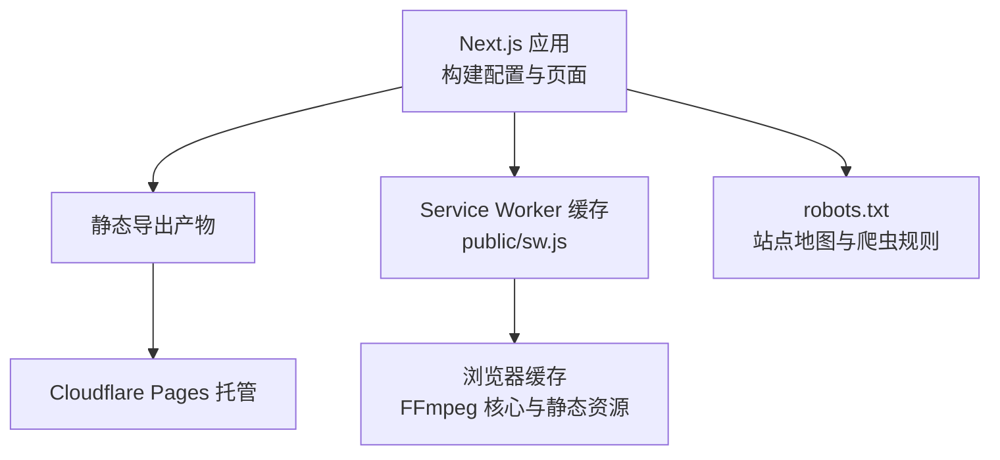
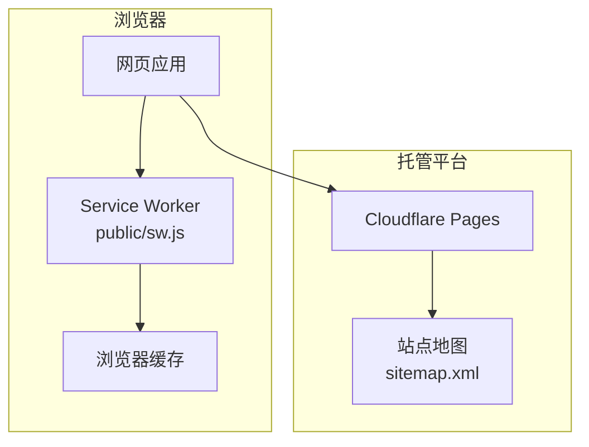
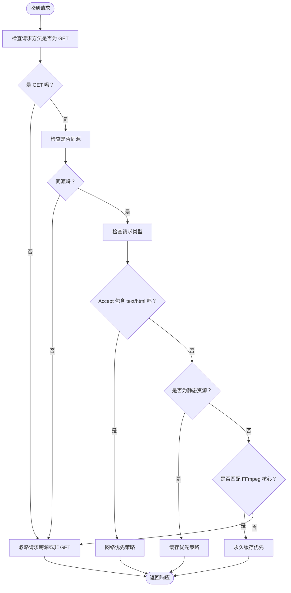
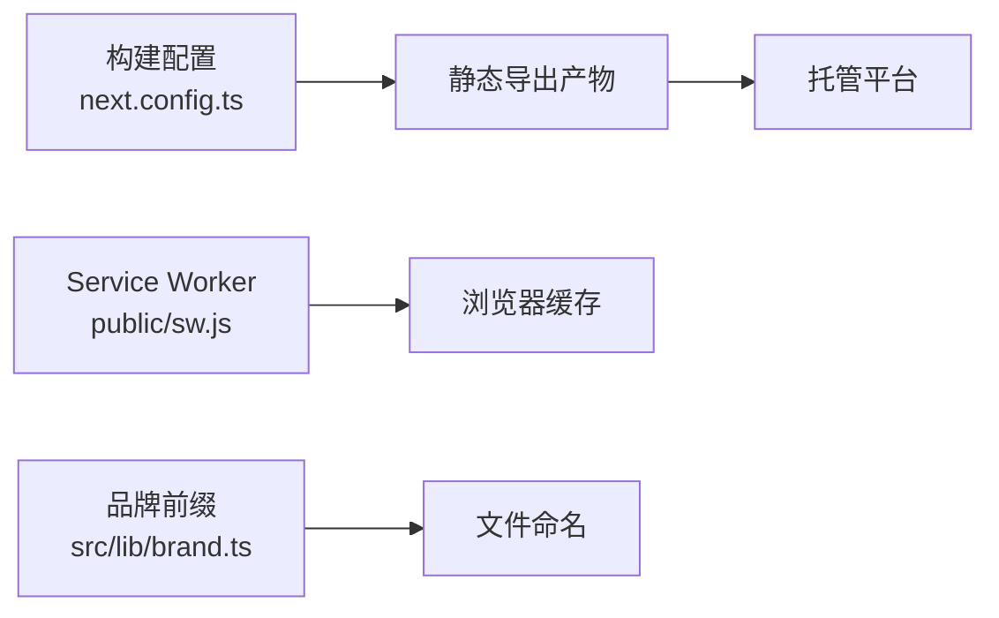

# 安全与HTTPS

<cite>
**本文引用的文件**
- [package.json](file://package.json)
- [next.config.ts](file://next.config.ts)
- [sw.js](file://public/sw.js)
- [robots.txt](file://public/robots.txt)
- [ServiceWorkerRegistration.tsx](file://src/components/shared/ServiceWorkerRegistration.tsx)
- [brand.ts](file://src/lib/brand.ts)
</cite>

## 目录
1. [简介](#简介)
2. [项目结构](#项目结构)
3. [核心组件](#核心组件)
4. [架构总览](#架构总览)
5. [详细组件分析](#详细组件分析)
6. [依赖关系分析](#依赖关系分析)
7. [性能考量](#性能考量)
8. [故障排查指南](#故障排查指南)
9. [结论](#结论)
10. [附录](#附录)

## 简介
本文件面向 PrivaDeck 媒体工具箱的安全与 HTTPS 配置，重点覆盖以下方面：
- COOP/COEP 安全头的作用与配置要点，以及对 WebAssembly 与 WebCodecs 的支持影响
- HTTPS 强制跳转与安全连接的实现方式
- 内容安全策略（CSP）的制定与实施，以抵御 XSS 等攻击
- 跨域资源共享（CORS）配置与 API 安全调用
- Cookie 安全设置与会话管理
- 安全审计清单与常见漏洞防护建议
- HTTPS 证书管理与自动续期配置思路

说明：当前仓库未包含服务端安全头、CSP、CORS、Cookie 安全等配置文件。本文在不虚构现有实现的前提下，基于 Next.js 与前端部署特性，给出可落地的配置建议与最佳实践。

## 项目结构
PrivaDeck 采用 Next.js 应用框架，构建产物为静态导出（export），并使用 Cloudflare Pages 进行托管与分发。安全相关的关键位置包括：
- 构建配置：用于控制输出模式与图片优化策略
- Service Worker 缓存：负责静态资源与 FFmpeg 核心的离线缓存
- 机器人协议：声明站点地图与爬虫访问范围
- 品牌前缀：用于生成带品牌前缀的文件名，便于识别与追踪

图表来源
- [next.config.ts:1-13](file://next.config.ts#L1-L13)
- [sw.js:1-93](file://public/sw.js#L1-L93)
- [robots.txt:1-5](file://public/robots.txt#L1-L5)

章节来源
- [next.config.ts:1-13](file://next.config.ts#L1-L13)
- [package.json:1-45](file://package.json#L1-L45)

## 核心组件
- 构建配置与输出模式
  - 当前配置启用静态导出与图片未优化策略，有助于减少运行时依赖与潜在风险面
- Service Worker 与缓存策略
  - 对 FFmpeg 核心进行永久缓存，提升离线可用性；对静态资源采用缓存优先策略；对 HTML 采用网络优先策略
- 机器人协议
  - 明确站点地图地址，避免搜索引擎误判
- 品牌前缀
  - 统一文件命名前缀，便于审计与溯源

章节来源
- [next.config.ts:6-10](file://next.config.ts#L6-L10)
- [sw.js:1-93](file://public/sw.js#L1-L93)
- [robots.txt:1-5](file://public/robots.txt#L1-L5)
- [brand.ts:1-6](file://src/lib/brand.ts#L1-L6)

## 架构总览
下图展示 PrivaDeck 在浏览器侧的安全与缓存交互，以及与托管平台的关系：

图表来源
- [sw.js:30-92](file://public/sw.js#L30-L92)
- [robots.txt:4-4](file://public/robots.txt#L4-L4)

## 详细组件分析

### Service Worker 与缓存策略
- FFmpeg 核心缓存
  - 将 FFmpeg 的核心脚本与 WASM 文件加入永久缓存，确保在无网络环境下仍可使用媒体处理能力
- 静态资源缓存
  - 对 JS/CSS/图片/WebP 等静态资源采用缓存优先策略，降低请求延迟与外部依赖
- HTML 页面更新
  - 对 HTML 采用网络优先策略，保证用户获取最新内容
- 跨源请求限制
  - 仅处理同源 GET 请求，避免跨站资源被滥用

图表来源
- [sw.js:30-92](file://public/sw.js#L30-L92)

章节来源
- [sw.js:30-92](file://public/sw.js#L30-L92)
- [ServiceWorkerRegistration.tsx:1-15](file://src/components/shared/ServiceWorkerRegistration.tsx#L1-L15)

### COOP/COEP 安全头与 WebAssembly/WebCodecs 支持
- COOP（Cross-Origin-Opener-Policy）
  - 作用：隔离页面与共享进程，防止跨源窗口读取上下文，降低侧信道攻击风险
  - 影响：开启后需配合 COEP，否则浏览器可能拒绝某些跨源资源（如 WebAssembly 模块）
- COEP（Cross-Origin-Embedder-Policy）
  - 作用：强制嵌入资源必须具备跨源隔离能力，保障 WebAssembly 与 WebCodecs 的安全使用
  - 影响：若未满足跨源隔离条件，浏览器将阻止加载 WASM 或禁用部分高精度 API
- 实施建议
  - 在服务端响应头中设置 COOP 与 COEP，并确保所有跨源资源具备相应 CORS/COOP/COEP 标识
  - 对于静态托管（如 Cloudflare Pages），可在边缘规则或自定义响应头中添加上述安全头
  - 与 CSP 协同，限制仅加载可信来源的 WASM 与媒体资源

章节来源
- [sw.js:6-9](file://public/sw.js#L6-L9)

### HTTPS 强制跳转与安全连接
- 静态导出与托管平台
  - 由于应用为静态导出并通过托管平台分发，HTTPS 由平台统一提供
- 强制 HTTPS 策略
  - 在托管平台配置重定向规则，将 HTTP 请求重定向至 HTTPS
  - 使用 HSTS 头部增强安全性（需在服务端或边缘层配置）
- 证书管理
  - 使用平台提供的自动证书颁发与续期机制
  - 如需自定义域名，确保 ACME 自动续期流程在平台侧可用

章节来源
- [next.config.ts:7-10](file://next.config.ts#L7-L10)

### 内容安全策略（CSP）与 XSS 防护
- 制定原则
  - 最小权限：仅允许必要的来源（如 CDN、自有域名）
  - 动态脚本：避免内联脚本，使用哈希或非ces 引入
  - 升级：逐步收紧策略，从报告模式过渡到严格模式
- 与 Service Worker 的协同
  - SW 注册与执行需遵循 CSP，避免内联事件处理器
  - 静态资源缓存策略应与 CSP 允许的来源一致
- 与 COOP/COEP 的配合
  - 仅加载来自可信来源的 WASM 与媒体资源，避免跨源隔离失败

章节来源
- [sw.js:30-92](file://public/sw.js#L30-L92)

### 跨域资源共享（CORS）与 API 安全调用
- CORS 配置要点
  - 明确允许的来源、方法与头部
  - 严格控制凭据（credentials）传递范围，避免泄露敏感信息
- API 安全调用
  - 优先使用 HTTPS 与最小权限授权
  - 对第三方 API，确保其具备安全头与 CORS 配置
- 与 Service Worker 的关系
  - SW 仅处理同源请求，跨域 API 调用应在应用层完成，且遵循 CORS 规则

章节来源
- [sw.js:52-55](file://public/sw.js#L52-L55)

### Cookie 安全设置与会话管理
- Cookie 安全属性
  - Secure：仅通过 HTTPS 传输
  - HttpOnly：禁止客户端脚本访问（服务端会话场景）
  - SameSite：推荐 Strict 或 Lax，减少 CSRF 风险
- 会话管理
  - 服务端生成短生命周期会话令牌，前端仅存储必要信息
  - 对敏感操作要求二次验证（如二次确认或二次认证）

章节来源
- [sw.js:30-92](file://public/sw.js#L30-L92)

## 依赖关系分析
- 构建配置与部署
  - 静态导出与图片未优化策略降低了运行时依赖，有利于安全边界收敛
- Service Worker 与缓存
  - 与托管平台的缓存策略相互补充，提升离线可用性与性能
- 品牌前缀与文件命名
  - 有助于审计与溯源，便于定位问题与追踪异常

图表来源
- [next.config.ts:6-10](file://next.config.ts#L6-L10)
- [sw.js:1-93](file://public/sw.js#L1-L93)
- [brand.ts:1-6](file://src/lib/brand.ts#L1-L6)

章节来源
- [next.config.ts:6-10](file://next.config.ts#L6-L10)
- [brand.ts:1-6](file://src/lib/brand.ts#L1-L6)

## 性能考量
- 缓存优先策略适用于静态资源与 FFmpeg 核心，显著降低首屏加载时间
- 网络优先策略确保 HTML 内容的实时性
- 静态导出减少了服务器端逻辑，降低了攻击面

章节来源
- [sw.js:30-92](file://public/sw.js#L30-L92)

## 故障排查指南
- Service Worker 注册失败
  - 检查浏览器控制台错误与 HTTPS 环境
  - 确认 SW 文件路径正确且可访问
- 缓存命中异常
  - 核对请求来源与方法是否符合 SW 条件（同源、GET）
  - 检查静态资源扩展名与路径匹配规则
- FFmpeg 加载失败
  - 确认跨源隔离与安全头已正确配置
  - 检查 CDN 可达性与缓存状态

章节来源
- [ServiceWorkerRegistration.tsx:1-15](file://src/components/shared/ServiceWorkerRegistration.tsx#L1-L15)
- [sw.js:30-92](file://public/sw.js#L30-L92)

## 结论
- PrivaDeck 当前以静态导出与托管平台为核心，安全边界主要集中在浏览器侧（CSP、SW 缓存）与托管平台（HTTPS、HSTS、CORS）
- 若需进一步强化安全，建议在服务端或边缘层增加 COOP/COEP、CSP、HSTS 等安全头，并完善 CORS 与 Cookie 安全配置
- 通过严格的来源白名单与最小权限原则，可有效降低 XSS、CSRF 等风险

## 附录

### 安全审计清单（建议）
- 服务端/边缘层
  - 是否设置 COOP/COEP 以满足跨源隔离需求
  - 是否设置 CSP 并逐步收紧策略
  - 是否启用 HSTS 并配置预加载
  - CORS 配置是否最小化并明确允许来源
  - Cookie 是否具备 Secure、HttpOnly、SameSite 属性
- 浏览器侧
  - Service Worker 是否仅处理同源请求
  - 静态资源与 FFmpeg 核心来源是否可信
  - 是否避免内联脚本与动态 eval
- 部署与证书
  - 是否强制 HTTPS 并自动续期
  - 是否正确配置站点地图与 robots.txt

### HTTPS 证书管理与自动续期
- 使用托管平台的自动证书颁发与续期
- 如需自定义域名，确保 ACME 自动续期流程可用
- 在平台边缘规则中启用 HSTS 与安全重定向