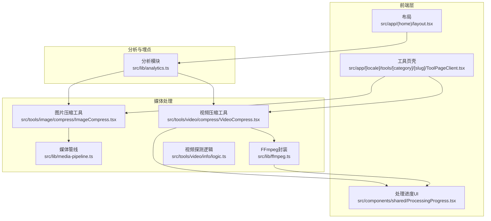
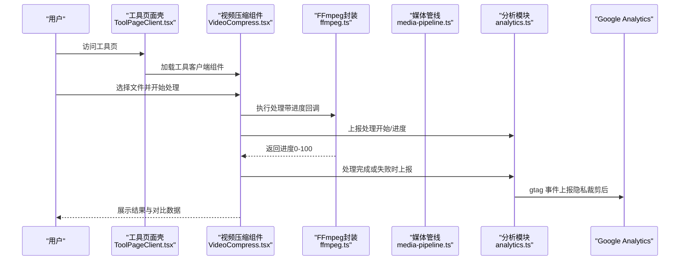
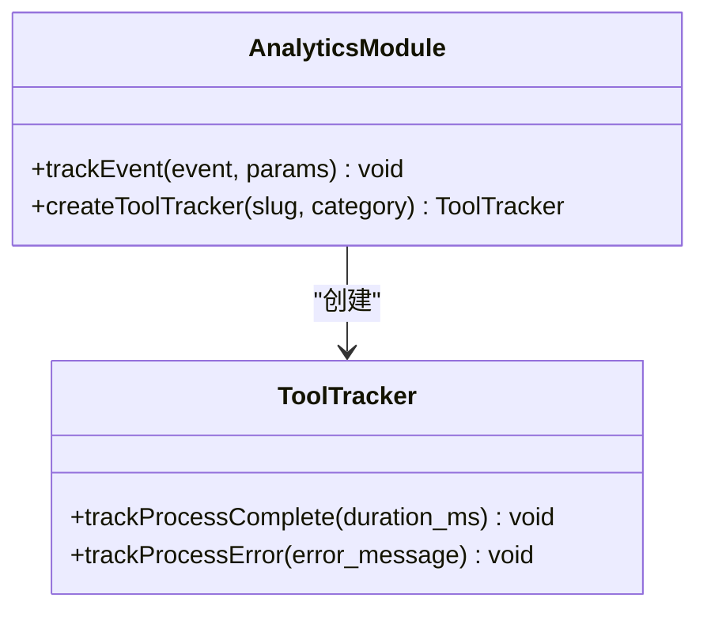
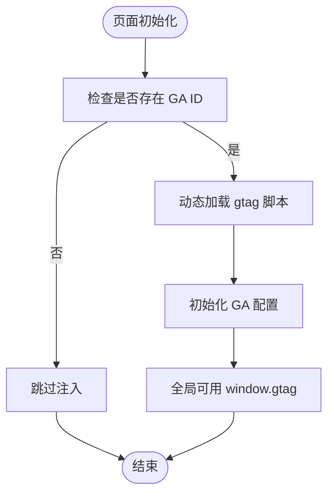
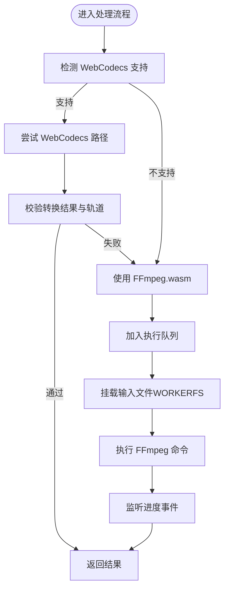
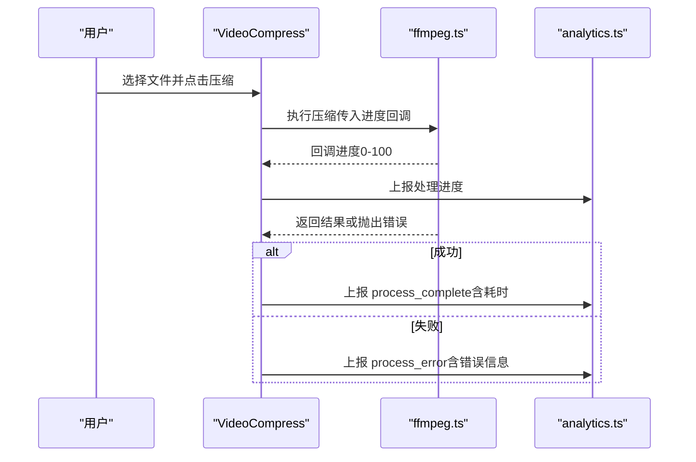
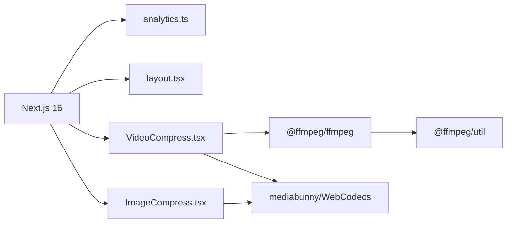

# 性能监控

<cite>
**本文引用的文件**
- [src/lib/analytics.ts](file://src/lib/analytics.ts)
- [src/app/(home)/layout.tsx](file://src/app/(home)/layout.tsx)
- [src/lib/ffmpeg.ts](file://src/lib/ffmpeg.ts)
- [src/lib/media-pipeline.ts](file://src/lib/media-pipeline.ts)
- [src/tools/video/compress/VideoCompress.tsx](file://src/tools/video/compress/VideoCompress.tsx)
- [src/components/shared/ProcessingProgress.tsx](file://src/components/shared/ProcessingProgress.tsx)
- [src/tools/image/compress/ImageCompress.tsx](file://src/tools/image/compress/ImageCompress.tsx)
- [src/tools/video/info/logic.ts](file://src/tools/video/info/logic.ts)
- [src/app/[locale]/tools/[category]/[slug]/ToolPageClient.tsx](file://src/app/[locale]/tools/[category]/[slug]/ToolPageClient.tsx)
- [next.config.ts](file://next.config.ts)
- [package.json](file://package.json)
</cite>

## 目录
1. [简介](#简介)
2. [项目结构](#项目结构)
3. [核心组件](#核心组件)
4. [架构总览](#架构总览)
5. [详细组件分析](#详细组件分析)
6. [依赖关系分析](#依赖关系分析)
7. [性能考量](#性能考量)
8. [故障排查指南](#故障排查指南)
9. [结论](#结论)
10. [附录](#附录)

## 简介
本文件面向 PrivaDeck 媒体工具箱的性能监控与分析，聚焦以下目标：
- 集成 Google Analytics（GA4）进行用户行为与工具使用数据采集
- 监控 Core Web Vitals 指标（LCP、FID、CLS）
- 监控媒体处理性能（处理时长、进度、资源占用）
- 错误监控与日志记录（含隐私保护）
- 性能优化建议与瓶颈识别方法
- A/B 测试与功能分析配置思路
- 隐私友好与 GDPR 合规实践

## 项目结构
PrivaDeck 使用 Next.js 16 应用框架，采用按功能分层的目录组织。与性能监控相关的关键位置如下：
- 分析埋点：src/lib/analytics.ts 提供 GA4 事件上报与隐私裁剪
- GA4 注入：src/app/(home)/layout.tsx 在运行时注入 gtag 脚本与初始化
- 媒体处理：src/lib/ffmpeg.ts 与 src/lib/media-pipeline.ts 提供 FFmpeg.wasm 与 WebCodecs 的处理管线
- 工具页面：src/tools/video/compress/VideoCompress.tsx、src/tools/image/compress/ImageCompress.tsx 展示处理流程与进度
- 进度 UI：src/components/shared/ProcessingProgress.tsx 渲染处理进度条
- 视频探测：src/tools/video/info/logic.ts 解析 FFmpeg 日志生成媒体信息
- 页面壳子：src/app/[locale]/tools/[category]/[slug]/ToolPageClient.tsx 加载工具客户端组件

图表来源
- [src/app/(home)/layout.tsx](file://src/app/(home)/layout.tsx#L48-L58)
- [src/lib/analytics.ts:106-124](file://src/lib/analytics.ts#L106-L124)
- [src/lib/media-pipeline.ts:1-14](file://src/lib/media-pipeline.ts#L1-L14)
- [src/lib/ffmpeg.ts:10-39](file://src/lib/ffmpeg.ts#L10-L39)
- [src/tools/video/compress/VideoCompress.tsx:45-103](file://src/tools/video/compress/VideoCompress.tsx#L45-L103)
- [src/tools/image/compress/ImageCompress.tsx:138-178](file://src/tools/image/compress/ImageCompress.tsx#L138-L178)
- [src/components/shared/ProcessingProgress.tsx:14-46](file://src/components/shared/ProcessingProgress.tsx#L14-L46)
- [src/tools/video/info/logic.ts:33-71](file://src/tools/video/info/logic.ts#L33-L71)

章节来源
- [src/app/(home)/layout.tsx](file://src/app/(home)/layout.tsx#L38-L62)
- [src/lib/analytics.ts:106-137](file://src/lib/analytics.ts#L106-L137)
- [src/lib/ffmpeg.ts:10-144](file://src/lib/ffmpeg.ts#L10-L144)
- [src/lib/media-pipeline.ts:1-105](file://src/lib/media-pipeline.ts#L1-L105)
- [src/tools/video/compress/VideoCompress.tsx:45-529](file://src/tools/video/compress/VideoCompress.tsx#L45-L529)
- [src/tools/image/compress/ImageCompress.tsx:63-373](file://src/tools/image/compress/ImageCompress.tsx#L63-L373)
- [src/components/shared/ProcessingProgress.tsx:14-46](file://src/components/shared/ProcessingProgress.tsx#L14-L46)
- [src/tools/video/info/logic.ts:33-88](file://src/tools/video/info/logic.ts#L33-L88)
- [src/app/[locale]/tools/[category]/[slug]/ToolPageClient.tsx](file://src/app/[locale]/tools/[category]/[slug]/ToolPageClient.tsx#L29-L58)

## 核心组件
- 分析与埋点模块（analytics.ts）
  - 定义事件参数接口，统一字段类型
  - 提供通用 trackEvent 方法，自动裁剪敏感字段（如错误信息、搜索词），避免记录文件名
  - 提供 createToolTracker 工厂，便捷上报“处理完成/处理失败”事件
- GA4 注入（layout.tsx）
  - 通过 Script 组件在运行时注入 gtag 脚本与初始化配置
  - 仅在存在 GA ID 时加载，保证可配置性
- 媒体处理管线（media-pipeline.ts、ffmpeg.ts）
  - WebCodecs 支持检测与降级回退策略
  - FFmpeg.wasm 实例化、加载、进度监听与队列化执行
  - 处理流程中暴露进度回调，便于 UI 与埋点联动
- 工具页面与进度展示（VideoCompress.tsx、ImageCompress.tsx、ProcessingProgress.tsx）
  - 视频压缩与图片压缩工具均支持进度可视化
  - 结合 createToolTracker 上报处理耗时与错误

章节来源
- [src/lib/analytics.ts:106-137](file://src/lib/analytics.ts#L106-L137)
- [src/app/(home)/layout.tsx](file://src/app/(home)/layout.tsx#L48-L58)
- [src/lib/media-pipeline.ts:7-105](file://src/lib/media-pipeline.ts#L7-L105)
- [src/lib/ffmpeg.ts:10-144](file://src/lib/ffmpeg.ts#L10-L144)
- [src/tools/video/compress/VideoCompress.tsx:74-103](file://src/tools/video/compress/VideoCompress.tsx#L74-L103)
- [src/tools/image/compress/ImageCompress.tsx:138-178](file://src/tools/image/compress/ImageCompress.tsx#L138-L178)
- [src/components/shared/ProcessingProgress.tsx:14-46](file://src/components/shared/ProcessingProgress.tsx#L14-L46)

## 架构总览
下图展示了从用户操作到数据采集与处理性能监控的整体流程。

图表来源
- [src/app/[locale]/tools/[category]/[slug]/ToolPageClient.tsx](file://src/app/[locale]/tools/[category]/[slug]/ToolPageClient.tsx#L29-L58)
- [src/tools/video/compress/VideoCompress.tsx:74-103](file://src/tools/video/compress/VideoCompress.tsx#L74-L103)
- [src/lib/ffmpeg.ts:99-144](file://src/lib/ffmpeg.ts#L99-L144)
- [src/lib/media-pipeline.ts:1-14](file://src/lib/media-pipeline.ts#L1-L14)
- [src/lib/analytics.ts:106-137](file://src/lib/analytics.ts#L106-L137)

## 详细组件分析

### 分析与埋点模块（analytics.ts）
- 事件参数类型安全：通过泛型约束确保事件名与参数一一对应
- 隐私保护：对错误消息与搜索关键词进行长度截断，不记录文件名
- 工具追踪器工厂：createToolTracker 自动填充工具类别与标识，简化调用

图表来源
- [src/lib/analytics.ts:106-137](file://src/lib/analytics.ts#L106-L137)

章节来源
- [src/lib/analytics.ts:106-137](file://src/lib/analytics.ts#L106-L137)

### GA4 注入与初始化（layout.tsx）
- 条件注入：仅当存在 GA ID 时才加载脚本与初始化
- 运行时策略：afterInteractive，避免阻塞首屏渲染
- 全局可用：window.gtag 可被任意组件调用

图表来源
- [src/app/(home)/layout.tsx](file://src/app/(home)/layout.tsx#L48-L58)

章节来源
- [src/app/(home)/layout.tsx](file://src/app/(home)/layout.tsx#L48-L58)

### 媒体处理管线（media-pipeline.ts、ffmpeg.ts）
- WebCodecs 支持检测：Video/Audio 编解码器可用性判断
- 降级策略：不支持或不兼容时回退至 FFmpeg.wasm
- FFmpeg 封装：单实例、延迟加载、进度事件监听、操作队列化，避免并发冲突
- 进度回调：将 0-1 原始进度映射为 0-100 的整数百分比

图表来源
- [src/lib/media-pipeline.ts:7-105](file://src/lib/media-pipeline.ts#L7-L105)
- [src/lib/ffmpeg.ts:75-144](file://src/lib/ffmpeg.ts#L75-L144)

章节来源
- [src/lib/media-pipeline.ts:1-105](file://src/lib/media-pipeline.ts#L1-L105)
- [src/lib/ffmpeg.ts:10-144](file://src/lib/ffmpeg.ts#L10-L144)

### 视频压缩工具（VideoCompress.tsx）
- 功能特性：简单/高级模式、CRF、编码预设、分辨率、帧率、音频码率、最大码率
- 处理流程：上传文件 → 选择模式 → 执行压缩 → 展示结果与对比表
- 进度与错误：显示进度条、错误提示；支持 HEVC 扩展建议
- 埋点集成：处理完成/失败时通过 createToolTracker 上报耗时与错误

图表来源
- [src/tools/video/compress/VideoCompress.tsx:74-103](file://src/tools/video/compress/VideoCompress.tsx#L74-L103)
- [src/lib/ffmpeg.ts:99-144](file://src/lib/ffmpeg.ts#L99-L144)
- [src/lib/analytics.ts:128-137](file://src/lib/analytics.ts#L128-L137)

章节来源
- [src/tools/video/compress/VideoCompress.tsx:45-529](file://src/tools/video/compress/VideoCompress.tsx#L45-L529)
- [src/lib/ffmpeg.ts:99-144](file://src/lib/ffmpeg.ts#L99-L144)
- [src/lib/analytics.ts:128-137](file://src/lib/analytics.ts#L128-L137)

### 图片压缩工具（ImageCompress.tsx）
- 功能特性：预设质量、最大尺寸、最大分辨率、输出格式、EXIF 保留、自定义尺寸
- 处理流程：批量文件 → 应用预设/自定义 → 逐个压缩 → 展示结果列表
- 进度与错误：显示当前处理进度与累计错误信息
- 埋点集成：处理完成后汇总上报（可在工具内部扩展）

章节来源
- [src/tools/image/compress/ImageCompress.tsx:63-373](file://src/tools/image/compress/ImageCompress.tsx#L63-L373)

### 处理进度 UI（ProcessingProgress.tsx）
- 支持确定与不确定两种进度形态
- 数字百分比与进度条同步更新
- 与工具组件结合，形成一致的用户体验

章节来源
- [src/components/shared/ProcessingProgress.tsx:14-46](file://src/components/shared/ProcessingProgress.tsx#L14-L46)

### 视频探测逻辑（logic.ts）
- 使用 FFmpeg 日志解析容器、时长、总码率、音视频轨等信息
- 通过 enqueueOperation 串行执行，避免冲突
- 为后续压缩参数推荐提供依据

章节来源
- [src/tools/video/info/logic.ts:33-88](file://src/tools/video/info/logic.ts#L33-L88)

## 依赖关系分析
- 运行时依赖
  - Next.js 16（SSG/SSR/客户端组件）
  - @ffmpeg/ffmpeg 与 @ffmpeg/util（浏览器端媒体处理）
  - mediabunny（WebCodecs 媒体处理）
  - next-intl（国际化）
- 性能相关配置
  - next.config.ts 设置静态导出、禁用图片优化、尾斜杠
  - package.json 指定媒体处理相关依赖版本

图表来源
- [next.config.ts:6-10](file://next.config.ts#L6-L10)
- [package.json:11-31](file://package.json#L11-L31)

章节来源
- [next.config.ts:6-10](file://next.config.ts#L6-L10)
- [package.json:11-31](file://package.json#L11-L31)

## 性能考量
- Core Web Vitals 监控
  - LCP：通过 GA4 自定义事件记录首屏内容绘制时间，结合页面加载阶段标记
  - FID：记录交互到响应的时间，用于评估按钮、滑块等控件响应
  - CLS：记录布局偏移分数，关注视频/图片预览区域的稳定性
- 媒体处理性能
  - 进度回调：将 FFmpeg 进度映射为 UI 百分比，同时可用于埋点统计
  - 资源占用：优先使用 WebCodecs（若可用），减少内存复制与峰值占用
  - 并发控制：通过 Promise 队列串行执行 FFmpeg 操作，避免竞态
- 隐私与合规
  - 对错误信息与搜索词进行截断，避免记录敏感数据
  - 不记录文件名，遵循最小化原则
  - 提供可配置的 GA ID，便于用户选择是否启用分析

## 故障排查指南
- GA4 未生效
  - 检查是否存在 GA ID；确认脚本已注入且初始化成功
  - 确认 window.gtag 是否可用
- 处理无进度或卡顿
  - 检查 WebCodecs 支持情况；必要时回退至 FFmpeg.wasm
  - 查看 FFmpeg 进度事件是否触发；确认队列未被阻塞
- 错误上报异常
  - 确认 trackEvent 参数类型正确；检查隐私裁剪是否影响字段
  - 对于工具特定错误（如不支持的视频编码），使用 createToolTracker 上报

章节来源
- [src/app/(home)/layout.tsx](file://src/app/(home)/layout.tsx#L48-L58)
- [src/lib/analytics.ts:106-124](file://src/lib/analytics.ts#L106-L124)
- [src/lib/media-pipeline.ts:98-105](file://src/lib/media-pipeline.ts#L98-L105)
- [src/lib/ffmpeg.ts:41-58](file://src/lib/ffmpeg.ts#L41-L58)

## 结论
本项目通过 GA4 与自研分析模块实现了用户行为与工具使用数据的采集，并结合 WebCodecs 与 FFmpeg.wasm 的双路径处理策略，在保障隐私的前提下提供了可观测的性能指标。建议在现有基础上进一步完善 Core Web Vitals 的自动化采集与阈值告警，持续优化媒体处理的并发与资源占用，并在工具页面中增加更细粒度的埋点以支撑 A/B 测试与功能分析。

## 附录
- A/B 测试与功能分析配置思路
  - 使用 GA4 自定义事件与维度区分实验组与对照组
  - 对关键转化路径（上传、处理、下载）设置转化目标
  - 利用隐私裁剪后的参数进行分群分析
- 隐私友好与 GDPR 合规
  - 明确数据收集范围与目的，提供可撤销同意机制
  - 对所有事件参数进行最小化与匿名化处理
  - 提供数据删除与导出请求通道