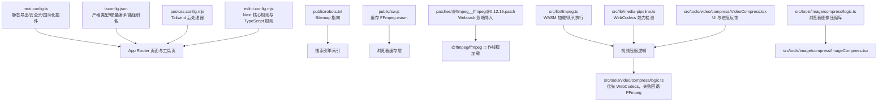
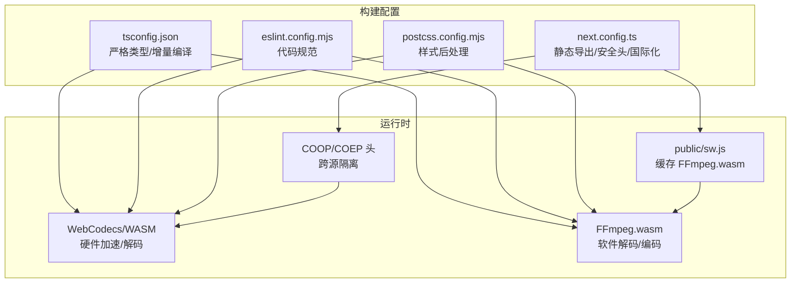
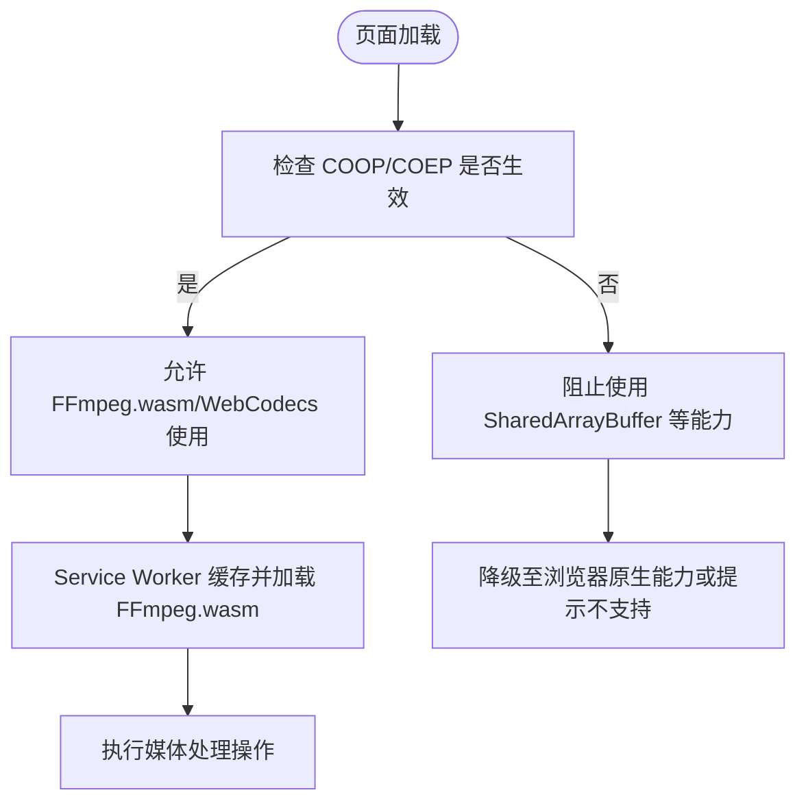
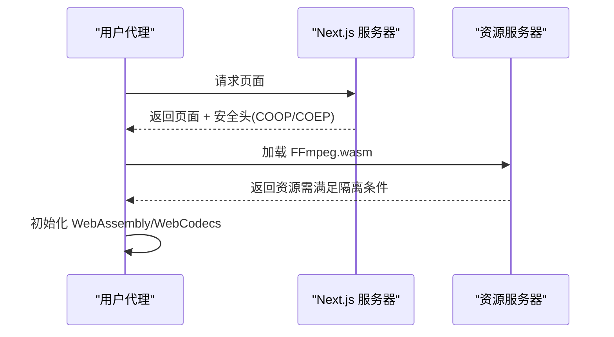
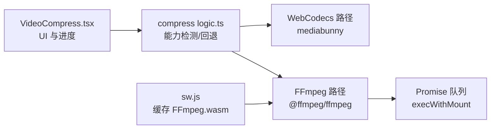

# 构建配置

<cite>
**本文引用的文件**
- [next.config.ts](file://next.config.ts)
- [tsconfig.json](file://tsconfig.json)
- [package.json](file://package.json)
- [postcss.config.mjs](file://postcss.config.mjs)
- [eslint.config.mjs](file://eslint.config.mjs)
- [public/robots.txt](file://public/robots.txt)
- [public/sw.js](file://public/sw.js)
- [patches/@ffmpeg__ffmpeg@0.12.15.patch](file://patches/@ffmpeg__ffmpeg@0.12.15.patch)
- [src/lib/ffmpeg.ts](file://src/lib/ffmpeg.ts)
- [src/lib/media-pipeline.ts](file://src/lib/media-pipeline.ts)
- [src/tools/video/compress/VideoCompress.tsx](file://src/tools/video/compress/VideoCompress.tsx)
- [src/tools/video/compress/logic.ts](file://src/tools/video/compress/logic.ts)
- [src/tools/image/compress/ImageCompress.tsx](file://src/tools/image/compress/ImageCompress.tsx)
- [src/tools/image/compress/logic.ts](file://src/tools/image/compress/logic.ts)
</cite>

## 目录
1. [简介](#简介)
2. [项目结构](#项目结构)
3. [核心组件](#核心组件)
4. [架构总览](#架构总览)
5. [详细组件分析](#详细组件分析)
6. [依赖关系分析](#依赖关系分析)
7. [性能考量](#性能考量)
8. [故障排查指南](#故障排查指南)
9. [结论](#结论)
10. [附录](#附录)

## 简介
本文件面向 PrivaDeck 媒体工具箱的构建配置，系统性解析以下关键点：
- Next.js 静态导出配置（output: 'export'）及其工作原理与限制
- 图片优化配置（images.unoptimized: true）与 FFmpeg.wasm/WebCodecs 兼容性考量
- 尾斜杠配置（trailingSlash: true）的作用与 SEO 影响
- 安全头配置（COOP/COEP）对 WebAssembly 与 WebCodecs 的支持
- TypeScript 编译选项对构建过程的影响
- 构建优化建议与常见问题解决方案

## 项目结构
本项目采用 Next.js App Router 结构，核心构建配置集中在 next.config.ts；TypeScript 编译规则在 tsconfig.json；样式通过 PostCSS（Tailwind）处理；ESLint 规范由 eslint.config.mjs 统一管理；Service Worker 用于缓存 FFmpeg.wasm 资源以提升离线可用性。

图表来源
- [next.config.ts:1-30](file://next.config.ts#L1-L30)
- [tsconfig.json:1-35](file://tsconfig.json#L1-L35)
- [postcss.config.mjs:1-8](file://postcss.config.mjs#L1-L8)
- [eslint.config.mjs:1-19](file://eslint.config.mjs#L1-L19)
- [public/robots.txt:1-5](file://public/robots.txt#L1-L5)
- [public/sw.js:1-93](file://public/sw.js#L1-L93)
- [patches/@ffmpeg__ffmpeg@0.12.15.patch:1-14](file://patches/@ffmpeg__ffmpeg@0.12.15.patch#L1-L14)
- [src/lib/ffmpeg.ts:1-144](file://src/lib/ffmpeg.ts#L1-L144)
- [src/lib/media-pipeline.ts:1-105](file://src/lib/media-pipeline.ts#L1-L105)
- [src/tools/video/compress/logic.ts:1-257](file://src/tools/video/compress/logic.ts#L1-L257)
- [src/tools/image/compress/logic.ts:1-135](file://src/tools/image/compress/logic.ts#L1-L135)

章节来源
- [next.config.ts:1-30](file://next.config.ts#L1-L30)
- [tsconfig.json:1-35](file://tsconfig.json#L1-L35)
- [postcss.config.mjs:1-8](file://postcss.config.mjs#L1-L8)
- [eslint.config.mjs:1-19](file://eslint.config.mjs#L1-L19)
- [public/robots.txt:1-5](file://public/robots.txt#L1-L5)
- [public/sw.js:1-93](file://public/sw.js#L1-L93)
- [patches/@ffmpeg__ffmpeg@0.12.15.patch:1-14](file://patches/@ffmpeg__ffmpeg@0.12.15.patch#L1-L14)

## 核心组件
- 静态导出（output: 'export'）
  - 作用：将应用构建为静态站点，便于部署到无服务器或 CDN（如 Cloudflare Pages），无需 Node.js 运行时。
  - 影响：禁用动态路由、API 路由、SSR/SSG 中的特定特性；适合纯前端工具类页面。
- 图片优化（images.unoptimized: true）
  - 作用：关闭 Next.js 内置图片优化，避免与 FFmpeg.wasm/WebCodecs 的跨源隔离要求冲突。
  - 原因：当启用 COEP/COOP 时，浏览器要求资源具备跨源隔离能力，内联图片优化可能引入跨域资源，破坏隔离。
- 尾斜杠（trailingSlash: true）
  - 作用：所有路由自动添加尾斜杠，有助于统一 URL 形态，减少重复内容风险。
  - SEO 影响：配合 robots.txt 的 Sitemap 指向，可降低重复链接带来的 SEO 分散权重。
- 安全头（headers: COOP/COEP）
  - 作用：强制跨源隔离，使 WebAssembly 和 WebCodecs 可以使用 SharedArrayBuffer 等高级能力。
  - 影响：要求所有响应头满足跨源隔离条件，否则浏览器会拒绝相关功能。

章节来源
- [next.config.ts:6-27](file://next.config.ts#L6-L27)
- [public/robots.txt:1-5](file://public/robots.txt#L1-L5)

## 架构总览
下图展示构建配置如何影响运行时行为：静态导出决定部署形态；安全头确保跨源隔离；Service Worker 缓存 FFmpeg.wasm；TypeScript 严格模式保障类型安全；工具页根据能力选择 WebCodecs 或 FFmpeg 执行。

图表来源
- [next.config.ts:6-27](file://next.config.ts#L6-L27)
- [tsconfig.json:1-35](file://tsconfig.json#L1-L35)
- [eslint.config.mjs:1-19](file://eslint.config.mjs#L1-L19)
- [postcss.config.mjs:1-8](file://postcss.config.mjs#L1-L8)
- [public/sw.js:1-93](file://public/sw.js#L1-L93)

## 详细组件分析

### Next.js 静态导出（output: 'export'）
- 工作原理
  - 构建阶段生成静态 HTML/CSS/JS 文件，路由按页面树预渲染。
  - 适用于无服务部署（Cloudflare Pages、Vercel Static、GitHub Pages 等）。
- 限制
  - 不支持动态路由参数的 SSR/SSG 动态生成。
  - 不支持 API 路由与边缘函数。
  - 不支持 App Router 的中间件（除非平台原生支持）。
- 在本项目中的意义
  - 工具页面均为静态交互，无需服务端逻辑，静态导出可最大化性能与成本效益。

章节来源
- [next.config.ts:7](file://next.config.ts#L7)

### 图片优化与 FFmpeg.wasm/WebCodecs 兼容性（images.unoptimized: true）
- 设计动机
  - FFmpeg.wasm 与 WebCodecs 需要跨源隔离（COOP/COEP），以启用 SharedArrayBuffer 等能力。
  - Next.js 默认的图片优化会注入跨域资源，破坏跨源隔离。
- 实现方式
  - 关闭内置图片优化，改用原生  或自定义资源加载策略。
  - Service Worker 缓存 FFmpeg.wasm，减少网络请求并保证离线可用。
- 补丁说明
  - 通过 patch 修正 @ffmpeg/ffmpeg 工作线程加载，避免打包器误判模块导入，确保在静态导出环境下稳定加载。

图表来源
- [next.config.ts:8](file://next.config.ts#L8)
- [public/sw.js:30-50](file://public/sw.js#L30-L50)
- [patches/@ffmpeg__ffmpeg@0.12.15.patch:1-14](file://patches/@ffmpeg__ffmpeg@0.12.15.patch#L1-L14)

章节来源
- [next.config.ts:8](file://next.config.ts#L8)
- [public/sw.js:1-93](file://public/sw.js#L1-L93)
- [patches/@ffmpeg__ffmpeg@0.12.15.patch:1-14](file://patches/@ffmpeg__ffmpeg@0.12.15.patch#L1-L14)

### 尾斜杠与 SEO（trailingSlash: true）
- 作用
  - 统一 URL 形态，避免同一页面多份 URL 导致的重复内容。
  - 与 robots.txt 的 Sitemap 指向配合，集中搜索引擎权重。
- 影响
  - 对用户透明，但需确保内部链接与重定向策略一致，避免混合使用带/与不带/的链接。

章节来源
- [next.config.ts:9](file://next.config.ts#L9)
- [public/robots.txt:1-5](file://public/robots.txt#L1-L5)

### 安全头配置（COOP/COEP）
- 目标
  - 强制跨源隔离，使 WebAssembly 与 WebCodecs 可以使用 SharedArrayBuffer 等能力。
- 实施
  - 通过 headers 配置返回 Cross-Origin-Opener-Policy 与 Cross-Origin-Embedder-Policy。
- 影响
  - 要求所有嵌入资源均满足跨源隔离条件（同源或明确授权），否则浏览器会阻断隔离。

图表来源
- [next.config.ts:10-26](file://next.config.ts#L10-L26)

章节来源
- [next.config.ts:10-26](file://next.config.ts#L10-L26)

### TypeScript 配置与编译选项
- 关键选项
  - strict: 开启严格类型检查，降低运行时错误概率。
  - noEmit: 仅类型检查，不输出 JS，交由 Next.js 编译器处理。
  - isolatedModules: 与增量编译配合，提升开发体验。
  - incremental: 增量编译，缩短二次构建时间。
  - moduleResolution: bundler，与现代打包器兼容。
  - jsx: react-jsx，适配 React 18+ JSX 运行时。
  - paths: @/* 别名，简化导入路径。
- 影响
  - 提升类型安全性与开发效率；与 Next.js 编译链路协同，确保产物质量。

章节来源
- [tsconfig.json:2-24](file://tsconfig.json#L2-L24)

### 构建脚本与依赖
- 构建脚本
  - build: 使用 Next.js 构建，并显式启用 Webpack（保持与当前版本兼容）。
- 依赖要点
  - @ffmpeg/ffmpeg: WebAssembly 媒体处理核心。
  - mediabunny: WebCodecs 硬件加速替代方案。
  - next-intl: 国际化插件，配合 next.config.ts 的 withNextIntl 包装。

章节来源
- [package.json:5-10](file://package.json#L5-L10)
- [package.json:11-32](file://package.json#L11-L32)
- [next.config.ts:4](file://next.config.ts#L4)

## 依赖关系分析
- 能力检测与回退
  - WebCodecs 支持检测优先执行，若不支持或遇到不支持的编解码器，则回退到 FFmpeg.wasm。
  - FFmpeg.wasm 通过 Promise 队列串行执行，避免并发冲突。
- 缓存与加载
  - Service Worker 缓存 FFmpeg.wasm，显著改善首次加载与离线可用性。
  - 补丁确保工作线程加载不受打包器干扰。

图表来源
- [src/tools/video/compress/VideoCompress.tsx:1-529](file://src/tools/video/compress/VideoCompress.tsx#L1-L529)
- [src/tools/video/compress/logic.ts:1-257](file://src/tools/video/compress/logic.ts#L1-L257)
- [src/lib/ffmpeg.ts:1-144](file://src/lib/ffmpeg.ts#L1-L144)
- [public/sw.js:1-93](file://public/sw.js#L1-L93)

章节来源
- [src/lib/media-pipeline.ts:1-105](file://src/lib/media-pipeline.ts#L1-L105)
- [src/lib/ffmpeg.ts:1-144](file://src/lib/ffmpeg.ts#L1-L144)
- [src/tools/video/compress/logic.ts:1-257](file://src/tools/video/compress/logic.ts#L1-L257)
- [public/sw.js:1-93](file://public/sw.js#L1-L93)

## 性能考量
- 静态导出
  - 优点：零运行时开销、CDN 友好、冷启动为零。
  - 注意：避免在静态导出中使用需要 SSR 的特性。
- 图片与资源
  - 关闭内置图片优化，结合原生  与 Service Worker 缓存，减少不必要的转换与网络往返。
- 编译优化
  - 启用增量编译与严格类型检查，缩短开发迭代周期。
- 能力选择
  - 优先 WebCodecs（硬件加速），失败再回退 FFmpeg.wasm，兼顾性能与兼容性。

## 故障排查指南
- WebAssembly 或 WebCodecs 无法使用
  - 检查是否返回了 COOP/COEP 头，且所有资源满足跨源隔离。
  - 确认 Service Worker 成功缓存 FFmpeg.wasm。
- FFmpeg.wasm 加载失败
  - 检查补丁是否正确应用，确保工作线程加载不受打包器干扰。
  - 确认 CDN 地址可达且未被 CSP 屏蔽。
- 静态导出后路由异常
  - 确保所有链接使用尾斜杠，避免重复内容与索引分散。
- 类型错误或编译报错
  - 检查 tsconfig.json 的严格模式与路径别名配置，确保与实际目录一致。

章节来源
- [next.config.ts:10-26](file://next.config.ts#L10-L26)
- [public/sw.js:1-93](file://public/sw.js#L1-L93)
- [patches/@ffmpeg__ffmpeg@0.12.15.patch:1-14](file://patches/@ffmpeg__ffmpeg@0.12.15.patch#L1-L14)
- [tsconfig.json:2-24](file://tsconfig.json#L2-L24)

## 结论
本项目的构建配置围绕“静态导出 + 跨源隔离 + 能力检测回退”的核心思路设计：通过静态导出获得最佳部署与性能；通过 COOP/COEP 保障 WebAssembly 与 WebCodecs 的可用性；通过 Service Worker 与补丁确保 FFmpeg.wasm 的稳定加载；通过严格的 TypeScript 配置与 ESLint 规范提升代码质量。该组合在工具类媒体处理场景下实现了高可用、高性能与强兼容性的平衡。

## 附录
- 术语
  - COOP：Cross-Origin-Opener-Policy
  - COEP：Cross-Origin-Embedder-Policy
  - WebCodecs：浏览器原生编解码 API
  - FFmpeg.wasm：FFmpeg 的 WebAssembly 版本