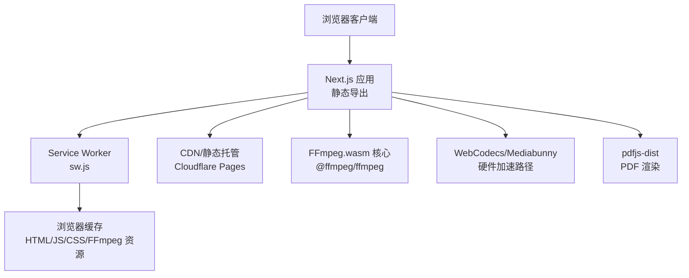
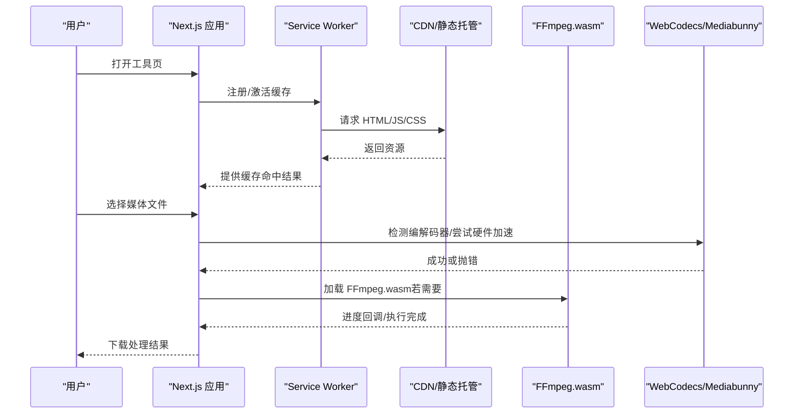
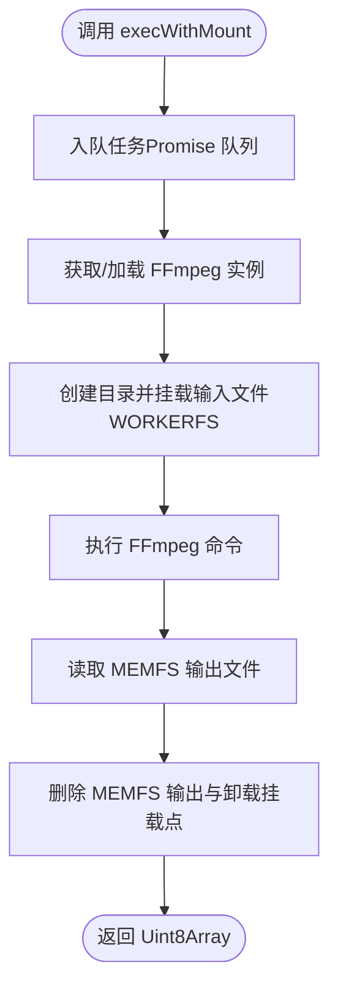
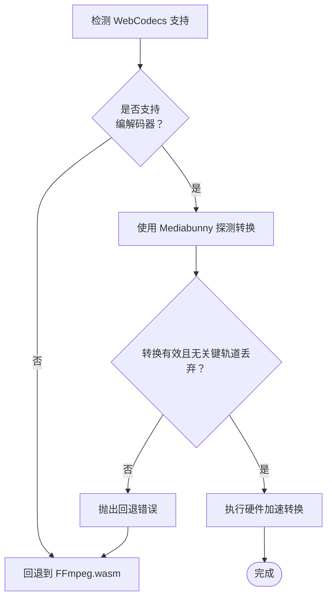
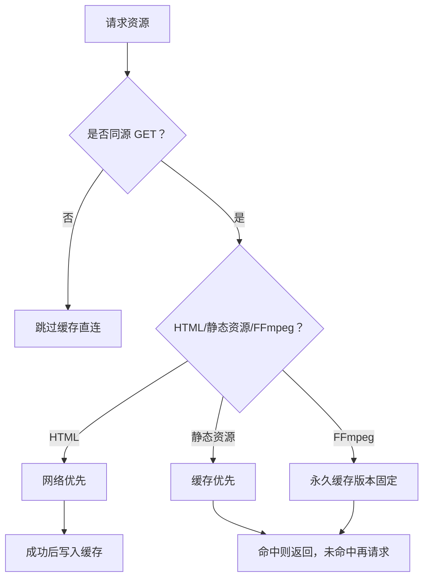
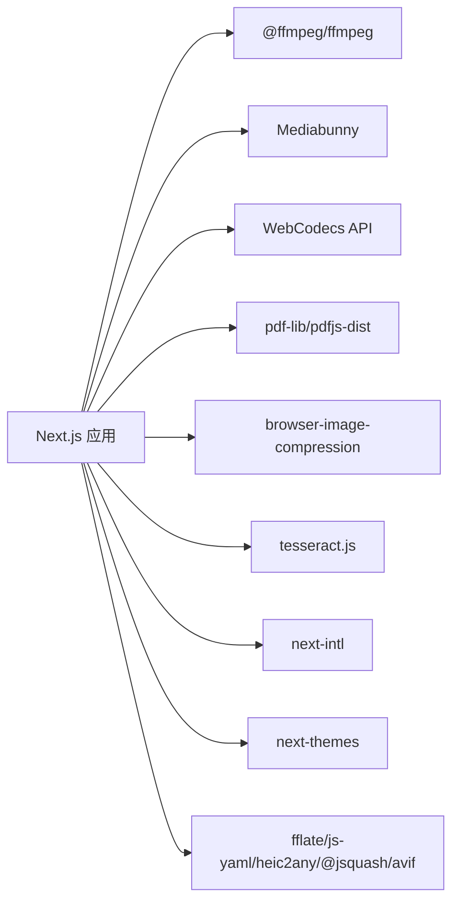

# 生产环境优化

<cite>
**本文引用的文件**
- [package.json](file://package.json)
- [next.config.ts](file://next.config.ts)
- [@ffmpeg 补丁](file://patches/@ffmpeg__ffmpeg@0.12.15.patch)
- [FFmpeg 封装](file://src/lib/ffmpeg.ts)
- [媒体处理管线](file://src/lib/media-pipeline.ts)
- [Service Worker 缓存](file://public/sw.js)
- [视频上传器](file://src/components/shared/VideoUploader.tsx)
- [根布局与元数据](file://src/app/layout.tsx)
- [分析埋点](file://src/lib/analytics.ts)
- [PDF.js 配置](file://src/lib/pdfjs.ts)
- [README](file://README.md)
</cite>

## 目录
1. [简介](#简介)
2. [项目结构](#项目结构)
3. [核心组件](#核心组件)
4. [架构总览](#架构总览)
5. [详细组件分析](#详细组件分析)
6. [依赖关系分析](#依赖关系分析)
7. [性能考量](#性能考量)
8. [故障排查指南](#故障排查指南)
9. [结论](#结论)
10. [附录](#附录)

## 简介
本指南面向 PrivaDeck 媒体工具箱的生产环境优化，聚焦以下目标：
- 资源加载优化：代码分割、懒加载与预加载策略
- 缓存策略：浏览器缓存、CDN 缓存与服务器缓存协同
- 依赖优化：FFmpeg 补丁应用、第三方库版本管理
- 内存与垃圾回收：大文件处理的内存控制与回收
- 生产部署：环境变量、错误处理与监控
- 自动化部署与 CI/CD 建议

PrivaDeck 采用浏览器端处理模型，所有媒体处理在客户端完成，不上传文件，具备 PWA 能力与静态导出部署能力。

## 项目结构
项目采用 Next.js App Router + 静态导出（output export）的架构，结合 Service Worker 实现离线与缓存加速；媒体处理通过 FFmpeg.wasm 与 WebCodecs/Mediabunny 并行方案实现硬件加速与兼容回退。

图表来源
- [next.config.ts:6-10](file://next.config.ts#L6-L10)
- [Service Worker 缓存:1-92](file://public/sw.js#L1-L92)
- [FFmpeg 封装:1-144](file://src/lib/ffmpeg.ts#L1-L144)
- [媒体处理管线:1-105](file://src/lib/media-pipeline.ts#L1-L105)
- [PDF.js 配置:1-16](file://src/lib/pdfjs.ts#L1-L16)

章节来源
- [next.config.ts:1-13](file://next.config.ts#L1-L13)
- [README:26-34](file://README.md#L26-L34)

## 核心组件
- FFmpeg.wasm 封装：单例加载、进度监听、序列化队列、WORKERFS 挂载避免内存拷贝
- WebCodecs/Mediabunny 硬件加速：自动检测与回退策略
- Service Worker 缓存：HTML 网络优先、静态资源缓存优先、FFmpeg 永久缓存
- 视频上传器：元数据采集、帧率检测、编解码器兼容性提示
- 分析埋点：GA4 事件上报，隐私保护字段截断
- PDF.js 配置：全局 worker 路径设置

章节来源
- [FFmpeg 封装:1-144](file://src/lib/ffmpeg.ts#L1-L144)
- [媒体处理管线:1-105](file://src/lib/media-pipeline.ts#L1-L105)
- [Service Worker 缓存:1-92](file://public/sw.js#L1-L92)
- [视频上传器:1-372](file://src/components/shared/VideoUploader.tsx#L1-L372)
- [分析埋点:1-138](file://src/lib/analytics.ts#L1-L138)
- [PDF.js 配置:1-16](file://src/lib/pdfjs.ts#L1-L16)

## 架构总览
生产环境的关键链路：
- 首屏与静态资源：静态导出 + CDN 缓存 + 浏览器缓存
- 媒体处理：优先 WebCodecs/Mediabunny，失败回退至 FFmpeg.wasm
- 缓存策略：Service Worker 对 FFmpeg 核心永久缓存，静态资源与 HTML 分类缓存
- 错误与监控：统一分析埋点记录处理耗时与错误

图表来源
- [Service Worker 缓存:30-92](file://public/sw.js#L30-L92)
- [FFmpeg 封装:10-39](file://src/lib/ffmpeg.ts#L10-L39)
- [媒体处理管线:7-14](file://src/lib/media-pipeline.ts#L7-L14)

## 详细组件分析

### FFmpeg.wasm 优化与内存管理
- 单例与延迟加载：首次使用时按需加载核心与 WASM，失败终止并重试
- 进度监听：统一事件派发，范围校验，避免异常进度导致 UI 异常
- 序列化执行：Promise 队列确保 FFmpeg WASM 单线程安全
- WORKERFS 挂载：直接挂载 File 对象，避免两次内存拷贝；完成后立即删除 MEMFS 输出以降低峰值内存
- 补丁适配：对打包器进行忽略导入标记，避免构建期错误注入

图表来源
- [FFmpeg 封装:99-143](file://src/lib/ffmpeg.ts#L99-L143)

章节来源
- [FFmpeg 封装:1-144](file://src/lib/ffmpeg.ts#L1-L144)
- [@ffmpeg 补丁:1-14](file://patches/@ffmpeg__ffmpeg@0.12.15.patch#L1-L14)

### WebCodecs/Mediabunny 硬件加速与回退
- 能力检测：Video/Audio 编解码器是否存在
- 转换验证：严格检查丢弃轨道原因，避免无声/无画面输出
- Windows + Chromium 的 HEVC 扩展提示：引导安装以获得硬件解码
- 不支持的视频编码（如 HEVC/VP9/AV1）作为终端错误，不再回退至 FFmpeg（性能不佳）

图表来源
- [媒体处理管线:7-104](file://src/lib/media-pipeline.ts#L7-L104)

章节来源
- [媒体处理管线:1-105](file://src/lib/media-pipeline.ts#L1-L105)
- [视频上传器:119-200](file://src/components/shared/VideoUploader.tsx#L119-L200)

### Service Worker 与浏览器缓存策略
- HTML：网络优先，保证内容新鲜
- 静态资源：缓存优先，命中即返回
- FFmpeg 核心：永久缓存（URL 包含版本号），首次加载后稳定复用
- 激活清理：仅保留当前版本缓存集合，避免陈旧缓存占用空间

图表来源
- [Service Worker 缓存:30-92](file://public/sw.js#L30-L92)

章节来源
- [Service Worker 缓存:1-92](file://public/sw.js#L1-L92)

### 视频上传器与元数据采集
- 文件选择与预览：Object URL 临时预览，释放时回收
- 元数据计算：宽高、时长、估算码率、帧率（通过 requestVideoFrameCallback）
- 编解码器兼容性提示：针对不支持的视频编码给出提示与扩展安装建议

章节来源
- [视频上传器:1-372](file://src/components/shared/VideoUploader.tsx#L1-L372)

### 分析埋点与隐私保护
- 事件参数接口化，统一入口进行隐私处理（截断敏感字段）
- 工具级追踪器工厂：自动填充工具 slug/category
- 仅在存在全局 gtag 时上报，避免非目标环境异常

章节来源
- [分析埋点:1-138](file://src/lib/analytics.ts#L1-L138)

### PDF.js 配置
- 首次使用时设置 worker 路径，避免运行时路径解析问题
- 保持全局配置一次即可

章节来源
- [PDF.js 配置:1-16](file://src/lib/pdfjs.ts#L1-L16)

## 依赖关系分析
- 构建与导出：Next.js 静态导出 + trailingSlash，适合 CDN/静态托管
- 媒体处理：FFmpeg.wasm 用于通用场景；WebCodecs/Mediabunny 用于硬件加速
- PDF：pdf-lib + pdfjs-dist
- 图片：browser-image-compression
- OCR：tesseract.js
- 国际化：next-intl
- 主题：next-themes
- 工具函数：fflate、js-yaml、heic2any、@jsquash/avif 等

图表来源
- [package.json:11-32](file://package.json#L11-L32)
- [媒体处理管线:1-105](file://src/lib/media-pipeline.ts#L1-L105)
- [FFmpeg 封装:1-144](file://src/lib/ffmpeg.ts#L1-L144)

章节来源
- [package.json:1-45](file://package.json#L1-L45)
- [next.config.ts:1-13](file://next.config.ts#L1-L13)

## 性能考量
- 资源加载优化
  - 代码分割：利用 Next.js App Router 的路由级分割，按需加载工具页面与逻辑
  - 懒加载：工具页面与复杂组件在用户交互时再动态导入，减少首屏 JS 体积
  - 预加载：对关键字体与图标资源使用预加载策略，提升首屏渲染
- 缓存策略
  - 浏览器缓存：HTML 网络优先，静态资源缓存优先，FFmpeg 永久缓存
  - CDN 缓存：静态导出产物配合 CDN，开启长期缓存与压缩
  - 服务器缓存：Service Worker 作为本地缓存层，降低重复请求
- 依赖优化
  - FFmpeg 补丁：修复打包器注入问题，确保生产构建稳定
  - 第三方库版本：定期更新并在 CI 中验证，避免安全与性能回归
- 内存与 GC
  - 使用 WORKERFS 挂载避免多次内存拷贝
  - 处理完成后及时删除 MEMFS 输出与卸载挂载点
  - 大文件处理时限制并发，使用序列化队列串行执行
  - 及时释放 Object URL 与取消帧回调
- 硬件加速
  - 优先 WebCodecs/Mediabunny，失败再回退 FFmpeg
  - 对不支持的视频编码直接提示，避免无效尝试

章节来源
- [FFmpeg 封装:99-143](file://src/lib/ffmpeg.ts#L99-L143)
- [Service Worker 缓存:30-92](file://public/sw.js#L30-L92)
- [@ffmpeg 补丁:1-14](file://patches/@ffmpeg__ffmpeg@0.12.15.patch#L1-L14)
- [媒体处理管线:7-104](file://src/lib/media-pipeline.ts#L7-L104)

## 故障排查指南
- FFmpeg 加载失败
  - 现象：初始化抛错或无法加载核心
  - 排查：确认 CDN 可达性、检查补丁是否生效、查看网络面板与控制台错误
  - 处理：重试加载、降级至其他工具或提示用户刷新
- 进度异常
  - 现象：进度超出 0-100 或不变化
  - 排查：检查进度回调范围校验与事件派发
  - 处理：增加边界判断与容错
- WebCodecs 不支持或失败
  - 现象：抛出回退错误或不支持的视频编码
  - 排查：UA 检测、Windows + Chromium 场景下的 HEVC 扩展状态
  - 处理：提示安装扩展或回退 FFmpeg
- Service Worker 缓存未命中
  - 现象：FFmpeg 核心重复下载
  - 排查：确认缓存命名与版本 URL 是否一致、激活阶段清理是否成功
  - 处理：更新缓存版本名或强制更新
- 分析埋点未上报
  - 现象：GA4 事件缺失
  - 排查：确认全局 gtag 存在、参数是否被截断、隐私字段处理
  - 处理：在目标环境注入 gtag 或禁用埋点

章节来源
- [FFmpeg 封装:20-36](file://src/lib/ffmpeg.ts#L20-L36)
- [媒体处理管线:32-53](file://src/lib/media-pipeline.ts#L32-L53)
- [Service Worker 缓存:15-28](file://public/sw.js#L15-L28)
- [分析埋点:106-124](file://src/lib/analytics.ts#L106-L124)

## 结论
PrivaDeck 通过“浏览器端处理 + 静态导出 + Service Worker 缓存”的组合，在不上传文件的前提下实现了高性能与良好用户体验。生产优化应围绕资源加载、缓存策略、依赖管理、内存控制与监控体系展开，并结合硬件加速与回退机制，确保在不同设备与浏览器上的稳定性与性能表现。

## 附录

### 生产环境部署最佳实践
- 环境变量管理
  - 使用 .env.production 管理 GA4 等外部服务密钥，避免硬编码
  - 区分开发/生产 CDN 域名与缓存策略
- 错误处理
  - 统一捕获与上报（分析埋点），区分可恢复与不可恢复错误
  - 对网络与资源加载失败提供重试与降级路径
- 监控配置
  - 基础指标：首屏时间、TTI、处理耗时分布
  - 用户行为：工具使用次数、错误率、回退比例
- 自动化部署与 CI/CD
  - 构建：pnpm build（静态导出），校验无运行时错误
  - 测试：单元/集成测试，关键工具端到端验证
  - 发布：Cloudflare Pages 部署，启用缓存头与压缩
  - 回滚：灰度发布与快速回滚策略

章节来源
- [根布局与元数据:1-48](file://src/app/layout.tsx#L1-L48)
- [分析埋点:1-138](file://src/lib/analytics.ts#L1-L138)
- [README:35-54](file://README.md#L35-L54)