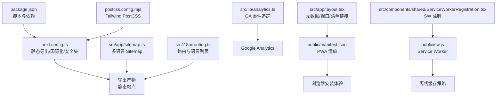
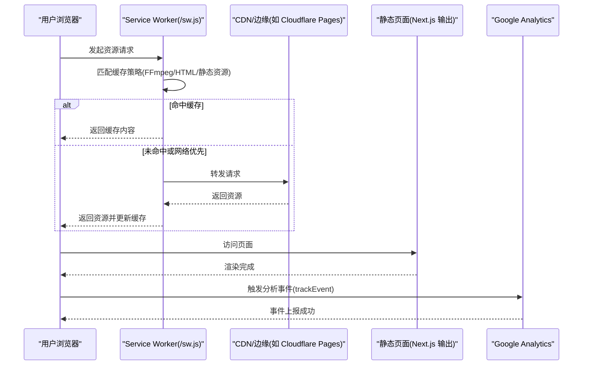
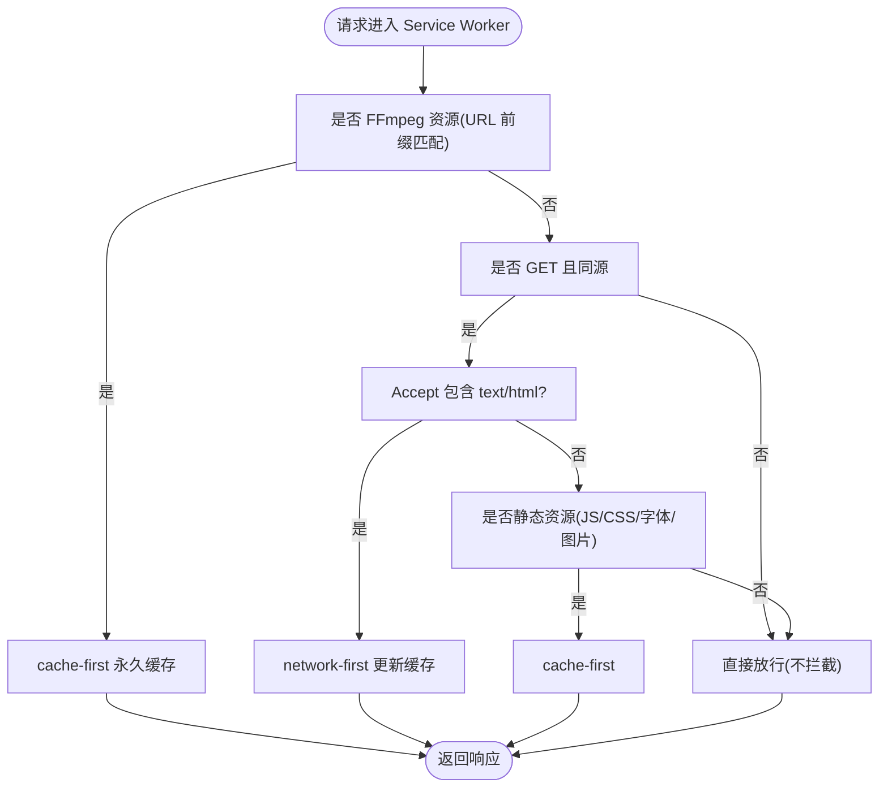
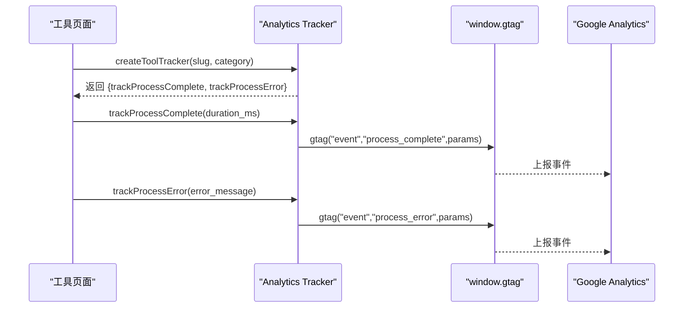
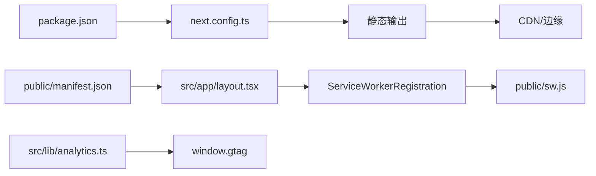

# 部署配置

<cite>
**本文引用的文件**
- [next.config.ts](file://next.config.ts)
- [package.json](file://package.json)
- [postcss.config.mjs](file://postcss.config.mjs)
- [public/manifest.json](file://public/manifest.json)
- [public/sw.js](file://public/sw.js)
- [src/app/layout.tsx](file://src/app/layout.tsx)
- [src/components/shared/ServiceWorkerRegistration.tsx](file://src/components/shared/ServiceWorkerRegistration.tsx)
- [src/lib/analytics.ts](file://src/lib/analytics.ts)
- [src/app/sitemap.ts](file://src/app/sitemap.ts)
- [src/i18n/routing.ts](file://src/i18n/routing.ts)
</cite>

## 目录
1. [简介](#简介)
2. [项目结构](#项目结构)
3. [核心组件](#核心组件)
4. [架构总览](#架构总览)
5. [详细组件分析](#详细组件分析)
6. [依赖关系分析](#依赖关系分析)
7. [性能考虑](#性能考虑)
8. [故障排除指南](#故障排除指南)
9. [结论](#结论)
10. [附录](#附录)

## 简介
本文件面向 PrivaDeck 媒体工具箱的部署与配置，聚焦以下方面：
- 构建配置：Next.js 静态导出、图片优化、国际化插件与安全响应头
- PWA 配置：应用清单、Service Worker 注册与离线缓存策略
- CDN 与静态资源优化：Cloudflare Pages 部署适配、资源压缩与缓存策略
- 安全与 HTTPS：COOP/COEP 响应头、CSP 与安全头建议
- 性能监控与分析：Google Analytics 集成与事件追踪
- 生产优化：资源加载、缓存策略与错误监控
- 版本管理与发布：CI/CD 与自动化部署建议

## 项目结构
PrivaDeck 使用 Next.js 应用模式，采用静态导出（Static Export）以适配 CDN/边缘平台（如 Cloudflare Pages）。关键目录与文件如下：
- 构建与脚本：next.config.ts、package.json、postcss.config.mjs
- PWA 资源：public/manifest.json、public/sw.js
- 入口与元数据：src/app/layout.tsx
- PWA 注册：src/components/shared/ServiceWorkerRegistration.tsx
- 分析与事件：src/lib/analytics.ts
- SEO 与多语言：src/app/sitemap.ts、src/i18n/routing.ts

图表来源
- [next.config.ts:1-30](file://next.config.ts#L1-L30)
- [package.json:1-45](file://package.json#L1-L45)
- [postcss.config.mjs:1-8](file://postcss.config.mjs#L1-L8)
- [public/manifest.json:1-29](file://public/manifest.json#L1-L29)
- [public/sw.js:1-93](file://public/sw.js#L1-L93)
- [src/app/layout.tsx:1-48](file://src/app/layout.tsx#L1-L48)
- [src/components/shared/ServiceWorkerRegistration.tsx:1-16](file://src/components/shared/ServiceWorkerRegistration.tsx#L1-L16)
- [src/lib/analytics.ts:1-138](file://src/lib/analytics.ts#L1-L138)
- [src/app/sitemap.ts](file://src/app/sitemap.ts)
- [src/i18n/routing.ts](file://src/i18n/routing.ts)

章节来源
- [next.config.ts:1-30](file://next.config.ts#L1-L30)
- [package.json:1-45](file://package.json#L1-L45)
- [postcss.config.mjs:1-8](file://postcss.config.mjs#L1-L8)
- [src/app/layout.tsx:1-48](file://src/app/layout.tsx#L1-L48)

## 核心组件
- 静态导出与国际化：通过 next.config.ts 启用 output: "export" 与国际化插件，确保生成纯静态站点并支持多语言。
- 图片优化：images.unoptimized: true 以避免动态图像处理，配合静态导出。
- 安全响应头：在 headers 中设置 COOP/COEP，保障 WebAssembly 等资源跨源隔离。
- PWA 清单：public/manifest.json 提供应用名称、图标、启动路径与主题色。
- Service Worker：public/sw.js 实现 FFmpeg 永久缓存、HTML 网络优先与静态资源缓存优先策略。
- SW 注册：src/components/shared/ServiceWorkerRegistration.tsx 在客户端注册 /sw.js。
- 分析与事件：src/lib/analytics.ts 提供隐私友好的 GA 事件追踪接口。

章节来源
- [next.config.ts:6-27](file://next.config.ts#L6-L27)
- [public/manifest.json:1-29](file://public/manifest.json#L1-L29)
- [public/sw.js:1-93](file://public/sw.js#L1-L93)
- [src/components/shared/ServiceWorkerRegistration.tsx:5-12](file://src/components/shared/ServiceWorkerRegistration.tsx#L5-L12)
- [src/lib/analytics.ts:106-137](file://src/lib/analytics.ts#L106-L137)

## 架构总览
下图展示从请求到渲染、PWA 缓存与分析上报的整体流程：

图表来源
- [public/sw.js:30-92](file://public/sw.js#L30-L92)
- [src/components/shared/ServiceWorkerRegistration.tsx:7-11](file://src/components/shared/ServiceWorkerRegistration.tsx#L7-L11)
- [src/lib/analytics.ts:106-124](file://src/lib/analytics.ts#L106-L124)

## 详细组件分析

### 构建配置与静态导出
- 静态导出：output: "export" 使 Next.js 生成纯静态文件，便于部署至 CDN 或静态托管平台。
- 图片优化：images.unoptimized: true 禁用动态图像优化，避免运行时处理，提升构建稳定性。
- 国际化：通过 createNextIntlPlugin() 插件生成多语言静态页面。
- 安全响应头：headers 中设置 COOP/COEP，满足跨源隔离要求，确保 FFmpeg WASM 等资源可正常加载。

章节来源
- [next.config.ts:6-27](file://next.config.ts#L6-L27)

### PWA 配置与 Service Worker
- 应用清单：public/manifest.json 定义名称、启动路径、显示模式、主题色与图标集。
- 清单链接：src/app/layout.tsx 将 manifest 与 Apple Web App 设置注入到根布局。
- Service Worker 注册：src/components/shared/ServiceWorkerRegistration.tsx 在客户端注册 /sw.js。
- 缓存策略：
  - FFmpeg 永久缓存：对指定版本 URL 进行 cache-first，保证本地处理稳定。
  - HTML 网络优先：保持页面内容新鲜，失败时回退缓存。
  - 静态资源缓存优先：对 JS/CSS/字体/图片等进行 cache-first，减少重复请求。

图表来源
- [public/sw.js:30-92](file://public/sw.js#L30-L92)

章节来源
- [public/manifest.json:1-29](file://public/manifest.json#L1-L29)
- [src/app/layout.tsx:10-17](file://src/app/layout.tsx#L10-L17)
- [src/components/shared/ServiceWorkerRegistration.tsx:5-12](file://src/components/shared/ServiceWorkerRegistration.tsx#L5-L12)
- [public/sw.js:1-93](file://public/sw.js#L1-L93)

### CDN 配置与静态资源优化
- 静态导出适配：由于使用 output: "export"，建议部署至支持静态托管的 CDN/边缘平台（如 Cloudflare Pages），并启用压缩与缓存。
- 资源压缩：在 CDN 层面启用 Gzip/Brotli 压缩；静态资源可利用现代格式（如 AVIF/WebP）与按需加载策略。
- 缓存策略：结合 Service Worker 的 cache-first 与 network-first 策略，以及 CDN 的缓存头，实现最优加载速度与一致性。

章节来源
- [next.config.ts:6-9](file://next.config.ts#L6-L9)

### 安全配置与 HTTPS
- COOP/COEP：在 headers 中设置 Cross-Origin-Opener-Policy 与 Cross-Origin-Embedder-Policy，满足跨源隔离要求。
- HTTPS 与证书：在 CDN/边缘平台启用 HTTPS 与自动证书管理；确保所有资源通过 HTTPS 加载。
- CSP 建议：可在 headers 中添加 Content-Security-Policy，限制脚本来源与内联脚本，仅允许必要的外部资源（如 FFmpeg CDN）。

章节来源
- [next.config.ts:10-26](file://next.config.ts#L10-L26)

### 性能监控与分析
- Google Analytics 集成：src/lib/analytics.ts 提供 trackEvent 与 createToolTracker，用于记录工具处理时长、错误与交互事件。
- 隐私保护：对敏感字段进行截断处理，避免记录文件名等敏感信息。
- 事件参数：涵盖文件上传/下载、复制点击、搜索查询/选择、相关工具点击、FAQ 展开、主题/语言切换、分享点击、处理完成/错误等。

图表来源
- [src/lib/analytics.ts:128-137](file://src/lib/analytics.ts#L128-L137)
- [src/lib/analytics.ts:106-124](file://src/lib/analytics.ts#L106-L124)

章节来源
- [src/lib/analytics.ts:1-138](file://src/lib/analytics.ts#L1-L138)

### 版本管理与发布流程
- 版本号：package.json 中定义版本号，可用于发布标签与变更日志。
- 构建脚本：dev/build/start/lint 脚本支持本地开发与生产构建。
- 多语言与 Sitemap：src/app/sitemap.ts 与 src/i18n/routing.ts 支持多语言页面与搜索引擎索引。

章节来源
- [package.json:5-10](file://package.json#L5-L10)
- [src/app/sitemap.ts](file://src/app/sitemap.ts)
- [src/i18n/routing.ts](file://src/i18n/routing.ts)

## 依赖关系分析
- 构建链路：package.json -> next.config.ts -> 输出静态文件 -> CDN/边缘托管
- PWA 链路：public/manifest.json + src/app/layout.tsx -> Service Worker 注册 -> public/sw.js
- 分析链路：src/lib/analytics.ts -> window.gtag -> GA

图表来源
- [package.json:1-45](file://package.json#L1-L45)
- [next.config.ts:1-30](file://next.config.ts#L1-L30)
- [public/manifest.json:1-29](file://public/manifest.json#L1-L29)
- [src/app/layout.tsx:10-17](file://src/app/layout.tsx#L10-L17)
- [src/components/shared/ServiceWorkerRegistration.tsx:5-12](file://src/components/shared/ServiceWorkerRegistration.tsx#L5-L12)
- [public/sw.js:1-93](file://public/sw.js#L1-L93)
- [src/lib/analytics.ts:106-124](file://src/lib/analytics.ts#L106-L124)

章节来源
- [package.json:1-45](file://package.json#L1-L45)
- [next.config.ts:1-30](file://next.config.ts#L1-L30)

## 性能考虑
- 资源加载优化
  - 使用静态导出与 CDN 边缘缓存，减少服务器端渲染压力。
  - 对静态资源采用 cache-first 策略，降低带宽与延迟。
  - HTML 采用 network-first，确保内容更新及时。
- 缓存策略
  - FFmpeg 永久缓存：基于版本 URL 的 cache-first，避免重复下载。
  - 静态资源缓存：对 JS/CSS/字体/图片等进行 cache-first，提升二次访问速度。
- 错误监控
  - 结合 GA 的 process_error 事件，收集处理失败原因，辅助定位问题。
  - 在 Service Worker 中对网络异常进行降级回退（缓存回退）。

## 故障排除指南
- Service Worker 无法注册
  - 确认 /sw.js 可被访问且无跨域问题。
  - 检查浏览器控制台是否存在 CORS 或 HTTPS 相关错误。
- FFmpeg 加载失败
  - 确保 COOP/COEP 响应头正确设置，满足跨源隔离。
  - 检查 FFmpeg CDN 的可用性与版本 URL 是否匹配。
- 分析事件未上报
  - 确认已正确初始化 window.gtag，并在隐私设置下允许第三方 Cookie/追踪。
  - 检查隐私截断逻辑是否导致参数丢失。

章节来源
- [src/components/shared/ServiceWorkerRegistration.tsx:7-11](file://src/components/shared/ServiceWorkerRegistration.tsx#L7-L11)
- [next.config.ts:16-22](file://next.config.ts#L16-L22)
- [public/sw.js:34-48](file://public/sw.js#L34-L48)
- [src/lib/analytics.ts:110-124](file://src/lib/analytics.ts#L110-L124)

## 结论
PrivaDeck 采用静态导出与 PWA 策略，结合 CDN 边缘缓存与严格的跨源隔离，实现了高性能、可离线的媒体工具服务。通过 GA 事件追踪与隐私保护设计，既能洞察用户行为，又尊重用户隐私。建议在生产环境中完善 CSP、HTTPS 与自动化 CI/CD 流程，持续优化缓存与监控体系。

## 附录
- 部署建议
  - 平台：Cloudflare Pages（静态导出友好）
  - 功能：开启压缩、缓存、HTTPS 与自动证书
  - 安全：设置 COOP/COEP，必要时补充 CSP
- 监控建议
  - 引入错误监控（如 Sentry）与性能指标（如 Web Vitals）
  - 结合 GA 事件与自定义指标评估工具使用情况