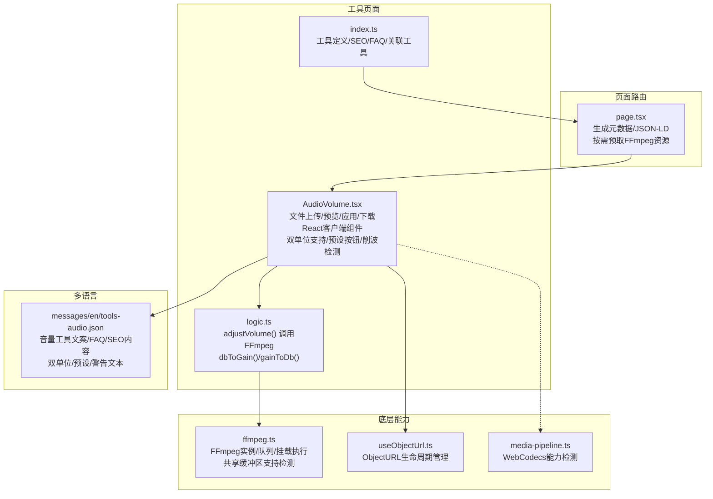
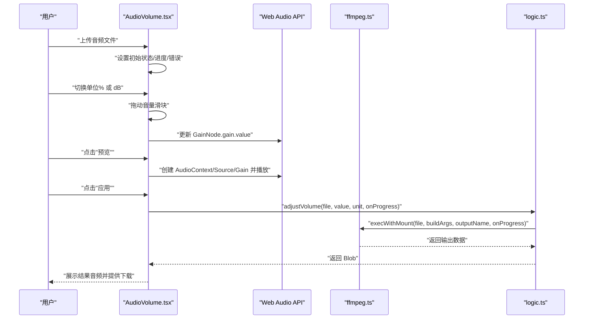
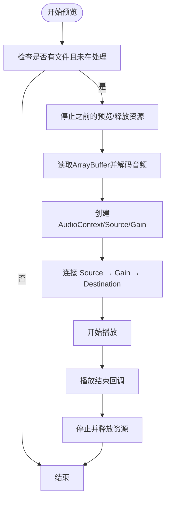
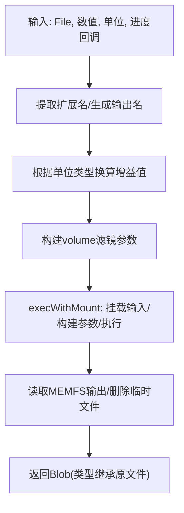
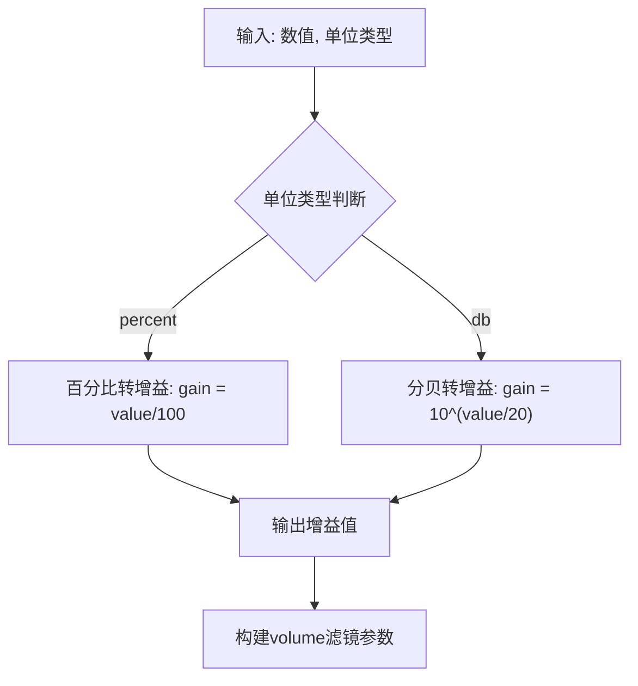
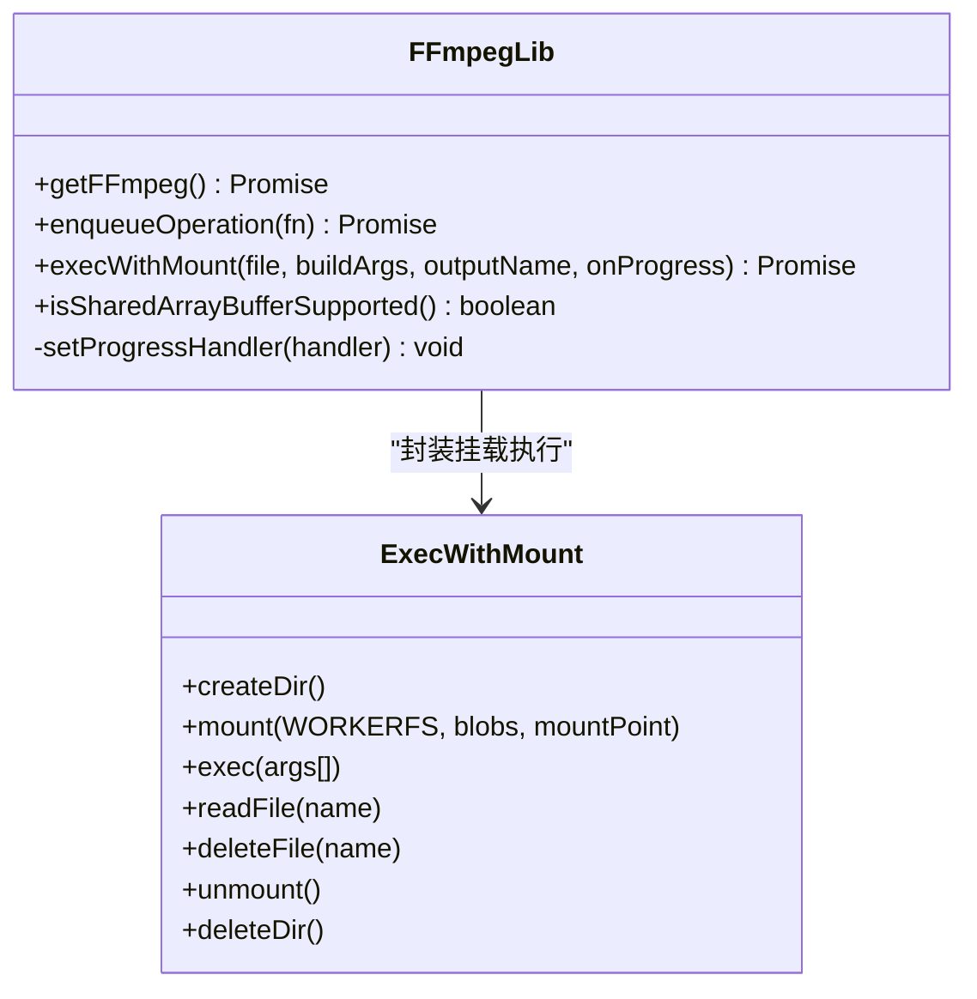
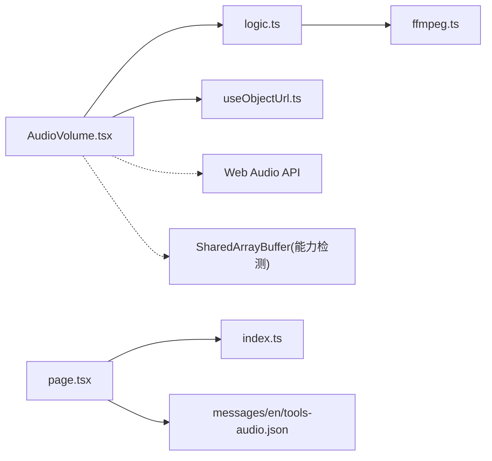

# 音量调节

<cite>
**本文引用的文件**
- [src/tools/audio/volume/AudioVolume.tsx](file://src/tools/audio/volume/AudioVolume.tsx)
- [src/tools/audio/volume/logic.ts](file://src/tools/audio/volume/logic.ts)
- [src/tools/audio/volume/index.ts](file://src/tools/audio/volume/index.ts)
- [src/lib/ffmpeg.ts](file://src/lib/ffmpeg.ts)
- [src/lib/hooks/useObjectUrl.ts](file://src/lib/hooks/useObjectUrl.ts)
- [messages/en/tools-audio.json](file://messages/en/tools-audio.json)
- [messages/zh-Hans/tools-audio.json](file://messages/zh-Hans/tools-audio.json)
- [src/app/[locale]/tools/[category]/[slug]/page.tsx](file://src/app/[locale]/tools/[category]/[slug]/page.tsx)
- [src/tools/audio/trim/AudioTrim.tsx](file://src/tools/audio/trim/AudioTrim.tsx)
- [src/tools/audio/convert/AudioConvert.tsx](file://src/tools/audio/convert/AudioConvert.tsx)
- [src/lib/media-pipeline.ts](file://src/lib/media-pipeline.ts)
</cite>

## 更新摘要
**变更内容**
- 新增双单位支持（百分比和分贝），提供更专业的音频调节体验
- 集成一键预设按钮，支持静音、50%、100%、150%、200%五档常用音量设置
- 实现削波检测警告功能，当增益超过100%时自动提示可能的音频失真
- 重构音量调节算法，支持精确的分贝与百分比换算
- 增强用户界面，提供直观的单位切换和预设选择

## 目录
1. [简介](#简介)
2. [项目结构](#项目结构)
3. [核心组件](#核心组件)
4. [架构总览](#架构总览)
5. [详细组件分析](#详细组件分析)
6. [依赖关系分析](#依赖关系分析)
7. [性能考量](#性能考量)
8. [故障排除指南](#故障排除指南)
9. [结论](#结论)
10. [附录](#附录)

## 简介
本文件面向"音量调节"工具的全面技术与使用文档。该工具允许用户在浏览器中调整音频文件的音量，支持实时预览与批量导出。其核心基于 FFmpeg.wasm 在浏览器端执行音量增益（volume）滤镜，无需上传文件到服务器，保障隐私与离线可用性。

**更新** 工具现已采用现代化的React客户端组件架构，提供更流畅的用户体验和更精确的音量控制。新增双单位支持（百分比和分贝）、一键预设按钮和削波检测警告功能，满足从初学者到专业音频工程师的多样化需求。

工具特性与目标：
- **实时音量预览**：通过 Web Audio API 即时播放调整后的音频，便于快速试听。
- **精确音量控制**：滑动条范围覆盖 0%–300%（百分比）或 -20 dB 到 +20 dB（分贝），满足提升与降低音量的广泛需求。
- **双单位支持**：在百分比和分贝之间自由切换，专业用户用 dB，普通用户用百分比。
- **一键预设**：静音、50%、100%、150%、200% 五档常用音量设置，省去精细拖动。
- **削波检测**：内置增益检测，超过 100% 增幅时即时提示可能失真。
- **高质量处理**：调用 FFmpeg 的 volume 滤镜进行无损或高质量重编码，输出保持原格式与高质量。
- **多语言与 SEO**：内置多语言翻译与 SEO 结构化数据，覆盖常见问答与使用场景。
- **分析追踪**：集成用户行为追踪，帮助改进工具体验。
- **与其他音频工具协同**：可与"裁剪""转换"等工具组合使用，形成完整的音频处理流水线。

## 项目结构
音量调节工具位于音频工具模块下，采用"页面路由 + 客户端组件 + 业务逻辑 + 工具注册"的分层组织方式。页面路由负责国际化与 SEO，客户端组件负责 UI 交互与状态管理，业务逻辑封装 FFmpeg 调用，工具注册定义元数据与关联关系。

**图表来源**
- [src/app/[locale]/tools/[category]/[slug]/page.tsx:78-L106](file://src/app/[locale]/tools/[category]/[slug]/page.tsx#L78-L106)
- [src/tools/audio/volume/AudioVolume.tsx:15-201](file://src/tools/audio/volume/AudioVolume.tsx#L15-L201)
- [src/tools/audio/volume/logic.ts:3-18](file://src/tools/audio/volume/logic.ts#L3-L18)
- [src/lib/ffmpeg.ts:99-143](file://src/lib/ffmpeg.ts#L99-L143)
- [src/lib/hooks/useObjectUrl.ts:7-20](file://src/lib/hooks/useObjectUrl.ts#L7-L20)
- [messages/en/tools-audio.json:141-187](file://messages/en/tools-audio.json#L141-L187)

**章节来源**
- [src/app/[locale]/tools/[category]/[slug]/page.tsx](file://src/app/[locale]/tools/[category]/[slug]/page.tsx#L33-L108)
- [src/tools/audio/volume/AudioVolume.tsx:15-201](file://src/tools/audio/volume/AudioVolume.tsx#L15-L201)
- [src/tools/audio/volume/logic.ts:3-18](file://src/tools/audio/volume/logic.ts#L3-L18)
- [src/tools/audio/volume/index.ts:3-22](file://src/tools/audio/volume/index.ts#L3-L22)
- [src/lib/ffmpeg.ts:10-39](file://src/lib/ffmpeg.ts#L10-L39)
- [src/lib/hooks/useObjectUrl.ts:7-20](file://src/lib/hooks/useObjectUrl.ts#L7-L20)
- [messages/en/tools-audio.json:141-187](file://messages/en/tools-audio.json#L141-L187)

## 核心组件
- **页面路由与 SEO**
  - 动态生成工具页面的元数据与 JSON-LD，按需预取 FFmpeg 核心资源，提升首次加载性能。
  - 支持多语言，合并通用消息与工具专属翻译，渲染 FAQ 与面包屑结构化数据。
- **音量调节客户端组件**
  - **现代化React架构**：采用客户端组件模式，提供更好的用户体验和状态管理。
  - **文件上传与状态管理**：文件选择、进度、错误、处理中状态的完整管理。
  - **实时预览**：通过 Web Audio API 创建 AudioContext、AudioBufferSourceNode、GainNode，实现 0%–300% 的即时音量调整。
  - **双单位支持**：支持百分比（0-300%）和分贝（-20 到 +20 dB）两种单位模式，自动换算和显示。
  - **一键预设**：提供静音、50%、100%、150%、200% 五档常用音量设置，一键应用。
  - **削波检测**：当增益超过 100% 时显示警告，防止音频失真。
  - **应用处理**：调用业务逻辑函数执行 FFmpeg volume 滤镜，返回新 Blob 并提供下载。
  - **UI 控件**：滑块（0–300% 或 -20/+20 dB）、预览/停止按钮、应用/处理中显示、错误提示、结果播放器与下载按钮。
  - **分析追踪**：集成用户行为追踪，记录处理时间和错误信息。
- **业务逻辑**
  - adjustVolume：根据文件扩展名生成输出名，构建 volume 滤镜参数，支持百分比和分贝两种单位，通过 execWithMount 执行 FFmpeg 命令，返回处理后的二进制数据。
  - dbToGain/gainToDb：提供分贝与线性增益之间的精确换算。
- **工具注册**
  - 定义工具 slug、分类、图标、SEO 结构化数据、FAQ 列表以及相关工具列表，便于导航与 SEO。

**章节来源**
- [src/app/[locale]/tools/[category]/[slug]/page.tsx](file://src/app/[locale]/tools/[category]/[slug]/page.tsx#L33-L108)
- [src/tools/audio/volume/AudioVolume.tsx:15-201](file://src/tools/audio/volume/AudioVolume.tsx#L15-L201)
- [src/tools/audio/volume/logic.ts:3-18](file://src/tools/audio/volume/logic.ts#L3-L18)
- [src/tools/audio/volume/index.ts:3-22](file://src/tools/audio/volume/index.ts#L3-L22)

## 架构总览
音量调节工具的运行流程分为"前端 UI 交互"和"后端（浏览器内）处理"两部分。前端负责用户输入与预览，后端（FFmpeg.wasm）负责实际的音量处理与输出。

**图表来源**
- [src/tools/audio/volume/AudioVolume.tsx:63-132](file://src/tools/audio/volume/AudioVolume.tsx#L63-L132)
- [src/tools/audio/volume/logic.ts:3-18](file://src/tools/audio/volume/logic.ts#L3-L18)
- [src/lib/ffmpeg.ts:99-143](file://src/lib/ffmpeg.ts#L99-L143)

## 详细组件分析

### 组件一：音量调节 UI 与预览（AudioVolume）
**更新** 采用完整的React客户端组件架构，提供现代化的用户界面和状态管理，新增双单位支持、预设按钮和削波检测功能。

职责与行为
- **文件管理**：接收单个音频文件，清理上一次处理结果，重置音量至默认值。
- **实时预览**：在用户点击"预览"时，解码音频并创建音频节点链路（源 → 增益 → 输出），通过 GainNode.gain.value 实时反映滑块数值。
- **双单位支持**：支持百分比和分贝两种单位模式，自动在两种模式间换算和显示。
- **一键预设**：提供静音、50%、100%、150%、200% 五档常用音量设置，一键应用。
- **削波检测**：当增益超过 100% 时显示警告，防止音频失真。
- **音量应用**：点击"应用"后停止预览，调用业务逻辑执行 FFmpeg 处理，并显示进度与最终结果。
- **错误处理**：捕获解码与处理异常，向用户展示错误信息。
- **下载与回放**：生成结果 URL，提供音频播放器与下载按钮。
- **状态管理**：使用 React Hooks 管理文件、音量、进度、处理状态等。
- **兼容性检查**：检测 SharedArrayBuffer 支持情况，提供友好的降级提示。

关键交互流程（预览）

**图表来源**
- [src/tools/audio/volume/AudioVolume.tsx:63-104](file://src/tools/audio/volume/AudioVolume.tsx#L63-L104)

**章节来源**
- [src/tools/audio/volume/AudioVolume.tsx:15-201](file://src/tools/audio/volume/AudioVolume.tsx#L15-L201)

### 组件二：音量调节业务逻辑（logic.ts）
**更新** 新增双单位支持和精确换算功能。

职责与行为
- **参数准备**：从文件名提取扩展名，构造输出文件名；根据单位类型（百分比或分贝）计算增益值。
- **单位换算**：提供 dbToGain 和 gainToDb 函数，在分贝和线性增益之间精确换算。
- **FFmpeg 调用**：通过 execWithMount 将输入文件以只读方式挂载到虚拟文件系统，执行 volume 滤镜命令，读取内存中的输出文件并删除临时文件。
- **返回结果**：将二进制数据包装为 Blob，类型继承自原文件类型或默认为音频 MPEG 类型。

**图表来源**
- [src/tools/audio/volume/logic.ts:3-18](file://src/tools/audio/volume/logic.ts#L3-L18)
- [src/lib/ffmpeg.ts:99-143](file://src/lib/ffmpeg.ts#L99-L143)

**章节来源**
- [src/tools/audio/volume/logic.ts:3-18](file://src/tools/audio/volume/logic.ts#L3-L18)

### 组件三：单位换算与增益计算（logic.ts）
**新增** 专门处理分贝与百分比之间的换算。

职责与行为
- **分贝转增益**：使用公式 `gain = 10^(dB/20)` 将分贝值转换为线性增益。
- **增益转分贝**：使用公式 `dB = 20 * log10(gain)` 将线性增益转换为分贝值。
- **边界处理**：处理 0 增益的特殊情况，返回负无穷分贝值。

**图表来源**
- [src/tools/audio/volume/logic.ts:37-43](file://src/tools/audio/volume/logic.ts#L37-L43)

**章节来源**
- [src/tools/audio/volume/logic.ts:37-43](file://src/tools/audio/volume/logic.ts#L37-L43)

### 组件四：FFmpeg 集成与挂载执行（ffmpeg.ts）
职责与行为
- **单例与懒加载**：延迟初始化 FFmpeg 实例，加载核心脚本与 WASM，失败时终止并抛错。
- **进度监听**：统一设置/移除 progress 事件处理器，将进度归一化到 0–100。
- **串行队列**：通过 Promise 队列保证 FFmpeg 操作串行执行，避免并发挂载冲突。
- **挂载执行**：使用 WORKERFS 将 File 对象直接挂载为只读输入，避免内存拷贝；执行完成后卸载并清理目录。
- **共享缓冲区支持检测**：提供 isSharedArrayBufferSupported 函数检测浏览器兼容性。

**图表来源**
- [src/lib/ffmpeg.ts:10-39](file://src/lib/ffmpeg.ts#L10-L39)
- [src/lib/ffmpeg.ts:99-143](file://src/lib/ffmpeg.ts#L99-L143)

**章节来源**
- [src/lib/ffmpeg.ts:10-39](file://src/lib/ffmpeg.ts#L10-L39)
- [src/lib/ffmpeg.ts:41-58](file://src/lib/ffmpeg.ts#L41-L58)
- [src/lib/ffmpeg.ts:75-82](file://src/lib/ffmpeg.ts#L75-L82)
- [src/lib/ffmpeg.ts:99-143](file://src/lib/ffmpeg.ts#L99-L143)

### 组件五：对象 URL 生命周期（useObjectUrl）
职责与行为
- **自动管理**：自动管理 Blob/File 到 ObjectURL 的创建与撤销，避免内存泄漏与 URL 泄露。
- **生命周期控制**：在依赖变化与组件卸载时自动清理旧 URL。

**章节来源**
- [src/lib/hooks/useObjectUrl.ts:7-20](file://src/lib/hooks/useObjectUrl.ts#L7-L20)

### 组件六：工具注册与 SEO（index.ts 与 page.tsx）
职责与行为
- **工具注册**：定义工具 slug、分类、图标、SEO 结构化数据、FAQ 列表与相关工具，供路由与页面渲染使用。
- **页面路由**：生成工具页面的元数据与 JSON-LD，按需预取 FFmpeg 资源，合并多语言消息，渲染工具专属翻译与面包屑。

**章节来源**
- [src/tools/audio/volume/index.ts:3-22](file://src/tools/audio/volume/index.ts#L3-L22)
- [src/app/[locale]/tools/[category]/[slug]/page.tsx](file://src/app/[locale]/tools/[category]/[slug]/page.tsx#L24-L108)

## 依赖关系分析
- **组件耦合**
  - AudioVolume.tsx 依赖 logic.ts 提供的 adjustVolume、dbToGain、gainToDb，依赖 ffmpeg.ts 的 execWithMount，依赖 useObjectUrl 管理 URL 生命周期。
  - page.tsx 依赖工具注册定义与多语言消息，负责 SEO 与资源预取。
- **外部依赖**
  - FFmpeg.wasm：音视频处理核心，通过 @ffmpeg/ffmpeg 与 @ffmpeg/util 提供加载与工具方法。
  - Web Audio API：用于实时音量预览与播放控制。
  - 浏览器能力：需要 SharedArrayBuffer 支持以启用多线程与高性能处理（工具已做兼容性检查）。
- **可能的循环依赖**
  - 当前模块间为单向依赖（UI → 逻辑 → FFmpeg），未发现循环依赖风险。

**图表来源**
- [src/tools/audio/volume/AudioVolume.tsx:1-13](file://src/tools/audio/volume/AudioVolume.tsx#L1-L13)
- [src/tools/audio/volume/logic.ts:1-1](file://src/tools/audio/volume/logic.ts#L1-L1)
- [src/lib/ffmpeg.ts:1-9](file://src/lib/ffmpeg.ts#L1-L9)
- [src/app/[locale]/tools/[category]/[slug]/page.tsx](file://src/app/[locale]/tools/[category]/[slug]/page.tsx#L1-L11)
- [messages/en/tools-audio.json:141-146](file://messages/en/tools-audio.json#L141-L146)

**章节来源**
- [src/tools/audio/volume/AudioVolume.tsx:1-13](file://src/tools/audio/volume/AudioVolume.tsx#L1-L13)
- [src/tools/audio/volume/logic.ts:1-1](file://src/tools/audio/volume/logic.ts#L1-L1)
- [src/lib/ffmpeg.ts:1-9](file://src/lib/ffmpeg.ts#L1-L9)
- [src/app/[locale]/tools/[category]/[slug]/page.tsx](file://src/app/[locale]/tools/[category]/[slug]/page.tsx#L1-L11)
- [messages/en/tools-audio.json:141-146](file://messages/en/tools-audio.json#L141-L146)

## 性能考量
- **内存优化**
  - 使用 WORKERFS 直接挂载 File 对象，避免两次完整内存拷贝；处理完成后立即删除 MEMFS 中的输出文件，降低峰值内存占用。
  - 串行队列执行所有 FFmpeg 操作，避免并发挂载点冲突与资源竞争。
- **加载与缓存**
  - 页面按需预取 FFmpeg 核心脚本与 WASM，减少首次处理等待时间。
  - FFmpeg 实例单例复用，避免重复加载。
- **预览性能**
  - Web Audio API 解码与播放，仅在用户交互时创建上下文，避免后台资源占用。
- **兼容性**
  - 工具对 SharedArrayBuffer 进行能力检测，不支持时提示用户使用现代浏览器与 HTTPS。
- **用户体验优化**
  - React客户端组件提供更好的状态管理和响应式更新。
  - 实时预览功能让用户能够即时听到音量变化效果。
  - 双单位支持满足不同用户群体的需求。
  - 削波检测警告帮助用户避免音频质量问题。

**章节来源**
- [src/lib/ffmpeg.ts:99-143](file://src/lib/ffmpeg.ts#L99-L143)
- [src/lib/ffmpeg.ts:75-82](file://src/lib/ffmpeg.ts#L75-L82)
- [src/lib/ffmpeg.ts:14-39](file://src/lib/ffmpeg.ts#L14-L39)
- [src/tools/audio/volume/AudioVolume.tsx:134-142](file://src/tools/audio/volume/AudioVolume.tsx#L134-L142)

## 故障排除指南
常见问题与解决建议
- **预览失败**
  - 现象：点击"预览"后无声音或报错。
  - 排查：确认浏览器支持 Web Audio API；检查文件是否可解码；查看错误提示并重试。
  - 相关实现参考：[src/tools/audio/volume/AudioVolume.tsx:63-104](file://src/tools/audio/volume/AudioVolume.tsx#L63-L104)
- **处理失败**
  - 现象：点击"应用"后出现错误或长时间无响应。
  - 排查：确认文件格式受支持；检查网络与 FFmpeg 核心加载状态；查看进度回调是否正常；尝试刷新页面重新加载核心。
  - 相关实现参考：[src/tools/audio/volume/logic.ts:3-18](file://src/tools/audio/volume/logic.ts#L3-L18)、[src/lib/ffmpeg.ts:99-143](file://src/lib/ffmpeg.ts#L99-L143)
- **兼容性问题**
  - 现象：页面提示不支持当前功能。
  - 排查：使用现代浏览器（支持 SharedArrayBuffer）并启用 HTTPS；安装 PWA 后可离线使用。
  - 相关实现参考：[src/tools/audio/volume/AudioVolume.tsx:134-142](file://src/tools/audio/volume/AudioVolume.tsx#L134-L142)
- **音质与失真**
  - 现象：音量提升过高导致削波或噪声放大。
  - 建议：避免超过 200% 的大幅提升；结合"裁剪"工具去除静音段落；必要时使用"转换"工具调整编码格式；关注削波检测警告。
  - 相关实现参考：[messages/en/tools-audio.json:156-157](file://messages/en/tools-audio.json#L156-L157)
- **单位换算问题**
  - 现象：分贝与百分比换算不准确。
  - 排查：确认使用内置的 dbToGain 和 gainToDb 函数；检查数值精度和边界条件。
  - 相关实现参考：[src/tools/audio/volume/logic.ts:37-43](file://src/tools/audio/volume/logic.ts#L37-L43)

**章节来源**
- [src/tools/audio/volume/AudioVolume.tsx:63-104](file://src/tools/audio/volume/AudioVolume.tsx#L63-L104)
- [src/tools/audio/volume/logic.ts:3-18](file://src/tools/audio/volume/logic.ts#L3-L18)
- [src/lib/ffmpeg.ts:99-143](file://src/lib/ffmpeg.ts#L99-L143)
- [messages/en/tools-audio.json:156-157](file://messages/en/tools-audio.json#L156-L157)

## 结论
音量调节工具通过 Web Audio API 实现实时预览，借助 FFmpeg.wasm 在浏览器端完成高质量音量处理，具备隐私保护、离线可用与多语言支持等优势。**更新** 新的React客户端组件架构提供了更流畅的用户体验，支持0%-300%的精确音量控制范围，集成了分析追踪功能，新增双单位支持（百分比和分贝）、一键预设按钮和削波检测警告，与其他音频工具（裁剪、转换）形成完整的处理链路，满足从初学者到专业用户的多样化需求。

## 附录

### 使用示例与最佳实践
- **精确音量控制**
  - 使用 0%–300% 滑块微调音量，配合"预览"按钮快速对比效果。
  - 参考路径：[src/tools/audio/volume/AudioVolume.tsx:156-171](file://src/tools/audio/volume/AudioVolume.tsx#L156-L171)
- **双单位切换**
  - 在百分比和分贝之间自由切换，专业用户用 dB，普通用户用百分比。
  - 参考路径：[src/tools/audio/volume/AudioVolume.tsx:111-122](file://src/tools/audio/volume/AudioVolume.tsx#L111-L122)
- **一键预设**
  - 使用静音、50%、100%、150%、200% 五档预设快速设置常用音量。
  - 参考路径：[src/tools/audio/volume/AudioVolume.tsx:124-132](file://src/tools/audio/volume/AudioVolume.tsx#L124-L132)
- **削波检测**
  - 关注增益超过 100% 时的警告，避免音频失真。
  - 参考路径：[src/tools/audio/volume/AudioVolume.tsx:62](file://src/tools/audio/volume/AudioVolume.tsx#L62)
- **批量调节**
  - 逐个上传文件，分别设置音量并导出，适用于多段音频的统一处理。
  - 参考路径：[src/tools/audio/volume/AudioVolume.tsx:113-132](file://src/tools/audio/volume/AudioVolume.tsx#L113-L132)
- **与其他工具协同**
  - 先用"裁剪"去除静音/噪音段，再用"音量调节"提升整体响度，最后用"转换"调整格式。
  - 参考路径：[src/tools/audio/trim/AudioTrim.tsx:48-62](file://src/tools/audio/trim/AudioTrim.tsx#L48-L62)、[src/tools/audio/convert/AudioConvert.tsx:34-48](file://src/tools/audio/convert/AudioConvert.tsx#L34-L48)

### 技术术语与实现要点
- **响度测量与感知响度模型**
  - 当前实现基于线性增益（volume 滤镜），未集成响度测量或感知响度模型（如 ITU-R BS.1770）。若需更专业的响度控制，可在现有 volume 滤镜基础上引入动态压缩或响度归一化滤镜。
- **动态范围压缩与音频增益计算**
  - 动态压缩可通过 FFmpeg 的 acompressor 或 silencedetect + compand 等滤镜实现；增益计算可基于 RMS 或峰值检测进行自动化调节。
- **峰值检测与 RMS 计算**
  - 可使用 FFmpeg 的 astats 滤镜统计音频统计信息，结合阈值与包络跟踪实现自动增益与限幅。
- **分贝与百分比换算**
  - 分贝转增益：`gain = 10^(dB/20)`
  - 增益转分贝：`dB = 20 * log10(gain)`
  - 边界处理：0 增益对应负无穷分贝值。
- **React客户端组件架构**
  - 采用现代React Hooks模式，提供更好的状态管理和用户体验。
  - 集成分析追踪功能，帮助改进工具体验。
  - 支持完整的错误处理和用户反馈机制。
  - 实现双单位支持和一键预设功能。