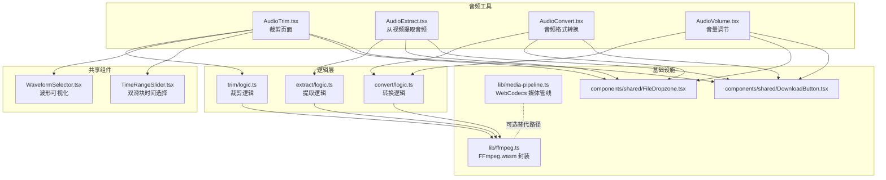
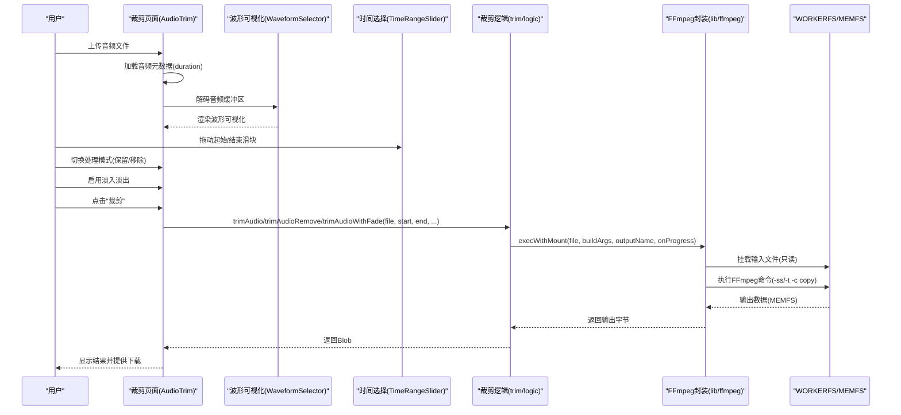
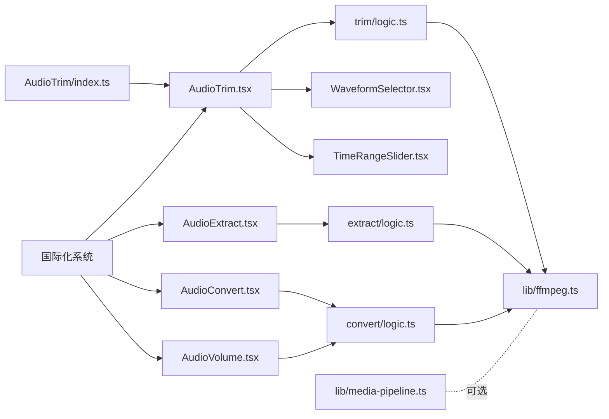

# 音频剪辑

<cite>
**本文引用的文件**
- [AudioTrim.tsx](file://src/tools/audio/trim/AudioTrim.tsx)
- [logic.ts](file://src/tools/audio/trim/logic.ts)
- [WaveformSelector.tsx](file://src/components/shared/WaveformSelector.tsx)
- [TimeRangeSlider.tsx](file://src/components/shared/TimeRangeSlider.tsx)
- [ffmpeg.ts](file://src/lib/ffmpeg.ts)
- [media-pipeline.ts](file://src/lib/media-pipeline.ts)
- [FileDropzone.tsx](file://src/components/shared/FileDropzone.tsx)
- [DownloadButton.tsx](file://src/components/shared/DownloadButton.tsx)
- [AudioExtract.tsx](file://src/tools/audio/extract/AudioExtract.tsx)
- [extract-logic.ts](file://src/tools/audio/extract/logic.ts)
- [AudioConvert.tsx](file://src/tools/audio/convert/AudioConvert.tsx)
- [convert-logic.ts](file://src/tools/audio/convert/logic.ts)
- [AudioVolume.tsx](file://src/tools/audio/volume/AudioVolume.tsx)
- [README.md](file://README.md)
- [package.json](file://package.json)
- [tools-audio.json](file://messages/en/tools-audio.json)
- [tools-audio.json](file://messages/zh-Hans/tools-audio.json)
- [index.ts](file://src/tools/audio/trim/index.ts)
</cite>

## 目录
1. [简介](#简介)
2. [项目结构](#项目结构)
3. [核心组件](#核心组件)
4. [架构总览](#架构总览)
5. [详细组件分析](#详细组件分析)
6. [依赖关系分析](#依赖关系分析)
7. [性能考虑](#性能考虑)
8. [故障排除指南](#故障排除指南)
9. [结论](#结论)
10. [附录](#附录)

## 简介
本文件面向"音频剪辑"工具的实现与使用，系统阐述以下方面：
- 时间轴选择、音频片段提取与精确裁剪算法
- 用户界面交互设计（时间滑块、播放控制、预览）
- 支持的音频格式、采样率处理与质量保持策略
- 内存管理与性能优化技术
- 使用示例与常见问题排查

该工具基于浏览器端处理，所有操作在本地完成，不涉及文件上传，保障隐私与离线可用。

**更新** 新增了波形可视化、双滑块时间选择、保留/移除两种处理模式、毫秒级精确时间输入、淡入淡出功能、环铃声预设以及全面的国际化支持。

## 项目结构
音频剪辑工具位于工具模块下的 audio 分类中，采用"页面组件 + 逻辑函数"的分层组织方式：
- 页面组件负责 UI 交互与状态管理
- 逻辑函数封装纯处理流程（如裁剪、提取、转换、音量调节）
- 底层通过 FFmpeg.wasm 执行实际的媒体处理

**图表来源**
- [AudioTrim.tsx:8-9](file://src/tools/audio/trim/AudioTrim.tsx#L8-L9)
- [WaveformSelector.tsx:15-23](file://src/components/shared/WaveformSelector.tsx#L15-L23)
- [TimeRangeSlider.tsx:20-27](file://src/components/shared/TimeRangeSlider.tsx#L20-L27)
- [logic.ts:3-19](file://src/tools/audio/trim/logic.ts#L3-L19)
- [ffmpeg.ts:99-143](file://src/lib/ffmpeg.ts#L99-L143)
- [media-pipeline.ts:1-175](file://src/lib/media-pipeline.ts#L1-L175)

**章节来源**
- [README.md:55-78](file://README.md#L55-L78)
- [package.json:11-32](file://package.json#L11-L32)

## 核心组件
- 音频剪辑页面组件：负责文件上传、时间轴选择、进度显示、结果下载与错误提示
- 波形可视化组件：提供音频波形的实时可视化，支持拖拽选择和播放头指示
- 双滑块时间选择器：支持拖拽起始/结束滑块、范围拖拽和精确时间输入
- 裁剪逻辑函数：封装 FFmpeg 参数与执行流程，支持保留模式、移除模式和淡入淡出
- FFmpeg 封装：提供单例加载、串行队列、WORKERFS 挂载、进度回调等能力
- 文件拖拽与下载组件：统一的上传与下载交互体验
- WebCodecs 媒体管线：在浏览器支持时提供硬件加速与回退策略
- 国际化支持：完整的多语言翻译系统，支持 20+ 种语言

**更新** 新增了波形可视化组件、双滑块时间选择器、保留/移除两种处理模式、毫秒级精确时间输入、淡入淡出功能、环铃声预设以及全面的国际化支持。

**章节来源**
- [AudioTrim.tsx:12-106](file://src/tools/audio/trim/AudioTrim.tsx#L12-L106)
- [WaveformSelector.tsx:15-146](file://src/components/shared/WaveformSelector.tsx#L15-L146)
- [TimeRangeSlider.tsx:20-144](file://src/components/shared/TimeRangeSlider.tsx#L20-L144)
- [logic.ts:3-19](file://src/tools/audio/trim/logic.ts#L3-L19)
- [ffmpeg.ts:10-39](file://src/lib/ffmpeg.ts#L10-L39)
- [FileDropzone.tsx:42-143](file://src/components/shared/FileDropzone.tsx#L42-L143)
- [DownloadButton.tsx:18-53](file://src/components/shared/DownloadButton.tsx#L18-L53)
- [media-pipeline.ts:7-14](file://src/lib/media-pipeline.ts#L7-L14)

## 架构总览
音频剪辑的处理链路如下：
- 用户在裁剪页面选择音频文件
- 页面读取音频元数据以初始化时长与时间轴范围
- 用户通过起始/结束滑块设定裁剪区间
- 调用裁剪逻辑函数，内部通过 FFmpeg.wasm 执行精确裁剪
- 进度回调实时更新 UI，完成后提供下载按钮

**图表来源**
- [AudioTrim.tsx:48-62](file://src/tools/audio/trim/AudioTrim.tsx#L48-L62)
- [WaveformSelector.tsx:38-95](file://src/components/shared/WaveformSelector.tsx#L38-L95)
- [TimeRangeSlider.tsx:46-84](file://src/components/shared/TimeRangeSlider.tsx#L46-L84)
- [logic.ts:3-19](file://src/tools/audio/trim/logic.ts#L3-L19)
- [ffmpeg.ts:99-143](file://src/lib/ffmpeg.ts#L99-L143)

## 详细组件分析

### 组件一：音频剪辑页面（AudioTrim）
- 功能要点
  - 文件上传：通过共享组件接收音频文件
  - 波形可视化：使用 WaveformSelector 组件显示音频波形，支持拖拽选择和播放头指示
  - 双滑块时间选择：TimeRangeSlider 提供直观的起始/结束时间拖拽
  - 处理模式：支持"保留选区"和"删除选区"两种模式
  - 淡入淡出：可选的 0-3 秒淡入淡出效果
  - 环铃声预设：一键设置 30/40 秒铃声长度
  - 毫秒级精确输入：支持 mm:ss.ms 格式的精确时间输入
  - 播放控制：内置音频元素用于预览与时长获取
  - 进度反馈：调用裁剪逻辑时传入进度回调，实时更新百分比
  - 结果下载：裁剪成功后生成 Blob 并提供下载按钮
  - 错误处理：捕获异常并展示错误信息
- 关键交互
  - 加载元数据后设置默认结束时间为总时长
  - 起始滑块最大不超过结束时间-0.1 秒，结束滑块最小不低于起始时间+0.1 秒，避免无效区间
  - 使用对象 URL 提供音频预览，避免内存复制
  - 支持波形拖拽选择和精确时间输入双向同步

**更新** 新增了波形可视化、双滑块时间选择、处理模式切换、淡入淡出、环铃声预设和毫秒级精确输入功能。

**章节来源**
- [AudioTrim.tsx:12-106](file://src/tools/audio/trim/AudioTrim.tsx#L12-L106)
- [AudioTrim.tsx:261-266](file://src/tools/audio/trim/AudioTrim.tsx#L261-L266)
- [AudioTrim.tsx:283-289](file://src/tools/audio/trim/AudioTrim.tsx#L283-L289)

### 组件二：波形可视化组件（WaveformSelector）
- 波形渲染算法
  - 使用 Canvas API 绘制音频波形，支持高 DPI 设备
  - 通过采样像素计算每个像素的最小/最大振幅值
  - 支持多声道音频的合并显示
  - 实时播放头指示和选区高亮
- 交互功能
  - 支持点击任意位置跳转到指定时间
  - 自适应容器尺寸变化
  - 高性能的波形绘制，限制最大画布尺寸防止内存溢出
- 性能优化
  - 使用 ResizeObserver 监听容器尺寸变化
  - 限制最大画布尺寸（4096×1024）防止 Safari 限制
  - 仅在必要时重新绘制波形

**更新** 新增了独立的波形可视化组件，提供专业的音频波形显示和交互功能。

**章节来源**
- [WaveformSelector.tsx:15-146](file://src/components/shared/WaveformSelector.tsx#L15-L146)
- [WaveformSelector.tsx:38-95](file://src/components/shared/WaveformSelector.tsx#L38-L95)

### 组件三：双滑块时间选择器（TimeRangeSlider）
- 双滑块拖拽
  - 支持拖拽起始滑块、结束滑块和整个选区
  - 智能边界约束，防止滑块重叠
  - 实时显示时间标签和选区时长
- 精确时间输入
  - 支持 mm:ss 格式的时间输入
  - 自动格式化和边界检查
  - 与波形可视化双向同步
- 交互优化
  - 支持触摸设备的指针事件
  - 智能的拖拽偏移计算
  - 平滑的动画和视觉反馈

**更新** 新增了专业的双滑块时间选择器，提供直观的时间选择体验。

**章节来源**
- [TimeRangeSlider.tsx:20-144](file://src/components/shared/TimeRangeSlider.tsx#L20-L144)
- [TimeRangeSlider.tsx:46-84](file://src/components/shared/TimeRangeSlider.tsx#L46-L84)

### 组件四：裁剪逻辑（trim/logic）
- 处理模式
  - 保留模式：使用 `-c copy` 实现无损流拷贝
  - 移除模式：删除选区并拼接剩余部分，需要重新编码
  - 淡入淡出模式：在裁剪基础上添加淡入淡出效果
- 精确裁剪算法
  - 输入参数：起始秒数、结束秒数、文件
  - FFmpeg 参数：-ss 指定起始位置，-t 指定时长（结束-起始），-c copy 实现无损流拷贝
  - 输出：根据原文件扩展名推断输出扩展名，返回与原类型一致的 Blob
- 时间格式化
  - 格式化为 HH:mm:ss.SSS（用于 -ss/-t）
  - 展示为 m:ss（用于 UI）
  - 支持毫秒级精确输入 mm:ss.ms
- 淡入淡出算法
  - 自动计算淡入淡出时间，避免重叠
  - 支持 0-3 秒的淡入淡出设置
  - 使用 FFmpeg 的 afade 滤镜实现平滑过渡

**更新** 新增了多种处理模式、淡入淡出功能和毫秒级精确时间输入支持。

**章节来源**
- [logic.ts:3-19](file://src/tools/audio/trim/logic.ts#L3-L19)
- [logic.ts:22-34](file://src/tools/audio/trim/logic.ts#L22-L34)
- [logic.ts:89-122](file://src/tools/audio/trim/logic.ts#L89-L122)
- [logic.ts:144-182](file://src/tools/audio/trim/logic.ts#L144-L182)

### 组件五：FFmpeg 封装（lib/ffmpeg）
- 单例加载与串行队列
  - 懒加载 FFmpeg.wasm 核心，失败自动清理
  - 通过 Promise 队列串行执行所有 FFmpeg 操作，避免并发冲突
- WORKERFS 挂载与内存优化
  - 使用 WORKERFS 直接挂载 File 对象，避免两次内存拷贝
  - 输出读取后立即删除 MEMFS 文件，降低峰值内存占用
- 进度回调
  - 统一监听 FFmpeg 进度事件，转换为 0-100 的整数回调

**章节来源**
- [ffmpeg.ts:10-39](file://src/lib/ffmpeg.ts#L10-L39)
- [ffmpeg.ts:75-82](file://src/lib/ffmpeg.ts#L75-L82)
- [ffmpeg.ts:99-143](file://src/lib/ffmpeg.ts#L99-L143)

### 组件六：文件拖拽与下载（components/shared）
- FileDropzone
  - 支持 accept 限制、maxSize 过滤、拖拽高亮、隐私提示
  - 统一的上传入口，便于扩展分析埋点
- DownloadButton
  - 支持 Blob 或数据 URL 下载，自动回收对象 URL
  - 品牌化文件名处理，便于识别来源

**章节来源**
- [FileDropzone.tsx:42-143](file://src/components/shared/FileDropzone.tsx#L42-L143)
- [DownloadButton.tsx:18-53](file://src/components/shared/DownloadButton.tsx#L18-L53)

### 组件七：WebCodecs 媒体管线（lib/media-pipeline）
- 能力检测：VideoEncoder/Decoder 与 AudioEncoder/Decoder 是否可用
- 转换验证：确保未丢弃关键音视频轨道，若出现编解码器问题则抛出回退错误
- 编码能力探测：可检测 H.264/H.265 编码能力，辅助选择更优路径
- 回退策略：当 WebCodecs 不满足要求时，回到 FFmpeg 路径

**章节来源**
- [media-pipeline.ts:7-14](file://src/lib/media-pipeline.ts#L7-L14)
- [media-pipeline.ts:59-91](file://src/lib/media-pipeline.ts#L59-L91)
- [media-pipeline.ts:108-141](file://src/lib/media-pipeline.ts#L108-L141)

### 组件八：从视频提取音频（AudioExtract）
- 适用场景：从视频中提取音频轨，支持多种输出格式（mp3、wav、aac）
- 参数：输入视频、目标格式、进度回调
- 流程：禁用视频轨（-vn），按格式配置编码参数，输出对应 MIME 类型的 Blob

**章节来源**
- [AudioExtract.tsx:15-84](file://src/tools/audio/extract/AudioExtract.tsx#L15-L84)
- [extract-logic.ts:11-25](file://src/tools/audio/extract/logic.ts#L11-L25)

### 组件九：音频格式转换（AudioConvert）
- 支持格式：mp3、wav、ogg、aac、flac
- 参数：输入音频、目标格式、进度回调
- 流程：按格式映射编码参数，输出对应 MIME 类型的 Blob

**章节来源**
- [AudioConvert.tsx:15-85](file://src/tools/audio/convert/AudioConvert.tsx#L15-L85)
- [convert-logic.ts:21-34](file://src/tools/audio/convert/logic.ts#L21-L34)

### 组件十：音量调节（AudioVolume）
- Web Audio API 预览：实时调整音量增益，支持预览与停止
- 裁剪/转换复用：与转换逻辑共享底层 FFmpeg 能力
- 错误处理与分析埋点：统一错误展示与处理耗时统计

**章节来源**
- [AudioVolume.tsx:15-201](file://src/tools/audio/volume/AudioVolume.tsx#L15-L201)

### 组件十一：国际化支持
- 多语言翻译：支持英语、中文、阿拉伯语、德语、西班牙语、法语、意大利语、荷兰语、葡萄牙语、俄语、泰语、土耳其语、越南语等 20+ 种语言
- 翻译结构：完整的音频工具翻译文件，包含功能描述、界面标签、帮助信息和 SEO 内容
- 动态加载：使用 next-intl 实现动态语言切换
- 本地化优化：针对不同语言的界面布局和文本长度进行优化

**更新** 新增了全面的国际化支持系统，提供多语言界面和内容。

**章节来源**
- [tools-audio.json:1-272](file://messages/en/tools-audio.json#L1-L272)
- [tools-audio.json:1-272](file://messages/zh-Hans/tools-audio.json#L1-L272)

## 依赖关系分析
- 技术栈
  - 前端框架：Next.js 16（App Router）
  - 媒体处理：@ffmpeg/ffmpeg（FFmpeg.wasm）、mediabunny（WebCodecs 媒体管线）
  - UI 组件：基础 UI 原子与共享组件
  - 国际化：next-intl 多语言支持
- 工具分类
  - 音频工具包含：剪辑、格式转换、从视频提取音频、音量调节

**图表来源**
- [AudioTrim.tsx](file://src/tools/audio/trim/AudioTrim.tsx#L10)
- [AudioExtract.tsx](file://src/tools/audio/extract/AudioExtract.tsx#L11)
- [AudioConvert.tsx](file://src/tools/audio/convert/AudioConvert.tsx#L11)
- [AudioVolume.tsx](file://src/tools/audio/volume/AudioVolume.tsx#L11)
- [logic.ts](file://src/tools/audio/trim/logic.ts#L1)
- [extract-logic.ts](file://src/tools/audio/extract/logic.ts#L1)
- [convert-logic.ts](file://src/tools/audio/convert/logic.ts#L1)
- [ffmpeg.ts:1-5](file://src/lib/ffmpeg.ts#L1-L5)
- [media-pipeline.ts:1-5](file://src/lib/media-pipeline.ts#L1-L5)
- [index.ts:1-45](file://src/tools/audio/trim/index.ts#L1-L45)

**章节来源**
- [README.md:26-33](file://README.md#L26-L33)
- [package.json:11-32](file://package.json#L11-L32)

## 性能考虑
- 内存管理
  - WORKERFS 直接挂载 File 对象，避免将文件读入内存
  - 输出读取后立即删除 MEMFS 文件，降低峰值内存
  - 对象 URL 在下载后及时回收
  - 波形绘制限制最大画布尺寸防止内存溢出
- 并发与串行
  - 通过 Promise 队列串行执行 FFmpeg 操作，避免资源竞争
- 进度反馈
  - 统一的进度事件转换为 0-100 的整数回调，UI 可即时刷新
- 可选硬件加速
  - WebCodecs 能力检测与回退策略，必要时退回 FFmpeg
- UI 响应
  - 滑块步进与边界约束减少无效重算
  - 预览使用 Web Audio API，避免额外下载开销
  - 波形渲染使用 Canvas API，支持高 DPI 设备
- 性能优化
  - 大文件跳过波形解码以避免内存溢出
  - 智能的波形采样计算，平衡精度和性能

**更新** 新增了波形可视化性能优化、大文件处理保护和智能采样计算。

**章节来源**
- [ffmpeg.ts:99-143](file://src/lib/ffmpeg.ts#L99-L143)
- [DownloadButton.tsx:27-36](file://src/components/shared/DownloadButton.tsx#L27-L36)
- [media-pipeline.ts:7-14](file://src/lib/media-pipeline.ts#L7-L14)
- [AudioTrim.tsx:89-92](file://src/tools/audio/trim/AudioTrim.tsx#L89-L92)
- [WaveformSelector.tsx:44-50](file://src/components/shared/WaveformSelector.tsx#L44-L50)

## 故障排除指南
- 时间轴同步问题
  - 症状：起始/结束滑块无法拖动或数值异常
  - 排查：确认已加载音频元数据（duration）；检查滑块边界逻辑（起始不得大于等于结束，结束不得小于等于起始）
  - 参考
    - [AudioTrim.tsx:40-46](file://src/tools/audio/trim/AudioTrim.tsx#L40-L46)
    - [AudioTrim.tsx:81-88](file://src/tools/audio/trim/AudioTrim.tsx#L81-L88)
- 音频质量损失
  - 症状：裁剪后音质明显下降
  - 说明：当前裁剪使用 -c copy（流拷贝），理论上不引入重新编码，应保持原始质量
  - 排查：确认输入文件本身质量；检查是否被其他处理步骤影响
  - 参考
    - [logic.ts:12-18](file://src/tools/audio/trim/logic.ts#L12-L18)
- 浏览器兼容性
  - 症状：页面提示不支持
  - 说明：需要 SharedArrayBuffer 支持；部分浏览器或策略限制可能禁用
  - 参考
    - [AudioTrim.tsx:25-31](file://src/tools/audio/trim/AudioTrim.tsx#L25-L31)
    - [ffmpeg.ts:60-62](file://src/lib/ffmpeg.ts#L60-L62)
- 处理卡顿或失败
  - 症状：长时间无响应或报错
  - 排查：检查网络与 CDN 加载 FFmpeg 核心；查看进度回调是否触发；确认文件大小与格式受支持
  - 参考
    - [ffmpeg.ts:14-38](file://src/lib/ffmpeg.ts#L14-L38)
    - [ffmpeg.ts:41-58](file://src/lib/ffmpeg.ts#L41-L58)
- 预览异常
  - 症状：音量调节预览无法播放或报错
  - 排查：确认音频解码成功；检查 AudioContext 生命周期与 gain 设置
  - 参考
    - [AudioVolume.tsx:77-104](file://src/tools/audio/volume/AudioVolume.tsx#L77-L104)
- 波形显示问题
  - 症状：波形无法显示或显示异常
  - 排查：检查音频文件格式是否支持；确认浏览器支持 AudioContext；检查文件大小是否超过限制
  - 参考
    - [AudioTrim.tsx:89-111](file://src/tools/audio/trim/AudioTrim.tsx#L89-L111)
    - [WaveformSelector.tsx:38-95](file://src/components/shared/WaveformSelector.tsx#L38-L95)
- 淡入淡出效果异常
  - 症状：淡入淡出效果不正常或音频质量下降
  - 排查：确认淡入淡出时间不超过选区时长；检查 FFmpeg 版本是否支持 afade 滤镜
  - 参考
    - [logic.ts:99-104](file://src/tools/audio/trim/logic.ts#L99-L104)
    - [logic.ts:107-109](file://src/tools/audio/trim/logic.ts#L107-L109)

**更新** 新增了波形显示问题、淡入淡出效果异常等故障排除指南。

## 结论
音频剪辑工具通过"页面组件 + 逻辑函数 + FFmpeg.wasm"的清晰分层，实现了在浏览器端的隐私安全、高性能音频处理。其核心优势包括：
- 精确裁剪：基于 -ss/-t 与 -c copy 的流拷贝策略，保持原始质量
- 低内存占用：WORKERFS 挂载与输出后清理，显著降低峰值内存
- 串行化执行：避免并发冲突，提升稳定性
- 丰富的 UI 与交互：时间轴滑块、预览、进度反馈与一键下载
- 专业波形可视化：直观的音频波形显示和交互选择
- 多种处理模式：保留模式、移除模式和淡入淡出功能
- 毫秒级精确控制：支持 mm:ss.ms 格式的时间输入
- 环铃声预设：一键设置常用铃声长度
- 全面国际化：支持 20+ 种语言的完整界面和内容

**更新** 新工具在原有优势基础上，新增了专业的波形可视化、灵活的处理模式、精确的时间控制、实用的功能预设和完整的国际化支持，为用户提供了更加专业和易用的音频剪辑体验。

对于专业用户，可结合 WebCodecs 能力与回退策略进一步优化性能；对于新手用户，工具提供了直观的交互与完善的错误提示，易于上手。

## 附录

### 使用示例
- 精确时间选择与导出
  - 步骤
    1) 上传音频文件
    2) 拖动起始/结束滑块，观察 UI 展示的时长
    3) 在波形图上拖拽选择区域，或直接输入 mm:ss.ms 精确时间
    4) 选择处理模式（保留/移除），可选启用淡入淡出
    5) 点击"裁剪"，等待进度条完成
    6) 点击"下载"保存裁剪结果
  - 参考
    - [AudioTrim.tsx:64-104](file://src/tools/audio/trim/AudioTrim.tsx#L64-L104)
    - [logic.ts:3-19](file://src/tools/audio/trim/logic.ts#L3-L19)
- 从视频提取音频
  - 步骤
    1) 上传视频文件
    2) 选择输出格式（mp3/wav/aac）
    3) 点击"提取"，预览并下载
  - 参考
    - [AudioExtract.tsx:50-81](file://src/tools/audio/extract/AudioExtract.tsx#L50-L81)
    - [extract-logic.ts:11-25](file://src/tools/audio/extract/logic.ts#L11-L25)
- 音频格式转换
  - 步骤
    1) 上传音频文件
    2) 选择目标格式
    3) 点击"转换"，预览并下载
  - 参考
    - [AudioConvert.tsx:50-82](file://src/tools/audio/convert/AudioConvert.tsx#L50-L82)
    - [convert-logic.ts:21-34](file://src/tools/audio/convert/logic.ts#L21-L34)
- 波形可视化使用
  - 步骤
    1) 上传音频文件，等待波形解码完成
    2) 在波形图上拖拽选择开始和结束点
    3) 点击播放按钮预览选区
    4) 使用精确时间输入框进行微调
  - 参考
    - [WaveformSelector.tsx:104-112](file://src/components/shared/WaveformSelector.tsx#L104-L112)
    - [AudioTrim.tsx:344-363](file://src/tools/audio/trim/AudioTrim.tsx#L344-L363)

**更新** 新增了波形可视化使用示例和多种处理模式的操作指南。

### 支持的音频格式与质量策略
- 裁剪：-c copy 流拷贝，保持原始质量
- 提取：mp3（高质量）、wav（无损 PCM）、aac（可配置码率）
- 转换：mp3、wav、ogg、aac、flac，按格式映射编码参数
- 处理模式
  - 保留模式：无损流拷贝，保持原始编码器、比特率和音质
  - 移除模式：重新编码为 MP3，拼接前后片段
  - 淡入淡出模式：重新编码为 MP3，添加平滑过渡效果
- 参考
  - [logic.ts:12-18](file://src/tools/audio/trim/logic.ts#L12-L18)
  - [logic.ts:39-83](file://src/tools/audio/trim/logic.ts#L39-L83)
  - [logic.ts:85-122](file://src/tools/audio/trim/logic.ts#L85-L122)
  - [extract-logic.ts:5-9](file://src/tools/audio/extract/logic.ts#L5-L9)
  - [convert-logic.ts:5-11](file://src/tools/audio/convert/logic.ts#L5-L11)

**更新** 新增了多种处理模式的质量策略说明。

### 国际化支持详情
- 支持语言：英语、中文、阿拉伯语、德语、西班牙语、法语、意大利语、荷兰语、葡萄牙语、俄语、泰语、土耳其语、越南语等 20+ 种语言
- 翻译内容：完整的界面标签、帮助信息、SEO 内容和 FAQ
- 动态加载：使用 next-intl 实现运行时语言切换
- 本地化优化：针对不同语言的文本长度和布局进行适配
- 参考
  - [tools-audio.json:1-272](file://messages/en/tools-audio.json#L1-L272)
  - [tools-audio.json:1-272](file://messages/zh-Hans/tools-audio.json#L1-L272)
  - [index.ts:10-40](file://src/tools/audio/trim/index.ts#L10-L40)

**更新** 新增了完整的国际化支持说明。