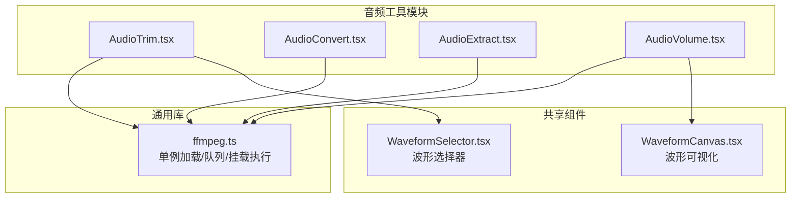
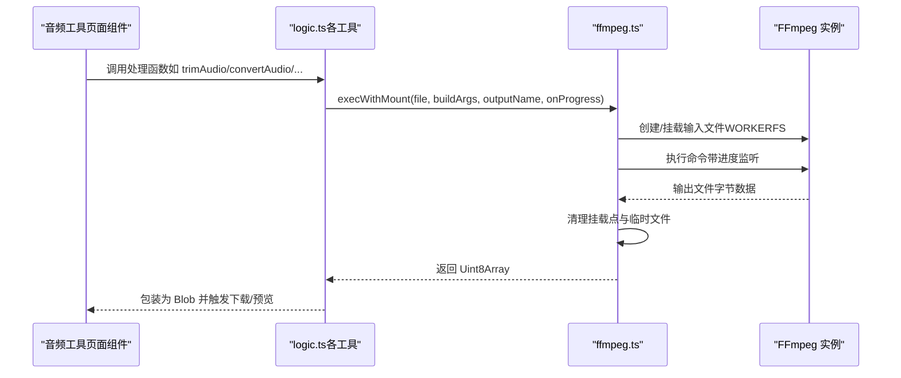
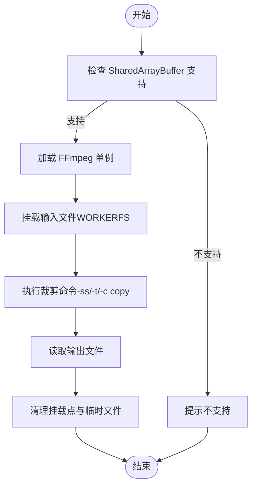
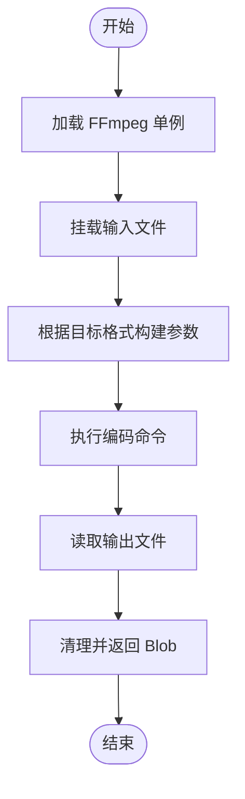
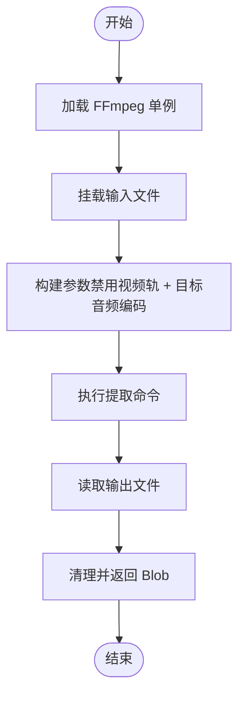
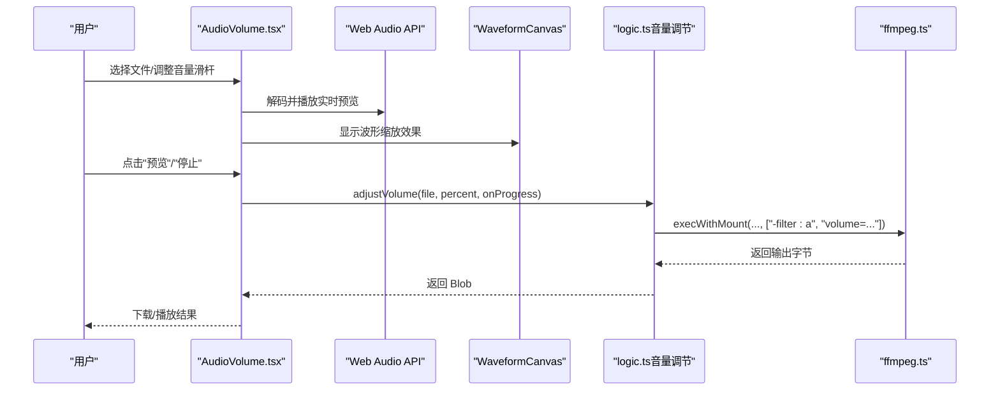

# 音频工具

<cite>
**本文引用的文件**
- [README.md](file://README.md)
- [ffmpeg.ts](file://src/lib/ffmpeg.ts)
- [AudioTrim.tsx](file://src/tools/audio/trim/AudioTrim.tsx)
- [logic.ts（音频剪辑）](file://src/tools/audio/trim/logic.ts)
- [AudioConvert.tsx](file://src/tools/audio/convert/AudioConvert.tsx)
- [logic.ts（音频格式转换）](file://src/tools/audio/convert/logic.ts)
- [AudioExtract.tsx](file://src/tools/audio/extract/AudioExtract.tsx)
- [logic.ts（音频提取）](file://src/tools/audio/extract/logic.ts)
- [AudioVolume.tsx](file://src/tools/audio/volume/AudioVolume.tsx)
- [logic.ts（音量调节）](file://src/tools/audio/volume/logic.ts)
- [WaveformCanvas.tsx](file://src/components/shared/WaveformCanvas.tsx)
- [WaveformSelector.tsx](file://src/components/shared/WaveformSelector.tsx)
- [page.tsx（工具页）](file://src/app/[locale]/tools/[category]/[slug]/page.tsx)
- [tools-audio.json（英文翻译）](file://messages/en/tools-audio.json)
- [tools-audio.json（中文翻译）](file://messages/zh-Hans/tools-audio.json)
</cite>

## 目录
1. [简介](#简介)
2. [项目结构](#项目结构)
3. [核心组件](#核心组件)
4. [架构总览](#架构总览)
5. [详细组件分析](#详细组件分析)
6. [依赖关系分析](#依赖关系分析)
7. [性能与质量](#性能与质量)
8. [使用示例与最佳实践](#使用示例与最佳实践)
9. [与其他媒体工具的关系](#与其他媒体工具的关系)
10. [故障排除指南](#故障排除指南)
11. [结论](#结论)

## 简介
本文件面向"音频工具"模块，系统梳理四类核心能力：音频剪辑、格式转换、从视频提取音频、音量调节。文档覆盖技术实现原理（编码/解码、采样率处理、滤镜效果）、格式支持矩阵、质量控制参数、性能优化策略、算法选择与权衡、使用示例与最佳实践，以及与其他媒体工具的协作关系与故障排除建议。

**更新** 本版本重点反映了音量调节工具的重大功能增强，包括波形可视化、双单位支持（百分比和分贝）、实时预览和剪辑检测等功能。

## 项目结构
音频工具位于 src/tools/audio 下，按功能划分为四个子目录，每个子目录包含：
- 客户端页面组件（例如 AudioTrim.tsx）
- 业务逻辑文件（例如 logic.ts）
- 模块入口（例如 index.ts）

核心依赖是 FFmpeg.wasm，通过统一的 ffmpeg.ts 提供单例加载、进度回调、文件挂载执行等能力。

**图表来源**
- [AudioTrim.tsx:8](file://src/tools/audio/trim/AudioTrim.tsx#L8)
- [AudioVolume.tsx:8](file://src/tools/audio/volume/AudioVolume.tsx#L8)
- [WaveformCanvas.tsx:1](file://src/components/shared/WaveformCanvas.tsx#L1)
- [WaveformSelector.tsx:1](file://src/components/shared/WaveformSelector.tsx#L1)

**章节来源**
- [README.md:16-25](file://README.md#L16-L25)
- [README.md:55-78](file://README.md#L55-L78)

## 核心组件
- 音频剪辑（AudioTrim）
  - 功能：基于时间轴精确裁剪音频片段，支持预览与进度反馈。
  - 关键点：使用流复制（stream copy）以无损方式提取片段，集成 WaveformSelector 波形选择器。
- 音频格式转换（AudioConvert）
  - 功能：在 MP3、WAV、OGG、AAC、FLAC 之间互转。
  - 关键点：针对每种格式设定最优编码参数与 MIME 类型。
- 音频提取（AudioExtract）
  - 功能：从视频文件中抽取音频轨，输出为 MP3、WAV 或 AAC。
  - 关键点：默认禁用视频轨（-vn），仅提取音频。
- 音量调节（AudioVolume）
  - 功能：实时预览与应用音量增益，支持 50%-300% 的调节范围，新增波形可视化和双单位支持。
  - 关键点：使用 volume 音频滤镜进行幅度缩放，集成 WaveformCanvas 实时波形显示。

**更新** 音量调节工具现在集成了完整的波形可视化系统，支持百分比和分贝两种单位模式，并提供实时预览功能。

**章节来源**
- [AudioTrim.tsx:12-107](file://src/tools/audio/trim/AudioTrim.tsx#L12-L107)
- [AudioConvert.tsx:15-86](file://src/tools/audio/convert/AudioConvert.tsx#L15-L86)
- [AudioExtract.tsx:15-85](file://src/tools/audio/extract/AudioExtract.tsx#L15-L85)
- [AudioVolume.tsx:15-202](file://src/tools/audio/volume/AudioVolume.tsx#L15-L202)

## 架构总览
音频工具统一通过 ffmpeg.ts 提供的能力执行 FFmpeg 命令。其核心流程包括：
- 单例加载 FFmpeg.wasm 核心
- 将输入文件以 WORKERFS 方式挂载至虚拟文件系统
- 执行命令并返回内存中的输出文件
- 清理挂载点与中间文件，降低峰值内存占用

**图表来源**
- [logic.ts（音频剪辑）:1-40](file://src/tools/audio/trim/logic.ts#L1-L40)
- [logic.ts（音频格式转换）:1-35](file://src/tools/audio/convert/logic.ts#L1-L35)
- [logic.ts（音频提取）:1-26](file://src/tools/audio/extract/logic.ts#L1-L26)
- [logic.ts（音量调节）:1-24](file://src/tools/audio/volume/logic.ts#L1-L24)
- [ffmpeg.ts:99-144](file://src/lib/ffmpeg.ts#L99-L144)

## 详细组件分析

### 音频剪辑（AudioTrim）
- 技术要点
  - 时间格式化与显示：支持时:分:秒.毫秒与分:秒两种格式。
  - 流复制裁剪：通过 -ss 指定起始位置，-t 指定时长，-c copy 实现无损提取。
  - 进度回调：通过 FFmpeg 进度事件映射到 0-100 的整数百分比。
  - **新增** 波形选择器：集成 WaveformSelector 组件，提供可视化的剪辑区域选择。
- 数据结构与复杂度
  - 输入为 File 对象；输出为 Blob；时间参数为浮点秒数。
  - 时间复杂度近似 O(n)，空间复杂度受输入大小与浏览器内存限制影响。
- 错误处理
  - 文件为空、浏览器不支持 SharedArrayBuffer、FFmpeg 加载失败、执行异常等均有相应错误提示。

**图表来源**
- [AudioTrim.tsx:25-31](file://src/tools/audio/trim/AudioTrim.tsx#L25-L31)
- [logic.ts（音频剪辑）:3-20](file://src/tools/audio/trim/logic.ts#L3-L20)
- [ffmpeg.ts:99-144](file://src/lib/ffmpeg.ts#L99-L144)

**章节来源**
- [AudioTrim.tsx:12-107](file://src/tools/audio/trim/AudioTrim.tsx#L12-L107)
- [logic.ts（音频剪辑）:1-40](file://src/tools/audio/trim/logic.ts#L1-L40)

### 音频格式转换（AudioConvert）
- 技术要点
  - 针对每种目标格式设置编码器与质量参数：
    - MP3：libmp3lame，中等质量
    - WAV：PCM 16-bit 无损
    - OGG：libvorbis，中等质量
    - AAC：AAC，192kbps
    - FLAC：无损压缩
  - MIME 类型与输出扩展名一一对应。
- 数据结构与复杂度
  - 输入为 File；输出为 Blob；复杂度近似 O(n)。
- 性能与质量权衡
  - 有损格式（MP3/OGG/AAC）体积小、兼容性好；无损格式（WAV/FLAC）质量高但体积大。

**图表来源**
- [AudioConvert.tsx:15-86](file://src/tools/audio/convert/AudioConvert.tsx#L15-L86)
- [logic.ts（音频格式转换）:21-35](file://src/tools/audio/convert/logic.ts#L21-L35)
- [ffmpeg.ts:99-144](file://src/lib/ffmpeg.ts#L99-L144)

**章节来源**
- [AudioConvert.tsx:15-86](file://src/tools/audio/convert/AudioConvert.tsx#L15-L86)
- [logic.ts（音频格式转换）:1-35](file://src/tools/audio/convert/logic.ts#L1-L35)

### 音频提取（AudioExtract）
- 技术要点
  - 从视频中抽取音频轨，禁用视频轨（-vn）。
  - 输出格式支持 MP3、WAV、AAC，分别采用相应编码器与比特率/质量参数。
- 数据结构与复杂度
  - 输入为 File（视频）；输出为 Blob；复杂度近似 O(n)。
- 使用场景
  - 音乐翻录、播客素材提取、配音素材分离等。

**图表来源**
- [AudioExtract.tsx:15-85](file://src/tools/audio/extract/AudioExtract.tsx#L15-L85)
- [logic.ts（音频提取）:11-26](file://src/tools/audio/extract/logic.ts#L11-L26)
- [ffmpeg.ts:99-144](file://src/lib/ffmpeg.ts#L99-L144)

**章节来源**
- [AudioExtract.tsx:15-85](file://src/tools/audio/extract/AudioExtract.tsx#L15-L85)
- [logic.ts（音频提取）:1-26](file://src/tools/audio/extract/logic.ts#L1-L26)

### 音量调节（AudioVolume）
- 技术要点
  - 使用 volume 音频滤镜进行幅度缩放，支持 50%-300%。
  - 实时预览：利用 Web Audio API 解码并播放，同时动态调整 GainNode 增益。
  - 应用时：执行带 volume 滤镜的 FFmpeg 命令生成最终音频。
  - **新增** 波形可视化：集成 WaveformCanvas 组件，在调整音量时实时显示波形缩放效果。
  - **新增** 双单位支持：支持百分比（0-300%）和分贝（-20 到 +20 dB）两种单位模式。
  - **新增** 剪辑检测：当增益超过 100% 时显示削波警告，防止音频失真。
  - **新增** 预设功能：提供静音、50%、100%、150%、200% 五档常用预设。
- 数据结构与复杂度
  - 输入为 File；输出为 Blob；复杂度近似 O(n)。
- 注意事项
  - 超过 200% 的增益可能引入削波失真，需谨慎使用。
  - 分贝模式下使用 dbToGain 和 gainToDb 进行精确转换。

**图表来源**
- [AudioVolume.tsx:15-202](file://src/tools/audio/volume/AudioVolume.tsx#L15-L202)
- [logic.ts（音量调节）:3-18](file://src/tools/audio/volume/logic.ts#L3-L18)
- [ffmpeg.ts:99-144](file://src/lib/ffmpeg.ts#L99-L144)

**章节来源**
- [AudioVolume.tsx:15-202](file://src/tools/audio/volume/AudioVolume.tsx#L15-L202)
- [logic.ts（音量调节）:1-24](file://src/tools/audio/volume/logic.ts#L1-L24)

### 波形可视化组件

#### WaveformCanvas（波形画布）
- 功能：实时渲染音频波形，支持增益缩放效果显示
- 技术要点：
  - 使用 Canvas API 绘制波形，支持多通道音频
  - 通过 devicePixelRatio 适配高分辨率屏幕
  - 实时缩放效果：使用 scaleY 变换显示增益变化
  - 自适应容器宽度，使用 ResizeObserver 监听尺寸变化
- 性能优化：
  - 采样像素策略：按像素密度采样，平衡精度与性能
  - 设备像素比适配：确保高清屏清晰显示
  - 过渡动画：80ms 缓动效果，平滑显示增益变化

#### WaveformSelector（波形选择器）
- 功能：提供可视化的音频选择区域，支持拖拽选择
- 技术要点：
  - 集成 AudioTrim 工具，提供剪辑区域可视化
  - 支持播放头指示和选择区域高亮
  - 响应式设计：自适应容器宽度变化
  - 指针事件处理：支持鼠标和触摸设备

**章节来源**
- [WaveformCanvas.tsx:1-97](file://src/components/shared/WaveformCanvas.tsx#L1-L97)
- [WaveformSelector.tsx:1-134](file://src/components/shared/WaveformSelector.tsx#L1-L134)

## 依赖关系分析
- 组件耦合
  - 各工具页面组件仅依赖对应的 logic.ts 与 ffmpeg.ts，内聚性良好。
  - 音量调节工具额外依赖 WaveformCanvas 组件。
  - 剪辑工具依赖 WaveformSelector 组件。
- 外部依赖
  - FFmpeg.wasm（@ffmpeg/ffmpeg）：提供浏览器端音视频处理能力。
  - @ffmpeg/util：用于将核心资源转为 Blob URL，便于加载。
- 运行时依赖
  - SharedArrayBuffer：部分浏览器出于安全考虑禁用，工具会检测并提示。
  - HTTPS 环境：CDN 资源加载需要安全上下文。

```mermaid
graph LR
A["AudioTrim.tsx"] --> L1["logic.ts剪辑"]
B["AudioConvert.tsx"] --> L2["logic.ts转换"]
C["AudioExtract.tsx"] --> L3["logic.ts提取"]
D["AudioVolume.tsx"] --> L4["logic.ts音量"]
D --> WC["WaveformCanvas.tsx"]
A --> WS["WaveformSelector.tsx"]
L1 --> F["ffmpeg.ts"]
L2 --> F
L3 --> F
L4 --> F
F --> W["@ffmpeg/ffmpeg"]
F --> U["@ffmpeg/util"]
```

**图表来源**
- [AudioTrim.tsx:8](file://src/tools/audio/trim/AudioTrim.tsx#L8)
- [AudioVolume.tsx:8](file://src/tools/audio/volume/AudioVolume.tsx#L8)
- [ffmpeg.ts:1-39](file://src/lib/ffmpeg.ts#L1-L39)

**章节来源**
- [ffmpeg.ts:1-39](file://src/lib/ffmpeg.ts#L1-L39)

## 性能与质量
- 性能优化策略
  - 单线程串行执行：通过 Promise 队列保证 FFmpeg WASM 的单线程约束，避免并发挂载冲突。
  - WORKERFS 挂载：直接从 File 对象读取，避免两次内存拷贝，显著降低峰值内存。
  - 进度回调：将 FFmpeg 的进度事件映射到 0-100 的整数，便于 UI 响应。
  - 输出后清理：读取输出后立即删除 MEMFS 中的临时文件，减少内存占用。
  - **新增** 波形渲染优化：WaveformCanvas 使用采样像素策略，平衡视觉质量和性能。
  - **新增** 自适应布局：使用 ResizeObserver 监听容器尺寸变化，避免重复计算。
- 质量控制参数
  - 转换：针对不同格式设置编码器与质量/比特率参数，兼顾体积与兼容性。
  - 提取：默认禁用视频轨，保持音频原始质量（必要时可启用流复制）。
  - 剪辑：使用流复制（-c copy）实现无损裁剪。
  - 音量：通过 volume 滤镜进行幅度缩放，注意避免过度放大导致削波。
  - **新增** 削波检测：实时监控增益值，超过 100% 时显示警告。
- 算法选择与权衡
  - 无损 vs 体积：WAV/FLAC 无损但体积大；MP3/OGG/AAC 体积小但有损。
  - 实时预览 vs 精确处理：预览使用 Web Audio API，快速但不等同于最终编码；最终处理严格遵循 FFmpeg 参数。
  - **新增** 单位转换精度：分贝与百分比之间的转换使用数学公式确保精度。

**章节来源**
- [ffmpeg.ts:75-82](file://src/lib/ffmpeg.ts#L75-L82)
- [ffmpeg.ts:105-142](file://src/lib/ffmpeg.ts#L105-L142)
- [logic.ts（音频格式转换）:5-11](file://src/tools/audio/convert/logic.ts#L5-L11)
- [logic.ts（音频剪辑）:12-18](file://src/tools/audio/trim/logic.ts#L12-L18)
- [logic.ts（音量调节）:12-16](file://src/tools/audio/volume/logic.ts#L12-L16)

## 使用示例与最佳实践
- 音频剪辑
  - 适用：铃声制作、播客剪辑、语音备忘录精炼。
  - 最佳实践：先预览选定区间，再执行流复制裁剪，确保无损。
  - **新增** 波形辅助：利用 WaveformSelector 的可视化界面精确定位剪辑区域。
- 音频格式转换
  - 适用：设备兼容性（MP3）、归档（FLAC）、网页音频（OGG）。
  - 最佳实践：根据用途选择有损/无损；注意目标格式的浏览器支持情况。
- 音频提取
  - 适用：从视频中提取音乐、对话、旁白。
  - 最佳实践：优先选择与视频匹配的音频编码（如 AAC），兼顾体积与兼容性。
- 音量调节
  - 适用：统一音量、提升弱录音。
  - 最佳实践：预览后再应用；避免超过 200% 的增益，防止削波。
  - **新增** 单位选择：专业用户使用分贝模式，普通用户使用百分比模式。
  - **新增** 预设使用：常用场景可直接使用预设档位，提高效率。
  - **新增** 波形监控：通过波形缩放直观观察增益效果。

**章节来源**
- [tools-audio.json:34-48](file://messages/en/tools-audio.json#L34-L48)
- [tools-audio.json:79-93](file://messages/en/tools-audio.json#L79-L93)
- [tools-audio.json:124-138](file://messages/en/tools-audio.json#L124-L138)
- [tools-audio.json:170-185](file://messages/en/tools-audio.json#L170-L185)

## 与其他媒体工具的关系
- 工具分类与数量
  - 音频工具共 4 个，覆盖剪辑、转换、提取、音量调节。
  - 与视频工具（剪辑、压缩、转格式、静音等）共享相同的 FFmpeg.wasm 能力与页面结构。
- 协作方式
  - 页面路由与 SEO 结构一致，工具页在加载时预取 FFmpeg 核心资源，提升首次使用体验。
  - 国际化与 SEO 结构化数据在工具页统一生成，保证跨语言一致性。
  - **新增** 共享组件：波形可视化组件在多个工具间复用，提升开发效率。

**章节来源**
- [README.md:16-25](file://README.md#L16-L25)
- [page.tsx（工具页）:94-99](file://src/app/[locale]/tools/[category]/[slug]/page.tsx#L94-L99)

## 故障排除指南
- SharedArrayBuffer 不支持
  - 现象：页面提示不支持。
  - 原因：浏览器禁用 SharedArrayBuffer 或非 HTTPS 环境。
  - 处理：使用支持该特性的现代浏览器并确保 HTTPS。
- FFmpeg 加载失败
  - 现象：初始化失败或无法执行命令。
  - 原因：CDN 资源加载失败或跨域限制。
  - 处理：检查网络与 CDN 可达性；确保预取链接可访问。
- 处理过程报错
  - 现象：转换/提取/剪辑/音量调节过程中出现错误。
  - 处理：查看控制台错误信息；确认输入文件格式受支持；尝试较小文件；重试操作。
- 预览异常
  - 现象：音量预览无法播放。
  - 处理：检查浏览器自动播放策略；尝试点击播放按钮；更换音频格式。
- **新增** 波形显示问题
  - 现象：波形无法正常显示或显示异常。
  - 处理：检查音频文件格式是否受支持；确认浏览器兼容性；尝试刷新页面。
- **新增** 单位切换异常
  - 现象：百分比与分贝模式切换时数值不正确。
  - 处理：确认 dbToGain 和 gainToDb 转换函数正常工作；检查数值范围限制。

**章节来源**
- [AudioTrim.tsx:25-31](file://src/tools/audio/trim/AudioTrim.tsx#L25-L31)
- [AudioConvert.tsx:26-32](file://src/tools/audio/convert/AudioConvert.tsx#L26-L32)
- [AudioExtract.tsx:26-32](file://src/tools/audio/extract/AudioExtract.tsx#L26-L32)
- [AudioVolume.tsx:134-142](file://src/tools/audio/volume/AudioVolume.tsx#L134-L142)
- [page.tsx（工具页）:94-99](file://src/app/[locale]/tools/[category]/[slug]/page.tsx#L94-L99)

## 结论
音频工具模块以 FFmpeg.wasm 为核心，围绕剪辑、转换、提取、音量调节四大功能构建，具备良好的可维护性与扩展性。通过 WORKERFS 挂载与串行队列执行，实现了在浏览器端高效、低内存占用的音视频处理。配合完善的国际化与 SEO 结构，为用户提供一致且高质量的隐私优先处理体验。

**更新** 本次更新重点增强了音量调节工具的功能完整性，通过集成波形可视化、双单位支持、实时预览和剪辑检测等特性，显著提升了用户体验和专业性。新增的共享组件架构也提高了代码复用性和开发效率。这些改进使得音量调节工具不仅适合普通用户，也能满足专业音频工程师的需求。