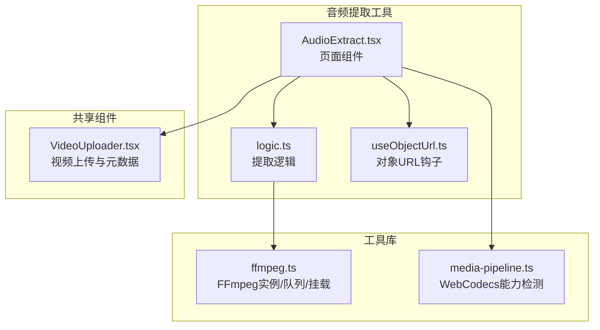
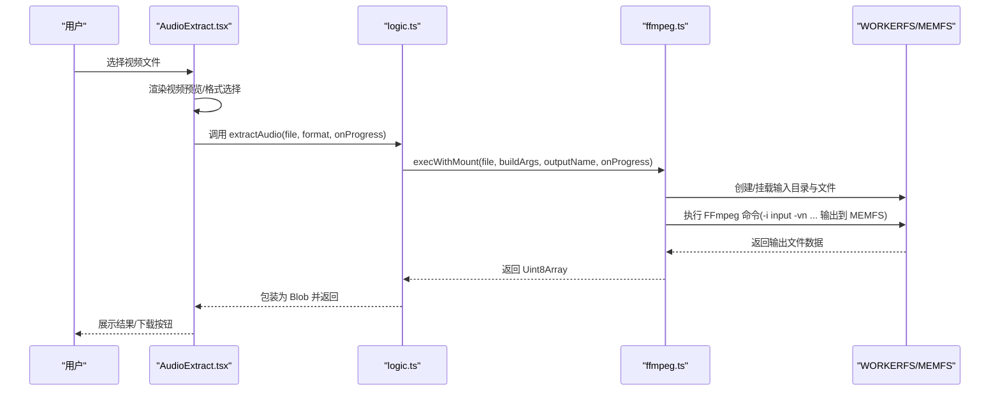
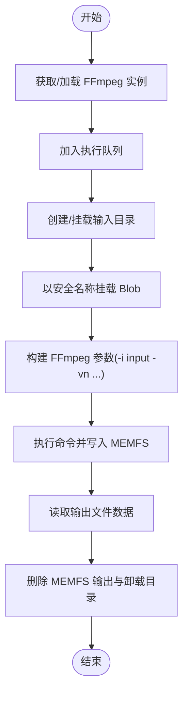
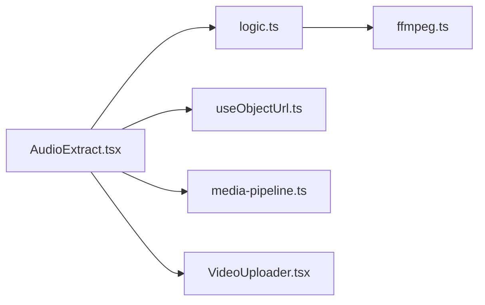

# 音频提取

<cite>
**本文引用的文件**
- [AudioExtract.tsx](file://src/tools/audio/extract/AudioExtract.tsx)
- [logic.ts](file://src/tools/audio/extract/logic.ts)
- [ffmpeg.ts](file://src/lib/ffmpeg.ts)
- [media-pipeline.ts](file://src/lib/media-pipeline.ts)
- [useObjectUrl.ts](file://src/lib/hooks/useObjectUrl.ts)
- [VideoUploader.tsx](file://src/components/shared/VideoUploader.tsx)
- [tools-audio.json](file://messages/en/tools-audio.json)
- [index.ts](file://src/tools/audio/extract/index.ts)
</cite>

## 目录
1. [简介](#简介)
2. [项目结构](#项目结构)
3. [核心组件](#核心组件)
4. [架构总览](#架构总览)
5. [详细组件分析](#详细组件分析)
6. [依赖关系分析](#依赖关系分析)
7. [性能考量](#性能考量)
8. [故障排查指南](#故障排查指南)
9. [结论](#结论)
10. [附录](#附录)

## 简介
本章节面向希望理解“从视频中提取音频”技术实现的用户与开发者，系统阐述该工具在浏览器端基于 FFmpeg.wasm 的工作原理、支持的容器与编码组合、质量控制选项、缓冲与并发策略、以及与视频处理工具的协作关系。文档同时提供常见问题与解决方案，帮助快速定位并修复音视频不同步、音频丢失或提取失败等问题。

## 项目结构
音频提取工具位于前端应用的音频工具模块下，采用“页面组件 + 业务逻辑 + 工具库”的分层组织方式：
- 页面组件负责用户交互与结果展示（上传、格式选择、进度反馈、下载）
- 业务逻辑封装 FFmpeg 命令构建与执行
- 工具库提供 FFmpeg 实例管理、进度回调、内存与并发控制等基础设施
- 共享组件用于视频元数据检测与编解码器兼容性提示

**图表来源**
- [AudioExtract.tsx:1-85](file://src/tools/audio/extract/AudioExtract.tsx#L1-L85)
- [logic.ts:1-26](file://src/tools/audio/extract/logic.ts#L1-L26)
- [ffmpeg.ts:1-144](file://src/lib/ffmpeg.ts#L1-L144)
- [media-pipeline.ts:1-175](file://src/lib/media-pipeline.ts#L1-L175)
- [useObjectUrl.ts:1-21](file://src/lib/hooks/useObjectUrl.ts#L1-L21)
- [VideoUploader.tsx:1-393](file://src/components/shared/VideoUploader.tsx#L1-L393)

**章节来源**
- [AudioExtract.tsx:1-85](file://src/tools/audio/extract/AudioExtract.tsx#L1-L85)
- [logic.ts:1-26](file://src/tools/audio/extract/logic.ts#L1-L26)
- [ffmpeg.ts:1-144](file://src/lib/ffmpeg.ts#L1-L144)
- [media-pipeline.ts:1-175](file://src/lib/media-pipeline.ts#L1-L175)
- [useObjectUrl.ts:1-21](file://src/lib/hooks/useObjectUrl.ts#L1-L21)
- [VideoUploader.tsx:1-393](file://src/components/shared/VideoUploader.tsx#L1-L393)

## 核心组件
- 页面组件：负责文件上传、格式选择、进度显示、错误提示与结果下载
- 提取逻辑：根据输出格式生成 FFmpeg 参数，调用挂载执行函数
- FFmpeg 工具库：单例实例、进度事件绑定、操作串行化队列、WORKERFS 挂载避免内存拷贝
- 对象 URL 钩子：生命周期管理，自动撤销旧 URL
- 视频上传组件：提供视频预览、元数据展示与编解码器兼容性提示

**章节来源**
- [AudioExtract.tsx:1-85](file://src/tools/audio/extract/AudioExtract.tsx#L1-L85)
- [logic.ts:1-26](file://src/tools/audio/extract/logic.ts#L1-L26)
- [ffmpeg.ts:1-144](file://src/lib/ffmpeg.ts#L1-L144)
- [useObjectUrl.ts:1-21](file://src/lib/hooks/useObjectUrl.ts#L1-L21)
- [VideoUploader.tsx:1-393](file://src/components/shared/VideoUploader.tsx#L1-L393)

## 架构总览
音频提取的核心流程是：用户上传视频 → 页面组件渲染预览与参数 → 业务逻辑构建 FFmpeg 命令 → 工具库通过 WORKERFS 挂载输入文件并执行 → 回传二进制结果并以 Blob 形式返回给页面 → 用户可预览与下载。

**图表来源**
- [AudioExtract.tsx:34-48](file://src/tools/audio/extract/AudioExtract.tsx#L34-L48)
- [logic.ts:11-25](file://src/tools/audio/extract/logic.ts#L11-L25)
- [ffmpeg.ts:99-143](file://src/lib/ffmpeg.ts#L99-L143)

## 详细组件分析

### 页面组件：AudioExtract
- 功能要点
  - 文件拖拽上传，支持视频类型
  - 格式选择（mp3、wav、aac）
  - 进度条与错误状态管理
  - 结果预览与下载
  - SharedArrayBuffer 支持检测（不支持时提示）
- 关键交互
  - 处理提取按钮点击，调用业务逻辑并传入进度回调
  - 使用对象 URL 钩子管理预览与下载链接生命周期

**章节来源**
- [AudioExtract.tsx:1-85](file://src/tools/audio/extract/AudioExtract.tsx#L1-L85)
- [useObjectUrl.ts:1-21](file://src/lib/hooks/useObjectUrl.ts#L1-L21)

### 业务逻辑：extractAudio
- 功能要点
  - 定义输出格式映射（含编码器与比特率参数）
  - 构建 FFmpeg 命令：禁用视频流（-vn），仅提取音频
  - 调用工具库执行并返回 Blob
- 参数与行为
  - 输入：File、目标格式、进度回调
  - 输出：对应 MIME 类型的 Blob
  - 错误：捕获异常并回传给 UI

**章节来源**
- [logic.ts:1-26](file://src/tools/audio/extract/logic.ts#L1-L26)

### 工具库：ffmpeg.ts
- 单例与加载
  - 懒加载 FFmpeg 实例，失败时终止并抛出
  - 通过 CDN 加载核心与 WASM 资源
- 进度回调
  - 统一监听 "progress" 事件，转换为 0-100 的整数进度
- 操作队列
  - Promise 队列保证串行执行，避免并发冲突
- 文件挂载与执行
  - 使用 WORKERFS 挂载 File 对象，避免内存复制
  - 执行完成后读取 MEMFS 输出并清理临时文件

**图表来源**
- [ffmpeg.ts:99-143](file://src/lib/ffmpeg.ts#L99-L143)

**章节来源**
- [ffmpeg.ts:1-144](file://src/lib/ffmpeg.ts#L1-L144)

### 共享组件：VideoUploader
- 功能要点
  - 视频预览与元数据展示（尺寸、时长、码率、FPS）
  - 编解码器兼容性检测（WebCodecs 能力与扩展建议）
  - 与音频提取工具协同：提供视频元信息与警告提示
- 与音频提取的关系
  - 在音频提取前可先进行视频元信息检查，辅助判断是否需要降级或提示

**章节来源**
- [VideoUploader.tsx:1-393](file://src/components/shared/VideoUploader.tsx#L1-L393)

### 国际化与 SEO 内容
- 工具描述与 FAQ
  - 支持的输入视频格式、输出音频格式、隐私与离线特性
  - 常见问题覆盖文件大小、浏览器要求、提取速度等
- 有助于用户理解工具能力边界与使用场景

**章节来源**
- [tools-audio.json:96-139](file://messages/en/tools-audio.json#L96-L139)

### 工具注册与导航
- 定义工具的分类、图标、SEO 结构化数据与相关工具
- 便于在应用内发现与跳转

**章节来源**
- [index.ts:1-37](file://src/tools/audio/extract/index.ts#L1-L37)

## 依赖关系分析
- 组件耦合
  - 页面组件依赖业务逻辑与对象 URL 钩子
  - 业务逻辑依赖工具库（FFmpeg）
  - 页面组件可选依赖视频上传组件与媒体管道能力检测
- 外部依赖
  - FFmpeg.wasm（WebAssembly）运行时
  - 浏览器 SharedArrayBuffer 支持（影响并发与性能）

**图表来源**
- [AudioExtract.tsx:1-85](file://src/tools/audio/extract/AudioExtract.tsx#L1-L85)
- [logic.ts:1-26](file://src/tools/audio/extract/logic.ts#L1-L26)
- [ffmpeg.ts:1-144](file://src/lib/ffmpeg.ts#L1-L144)
- [media-pipeline.ts:1-175](file://src/lib/media-pipeline.ts#L1-L175)
- [useObjectUrl.ts:1-21](file://src/lib/hooks/useObjectUrl.ts#L1-L21)
- [VideoUploader.tsx:1-393](file://src/components/shared/VideoUploader.tsx#L1-L393)

**章节来源**
- [AudioExtract.tsx:1-85](file://src/tools/audio/extract/AudioExtract.tsx#L1-L85)
- [logic.ts:1-26](file://src/tools/audio/extract/logic.ts#L1-L26)
- [ffmpeg.ts:1-144](file://src/lib/ffmpeg.ts#L1-L144)
- [media-pipeline.ts:1-175](file://src/lib/media-pipeline.ts#L1-L175)
- [useObjectUrl.ts:1-21](file://src/lib/hooks/useObjectUrl.ts#L1-L21)
- [VideoUploader.tsx:1-393](file://src/components/shared/VideoUploader.tsx#L1-L393)

## 性能考量
- 并发与串行化
  - 通过 Promise 队列串行化所有 FFmpeg 操作，避免多实例竞争与挂载点冲突
- 内存与 I/O
  - 使用 WORKERFS 挂载原生 File 对象，避免 fetchFile()+writeFile() 的两次全量内存拷贝
  - 执行后立即删除 MEMFS 输出，降低峰值内存占用
- 进度反馈
  - 统一订阅 FFmpeg 进度事件，转换为百分比回调，提升用户体验
- 浏览器能力
  - SharedArrayBuffer 支持决定能否启用更高并发；当前实现通过队列保障稳定性

**章节来源**
- [ffmpeg.ts:75-82](file://src/lib/ffmpeg.ts#L75-L82)
- [ffmpeg.ts:105-142](file://src/lib/ffmpeg.ts#L105-L142)

## 故障排查指南
- SharedArrayBuffer 不支持
  - 现象：页面提示不支持
  - 原因：浏览器/HTTPS 要求
  - 解决：使用现代浏览器并启用 HTTPS
- 提取失败或无结果
  - 现象：抛出异常，UI 显示错误
  - 排查：确认输入视频可被浏览器解码；检查 FFmpeg 日志（可通过工具库的队列与事件机制扩展）
- 音频丢失或为空
  - 现象：输出文件存在但无声
  - 排查：确认视频确实包含音频轨；检查 FFmpeg 命令是否正确禁用视频流并提取音频
- 音视频不同步
  - 现象：音频与视频播放不同步
  - 排查：当前提取逻辑仅提取音频轨，不改变时间轴；若出现不同步，通常源于源视频轨本身问题
- 文件过大导致内存不足
  - 现象：处理缓慢或崩溃
  - 解决：优先使用较小分辨率与较短时长的视频；或考虑服务端处理方案

**章节来源**
- [AudioExtract.tsx:26-32](file://src/tools/audio/extract/AudioExtract.tsx#L26-L32)
- [AudioExtract.tsx:42-47](file://src/tools/audio/extract/AudioExtract.tsx#L42-L47)
- [ffmpeg.ts:105-142](file://src/lib/ffmpeg.ts#L105-L142)

## 结论
音频提取工具通过“页面组件 + 业务逻辑 + FFmpeg 工具库”的清晰分层，在浏览器端实现了对多种视频容器与音频编码的稳定提取。其核心优势在于：
- 基于 FFmpeg.wasm 的本地处理，保障隐私与离线可用性
- 通过 WORKERFS 与串行队列优化内存与并发
- 提供直观的进度反馈与结果预览

对于更复杂的音视频同步、多轨提取或高并发需求，可在现有架构上扩展日志采集与并发策略，同时结合媒体管道能力检测进行降级与提示。

## 附录

### 支持的容器与编码组合
- 输入容器：MP4、WebM、MKV、AVI 等主流容器（由 FFmpeg 支持）
- 输出音频格式：MP3、WAV、AAC（由业务逻辑配置）
- 常见组合示例
  - H.264 + AAC → 导出 MP3/WAV/AAC
  - VP8/VP9 + Vorbis/Opus → 导出 MP3/WAV/AAC
- 注意：提取逻辑默认禁用视频流，仅提取音频轨

**章节来源**
- [logic.ts:5-9](file://src/tools/audio/extract/logic.ts#L5-L9)
- [tools-audio.json:107-110](file://messages/en/tools-audio.json#L107-L110)

### 质量控制选项
- 采样率：当前实现未显式设置采样率参数，保持源码流采样率
- 声道：未强制重排声道布局，保留源声道配置
- 音频增强：未内置均衡、去噪等增强功能
- 可扩展方向：在业务逻辑中增加采样率与声道参数映射，以满足特定导出需求

**章节来源**
- [logic.ts:5-9](file://src/tools/audio/extract/logic.ts#L5-L9)

### 使用示例（步骤说明）
- 从 MP4 中提取 MP3
  - 步骤：上传 MP4 → 选择输出格式为 MP3 → 点击提取 → 预览并下载
- 从 WebM 中提取 WAV
  - 步骤：上传 WebM → 选择输出格式为 WAV → 点击提取 → 下载
- 从 AVI 中提取 AAC
  - 步骤：上传 AVI → 选择输出格式为 AAC → 点击提取 → 下载

**章节来源**
- [AudioExtract.tsx:50-81](file://src/tools/audio/extract/AudioExtract.tsx#L50-L81)
- [tools-audio.json:123-125](file://messages/en/tools-audio.json#L123-L125)

### 与视频处理工具的协作
- 元信息先行：可先使用视频上传组件检测视频分辨率、时长、码率与编解码器，辅助判断是否需要降级
- 编解码器兼容性：当检测到不支持的视频编解码器时，可提示安装硬件扩展或改用其他工具
- 数据流转：音频提取工具直接消费 File 对象，无需上传至服务器，保障隐私与性能

**章节来源**
- [VideoUploader.tsx:117-124](file://src/components/shared/VideoUploader.tsx#L117-L124)
- [media-pipeline.ts:98-104](file://src/lib/media-pipeline.ts#L98-L104)