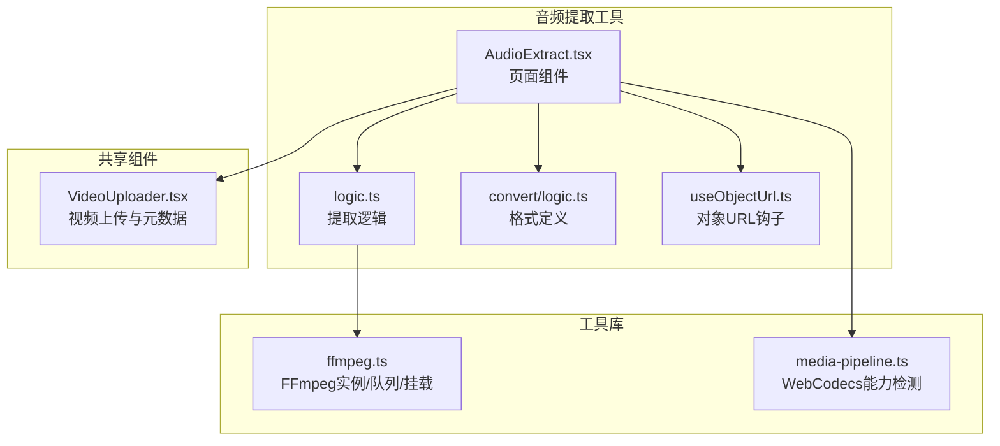
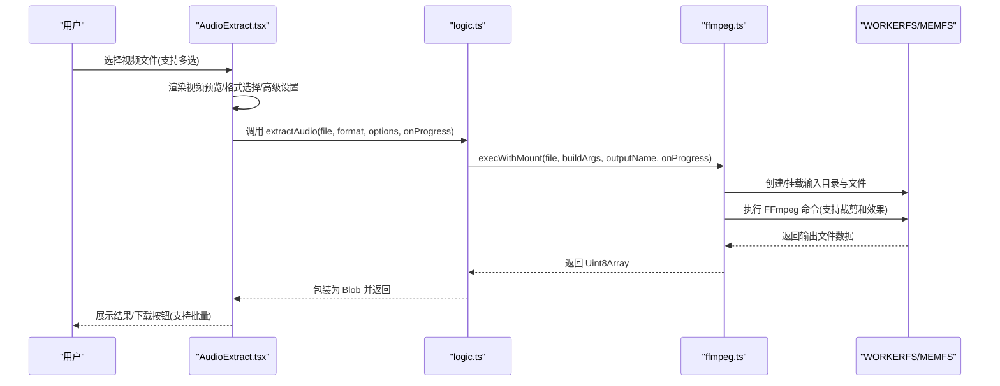
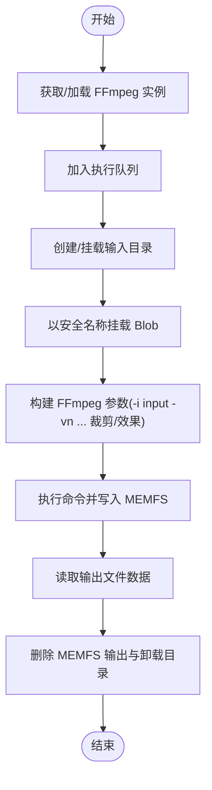
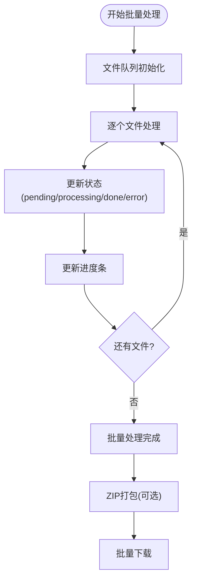
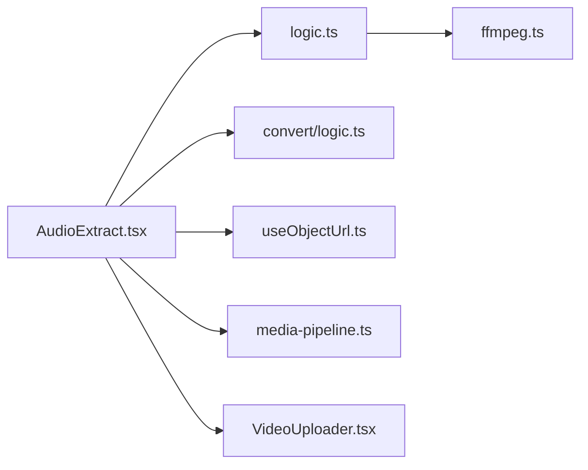

# 音频提取

<cite>
**本文引用的文件**
- [AudioExtract.tsx](file://src/tools/audio/extract/AudioExtract.tsx)
- [logic.ts](file://src/tools/audio/extract/logic.ts)
- [ffmpeg.ts](file://src/lib/ffmpeg.ts)
- [media-pipeline.ts](file://src/lib/media-pipeline.ts)
- [useObjectUrl.ts](file://src/lib/hooks/useObjectUrl.ts)
- [VideoUploader.tsx](file://src/components/shared/VideoUploader.tsx)
- [tools-audio.json](file://messages/en/tools-audio.json)
- [index.ts](file://src/tools/audio/extract/index.ts)
- [convert/logic.ts](file://src/tools/audio/convert/logic.ts)
</cite>

## 更新摘要
**变更内容**
- 新增批量处理功能，支持同时处理多个视频文件
- 新增高级质量控制选项，包括位率、采样率、声道数精细调节
- 新增时间范围裁剪功能，可从视频中提取指定时间段
- 新增淡入淡出音频效果处理
- 新增四种质量预设（低、标准、高、无损）
- 新增7种音频格式输出支持

## 目录
1. [简介](#简介)
2. [项目结构](#项目结构)
3. [核心组件](#核心组件)
4. [架构总览](#架构总览)
5. [详细组件分析](#详细组件分析)
6. [批量处理系统](#批量处理系统)
7. [质量控制选项](#质量控制选项)
8. [时间范围裁剪](#时间范围裁剪)
9. [音频效果处理](#音频效果处理)
10. [依赖关系分析](#依赖关系分析)
11. [性能考量](#性能考量)
12. [故障排查指南](#故障排查指南)
13. [结论](#结论)
14. [附录](#附录)

## 简介
本章节面向希望理解"从视频中提取音频"技术实现的用户与开发者，系统阐述该工具在浏览器端基于 FFmpeg.wasm 的工作原理、支持的容器与编码组合、批量处理能力、质量控制选项、时间范围裁剪、音频效果处理、缓冲与并发策略、以及与视频处理工具的协作关系。文档同时提供常见问题与解决方案，帮助快速定位并修复音视频不同步、音频丢失或提取失败等问题。

## 项目结构
音频提取工具位于前端应用的音频工具模块下，采用"页面组件 + 业务逻辑 + 工具库"的分层组织方式：
- 页面组件负责用户交互与结果展示（上传、格式选择、进度反馈、下载）
- 业务逻辑封装 FFmpeg 命令构建与执行，支持批量处理和高级选项
- 工具库提供 FFmpeg 实例管理、进度回调、内存与并发控制等基础设施
- 共享组件用于视频元数据检测与编解码器兼容性提示

**图表来源**
- [AudioExtract.tsx:1-85](file://src/tools/audio/extract/AudioExtract.tsx#L1-L85)
- [logic.ts:1-26](file://src/tools/audio/extract/logic.ts#L1-L26)
- [convert/logic.ts:1-131](file://src/tools/audio/convert/logic.ts#L1-L131)
- [ffmpeg.ts:1-144](file://src/lib/ffmpeg.ts#L1-L144)
- [media-pipeline.ts:1-175](file://src/lib/media-pipeline.ts#L1-L175)
- [useObjectUrl.ts:1-21](file://src/lib/hooks/useObjectUrl.ts#L1-L21)
- [VideoUploader.tsx:1-393](file://src/components/shared/VideoUploader.tsx#L1-L393)

**章节来源**
- [AudioExtract.tsx:1-85](file://src/tools/audio/extract/AudioExtract.tsx#L1-L85)
- [logic.ts:1-26](file://src/tools/audio/extract/logic.ts#L1-L26)
- [convert/logic.ts:1-131](file://src/tools/audio/convert/logic.ts#L1-L131)
- [ffmpeg.ts:1-144](file://src/lib/ffmpeg.ts#L1-L144)
- [media-pipeline.ts:1-175](file://src/lib/media-pipeline.ts#L1-L175)
- [useObjectUrl.ts:1-21](file://src/lib/hooks/useObjectUrl.ts#L1-L21)
- [VideoUploader.tsx:1-393](file://src/components/shared/VideoUploader.tsx#L1-L393)

## 核心组件
- 页面组件：负责文件上传、格式选择、进度显示、错误提示与结果下载，支持批量处理和高级设置
- 提取逻辑：根据输出格式生成 FFmpeg 参数，支持时间范围裁剪和音频效果处理
- 格式定义：统一管理音频格式、位率、采样率等配置
- FFmpeg 工具库：单例实例、进度事件绑定、操作串行化队列、WORKERFS 挂载避免内存拷贝
- 对象 URL 钩子：生命周期管理，自动撤销旧 URL
- 视频上传组件：提供视频预览、元数据展示与编解码器兼容性提示

**章节来源**
- [AudioExtract.tsx:1-85](file://src/tools/audio/extract/AudioExtract.tsx#L1-L85)
- [logic.ts:1-26](file://src/tools/audio/extract/logic.ts#L1-L26)
- [convert/logic.ts:1-131](file://src/tools/audio/convert/logic.ts#L1-L131)
- [ffmpeg.ts:1-144](file://src/lib/ffmpeg.ts#L1-L144)
- [useObjectUrl.ts:1-21](file://src/lib/hooks/useObjectUrl.ts#L1-L21)
- [VideoUploader.tsx:1-393](file://src/components/shared/VideoUploader.tsx#L1-L393)

## 架构总览
音频提取的核心流程是：用户上传视频 → 页面组件渲染预览与参数 → 业务逻辑构建 FFmpeg 命令 → 工具库通过 WORKERFS 挂载输入文件并执行 → 回传二进制结果并以 Blob 形式返回给页面 → 用户可预览与下载。新增的批量处理系统支持队列管理、进度跟踪和批量下载。

**图表来源**
- [AudioExtract.tsx:34-48](file://src/tools/audio/extract/AudioExtract.tsx#L34-L48)
- [logic.ts:11-25](file://src/tools/audio/extract/logic.ts#L11-L25)
- [ffmpeg.ts:99-143](file://src/lib/ffmpeg.ts#L99-L143)

## 详细组件分析

### 页面组件：AudioExtract
- 功能要点
  - 文件拖拽上传，支持视频类型和多文件选择
  - 格式选择（mp3、wav、aac、ogg、flac、m4a、opus）
  - 质量预设（低、标准、高、无损）和高级设置面板
  - 时间范围裁剪（开始/结束时间精确控制）
  - 音频效果（淡入淡出）
  - 进度条与错误状态管理
  - 结果预览与下载，支持批量ZIP打包
  - SharedArrayBuffer 支持检测（不支持时提示）
- 关键交互
  - 处理提取按钮点击，调用业务逻辑并传入进度回调
  - 使用对象 URL 钩子管理预览与下载链接生命周期
  - 支持批量文件队列管理和进度跟踪

**章节来源**
- [AudioExtract.tsx:1-85](file://src/tools/audio/extract/AudioExtract.tsx#L1-L85)
- [useObjectUrl.ts:1-21](file://src/lib/hooks/useObjectUrl.ts#L1-L21)

### 业务逻辑：extractAudio
- 功能要点
  - 定义输出格式映射（含编码器与比特率参数）
  - 构建 FFmpeg 命令：禁用视频流（-vn），仅提取音频
  - 支持时间范围裁剪（-ss 和 -t 参数）
  - 支持音频效果处理（afade 滤镜）
  - 调用工具库执行并返回 Blob
- 参数与行为
  - 输入：File、目标格式、提取选项、进度回调
  - 输出：对应 MIME 类型的 Blob
  - 错误：捕获异常并回传给 UI
  - 选项：bitrate、sampleRate、channels、start、end、fadeIn、fadeOut、duration

**章节来源**
- [logic.ts:1-26](file://src/tools/audio/extract/logic.ts#L1-L26)

### 格式定义：convert/logic.ts
- 功能要点
  - 统一管理音频格式、位率、采样率等配置
  - 定义格式元数据（扩展名、MIME类型、编解码器、是否无损）
  - 提供格式查询和验证功能
  - 支持位率限制和采样率选项
- 格式支持
  - mp3、wav、ogg、aac、flac、m4a、opus
  - 位率范围：64-320 kbps（opus限制256 kbps）
  - 采样率：8000-48000 Hz
  - 声道：1（单声道）、2（立体声）、保持原样

**章节来源**
- [convert/logic.ts:1-131](file://src/tools/audio/convert/logic.ts#L1-L131)

### 工具库：ffmpeg.ts
- 单例与加载
  - 懒加载 FFmpeg 实例，失败时终止并抛出
  - 通过 CDN 加载核心与 WASM 资源
- 进度回调
  - 统一监听 "progress" 事件，转换为 0-100 的整数进度
- 操作队列
  - Promise 队列保证串行执行，避免并发冲突
- 文件挂载与执行
  - 使用 WORKERFS 挂载 File 对象，避免内存复制
  - 执行完成后读取 MEMFS 输出并清理临时文件

**图表来源**
- [ffmpeg.ts:99-143](file://src/lib/ffmpeg.ts#L99-L143)

**章节来源**
- [ffmpeg.ts:1-144](file://src/lib/ffmpeg.ts#L1-L144)

### 共享组件：VideoUploader
- 功能要点
  - 视频预览与元数据展示（尺寸、时长、码率、FPS）
  - 编解码器兼容性检测（WebCodecs 能力与扩展建议）
  - 与音频提取工具协同：提供视频元信息与警告提示
- 与音频提取的关系
  - 在音频提取前可先进行视频元信息检查，辅助判断是否需要降级或提示

**章节来源**
- [VideoUploader.tsx:1-393](file://src/components/shared/VideoUploader.tsx#L1-L393)

### 国际化与 SEO 内容
- 工具描述与 FAQ
  - 支持的输入视频格式、输出音频格式、隐私与离线特性
  - 常见问题覆盖文件大小、浏览器要求、提取速度等
  - 新增批量处理、时间范围裁剪、音频效果等高级功能说明
- 有助于用户理解工具能力边界与使用场景

**章节来源**
- [tools-audio.json:96-139](file://messages/en/tools-audio.json#L96-L139)

### 工具注册与导航
- 定义工具的分类、图标、SEO 结构化数据与相关工具
- 便于在应用内发现与跳转

**章节来源**
- [index.ts:1-37](file://src/tools/audio/extract/index.ts#L1-L37)

## 批量处理系统

### 队列管理
- 队列状态管理
  - pending：待处理
  - processing：处理中
  - done：已完成
  - error：处理失败
- 进度跟踪
  - 每个文件独立进度显示
  - 总体完成状态统计
  - 支持批量下载ZIP打包

### 批量功能特性
- 多文件上传支持
- 共享设置应用到所有文件
- 逐个文件处理，避免内存溢出
- 错误隔离：单个文件失败不影响其他文件

**图表来源**
- [AudioExtract.tsx:300-386](file://src/tools/audio/extract/AudioExtract.tsx#L300-L386)

**章节来源**
- [AudioExtract.tsx:157-184](file://src/tools/audio/extract/AudioExtract.tsx#L157-L184)
- [AudioExtract.tsx:300-386](file://src/tools/audio/extract/AudioExtract.tsx#L300-L386)

## 质量控制选项

### 质量预设系统
- 低质量：128 kbps，22050 Hz采样率
- 标准质量：192 kbps，保持原采样率
- 高质量：320 kbps，保持原采样率
- 无损质量：FLAC格式，无比特率限制

### 高级设置面板
- 位率控制：64-320 kbps（opus限制256 kbps）
- 采样率控制：8000-48000 Hz
- 声道控制：单声道、立体声、保持原样
- 自动位率适配：针对不同格式的最优值

### 位率限制机制
- opus格式：最大256 kbps
- 其他格式：最大320 kbps
- 自动裁剪：超出范围时自动调整

**章节来源**
- [AudioExtract.tsx:46-53](file://src/tools/audio/extract/AudioExtract.tsx#L46-L53)
- [AudioExtract.tsx:133-155](file://src/tools/audio/extract/AudioExtract.tsx#L133-L155)
- [convert/logic.ts:77-82](file://src/tools/audio/convert/logic.ts#L77-L82)

## 时间范围裁剪

### 裁剪功能特性
- 精确时间控制：支持毫秒级精度
- 开始/结束时间设置
- 实时预览播放选段
- 时间范围可视化

### 技术实现
- FFmpeg参数：-ss（快进到开始时间），-t（设置长度）
- 快速搜索：避免从头解码整个视频
- 精确长度：重新编码时确保准确长度

### 用户界面
- 时间滑块控件
- 文本输入框（mm:ss.ms格式）
- 实时计算持续时间
- 预览播放功能

**章节来源**
- [AudioExtract.tsx:68-81](file://src/tools/audio/extract/AudioExtract.tsx#L68-L81)
- [AudioExtract.tsx:655-777](file://src/tools/audio/extract/AudioExtract.tsx#L655-L777)
- [logic.ts:59-75](file://src/tools/audio/extract/logic.ts#L59-L75)

## 音频效果处理

### 淡入淡出功能
- 淡入效果：在开始处平滑渐强
- 淡出效果：在结束处平滑渐弱
- 独立控制：可单独启用或调整时长
- 最大时长限制：防止重叠和音频失真

### 技术实现
- FFmpeg滤镜：afade（音频淡变）
- 时间计算：淡出位置 = 总时长 - 淡出时长
- 重叠保护：确保淡入和淡出不重叠

### 批量模式限制
- 单文件模式：支持完整的淡入淡出
- 批量模式：仅在已知时长的文件上应用淡出效果
- 自动探测：批量模式下探测每个文件的时长

**章节来源**
- [AudioExtract.tsx:78-81](file://src/tools/audio/extract/AudioExtract.tsx#L78-L81)
- [AudioExtract.tsx:790-827](file://src/tools/audio/extract/AudioExtract.tsx#L790-L827)
- [logic.ts:94-107](file://src/tools/audio/extract/logic.ts#L94-L107)

## 依赖关系分析
- 组件耦合
  - 页面组件依赖业务逻辑、格式定义与对象 URL 钩子
  - 业务逻辑依赖工具库（FFmpeg）和格式定义
  - 页面组件可选依赖视频上传组件与媒体管道能力检测
- 外部依赖
  - FFmpeg.wasm（WebAssembly）运行时
  - 浏览器 SharedArrayBuffer 支持（影响并发与性能）
  - fflate 库用于批量ZIP打包

**图表来源**
- [AudioExtract.tsx:1-85](file://src/tools/audio/extract/AudioExtract.tsx#L1-L85)
- [logic.ts:1-26](file://src/tools/audio/extract/logic.ts#L1-L26)
- [convert/logic.ts:1-131](file://src/tools/audio/convert/logic.ts#L1-L131)
- [ffmpeg.ts:1-144](file://src/lib/ffmpeg.ts#L1-L144)
- [media-pipeline.ts:1-175](file://src/lib/media-pipeline.ts#L1-L175)
- [useObjectUrl.ts:1-21](file://src/lib/hooks/useObjectUrl.ts#L1-L21)
- [VideoUploader.tsx:1-393](file://src/components/shared/VideoUploader.tsx#L1-L393)

**章节来源**
- [AudioExtract.tsx:1-85](file://src/tools/audio/extract/AudioExtract.tsx#L1-L85)
- [logic.ts:1-26](file://src/tools/audio/extract/logic.ts#L1-L26)
- [convert/logic.ts:1-131](file://src/tools/audio/convert/logic.ts#L1-L131)
- [ffmpeg.ts:1-144](file://src/lib/ffmpeg.ts#L1-L144)
- [media-pipeline.ts:1-175](file://src/lib/media-pipeline.ts#L1-L175)
- [useObjectUrl.ts:1-21](file://src/lib/hooks/useObjectUrl.ts#L1-L21)
- [VideoUploader.tsx:1-393](file://src/components/shared/VideoUploader.tsx#L1-L393)

## 性能考量
- 并发与串行化
  - 通过 Promise 队列串行化所有 FFmpeg 操作，避免多实例竞争与挂载点冲突
  - 批量处理时逐个文件处理，避免内存峰值过高
- 内存与 I/O
  - 使用 WORKERFS 挂载原生 File 对象，避免 fetchFile()+writeFile() 的两次全量内存拷贝
  - 执行后立即删除 MEMFS 输出，降低峰值内存占用
- 进度反馈
  - 统一订阅 FFmpeg 进度事件，转换为百分比回调，提升用户体验
  - 批量模式下提供实时进度跟踪
- 浏览器能力
  - SharedArrayBuffer 支持决定能否启用更高并发；当前实现通过队列保障稳定性
- 批量处理优化
  - 文件探测：批量模式下按需探测时长，避免不必要的I/O
  - 错误隔离：单个文件失败不影响整体流程

**章节来源**
- [ffmpeg.ts:75-82](file://src/lib/ffmpeg.ts#L75-L82)
- [ffmpeg.ts:105-142](file://src/lib/ffmpeg.ts#L105-L142)
- [AudioExtract.tsx:388-413](file://src/tools/audio/extract/AudioExtract.tsx#L388-L413)

## 故障排查指南
- SharedArrayBuffer 不支持
  - 现象：页面提示不支持
  - 原因：浏览器/HTTPS 要求
  - 解决：使用现代浏览器并启用 HTTPS
- 提取失败或无结果
  - 现象：抛出异常，UI 显示错误
  - 排查：确认输入视频可被浏览器解码；检查 FFmpeg 日志（可通过工具库的队列与事件机制扩展）
- 音频丢失或为空
  - 现象：输出文件存在但无声
  - 排查：确认视频确实包含音频轨；检查 FFmpeg 命令是否正确禁用视频流并提取音频
- 音视频不同步
  - 现象：音频与视频播放不同步
  - 排查：当前提取逻辑仅提取音频轨，不改变时间轴；若出现不同步，通常源于源视频轨本身问题
- 文件过大导致内存不足
  - 现象：处理缓慢或崩溃
  - 解决：优先使用较小分辨率与较短时长的视频；或考虑服务端处理方案
- 批量处理问题
  - 现象：某些文件处理失败
  - 排查：检查单个文件是否损坏；查看错误详情；尝试单独处理该文件
- 质量设置无效
  - 现象：位率或采样率未按预期设置
  - 排查：确认格式支持相应设置；检查位率限制（opus最大256 kbps）

**章节来源**
- [AudioExtract.tsx:26-32](file://src/tools/audio/extract/AudioExtract.tsx#L26-L32)
- [AudioExtract.tsx:42-47](file://src/tools/audio/extract/AudioExtract.tsx#L42-L47)
- [ffmpeg.ts:105-142](file://src/lib/ffmpeg.ts#L105-L142)

## 结论
音频提取工具通过"页面组件 + 业务逻辑 + FFmpeg 工具库"的清晰分层，在浏览器端实现了对多种视频容器与音频编码的稳定提取。其核心优势在于：
- 基于 FFmpeg.wasm 的本地处理，保障隐私与离线可用性
- 通过 WORKERFS 与串行队列优化内存与并发
- 提供直观的进度反馈与结果预览
- **新增**：批量处理能力，支持多文件同时处理和ZIP打包下载
- **新增**：高级质量控制选项，包括位率、采样率、声道数精细调节
- **新增**：时间范围裁剪和音频效果处理（淡入淡出）
- **新增**：四种质量预设，简化用户操作

对于更复杂的音视频同步、多轨提取或高并发需求，可在现有架构上扩展日志采集与并发策略，同时结合媒体管道能力检测进行降级与提示。

## 附录

### 支持的容器与编码组合
- 输入容器：MP4、WebM、MKV、AVI、MOV 等主流容器（由 FFmpeg 支持）
- 输出音频格式：MP3、WAV、AAC、OGG、FLAC、M4A、Opus（7种格式）
- 常见组合示例
  - H.264 + AAC → 导出 MP3/WAV/AAC/OGG/FLAC/M4A/Opus
  - VP8/VP9 + Vorbis/Opus → 导出 MP3/WAV/AAC/OGG/FLAC/M4A/Opus
- 注意：提取逻辑默认禁用视频流，仅提取音频轨

**章节来源**
- [logic.ts:5-9](file://src/tools/audio/extract/logic.ts#L5-L9)
- [convert/logic.ts:31-42](file://src/tools/audio/convert/logic.ts#L31-L42)
- [tools-audio.json:107-110](file://messages/en/tools-audio.json#L107-L110)

### 质量控制选项
- 采样率：支持 8000-48000 Hz，可保持原采样率或手动设置
- 声道：支持单声道、立体声或保持原声道配置
- 音频增强：内置淡入淡出效果，支持独立控制时长
- 预设质量：低(128k/22kHz)、标准(192k)、高(320k)、无损(FLAC)
- 可扩展方向：在业务逻辑中增加更多音频效果和参数映射

**章节来源**
- [logic.ts:5-9](file://src/tools/audio/extract/logic.ts#L5-L9)
- [convert/logic.ts:48-49](file://src/tools/audio/convert/logic.ts#L48-L49)
- [AudioExtract.tsx:46-53](file://src/tools/audio/extract/AudioExtract.tsx#L46-L53)

### 使用示例（步骤说明）
- 从 MP4 中提取 MP3（单文件）
  - 步骤：上传 MP4 → 选择输出格式为 MP3 → 设置质量预设 → 点击提取 → 预览并下载
- 从 WebM 中提取 WAV（批量）
  - 步骤：多选 WebM → 选择输出格式为 WAV → 启用批量模式 → 设置共享参数 → 点击提取 → 下载ZIP包
- 从 AVI 中提取 AAC（带时间裁剪）
  - 步骤：上传 AVI → 选择输出格式为 AAC → 启用时间裁剪 → 设置开始/结束时间 → 点击提取 → 下载
- 从多个视频中提取音频（带淡入淡出）
  - 步骤：选择多个视频 → 选择输出格式 → 启用淡入淡出 → 设置淡入/淡出时长 → 点击提取 → 下载ZIP包

**章节来源**
- [AudioExtract.tsx:50-81](file://src/tools/audio/extract/AudioExtract.tsx#L50-L81)
- [tools-audio.json:123-125](file://messages/en/tools-audio.json#L123-L125)

### 与视频处理工具的协作
- 元信息先行：可先使用视频上传组件检测视频分辨率、时长、码率与编解码器，辅助判断是否需要降级
- 编解码器兼容性：当检测到不支持的视频编解码器时，可提示安装硬件扩展或改用其他工具
- 数据流转：音频提取工具直接消费 File 对象，无需上传至服务器，保障隐私与性能
- 工作流集成：可与其他音频处理工具（修剪、转换、音量调整）无缝协作

**章节来源**
- [VideoUploader.tsx:117-124](file://src/components/shared/VideoUploader.tsx#L117-L124)
- [media-pipeline.ts:98-104](file://src/lib/media-pipeline.ts#L98-L104)

### 批量处理最佳实践
- 文件数量：建议每次处理不超过20个文件，避免浏览器内存压力
- 存储空间：确保设备有足够的存储空间处理批量文件
- 网络环境：批量处理可能消耗较多网络带宽，建议在稳定网络环境下使用
- 错误处理：批量模式下单个文件失败不会影响其他文件，可单独重试失败文件
- ZIP下载：批量处理完成后可一键下载所有结果的ZIP包，便于管理

**章节来源**
- [AudioExtract.tsx:415-452](file://src/tools/audio/extract/AudioExtract.tsx#L415-L452)
- [tools-audio.json:195-197](file://messages/en/tools-audio.json#L195-L197)