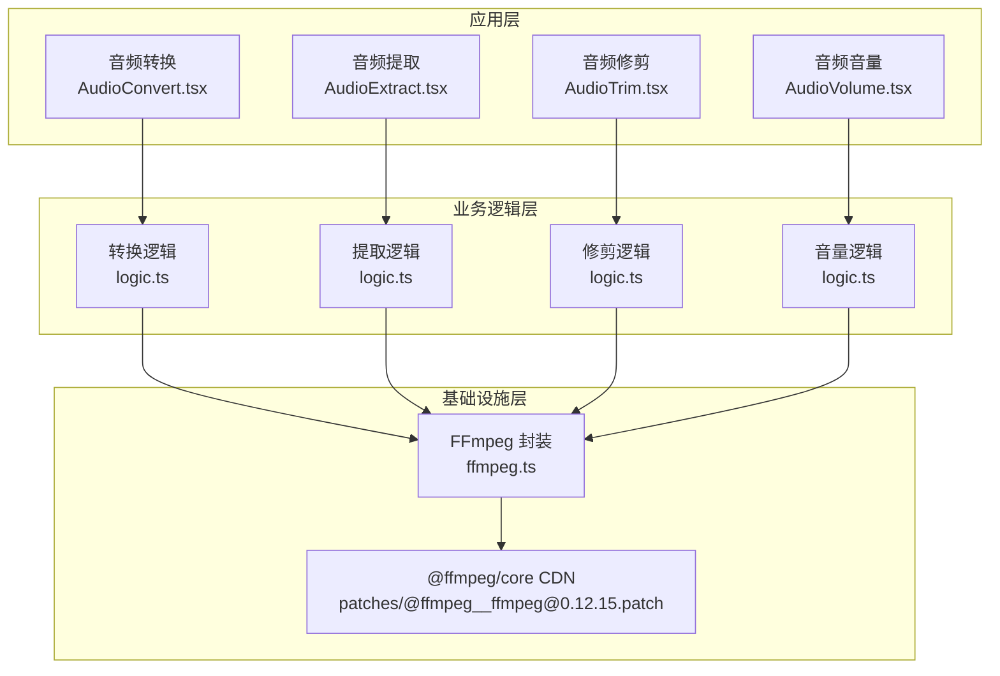
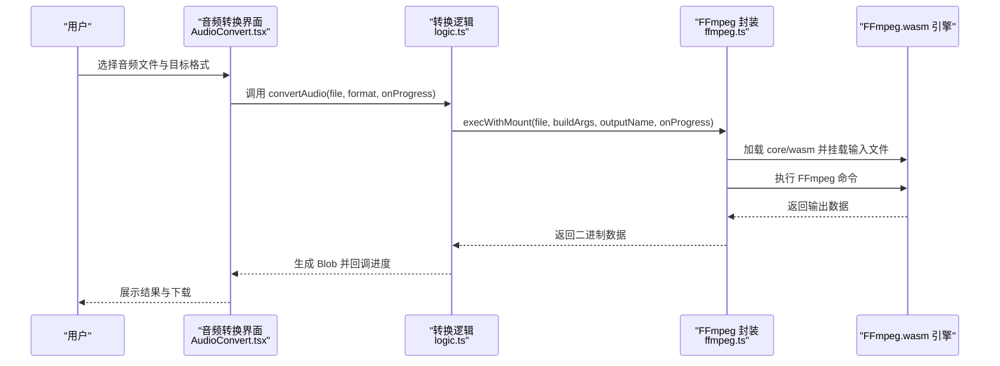
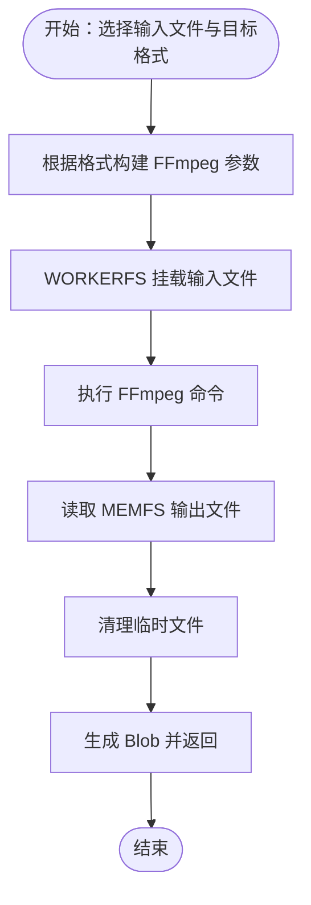
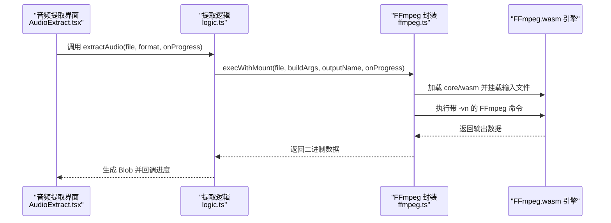
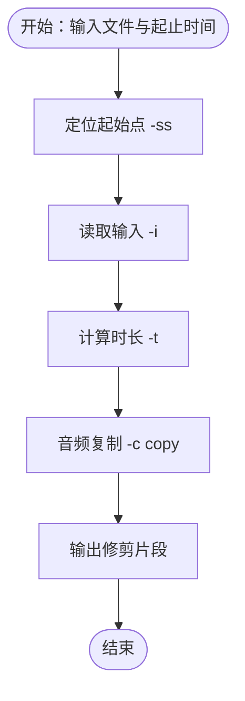
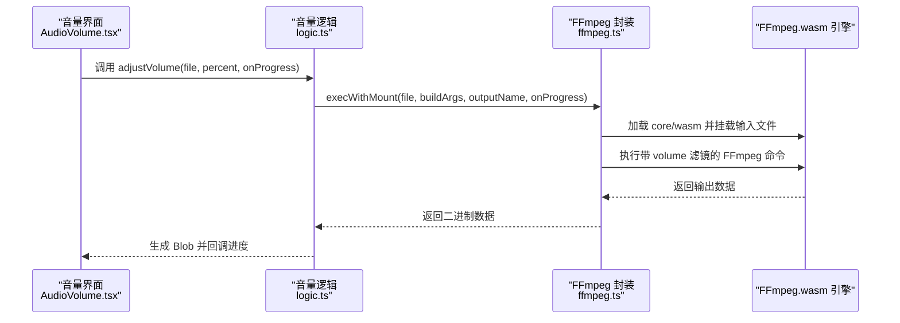
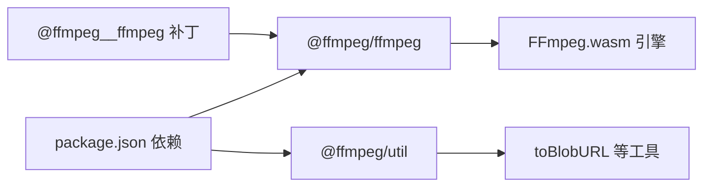

# 音频格式转换

<cite>
**本文引用的文件**
- [README.md](file://README.md)
- [package.json](file://package.json)
- [@ffmpeg__ffmpeg 补丁](file://patches/@ffmpeg__ffmpeg@0.12.15.patch)
- [FFmpeg 封装 ffmpeg.ts](file://src/lib/ffmpeg.ts)
- [音频转换 AudioConvert.tsx](file://src/tools/audio/convert/AudioConvert.tsx)
- [音频转换逻辑 logic.ts](file://src/tools/audio/convert/logic.ts)
- [音频提取 AudioExtract.tsx](file://src/tools/audio/extract/AudioExtract.tsx)
- [音频提取逻辑 logic.ts](file://src/tools/audio/extract/logic.ts)
- [音频修剪 AudioTrim.tsx](file://src/tools/audio/trim/AudioTrim.tsx)
- [音频修剪逻辑 logic.ts](file://src/tools/audio/trim/logic.ts)
- [音频音量 AudioVolume.tsx](file://src/tools/audio/volume/AudioVolume.tsx)
- [音频音量逻辑 logic.ts](file://src/tools/audio/volume/logic.ts)
</cite>

## 目录
1. [简介](#简介)
2. [项目结构](#项目结构)
3. [核心组件](#核心组件)
4. [架构总览](#架构总览)
5. [详细组件分析](#详细组件分析)
6. [依赖关系分析](#依赖关系分析)
7. [性能考量](#性能考量)
8. [故障排查指南](#故障排查指南)
9. [结论](#结论)
10. [附录](#附录)

## 简介
本项目是一个基于浏览器端的多媒体工具箱，专注于本地处理（零上传、零服务器），采用 FFmpeg.wasm 实现音视频处理能力。音频工具模块包含格式转换、从视频提取音频、音频修剪与音量调节等功能。本文档围绕音频格式转换展开，系统讲解编解码器选择、采样率与比特率控制、支持格式矩阵、质量控制参数、算法与性能优化策略，并提供使用示例与常见问题解决方案。

## 项目结构
- 工具分类覆盖图片、视频、音频、PDF、开发者五大类，音频工具包含剪辑、格式转换、提取音频、音量调整。
- 技术栈：Next.js 16（App Router、SSG）、TypeScript、Tailwind CSS v4、国际化 next-intl（21 个语言环境）、媒体处理基于 FFmpeg.wasm。
- 音频工具位于 src/tools/audio 下，分别提供转换、提取、修剪、音量四个子工具；通用 FFmpeg 能力封装于 src/lib/ffmpeg.ts。

图表来源
- [音频转换 AudioConvert.tsx:1-86](file://src/tools/audio/convert/AudioConvert.tsx#L1-L86)
- [音频转换逻辑 logic.ts:1-35](file://src/tools/audio/convert/logic.ts#L1-L35)
- [音频提取 AudioExtract.tsx:1-85](file://src/tools/audio/extract/AudioExtract.tsx#L1-L85)
- [音频提取逻辑 logic.ts:1-26](file://src/tools/audio/extract/logic.ts#L1-L26)
- [音频修剪 AudioTrim.tsx:1-107](file://src/tools/audio/trim/AudioTrim.tsx#L1-L107)
- [音频修剪逻辑 logic.ts:1-40](file://src/tools/audio/trim/logic.ts#L1-L40)
- [音频音量 AudioVolume.tsx:1-202](file://src/tools/audio/volume/AudioVolume.tsx#L1-L202)
- [音频音量逻辑 logic.ts:1-24](file://src/tools/audio/volume/logic.ts#L1-L24)
- [FFmpeg 封装 ffmpeg.ts:1-144](file://src/lib/ffmpeg.ts#L1-L144)
- [@ffmpeg__ffmpeg 补丁:1-14](file://patches/@ffmpeg__ffmpeg@0.12.15.patch#L1-L14)

章节来源
- [README.md:16-33](file://README.md#L16-L33)
- [package.json:11-32](file://package.json#L11-L32)

## 核心组件
- FFmpeg.wasm 封装：提供单例加载、进度事件绑定、操作队列串行化、WORKERFS 挂载输入文件以避免内存拷贝、统一执行接口。
- 音频转换：支持 MP3、WAV、OGG、AAC、FLAC 输出，内置默认编码参数与 MIME 映射。
- 音频提取：从视频中提取音频轨道，输出 MP3、WAV、AAC。
- 音频修剪：基于时间范围复制流，保持无损质量。
- 音量调节：通过 volume 音频滤镜调整增益。

章节来源
- [FFmpeg 封装 ffmpeg.ts:1-144](file://src/lib/ffmpeg.ts#L1-L144)
- [音频转换 AudioConvert.tsx:1-86](file://src/tools/audio/convert/AudioConvert.tsx#L1-L86)
- [音频转换逻辑 logic.ts:1-35](file://src/tools/audio/convert/logic.ts#L1-L35)
- [音频提取 AudioExtract.tsx:1-85](file://src/tools/audio/extract/AudioExtract.tsx#L1-L85)
- [音频提取逻辑 logic.ts:1-26](file://src/tools/audio/extract/logic.ts#L1-L26)
- [音频修剪 AudioTrim.tsx:1-107](file://src/tools/audio/trim/AudioTrim.tsx#L1-L107)
- [音频修剪逻辑 logic.ts:1-40](file://src/tools/audio/trim/logic.ts#L1-L40)
- [音频音量 AudioVolume.tsx:1-202](file://src/tools/audio/volume/AudioVolume.tsx#L1-L202)
- [音频音量逻辑 logic.ts:1-24](file://src/tools/audio/volume/logic.ts#L1-L24)

## 架构总览
浏览器端通过 FFmpeg.wasm 执行命令行式处理，避免上传文件；所有音频处理均在本地完成，保障隐私与安全。

图表来源
- [音频转换 AudioConvert.tsx:34-48](file://src/tools/audio/convert/AudioConvert.tsx#L34-L48)
- [音频转换逻辑 logic.ts:21-34](file://src/tools/audio/convert/logic.ts#L21-L34)
- [FFmpeg 封装 ffmpeg.ts:99-143](file://src/lib/ffmpeg.ts#L99-L143)

## 详细组件分析

### 组件一：音频格式转换（MP3/WAV/OGG/AAC/FLAC）
- 支持格式与默认参数
  - MP3：使用 libmp3lame，质量等级 q:a=2（兼顾体积与音质）。
  - WAV：PCM 16-bit 无损线性 PCM 编码。
  - OGG：Vorbis 编码，质量等级 q:a=5。
  - AAC：AAC 编码，码率 b:a=192k。
  - FLAC：无损 FLAC 编码。
- MIME 类型映射用于正确识别输出类型。
- 进度回调通过封装的事件监听器传递，范围 0–100。

图表来源
- [音频转换逻辑 logic.ts:5-11](file://src/tools/audio/convert/logic.ts#L5-L11)
- [FFmpeg 封装 ffmpeg.ts:99-143](file://src/lib/ffmpeg.ts#L99-L143)

章节来源
- [音频转换 AudioConvert.tsx:13-13](file://src/tools/audio/convert/AudioConvert.tsx#L13-L13)
- [音频转换逻辑 logic.ts:3-19](file://src/tools/audio/convert/logic.ts#L3-L19)
- [FFmpeg 封装 ffmpeg.ts:41-58](file://src/lib/ffmpeg.ts#L41-L58)

### 组件二：从视频提取音频（MP3/WAV/AAC）
- 提取流程：读取输入视频，剥离视频流（-vn），仅保留音频轨道并按目标格式编码。
- 默认参数与 MIME 映射与转换一致，便于统一对接。

图表来源
- [音频提取 AudioExtract.tsx:34-48](file://src/tools/audio/extract/AudioExtract.tsx#L34-L48)
- [音频提取逻辑 logic.ts:11-25](file://src/tools/audio/extract/logic.ts#L11-L25)
- [FFmpeg 封装 ffmpeg.ts:99-143](file://src/lib/ffmpeg.ts#L99-L143)

章节来源
- [音频提取 AudioExtract.tsx:13-13](file://src/tools/audio/extract/AudioExtract.tsx#L13-L13)
- [音频提取逻辑 logic.ts:5-9](file://src/tools/audio/extract/logic.ts#L5-L9)

### 组件三：音频修剪（时间范围复制）
- 使用 -ss 定位起始点，-t 指定时长，-c copy 以流复制方式避免重编码，保证无损质量。
- 时间格式化函数支持毫秒级精确显示与计算。

图表来源
- [音频修剪逻辑 logic.ts:12-18](file://src/tools/audio/trim/logic.ts#L12-L18)
- [音频修剪逻辑 logic.ts:22-28](file://src/tools/audio/trim/logic.ts#L22-L28)

章节来源
- [音频修剪 AudioTrim.tsx:48-62](file://src/tools/audio/trim/AudioTrim.tsx#L48-L62)
- [音频修剪逻辑 logic.ts:3-19](file://src/tools/audio/trim/logic.ts#L3-L19)

### 组件四：音频音量调节（volume 滤镜）
- 通过 volume 音频滤镜调整倍数（百分比），实时预览使用 Web Audio API。
- 保存结果时保留原文件扩展名，便于后续处理。

图表来源
- [音频音量 AudioVolume.tsx:113-132](file://src/tools/audio/volume/AudioVolume.tsx#L113-L132)
- [音频音量逻辑 logic.ts:3-17](file://src/tools/audio/volume/logic.ts#L3-L17)
- [FFmpeg 封装 ffmpeg.ts:99-143](file://src/lib/ffmpeg.ts#L99-L143)

章节来源
- [音频音量 AudioVolume.tsx:15-29](file://src/tools/audio/volume/AudioVolume.tsx#L15-L29)
- [音频音量逻辑 logic.ts:20-23](file://src/tools/audio/volume/logic.ts#L20-L23)

## 依赖关系分析
- 核心依赖：@ffmpeg/ffmpeg 与 @ffmpeg/util 提供 wasm 引擎与工具方法。
- 补丁作用：修正 worker.js 中动态导入路径，适配打包器（Webpack/Vite）差异，确保 ESM Worker 正常加载 coreURL。
- 工具间耦合：各工具仅依赖 ffmpeg.ts 的统一执行接口，内聚性高、耦合度低。

图表来源
- [package.json:11-32](file://package.json#L11-L32)
- [@ffmpeg__ffmpeg 补丁:1-14](file://patches/@ffmpeg__ffmpeg@0.12.15.patch#L1-L14)

章节来源
- [package.json:11-32](file://package.json#L11-L32)
- [@ffmpeg__ffmpeg 补丁:1-14](file://patches/@ffmpeg__ffmpeg@0.12.15.patch#L1-L14)

## 性能考量
- 单线程串行化：通过 Promise 队列确保 FFmpeg WASM 操作串行执行，避免并发挂载冲突与资源竞争。
- 内存优化：使用 WORKERFS 挂载原生 File 对象，避免两次完整内存拷贝；读取输出后立即删除 MEMFS 文件，降低峰值内存占用。
- 进度反馈：统一订阅 FFmpeg 进度事件，将 0–1 的进度归一化到 0–100，提升用户体验。
- 无损路径：修剪与音量调节采用流复制与滤镜处理，避免重编码带来的质量损失与额外开销。

章节来源
- [FFmpeg 封装 ffmpeg.ts:7-8](file://src/lib/ffmpeg.ts#L7-L8)
- [FFmpeg 封装 ffmpeg.ts:99-143](file://src/lib/ffmpeg.ts#L99-L143)
- [FFmpeg 封装 ffmpeg.ts:41-58](file://src/lib/ffmpeg.ts#L41-L58)

## 故障排查指南
- 不支持 SharedArrayBuffer
  - 症状：界面提示不支持。
  - 原因：浏览器禁用 SharedArrayBuffer 或跨源隔离未满足。
  - 解决：启用跨源隔离（COOP/COEP）或更换支持的浏览器。
- FFmpeg 加载失败
  - 症状：初始化阶段抛错。
  - 原因：coreURL/wasmURL 加载异常或 CDN 限制。
  - 解决：检查网络连通性、代理设置；确认补丁已应用以适配打包器。
- 转换/提取失败
  - 症状：抛出异常或无输出。
  - 原因：输入格式不受支持、参数非法、磁盘空间不足。
  - 解决：更换输入格式、检查参数、释放存储空间；查看控制台错误信息。
- 质量与体积权衡
  - MP3：q:a=2 体积较小，音质尚可；若需更高音质可调低质量参数或改用无损。
  - OGG：q:a=5 在同体积下通常优于 MP3；注意播放兼容性。
  - AAC：192k 码率适合大多数场景；移动设备优先考虑。
  - WAV/FLAC：无损，体积较大，适合后期制作与存档。
- 修剪导致无声或断续
  - 症状：输出片段开头静音或卡顿。
  - 原因：关键帧位置与 -ss 定位不匹配。
  - 解决：使用 -accurate_seek 与 -preset fast 等参数组合（视具体需求调整）。

章节来源
- [音频转换 AudioConvert.tsx:26-32](file://src/tools/audio/convert/AudioConvert.tsx#L26-L32)
- [FFmpeg 封装 ffmpeg.ts:14-39](file://src/lib/ffmpeg.ts#L14-L39)
- [音频转换逻辑 logic.ts:5-11](file://src/tools/audio/convert/logic.ts#L5-L11)
- [音频提取逻辑 logic.ts:5-9](file://src/tools/audio/extract/logic.ts#L5-L9)
- [音频修剪逻辑 logic.ts:12-18](file://src/tools/audio/trim/logic.ts#L12-L18)

## 结论
本项目以 FFmpeg.wasm 为核心，在浏览器端实现了完整的音频处理链路。通过统一的封装与严格的串行化执行，兼顾了易用性与性能。音频转换工具提供了多种格式与默认参数，满足从日常分享到专业制作的不同需求；同时保留了无损路径与滤镜处理能力，便于进一步优化质量与体积。建议在生产环境中配合跨源隔离与 CDN 加速，以获得更稳定的加载与运行体验。

## 附录

### 支持的音频格式矩阵与适用场景
- MP3
  - 特点：体积小、兼容广。
  - 适用：在线播放、社交分享、移动端传输。
- AAC
  - 特点：码率效率高、移动设备友好。
  - 适用：流媒体、移动设备、Apple 生态。
- FLAC
  - 特点：无损、体积大。
  - 适用：存档、后期制作、Hi-Fi 播放。
- OGG
  - 特点：开源、压缩比高。
  - 适用：开源项目、网页嵌入、替代 MP3。
- WAV
  - 特点：无损、简单直接。
  - 适用：编辑中间件、专业制作、无损回放。

章节来源
- [音频转换逻辑 logic.ts:3-19](file://src/tools/audio/convert/logic.ts#L3-L19)
- [音频提取逻辑 logic.ts:3-9](file://src/tools/audio/extract/logic.ts#L3-L9)

### 质量控制参数与权衡
- 压缩比与音质
  - MP3：q:a=2 为折中方案；更低质量参数可进一步减小体积但影响听感。
  - OGG：q:a=5 在同体积下通常优于 MP3；可适度提高以改善细节。
  - AAC：192k 码率适合大多数场景；高质量可提升至 256k/320k。
  - FLAC：无损，不涉及压缩比。
- 文件大小与播放兼容性
  - 优先考虑目标平台的播放器支持与带宽条件，平衡体积与音质。
- 采样率与声道
  - 当前默认参数未显式指定采样率与声道数；如需定制可在参数数组中追加相应选项。

章节来源
- [音频转换逻辑 logic.ts:5-11](file://src/tools/audio/convert/logic.ts#L5-L11)
- [音频提取逻辑 logic.ts:5-9](file://src/tools/audio/extract/logic.ts#L5-L9)

### 使用示例（步骤说明）
- 单文件转换
  - 步骤：选择音频文件 → 选择目标格式 → 点击“转换” → 预览结果 → 下载。
  - 进度：界面显示百分比进度条。
- 批量转换（思路）
  - 通过循环调用转换逻辑函数，逐个处理文件；注意串行化以避免资源冲突。
- 自定义参数（思路）
  - 在转换逻辑中扩展 FORMAT_OPTIONS，追加采样率、声道、质量等级等参数。
- 从视频提取音频
  - 步骤：选择视频文件 → 选择输出格式 → 点击“提取” → 下载音频文件。
- 音频修剪
  - 步骤：选择音频文件 → 拖动滑块设定起止时间 → 点击“修剪” → 下载片段。
- 音量调节
  - 步骤：选择音频文件 → 调整音量滑杆 → 预览 → 应用 → 下载。

章节来源
- [音频转换 AudioConvert.tsx:34-48](file://src/tools/audio/convert/AudioConvert.tsx#L34-L48)
- [音频提取 AudioExtract.tsx:34-48](file://src/tools/audio/extract/AudioExtract.tsx#L34-L48)
- [音频修剪 AudioTrim.tsx:48-62](file://src/tools/audio/trim/AudioTrim.tsx#L48-L62)
- [音频音量 AudioVolume.tsx:113-132](file://src/tools/audio/volume/AudioVolume.tsx#L113-L132)