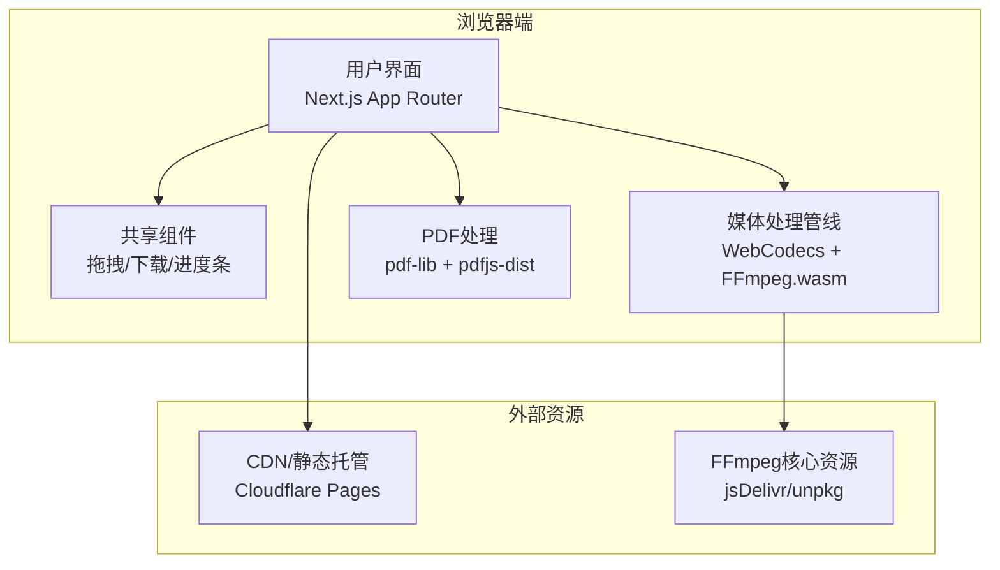
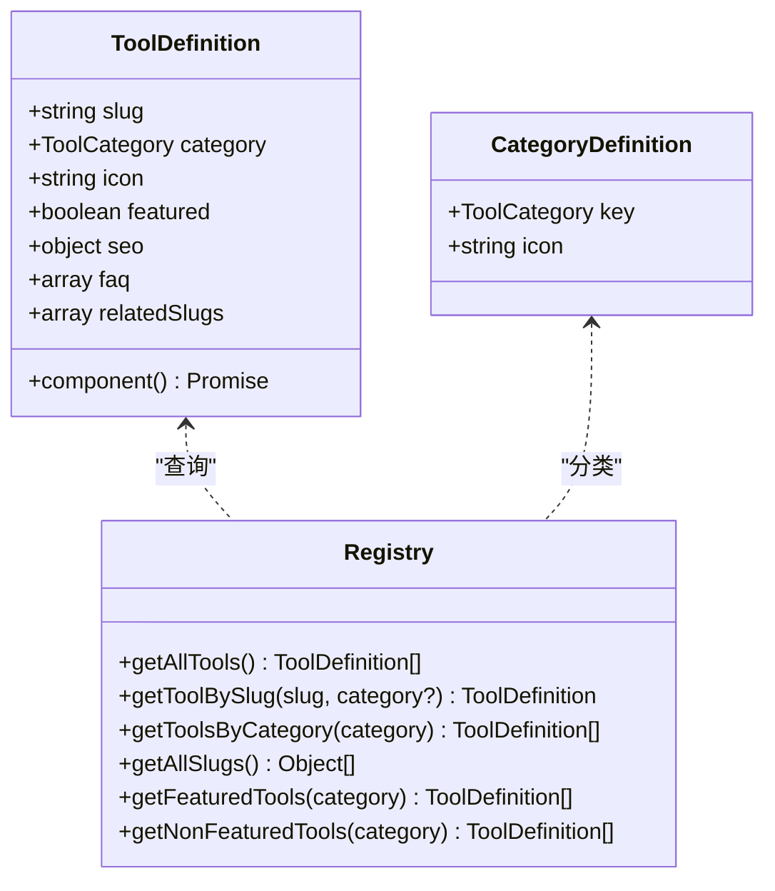
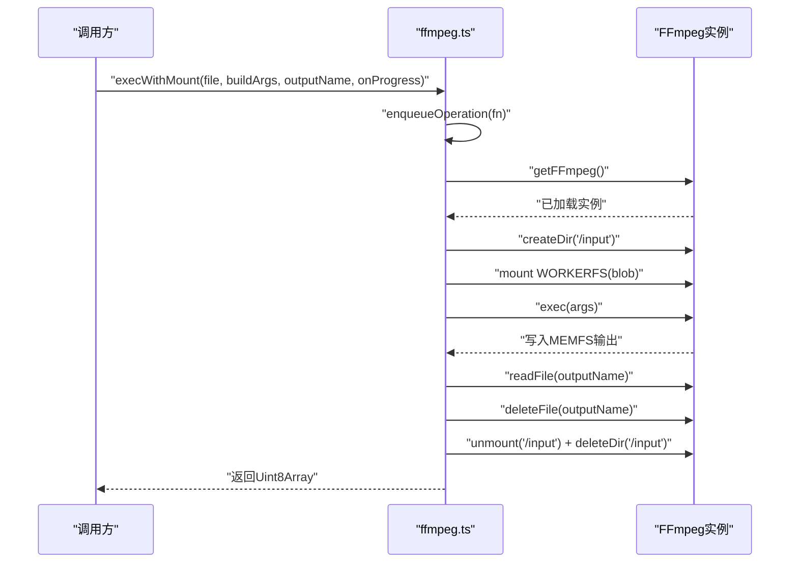
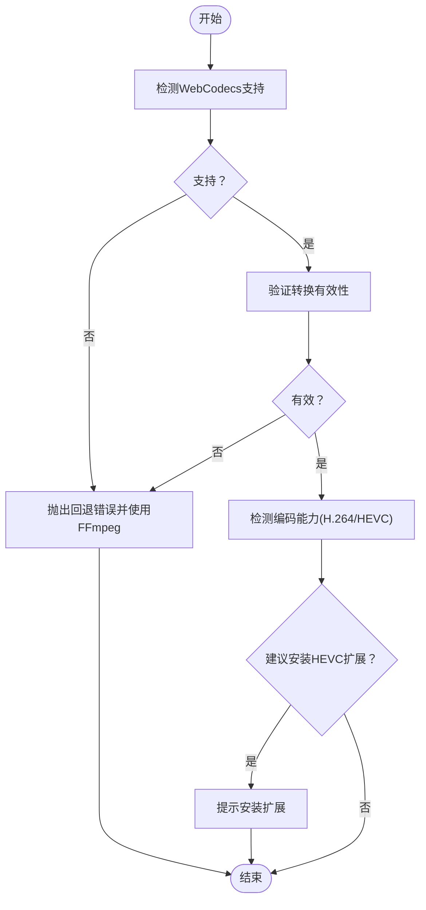
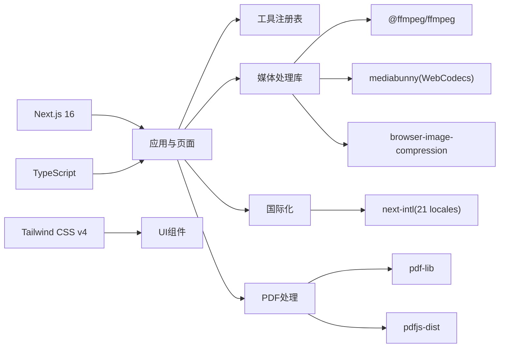

# 项目概述

<cite>
**本文引用的文件**
- [README.md](file://README.md)
- [package.json](file://package.json)
- [next.config.ts](file://next.config.ts)
- [src/lib/ffmpeg.ts](file://src/lib/ffmpeg.ts)
- [src/lib/media-pipeline.ts](file://src/lib/media-pipeline.ts)
- [src/lib/registry/index.ts](file://src/lib/registry/index.ts)
- [src/lib/registry/categories.ts](file://src/lib/registry/categories.ts)
- [src/lib/registry/types.ts](file://src/lib/registry/types.ts)
- [src/lib/pdfjs.ts](file://src/lib/pdfjs.ts)
- [src/app/layout.tsx](file://src/app/layout.tsx)
- [src/components/layout/MainLayout.tsx](file://src/components/layout/MainLayout.tsx)
- [public/manifest.json](file://public/manifest.json)
- [public/sw.js](file://public/sw.js)
- [src/tools/image/compress/index.ts](file://src/tools/image/compress/index.ts)
- [src/tools/video/compress/index.ts](file://src/tools/video/compress/index.ts)
- [src/tools/pdf/merge/index.ts](file://src/tools/pdf/merge/index.ts)
</cite>

## 目录
1. [引言](#引言)
2. [项目结构](#项目结构)
3. [核心组件](#核心组件)
4. [架构总览](#架构总览)
5. [详细组件分析](#详细组件分析)
6. [依赖关系分析](#依赖关系分析)
7. [性能考量](#性能考量)
8. [故障排查指南](#故障排查指南)
9. [结论](#结论)
10. [附录](#附录)

## 引言
媒体工具箱（PrivaDeck）是一个“隐私优先”的浏览器端多媒体处理平台，致力于在本地完成所有文件处理，实现“零上传、零服务器”。项目提供60个工具，覆盖图片、视频、音频、PDF与开发者五大类别，支持21种语言，并通过PWA能力实现离线可用与安装体验。技术上，项目采用Next.js 16（App Router + 静态导出）、TypeScript、Tailwind CSS v4，结合WebCodecs与FFmpeg.wasm在浏览器内实现高性能媒体处理；同时集成pdf-lib与pdfjs-dist用于PDF处理，browser-image-compression用于图片压缩。

- 项目愿景：让每个人都能在浏览器中安全、便捷地处理多媒体与文档任务，无需信任第三方服务器。
- 设计理念：隐私至上、性能优先、易用性强、可扩展性高。
- 核心价值主张：本地处理、零上传、多语言、PWA离线、SEO友好、静态生成。

**章节来源**
- [README.md:1-89](file://README.md#L1-L89)

## 项目结构
项目采用基于功能域的目录组织方式，核心模块包括：
- 应用层：Next.js App Router 页面与布局
- 组件层：共享组件（拖拽、下载、进度条等）、工具页面外壳、基础UI原子
- 工具层：按类别划分的60个工具模块（image、video、audio、pdf、developer）
- 库层：工具注册表、SEO元数据、国际化、媒体处理（FFmpeg、WebCodecs、PDFJS）
- 国际化：21种语言的消息文件（messages/）
- 静态资源与PWA：manifest.json、service worker、图标

```mermaid
graph TB
subgraph "应用层"
APP["Next.js App Router<br/>页面与布局"]
end
subgraph "组件层"
LAYOUT["布局组件<br/>Header/Sidebar/Footer/MobileNav"]
SHARED["共享组件<br/>FileDropzone/DownloadButton/ProcessingProgress"]
TOOL_SHELL["工具页面外壳<br/>ToolPageShell/ToolFAQ"]
UI["基础UI原子<br/>Button/Card/Badge/Tabs"]
end
subgraph "工具层"
IMG["图片工具<br/>compress/resize/crop/watermark..."]
VID["视频工具<br/>compress/trim/rotate/format-convert..."]
AUD["音频工具<br/>trim/convert/extract/volume"]
PDF["PDF工具<br/>merge/split/compress/to-image..."]
DEV["开发者工具<br/>base64/json-formatter/ocr/hash..."]
end
subgraph "库层"
REG["工具注册表<br/>registry/index.ts"]
SEOMETA["SEO与元数据<br/>seo/*"]
I18N["国际化<br/>i18n/*"]
MEDIA["媒体处理<br/>ffmpeg.ts / media-pipeline.ts / pdfjs.ts"]
end
subgraph "国际化"
MSG["消息文件<br/>messages/*/common.json + tools-*.json"]
end
subgraph "静态资源/PWA"
MANI["manifest.json"]
SW["sw.js Service Worker"]
ICONS["icons/*"]
end
APP --> LAYOUT
LAYOUT --> SHARED
LAYOUT --> TOOL_SHELL
LAYOUT --> UI
APP --> IMG
APP --> VID
APP --> AUD
APP --> PDF
APP --> DEV
APP --> REG
APP --> SEOMETA
APP --> I18N
APP --> MEDIA
APP --> MSG
APP --> MANI
APP --> SW
APP --> ICONS
```

**图表来源**
- [README.md:55-78](file://README.md#L55-L78)
- [src/lib/registry/index.ts:1-164](file://src/lib/registry/index.ts#L1-L164)
- [src/lib/registry/categories.ts:1-9](file://src/lib/registry/categories.ts#L1-L9)
- [src/lib/registry/types.ts:1-21](file://src/lib/registry/types.ts#L1-L21)

**章节来源**
- [README.md:55-78](file://README.md#L55-L78)
- [next.config.ts:1-13](file://next.config.ts#L1-L13)

## 核心组件
- 工具注册表：集中管理60个工具的元数据与路由映射，支持按分类检索、特色工具筛选与全量枚举。
- 媒体处理管线：统一抽象图片、视频、音频与PDF的处理流程，优先使用WebCodecs进行硬件加速，不支持时回退至FFmpeg.wasm。
- FFmpeg.wasm封装：单例懒加载、进度事件监听、WORKERFS挂载避免内存拷贝、Promise队列串行执行以适配WASM单线程。
- WebCodecs媒体管线：Mediabunny封装，检测编码器能力、验证转换有效性、提示HEVC扩展建议。
- PDFJS与pdf-lib：PDF读取、渲染、编辑与生成。
- 国际化与SEO：next-intl提供21种语言，静态生成+结构化数据+hreflang。
- PWA与离线：manifest.json + service worker缓存策略，HTML网络优先、静态资源缓存优先、FFmpeg永久缓存。

**章节来源**
- [src/lib/registry/index.ts:135-164](file://src/lib/registry/index.ts#L135-L164)
- [src/lib/ffmpeg.ts:10-144](file://src/lib/ffmpeg.ts#L10-L144)
- [src/lib/media-pipeline.ts:1-175](file://src/lib/media-pipeline.ts#L1-L175)
- [src/lib/pdfjs.ts:1-16](file://src/lib/pdfjs.ts#L1-L16)
- [public/manifest.json:1-29](file://public/manifest.json#L1-L29)
- [public/sw.js:1-93](file://public/sw.js#L1-L93)

## 架构总览
媒体工具箱采用“前端即服务”的架构：所有处理逻辑运行在浏览器端，通过WebCodecs与FFmpeg.wasm实现高性能媒体编解码，借助pdf-lib与pdfjs-dist完成PDF相关操作。应用通过Next.js静态导出部署于Cloudflare Pages，配合PWA提升离线可用性与安装体验。

**图表来源**
- [README.md:26-33](file://README.md#L26-L33)
- [src/lib/ffmpeg.ts:19-38](file://src/lib/ffmpeg.ts#L19-L38)
- [public/sw.js:5-9](file://public/sw.js#L5-L9)

## 详细组件分析

### 工具注册表与分类体系
- 分类定义：image、video、audio、pdf、developer五类，每类下包含多个具体工具。
- 工具元数据：slug、category、icon、featured标记、动态组件加载、SEO结构化数据类型、FAQ与关联工具。
- 查询接口：按slug查找、按分类过滤、获取全部slug、特色与非特色工具集合。

**图表来源**
- [src/lib/registry/types.ts:3-21](file://src/lib/registry/types.ts#L3-L21)
- [src/lib/registry/categories.ts:3-9](file://src/lib/registry/categories.ts#L3-L9)
- [src/lib/registry/index.ts:135-164](file://src/lib/registry/index.ts#L135-L164)

**章节来源**
- [src/lib/registry/index.ts:66-133](file://src/lib/registry/index.ts#L66-L133)
- [src/lib/registry/types.ts:5-16](file://src/lib/registry/types.ts#L5-L16)
- [src/lib/registry/categories.ts:3-9](file://src/lib/registry/categories.ts#L3-L9)

### FFmpeg.wasm 封装与执行队列
- 单例懒加载：首次调用时异步加载核心脚本与WASM，失败时终止实例并抛错。
- 进度事件：统一监听“progress”事件，将0~1标准化为0~100。
- 挂载执行：使用WORKERFS挂载输入文件，避免内存拷贝；执行完成后清理挂载点与临时文件。
- 串行队列：通过Promise队列确保WASM单线程下的并发安全。

**图表来源**
- [src/lib/ffmpeg.ts:99-144](file://src/lib/ffmpeg.ts#L99-L144)

**章节来源**
- [src/lib/ffmpeg.ts:10-39](file://src/lib/ffmpeg.ts#L10-L39)
- [src/lib/ffmpeg.ts:41-58](file://src/lib/ffmpeg.ts#L41-L58)
- [src/lib/ffmpeg.ts:75-82](file://src/lib/ffmpeg.ts#L75-L82)
- [src/lib/ffmpeg.ts:99-144](file://src/lib/ffmpeg.ts#L99-L144)

### WebCodecs 媒体管线与回退机制
- 能力检测：Video/Audio 编解码器是否存在。
- 转换验证：确保未丢弃关键轨道（视频/音频），否则抛出回退错误。
- 编码能力探测：检测H.264/H.265编码能力，必要时提示安装HEVC扩展。
- 视频编解码检测：识别源视频编解码类型（H.264/HEVC）。

**图表来源**
- [src/lib/media-pipeline.ts:7-14](file://src/lib/media-pipeline.ts#L7-L14)
- [src/lib/media-pipeline.ts:59-91](file://src/lib/media-pipeline.ts#L59-L91)
- [src/lib/media-pipeline.ts:98-104](file://src/lib/media-pipeline.ts#L98-L104)
- [src/lib/media-pipeline.ts:110-141](file://src/lib/media-pipeline.ts#L110-L141)
- [src/lib/media-pipeline.ts:149-174](file://src/lib/media-pipeline.ts#L149-L174)

**章节来源**
- [src/lib/media-pipeline.ts:7-14](file://src/lib/media-pipeline.ts#L7-L14)
- [src/lib/media-pipeline.ts:28-53](file://src/lib/media-pipeline.ts#L28-L53)
- [src/lib/media-pipeline.ts:59-91](file://src/lib/media-pipeline.ts#L59-L91)
- [src/lib/media-pipeline.ts:98-104](file://src/lib/media-pipeline.ts#L98-L104)
- [src/lib/media-pipeline.ts:110-141](file://src/lib/media-pipeline.ts#L110-L141)
- [src/lib/media-pipeline.ts:149-174](file://src/lib/media-pipeline.ts#L149-L174)

### PDF 处理与 OCR
- pdfjs-dist：配置worker路径，按需加载PDF处理能力。
- pdf-lib：用于PDF生成、编辑与合并等操作。
- OCR：通过tesseract.js在浏览器内进行文字识别。

**章节来源**
- [src/lib/pdfjs.ts:1-16](file://src/lib/pdfjs.ts#L1-L16)
- [package.json:31](file://package.json#L31)

### PWA 与离线缓存策略
- manifest.json：定义应用名称、图标、启动行为与主题色。
- service worker：区分FFmpeg核心资源（永久缓存）、HTML（网络优先）、静态资源（缓存优先）。
- 静态导出：Next.js输出静态页面，便于Cloudflare Pages部署。

**章节来源**
- [public/manifest.json:1-29](file://public/manifest.json#L1-L29)
- [public/sw.js:1-93](file://public/sw.js#L1-L93)
- [next.config.ts:6-10](file://next.config.ts#L6-L10)

### 工具示例：图片/视频/PDF压缩
- 图片压缩：featured工具，FAQ与相关工具（格式转换、尺寸调整、裁剪）。
- 视频压缩：featured工具，FAQ与相关工具（剪辑、格式转换、旋转、静音等）。
- PDF合并：featured工具，FAQ与相关工具（拆分、删除页、转图片）。

**章节来源**
- [src/tools/image/compress/index.ts:1-37](file://src/tools/image/compress/index.ts#L1-L37)
- [src/tools/video/compress/index.ts:1-49](file://src/tools/video/compress/index.ts#L1-L49)
- [src/tools/pdf/merge/index.ts:1-37](file://src/tools/pdf/merge/index.ts#L1-L37)

## 依赖关系分析
- 前端框架与构建：Next.js 16（App Router + 静态导出）、TypeScript、Tailwind CSS v4。
- 媒体处理：@ffmpeg/ffmpeg（FFmpeg.wasm）、mediabunny（WebCodecs封装）、browser-image-compression（图片压缩）。
- 文档处理：pdf-lib（PDF编辑）、pdfjs-dist（PDF渲染）。
- 国际化：next-intl（21种语言）。
- OCR与YAML解析：tesseract.js、js-yaml。
- UI与工具：lucide-react（图标）、react-image-crop（图片裁剪）。

**图表来源**
- [package.json:11-32](file://package.json#L11-L32)
- [README.md:26-33](file://README.md#L26-L33)

**章节来源**
- [package.json:11-32](file://package.json#L11-L32)
- [README.md:26-33](file://README.md#L26-L33)

## 性能考量
- WebCodecs优先：在支持的浏览器中利用硬件加速，显著降低CPU占用与处理时间。
- FFmpeg.wasm优化：WORKERFS挂载避免内存拷贝；Promise队列串行执行，避免并发冲突；进度事件标准化为百分比回调。
- 缓存策略：Service Worker对FFmpeg核心资源永久缓存，静态资源与HTML分别采用缓存优先与网络优先策略，减少重复请求。
- 静态导出：Next.js静态生成页面，部署成本低、加载速度快。
- 图片压缩：browser-image-compression提供多种压缩算法与质量参数，兼顾体积与画质。

**章节来源**
- [src/lib/media-pipeline.ts:7-14](file://src/lib/media-pipeline.ts#L7-L14)
- [src/lib/ffmpeg.ts:99-144](file://src/lib/ffmpeg.ts#L99-L144)
- [public/sw.js:30-92](file://public/sw.js#L30-L92)
- [next.config.ts:6-10](file://next.config.ts#L6-L10)

## 故障排查指南
- FFmpeg加载失败：检查CDN可达性与跨域设置；确认核心脚本与WASM URL正确；查看控制台错误堆栈。
- 进度回调异常：确认进度事件监听是否正确绑定与解绑；避免重复监听导致数值异常。
- WebCodecs不支持：自动回退至FFmpeg；若仍失败，检查浏览器版本与编码器能力。
- 视频编解码不支持：抛出“UnsupportedVideoCodecError”，提示更换浏览器或安装HEVC扩展。
- PDF渲染问题：确认pdfjs-dist worker路径已正确配置；检查PDF文件完整性。
- PWA离线不可用：检查service worker注册状态与缓存命中情况；确认静态导出产物完整。

**章节来源**
- [src/lib/ffmpeg.ts:19-38](file://src/lib/ffmpeg.ts#L19-L38)
- [src/lib/ffmpeg.ts:41-58](file://src/lib/ffmpeg.ts#L41-L58)
- [src/lib/media-pipeline.ts:28-53](file://src/lib/media-pipeline.ts#L28-L53)
- [src/lib/media-pipeline.ts:48-53](file://src/lib/media-pipeline.ts#L48-L53)
- [src/lib/pdfjs.ts:4-12](file://src/lib/pdfjs.ts#L4-L12)
- [public/sw.js:11-28](file://public/sw.js#L11-L28)

## 结论
媒体工具箱通过“隐私优先”的设计与“浏览器端处理”的技术路线，为用户提供安全、高效、易用的多媒体与文档处理能力。项目以WebCodecs与FFmpeg.wasm为核心，结合PWA与国际化方案，实现了跨平台、离线可用与多语言支持。未来可进一步完善工具生态、优化性能与用户体验，并持续扩展支持的媒体格式与编码能力。

## 附录
- 快速开始：安装依赖 → 启动开发服务器 → 构建静态站点 → 代码检查
- 项目结构：src/app、src/components、src/tools、src/lib、messages、public
- 工具分类：图片（17）、视频（8）、音频（4）、PDF（14）、开发者（17）

**章节来源**
- [README.md:35-53](file://README.md#L35-L53)
- [README.md:55-78](file://README.md#L55-L78)