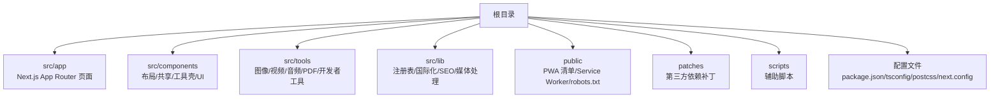
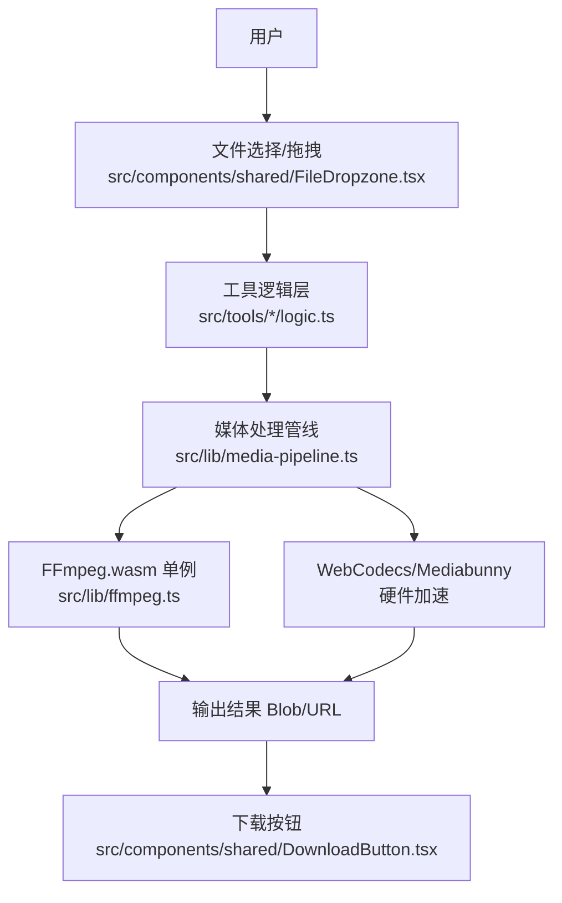
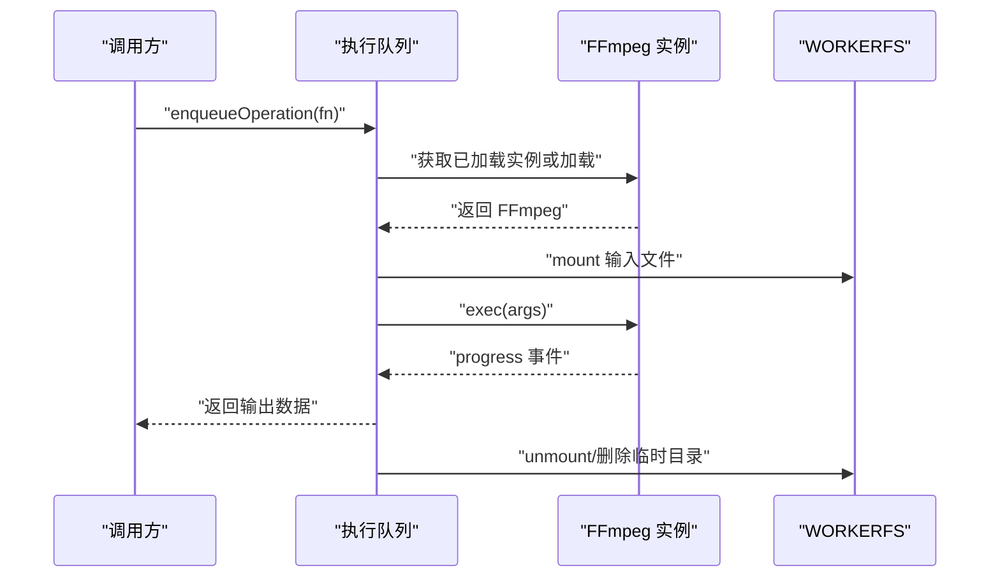
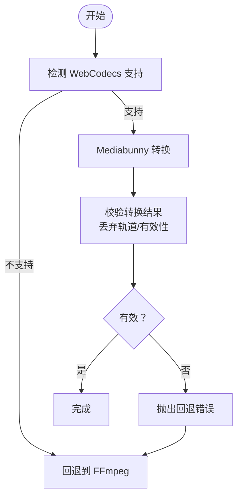
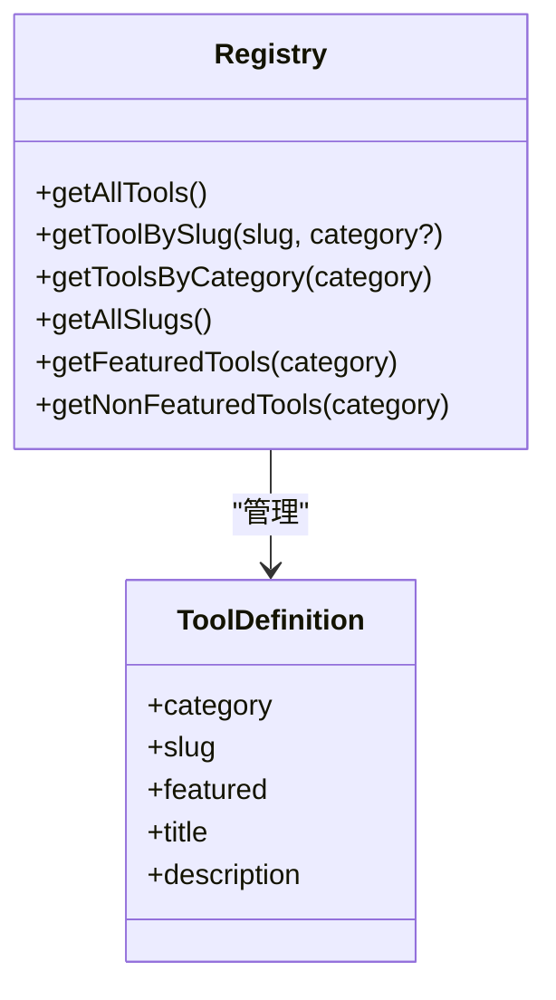
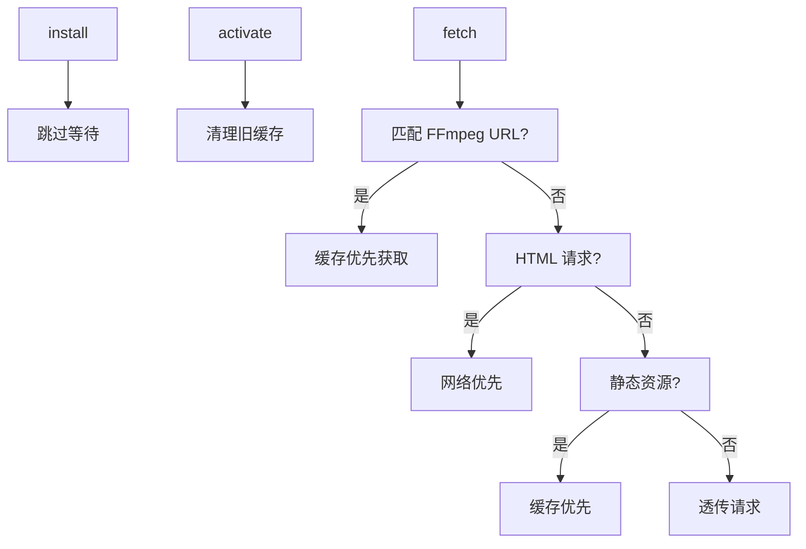
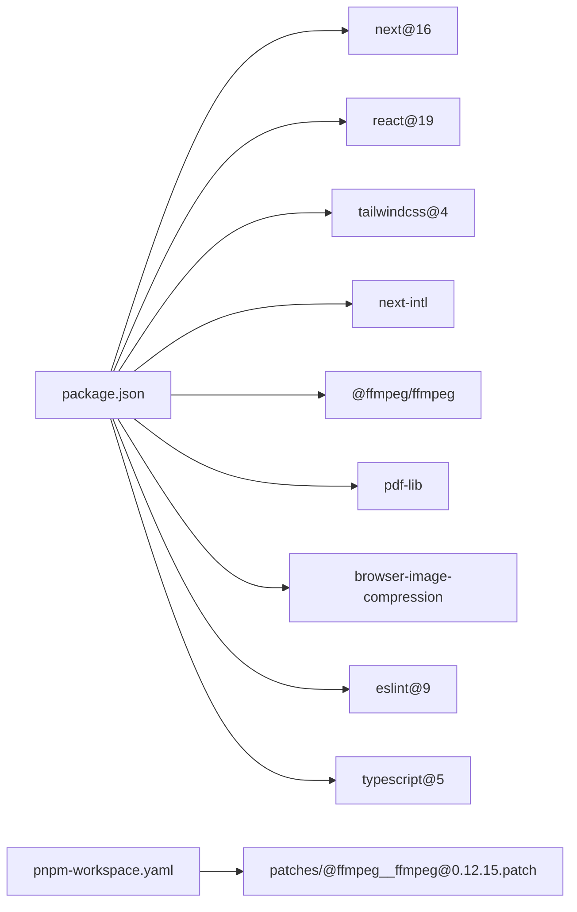

# 快速开始

<cite>
**本文引用的文件**
- [README.md](file://README.md)
- [package.json](file://package.json)
- [next.config.ts](file://next.config.ts)
- [eslint.config.mjs](file://eslint.config.mjs)
- [tsconfig.json](file://tsconfig.json)
- [postcss.config.mjs](file://postcss.config.mjs)
- [pnpm-workspace.yaml](file://pnpm-workspace.yaml)
- [patches/@ffmpeg__ffmpeg@0.12.15.patch](file://patches/@ffmpeg__ffmpeg@0.12.15.patch)
- [src/lib/ffmpeg.ts](file://src/lib/ffmpeg.ts)
- [src/lib/media-pipeline.ts](file://src/lib/media-pipeline.ts)
- [src/lib/registry/index.ts](file://src/lib/registry/index.ts)
- [src/tools/image/format-converter/logic.ts](file://src/tools/image/format-converter/logic.ts)
- [src/tools/pdf/compress/logic.ts](file://src/tools/pdf/compress/logic.ts)
- [public/manifest.json](file://public/manifest.json)
- [public/sw.js](file://public/sw.js)
</cite>

## 目录
1. [简介](#简介)
2. [项目结构](#项目结构)
3. [核心组件](#核心组件)
4. [架构总览](#架构总览)
5. [详细组件分析](#详细组件分析)
6. [依赖分析](#依赖分析)
7. [性能考虑](#性能考虑)
8. [故障排除指南](#故障排除指南)
9. [结论](#结论)
10. [附录](#附录)

## 简介
本指南面向首次接触 PrivaDeck 媒体工具箱的开发者，提供从环境准备到本地开发、构建与部署的完整路径。项目基于 Next.js 16 App Router 与静态导出（SSG），采用浏览器端媒体处理技术（FFmpeg.wasm、pdf-lib、WebCodecs/Mediabunny），实现“零上传、零服务器”的隐私优先方案。你将学会：
- 环境搭建：Node.js、pnpm、项目克隆与依赖安装
- 开发与构建：pnpm dev（Turbopack 加速）、pnpm build（静态导出至 out/）
- 质量保障：pnpm lint（ESLint）
- 部署：Cloudflare Pages 静态托管（含环境变量、域名与 HTTPS）

## 项目结构
项目采用按功能域划分的目录组织方式，核心目录与职责如下：
- src/app：Next.js App Router 页面与路由约定
- src/components：布局、共享组件、工具壳与基础 UI 组件
- src/tools：五大工具分类（image、video、audio、pdf、developer）的具体实现
- src/lib：工具注册表、国际化、SEO、媒体处理管线与分析等
- public：PWA 清单、Service Worker、robots.txt、sw.js
- patches：对第三方依赖（如 @ffmpeg/ffmpeg）的补丁
- scripts：辅助脚本（如清理 RSC 缓存）

章节来源
- [README.md:55-78](file://README.md#L55-L78)

## 核心组件
- 媒体处理管线
  - FFmpeg.wasm 单例加载与队列执行，避免并发冲突与内存拷贝
  - WebCodecs/Mediabunny 作为硬件加速替代方案，自动降级回 FFmpeg
- 工具注册表
  - 统一注册与查询工具元数据，支持分类检索与特性标记
- PWA 与缓存策略
  - Service Worker 按资源类型区分缓存策略，永久缓存 FFmpeg 核心资源
  - Manifest 定义应用名称、图标与显示模式

章节来源
- [src/lib/ffmpeg.ts:1-144](file://src/lib/ffmpeg.ts#L1-L144)
- [src/lib/media-pipeline.ts:1-105](file://src/lib/media-pipeline.ts#L1-L105)
- [src/lib/registry/index.ts:1-164](file://src/lib/registry/index.ts#L1-L164)
- [public/sw.js:1-93](file://public/sw.js#L1-L93)
- [public/manifest.json:1-29](file://public/manifest.json#L1-L29)

## 架构总览
下图展示浏览器端媒体处理的关键交互：用户上传文件 → 工具逻辑执行 → 通过 FFmpeg 或 WebCodecs 处理 → 生成结果并下载。

图表来源
- [src/lib/ffmpeg.ts:1-144](file://src/lib/ffmpeg.ts#L1-L144)
- [src/lib/media-pipeline.ts:1-105](file://src/lib/media-pipeline.ts#L1-L105)
- [src/tools/image/format-converter/logic.ts:1-161](file://src/tools/image/format-converter/logic.ts#L1-L161)
- [src/tools/pdf/compress/logic.ts:1-73](file://src/tools/pdf/compress/logic.ts#L1-L73)

## 详细组件分析

### FFmpeg.wasm 加载与执行
- 单例模式与加载重试：避免重复初始化与失败后清理
- 进度事件监听：统一转换进度回调
- 执行队列：串行化操作，防止并发挂载点冲突
- WORKERFS 挂载：直接读取输入文件，避免内存复制

图表来源
- [src/lib/ffmpeg.ts:75-142](file://src/lib/ffmpeg.ts#L75-L142)

章节来源
- [src/lib/ffmpeg.ts:1-144](file://src/lib/ffmpeg.ts#L1-L144)

### WebCodecs 与硬件加速
- 能力检测：判断浏览器是否支持 WebCodecs 编解码器
- 转换校验：确保未丢弃关键音视频轨道，否则抛出错误并回退 FFmpeg
- Windows + Chromium 下 HEVC 扩展建议：提示安装以启用硬件解码

图表来源
- [src/lib/media-pipeline.ts:7-104](file://src/lib/media-pipeline.ts#L7-L104)

章节来源
- [src/lib/media-pipeline.ts:1-105](file://src/lib/media-pipeline.ts#L1-L105)

### 工具注册表与路由
- 注册表集中导入各工具元数据，提供按分类、slug 查询与特性筛选
- App Router 使用动态路由 [category]/[slug] 映射到具体工具页面

图表来源
- [src/lib/registry/index.ts:135-164](file://src/lib/registry/index.ts#L135-L164)

章节来源
- [src/lib/registry/index.ts:1-164](file://src/lib/registry/index.ts#L1-L164)

### PWA 与 Service Worker
- 永久缓存 FFmpeg 核心资源（版本号固定）
- HTML 网络优先，保持内容新鲜；静态资源缓存优先
- 清理旧缓存，激活阶段接管控制

图表来源
- [public/sw.js:11-92](file://public/sw.js#L11-L92)

章节来源
- [public/sw.js:1-93](file://public/sw.js#L1-L93)
- [public/manifest.json:1-29](file://public/manifest.json#L1-L29)

## 依赖分析
- 包管理器：pnpm（工作区 + 补丁）
- 核心依赖：Next.js 16、React 19、Tailwind CSS v4、国际化 next-intl、媒体处理 FFmpeg.wasm/pdf-lib/browser-image-compression 等
- 开发依赖：ESLint 9、TypeScript 5、TailwindCSS 插件
- 补丁：对 @ffmpeg/ffmpeg 的 worker 导入进行兼容性修复

图表来源
- [package.json:11-43](file://package.json#L11-L43)
- [pnpm-workspace.yaml:1-3](file://pnpm-workspace.yaml#L1-L3)
- [patches/@ffmpeg__ffmpeg@0.12.15.patch:1-14](file://patches/@ffmpeg__ffmpeg@0.12.15.patch#L1-L14)

章节来源
- [package.json:1-45](file://package.json#L1-L45)
- [pnpm-workspace.yaml:1-3](file://pnpm-workspace.yaml#L1-L3)
- [patches/@ffmpeg__ffmpeg@0.12.15.patch:1-14](file://patches/@ffmpeg__ffmpeg@0.12.15.patch#L1-L14)

## 性能考虑
- 浏览器端处理
  - 使用 WebCodecs/Mediabunny 优先进行硬件加速，降低 CPU 占用
  - FFmpeg.wasm 通过 WORKERFS 挂载避免全量内存拷贝
- 缓存策略
  - Service Worker 对 FFmpeg 核心资源做永久缓存，显著缩短二次加载时间
- 构建与导出
  - Next.js 静态导出（export）配合 Turbopack 开发体验更佳
- 代码质量
  - ESLint 9 与 Next.js 推荐规则，结合全局忽略覆盖，提升一致性

章节来源
- [src/lib/ffmpeg.ts:99-142](file://src/lib/ffmpeg.ts#L99-L142)
- [src/lib/media-pipeline.ts:7-104](file://src/lib/media-pipeline.ts#L7-L104)
- [public/sw.js:30-92](file://public/sw.js#L30-L92)
- [eslint.config.mjs:1-19](file://eslint.config.mjs#L1-L19)

## 故障排除指南
- 开发服务器无法启动
  - 确认 Node.js 版本满足项目需求（由 TypeScript 与 Next.js 版本决定）
  - 使用 pnpm 安装依赖，避免 npm/yarn
  - 清理缓存后重试：删除 node_modules/.pnpm-store 并重新安装
- 构建失败或导出异常
  - 确保 next.config.ts 使用 output: "export" 且 images.unoptimized: true
  - 检查是否存在自定义 headers 导致跨源隔离策略不生效
- FFmpeg 加载失败
  - 检查 CDN 可达性与跨源隔离头（COOP/COEP）
  - 若浏览器不支持 SharedArrayBuffer，需确保跨源隔离头正确下发
- Service Worker 缓存问题
  - 更新 sw.js 后清理旧缓存并重新激活
  - 确认静态资源与 HTML 请求命中预期缓存策略
- 代码检查报错
  - 使用 pnpm lint 修复可自动修复的问题，其余手动修正

章节来源
- [next.config.ts:6-27](file://next.config.ts#L6-L27)
- [public/sw.js:11-28](file://public/sw.js#L11-L28)
- [eslint.config.mjs:5-16](file://eslint.config.mjs#L5-L16)

## 结论
通过本快速开始指南，你已完成 PrivaDeck 的环境搭建、本地开发、构建与质量检查，并理解了浏览器端媒体处理与静态导出的整体架构。后续可参考“添加新工具”流程扩展更多功能，或按附录中的部署指引将站点发布到 Cloudflare Pages。

## 附录

### 环境搭建与本地开发
- Node.js 与 pnpm
  - 使用 pnpm 作为包管理器，确保安装依赖时遵循工作区与补丁配置
- 克隆与安装
  - 克隆仓库后执行 pnpm install 安装依赖
- 启动开发服务器
  - pnpm dev 启动 Next.js 开发服务器（Turbopack 加速）
  - 访问 http://localhost:3000 查看效果
- 构建静态站点
  - pnpm build 输出到 out/ 目录，用于静态托管
- 代码检查
  - pnpm lint 运行 ESLint，遵循 Next.js 与 TypeScript 推荐规则

章节来源
- [README.md:35-54](file://README.md#L35-L54)
- [package.json:5-10](file://package.json#L5-L10)
- [eslint.config.mjs:1-19](file://eslint.config.mjs#L1-L19)

### 部署到 Cloudflare Pages（静态托管）
- 准备
  - 使用 pnpm build 生成 out/ 静态产物
- 设置
  - 选择静态发布目录为 out/
  - 配置环境变量（如需要）：例如 NEXT_PUBLIC_APP_ENV
  - 绑定自定义域名并在 DNS 中指向 Cloudflare
  - 启用 HTTPS（Cloudflare 提供免费证书与 TLS）
- 注意事项
  - 确保跨源隔离头（COOP/COEP）在生产环境正确下发
  - 如使用 FFmpeg，确认 CDN 可达性与缓存策略

章节来源
- [README.md:35-54](file://README.md#L35-L54)
- [next.config.ts:10-26](file://next.config.ts#L10-L26)

### 关键配置文件说明
- package.json
  - 定义脚本（dev/build/start/lint）与依赖版本
- next.config.ts
  - 静态导出（output: "export"）、图片优化关闭、尾随斜杠、跨源隔离头
- tsconfig.json
  - TypeScript 编译选项、路径别名 @/* 指向 src/*
- postcss.config.mjs
  - Tailwind CSS v4 插件配置
- eslint.config.mjs
  - ESLint 9 配置，继承 Next.js 核心与 TypeScript 规则
- pnpm-workspace.yaml 与 patches
  - 工作区与 @ffmpeg/ffmpeg 补丁，确保打包兼容性

章节来源
- [package.json:1-45](file://package.json#L1-L45)
- [next.config.ts:1-30](file://next.config.ts#L1-L30)
- [tsconfig.json:1-35](file://tsconfig.json#L1-L35)
- [postcss.config.mjs:1-8](file://postcss.config.mjs#L1-L8)
- [eslint.config.mjs:1-19](file://eslint.config.mjs#L1-L19)
- [pnpm-workspace.yaml:1-3](file://pnpm-workspace.yaml#L1-L3)
- [patches/@ffmpeg__ffmpeg@0.12.15.patch:1-14](file://patches/@ffmpeg__ffmpeg@0.12.15.patch#L1-L14)

### 目录结构速览
- src/app：页面与布局
- src/components：布局、共享组件、工具壳与 UI 原子
- src/tools：五大分类工具（image/video/audio/pdf/developer）
- src/lib：注册表、国际化、SEO、媒体处理与分析
- public：PWA 清单、Service Worker、robots.txt
- patches/scripts：第三方补丁与辅助脚本

章节来源
- [README.md:55-78](file://README.md#L55-L78)