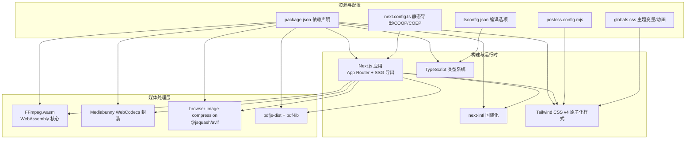
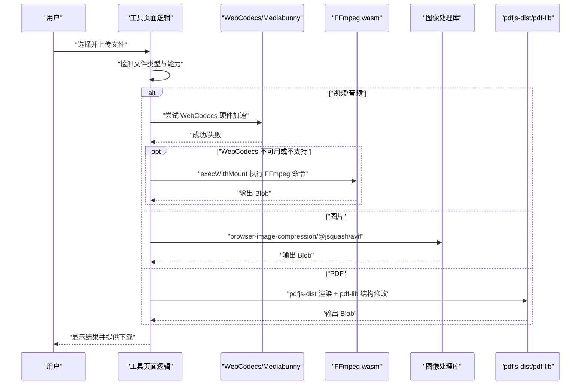
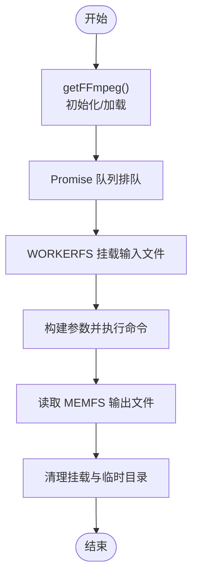
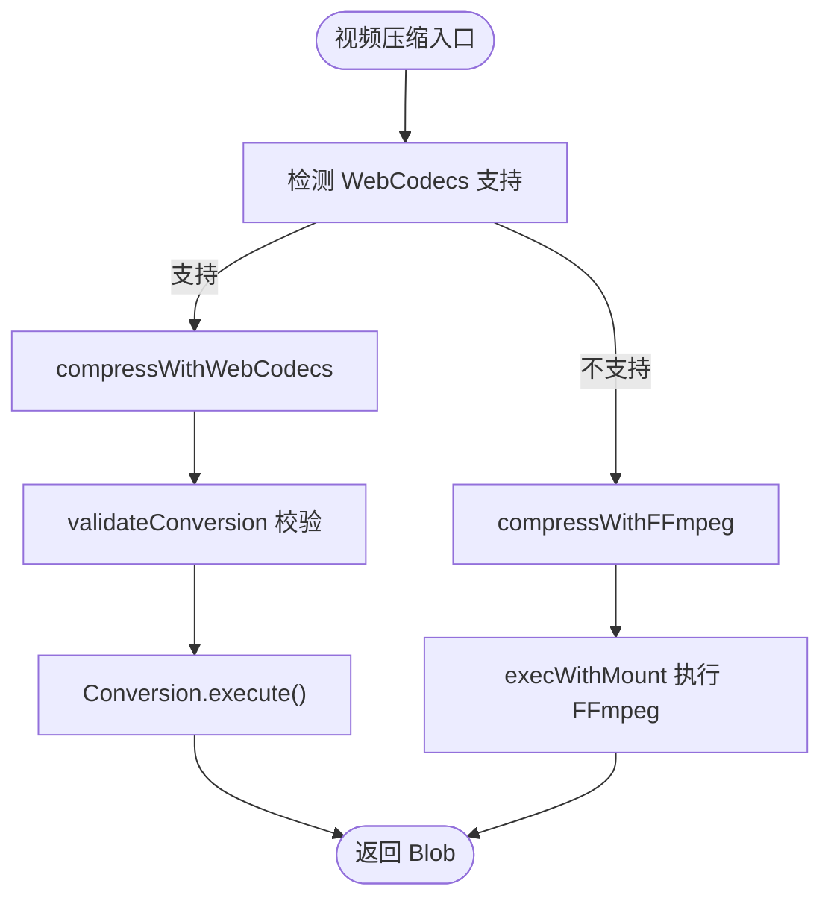
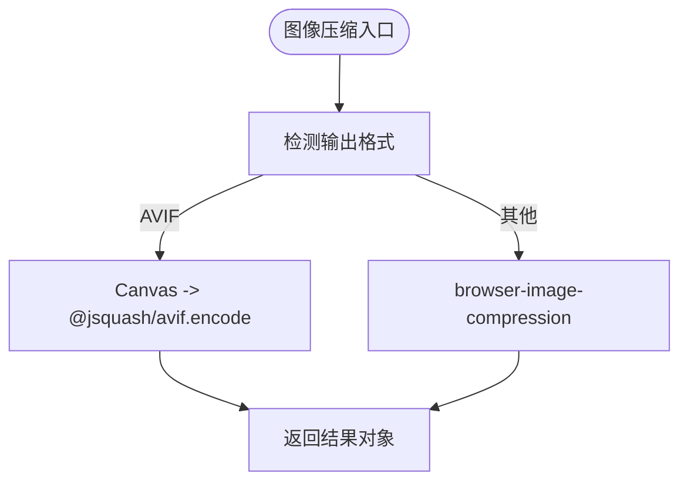
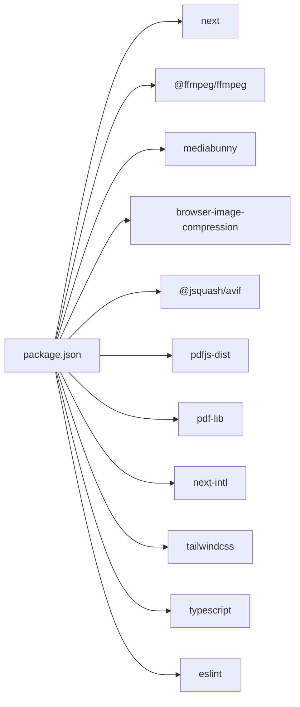

# 技术栈

<cite>
**本文引用的文件**
- [package.json](file://package.json)
- [next.config.ts](file://next.config.ts)
- [tsconfig.json](file://tsconfig.json)
- [postcss.config.mjs](file://postcss.config.mjs)
- [src/app/layout.tsx](file://src/app/layout.tsx)
- [src/app/globals.css](file://src/app/globals.css)
- [src/lib/ffmpeg.ts](file://src/lib/ffmpeg.ts)
- [src/lib/pdfjs.ts](file://src/lib/pdfjs.ts)
- [src/i18n/routing.ts](file://src/i18n/routing.ts)
- [src/tools/image/compress/logic.ts](file://src/tools/image/compress/logic.ts)
- [src/tools/video/compress/logic.ts](file://src/tools/video/compress/logic.ts)
- [patches/@ffmpeg__ffmpeg@0.12.15.patch](file://patches/@ffmpeg__ffmpeg@0.12.15.patch)
</cite>

## 目录
1. [引言](#引言)
2. [项目结构](#项目结构)
3. [核心组件](#核心组件)
4. [架构总览](#架构总览)
5. [详细组件分析](#详细组件分析)
6. [依赖关系分析](#依赖关系分析)
7. [性能考量](#性能考量)
8. [故障排查指南](#故障排查指南)
9. [结论](#结论)
10. [附录](#附录)

## 引言
本文件系统性梳理 PrivaDeck 媒体工具箱所采用的现代技术栈，围绕以下关键点展开：Next.js 16 App Router（支持静态导出）、TypeScript（强类型保障）、Tailwind CSS v4（原子化样式）、FFmpeg.wasm（视频/音频处理）、pdf-lib + pdfjs-dist（PDF 处理）、browser-image-compression（图像处理）、next-intl（国际化支持）。我们将解释每项技术的选型原因与优势，并阐明它们在浏览器端协同工作的机制，以实现高性能、低延迟的媒体处理体验；同时给出版本兼容性与升级策略建议。

## 项目结构
该项目采用基于功能域的组织方式，前端框架为 Next.js 16 App Router，配合 TypeScript 严格模式与 Tailwind CSS v4 原子化样式体系。媒体处理能力通过 WebAssembly（FFmpeg.wasm）与浏览器原生 API（WebCodecs、MediaStream、Canvas 等）组合实现；PDF 处理由 pdfjs-dist 提供 Worker 支持，pdf-lib 负责文档结构操作；图像处理借助 browser-image-compression 与 @jsquash/avif；国际化通过 next-intl 实现路由级多语言。

图表来源
- [package.json:11-32](file://package.json#L11-L32)
- [next.config.ts:6-27](file://next.config.ts#L6-L27)
- [tsconfig.json:2-24](file://tsconfig.json#L2-L24)
- [postcss.config.mjs:1-8](file://postcss.config.mjs#L1-L8)
- [src/app/globals.css:1-128](file://src/app/globals.css#L1-L128)

章节来源
- [package.json:1-45](file://package.json#L1-L45)
- [next.config.ts:1-30](file://next.config.ts#L1-L30)
- [tsconfig.json:1-35](file://tsconfig.json#L1-L35)
- [postcss.config.mjs:1-8](file://postcss.config.mjs#L1-L8)
- [src/app/globals.css:1-128](file://src/app/globals.css#L1-L128)

## 核心组件
- Next.js 16 App Router 与静态导出：启用 output: export，结合 images.unoptimized 与 trailingSlash，确保可直接部署到静态托管平台，降低运行时成本。
- TypeScript：严格模式、隔离模块、增量编译与 bundler 解析，保障类型安全与开发体验。
- Tailwind CSS v4：通过 @tailwindcss/postcss 插件与主题变量，实现暗色模式、动效与渐变边框等视觉一致性。
- FFmpeg.wasm：通过 WORKERFS 挂载输入文件，避免内存拷贝；使用 Promise 队列串行执行，保证单线程核心稳定性。
- WebCodecs（Mediabunny）：优先使用浏览器硬件加速的视频编码路径，对不支持或性能不佳的编解码器进行降级处理。
- 图像处理：browser-image-compression 结合 @jsquash/avif，提供高质量与高效率的压缩与格式转换。
- PDF 处理：pdfjs-dist 配置 Worker，pdf-lib 进行文档结构操作（合并、拆分、加水印等）。
- 国际化：next-intl 定义多语言路由与默认语言，支持 RTL 语言与本地化文案。

章节来源
- [next.config.ts:6-27](file://next.config.ts#L6-L27)
- [tsconfig.json:2-24](file://tsconfig.json#L2-L24)
- [src/lib/ffmpeg.ts:10-144](file://src/lib/ffmpeg.ts#L10-L144)
- [src/tools/video/compress/logic.ts:85-110](file://src/tools/video/compress/logic.ts#L85-L110)
- [src/tools/image/compress/logic.ts:1-135](file://src/tools/image/compress/logic.ts#L1-L135)
- [src/lib/pdfjs.ts:1-16](file://src/lib/pdfjs.ts#L1-L16)
- [src/i18n/routing.ts:1-18](file://src/i18n/routing.ts#L1-L18)

## 架构总览
下图展示浏览器端媒体处理的关键流程：用户上传文件后，前端根据文件类型选择最优处理路径（WebCodecs 优先，FFmpeg.wasm 作为兜底），图像处理通过浏览器 API 与专用库完成，PDF 处理由 pdfjs-dist 渲染、pdf-lib 修改结构，最终产物以 Blob 形式返回并触发下载。

图表来源
- [src/tools/video/compress/logic.ts:85-110](file://src/tools/video/compress/logic.ts#L85-L110)
- [src/lib/ffmpeg.ts:99-144](file://src/lib/ffmpeg.ts#L99-L144)
- [src/tools/image/compress/logic.ts:83-123](file://src/tools/image/compress/logic.ts#L83-L123)
- [src/lib/pdfjs.ts:3-13](file://src/lib/pdfjs.ts#L3-L13)

## 详细组件分析

### Next.js 16 App Router 与静态导出
- 特性与优势
  - App Router 提供更清晰的路由与布局层次，支持并行数据加载与流式渲染。
  - output: export 启用静态生成，适合无服务器部署与边缘分发，降低延迟与成本。
  - COOP/COEP 头部设置确保 SharedArrayBuffer 可用，为 FFmpeg.wasm 的多线程优化提供条件。
- 关键配置
  - next.config.ts 中的 headers、images.unoptimized、trailingSlash 与 output.export。
- 协同机制
  - 与 next-intl plugin 组合，实现多语言页面的静态导出与路由解析。

章节来源
- [next.config.ts:6-27](file://next.config.ts#L6-L27)
- [src/app/layout.tsx:10-39](file://src/app/layout.tsx#L10-L39)

### TypeScript 类型系统
- 特性与优势
  - 严格模式与 bundler 解析，减少运行时错误，提升重构安全性。
  - 增量编译与 isolatedModules 提升大型项目的编译效率。
- 关键配置
  - tsconfig.json 的 compilerOptions、paths 与 include/exclude。

章节来源
- [tsconfig.json:2-24](file://tsconfig.json#L2-L24)

### Tailwind CSS v4 原子化样式
- 特性与优势
  - 原子类极大减少样式编写时间，配合主题变量与自定义变体实现深浅色切换与动效。
  - 通过 @tailwindcss/postcss 插件与 CSS 变量桥接，统一设计系统。
- 关键配置
  - postcss.config.mjs 引入 @tailwindcss/postcss。
  - globals.css 定义 CSS 变量、暗色模式变体与常用动画。

章节来源
- [postcss.config.mjs:1-8](file://postcss.config.mjs#L1-L8)
- [src/app/globals.css:1-128](file://src/app/globals.css#L1-L128)

### FFmpeg.wasm 与媒体管道
- 设计要点
  - 单例懒加载与 Promise 队列：避免并发冲突，保证核心单线程稳定性。
  - WORKERFS 挂载：直接从 File 对象读取，避免内存拷贝，降低峰值占用。
  - 进度事件：统一监听与转换进度范围，提供一致的 UI 反馈。
- 典型流程
  - getFFmpeg 初始化核心与资源 URL。
  - execWithMount 接收输入文件、参数构建函数与输出名，返回 Uint8Array。
  - 通过补丁适配打包器行为，确保 ESM Worker 加载稳定。

图表来源
- [src/lib/ffmpeg.ts:10-39](file://src/lib/ffmpeg.ts#L10-L39)
- [src/lib/ffmpeg.ts:99-144](file://src/lib/ffmpeg.ts#L99-L144)
- [patches/@ffmpeg__ffmpeg@0.12.15.patch:1-14](file://patches/@ffmpeg__ffmpeg@0.12.15.patch#L1-L14)

章节来源
- [src/lib/ffmpeg.ts:10-144](file://src/lib/ffmpeg.ts#L10-L144)
- [patches/@ffmpeg__ffmpeg@0.12.15.patch:1-14](file://patches/@ffmpeg__ffmpeg@0.12.15.patch#L1-L14)

### WebCodecs 与 Mediabunny（视频处理）
- 设计要点
  - 优先使用 WebCodecs 硬件加速，显著降低 CPU 占用与耗时。
  - 对不支持或性能不佳的编解码器（如 H.265/HEVC、VP9、AV1）进行降级策略，避免劣化体验。
  - 通过 CRF 映射计算目标码率，结合分辨率与帧率动态调整。
- 典型流程
  - compressVideo 判断 WebCodecs 支持与编解码器兼容性，选择 compressWithWebCodecs 或回退至 FFmpeg。
  - WebCodecs 路径中构造 Input/Output/Conversion，设置视频/音频参数并执行。

图表来源
- [src/tools/video/compress/logic.ts:85-110](file://src/tools/video/compress/logic.ts#L85-L110)
- [src/tools/video/compress/logic.ts:112-201](file://src/tools/video/compress/logic.ts#L112-L201)
- [src/tools/video/compress/logic.ts:203-256](file://src/tools/video/compress/logic.ts#L203-L256)

章节来源
- [src/tools/video/compress/logic.ts:85-110](file://src/tools/video/compress/logic.ts#L85-L110)
- [src/tools/video/compress/logic.ts:112-201](file://src/tools/video/compress/logic.ts#L112-L201)
- [src/tools/video/compress/logic.ts:203-256](file://src/tools/video/compress/logic.ts#L203-L256)

### 图像处理（browser-image-compression 与 @jsquash/avif）
- 设计要点
  - 使用 Web Worker 与像素级 Canvas 处理，避免阻塞主线程。
  - 支持多种输出格式（JPEG/PNG/WebP/AVIF），并提供预设与自定义尺寸。
  - AVIF 编码通过 @jsquash/avif，兼顾体积与质量。
- 典型流程
  - compressImage 根据输出格式选择路径，调用 browser-image-compression 或 AVIF 编码。
  - 计算节省百分比并返回 CompressResult。

图表来源
- [src/tools/image/compress/logic.ts:83-123](file://src/tools/image/compress/logic.ts#L83-L123)
- [src/tools/image/compress/logic.ts:36-81](file://src/tools/image/compress/logic.ts#L36-L81)

章节来源
- [src/tools/image/compress/logic.ts:1-135](file://src/tools/image/compress/logic.ts#L1-L135)

### PDF 处理（pdfjs-dist + pdf-lib）
- 设计要点
  - pdfjs-dist 配置 Worker 路径，用于在浏览器内渲染 PDF 页面。
  - pdf-lib 用于文档结构操作（合并、拆分、添加水印、提取文本/图片等）。
- 典型流程
  - getPdfjs 初始化并缓存 workerSrc，后续按需导入 pdfjs-dist。
  - 工具页面根据功能调用 pdf-lib 进行结构修改，再以 Blob 下载。

章节来源
- [src/lib/pdfjs.ts:1-16](file://src/lib/pdfjs.ts#L1-L16)

### 国际化（next-intl）
- 设计要点
  - 定义多语言列表与默认语言，支持 RTL 语言。
  - 通过 defineRouting 与插件生成的路径，实现多语言页面静态导出。
- 典型流程
  - 路由匹配 locale，加载对应语言包与工具文案。

章节来源
- [src/i18n/routing.ts:1-18](file://src/i18n/routing.ts#L1-L18)
- [next.config.ts:1-4](file://next.config.ts#L1-L4)

## 依赖关系分析
- 核心依赖
  - @ffmpeg/ffmpeg 与 @ffmpeg/util：提供 FFmpeg.wasm 核心与工具方法。
  - mediabunny：封装 WebCodecs，提供硬件加速视频处理。
  - browser-image-compression 与 @jsquash/avif：图像压缩与 AVIF 编码。
  - pdfjs-dist 与 pdf-lib：PDF 渲染与结构修改。
  - next-intl：多语言路由与页面生成。
- 构建与样式
  - next 与 next-themes：应用框架与主题管理。
  - tailwindcss 与 @tailwindcss/postcss：样式生成与插件。
  - typescript 与 ESLint：类型检查与代码规范。

图表来源
- [package.json:11-32](file://package.json#L11-L32)

章节来源
- [package.json:11-32](file://package.json#L11-L32)

## 性能考量
- 浏览器端优化
  - WebAssembly 与 WebCodecs：利用浏览器硬件加速与多核能力，显著降低 CPU 占用与处理时间。
  - WORKERFS 挂载：避免大文件在内存中复制，降低峰值内存与 GC 压力。
  - 动态 Worker：pdfjs-dist 在首次使用时配置 workerSrc，避免不必要的初始化开销。
- 构建与部署
  - 静态导出（output: export）：减少运行时依赖，适合 CDN 分发与边缘节点就近响应。
  - COOP/COEP：开启 SharedArrayBuffer，为多线程优化与更高效的任务调度提供基础。
- 开发体验
  - TypeScript 严格模式与增量编译：提升迭代速度与类型安全。
  - Tailwind CSS 原子化：减少样式体积与重绘，提升渲染效率。

## 故障排查指南
- FFmpeg.wasm 加载失败
  - 症状：初始化失败或 Worker 加载异常。
  - 排查：确认 headers 中 COEP/COOP 设置；检查 CDN 资源可访问性；查看补丁是否生效。
  - 参考
    - [next.config.ts:10-26](file://next.config.ts#L10-L26)
    - [patches/@ffmpeg__ffmpeg@0.12.15.patch:1-14](file://patches/@ffmpeg__ffmpeg@0.12.15.patch#L1-L14)
- WebCodecs 不可用或性能不佳
  - 症状：视频处理卡顿或失败。
  - 排查：确认浏览器支持与编解码器兼容性；检查是否因 H.265/HEVC、VP9、AV1 等导致降级。
  - 参考
    - [src/tools/video/compress/logic.ts:85-110](file://src/tools/video/compress/logic.ts#L85-L110)
- 图像压缩无响应
  - 症状：Web Worker 未启动或 AVIF 编码失败。
  - 排查：检查 useWebWorker 与 Canvas 权限；确认 @jsquash/avif 可用。
  - 参考
    - [src/tools/image/compress/logic.ts:96-111](file://src/tools/image/compress/logic.ts#L96-L111)
- PDF 渲染空白
  - 症状：pdfjs-dist 无法加载 Worker。
  - 排查：确认 getPdfjs 已被调用且 workerSrc 正确；检查打包后的路径映射。
  - 参考
    - [src/lib/pdfjs.ts:3-13](file://src/lib/pdfjs.ts#L3-L13)

章节来源
- [next.config.ts:10-26](file://next.config.ts#L10-L26)
- [patches/@ffmpeg__ffmpeg@0.12.15.patch:1-14](file://patches/@ffmpeg__ffmpeg@0.12.15.patch#L1-L14)
- [src/tools/video/compress/logic.ts:85-110](file://src/tools/video/compress/logic.ts#L85-L110)
- [src/tools/image/compress/logic.ts:96-111](file://src/tools/image/compress/logic.ts#L96-L111)
- [src/lib/pdfjs.ts:3-13](file://src/lib/pdfjs.ts#L3-L13)

## 结论
本项目通过 Next.js 16 App Router 的现代化能力、TypeScript 的类型安全、Tailwind CSS v4 的高效样式体系，以及 FFmpeg.wasm 与 WebCodecs 的浏览器端媒体处理能力，构建了高性能、低延迟、隐私优先的媒体工具箱。借助静态导出与多语言支持，系统可在边缘网络上快速交付，满足全球用户的即时使用需求。未来升级应关注浏览器能力演进与依赖库的兼容性，持续优化资源加载与任务调度策略。

## 附录
- 版本与兼容性
  - Next.js 16.2.1、TypeScript 5、Tailwind CSS v4、@ffmpeg/ffmpeg 0.12.15、pdfjs-dist 5.x、pdf-lib 1.x、browser-image-compression 2.x、next-intl 4.x。
- 升级策略
  - 以语义化版本为主，先在测试环境验证新版本对 FFmpeg.wasm、WebCodecs、pdfjs-dist 的兼容性。
  - 关注 COOP/COEP 与 Worker 路径变化，确保静态导出与国际化路由正常工作。
  - 对样式与类型变更进行全量回归测试，确保 UI 与交互一致性。