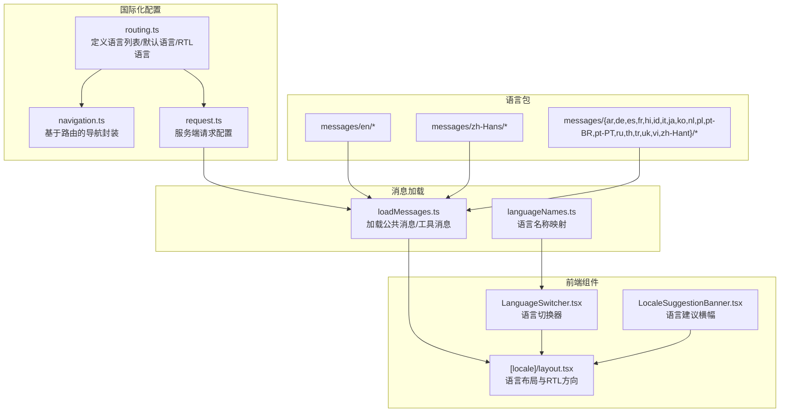
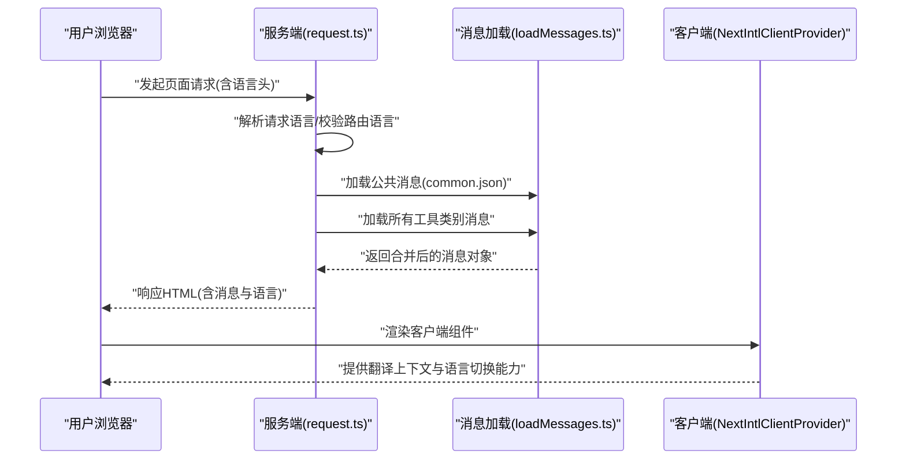
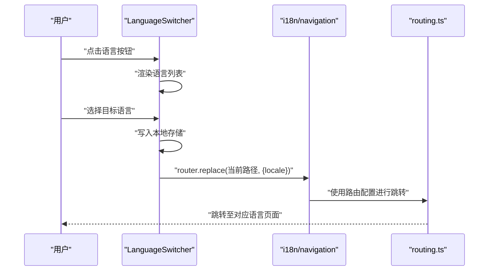
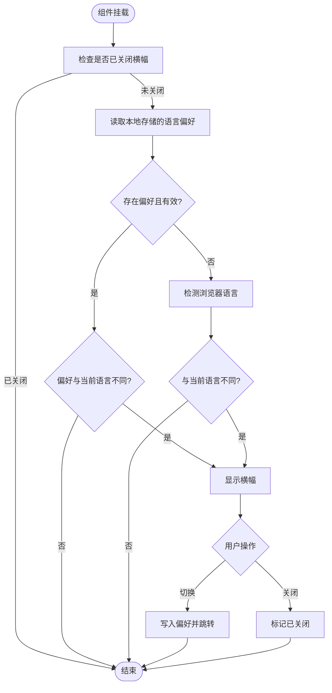
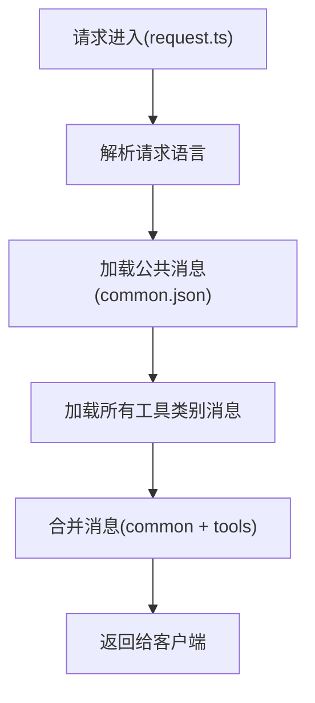
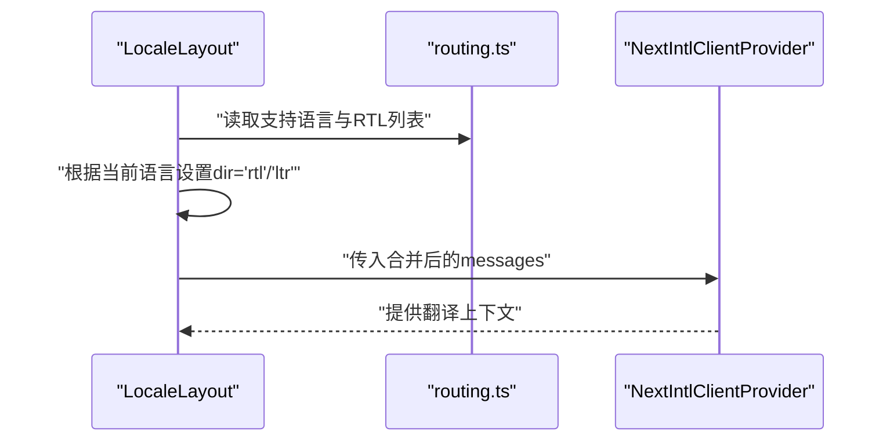
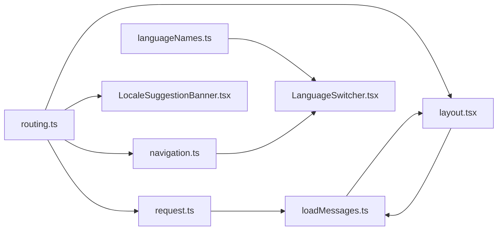

# 21种语言支持

<cite>
**本文档引用的文件**
- [routing.ts](file://src/i18n/routing.ts)
- [navigation.ts](file://src/i18n/navigation.ts)
- [request.ts](file://src/i18n/request.ts)
- [loadMessages.ts](file://src/lib/i18n/loadMessages.ts)
- [languageNames.ts](file://src/lib/i18n/languageNames.ts)
- [LanguageSwitcher.tsx](file://src/components/shared/LanguageSwitcher.tsx)
- [LocaleSuggestionBanner.tsx](file://src/components/shared/LocaleSuggestionBanner.tsx)
- [layout.tsx](file://src/app/[locale]/layout.tsx)
- [layout.tsx](file://src/app/layout.tsx)
- [common.json (英语)](file://messages/en/common.json)
- [common.json (简体中文)](file://messages/zh-Hans/common.json)
</cite>

## 目录
1. [简介](#简介)
2. [项目结构](#项目结构)
3. [核心组件](#核心组件)
4. [架构总览](#架构总览)
5. [详细组件分析](#详细组件分析)
6. [依赖关系分析](#依赖关系分析)
7. [性能考虑](#性能考虑)
8. [故障排除指南](#故障排除指南)
9. [结论](#结论)
10. [附录](#附录)

## 简介
本文件系统性阐述 PrivaDeck 的国际化（i18n）架构与多语言支持能力，覆盖以下方面：
- 支持的语言列表与区域变体
- 国际化架构设计原理（动态语言切换、翻译资源管理、RTL 语言支持）
- 语言包组织结构与维护流程
- 新语言添加流程
- 多语言用户体验优化策略（日期时间、数字、文化适配）
- 语言贡献指南与翻译质量保证机制

PrivaDeck 当前支持 21 种语言，包括：英语、简体中文、繁体中文、日语、韩语、法语、德语、西班牙语、俄语、阿拉伯语、意大利语、荷兰语、波兰语、葡萄牙语（巴西/葡萄牙）、泰语、越南语、印尼语、印地语、土耳其语、乌克兰语。

## 项目结构
PrivaDeck 的国际化采用 Next.js Internationalization（next-intl）方案，结合自定义消息加载与工具类翻译合并策略，形成“公共消息 + 工具类消息”的双层结构。语言包按目录组织，每个语言一个目录，包含通用消息与各工具类别的消息文件。

**图表来源**
- [routing.ts:1-18](file://src/i18n/routing.ts#L1-L18)
- [navigation.ts:1-6](file://src/i18n/navigation.ts#L1-L6)
- [request.ts:1-20](file://src/i18n/request.ts#L1-L20)
- [loadMessages.ts:1-55](file://src/lib/i18n/loadMessages.ts#L1-L55)
- [languageNames.ts:1-26](file://src/lib/i18n/languageNames.ts#L1-L26)
- [LanguageSwitcher.tsx:1-74](file://src/components/shared/LanguageSwitcher.tsx#L1-L74)
- [LocaleSuggestionBanner.tsx:1-104](file://src/components/shared/LocaleSuggestionBanner.tsx#L1-L104)
- [layout.tsx:1-77](file://src/app/[locale]/layout.tsx#L1-L77)

**章节来源**
- [routing.ts:1-18](file://src/i18n/routing.ts#L1-L18)
- [request.ts:1-20](file://src/i18n/request.ts#L1-L20)
- [loadMessages.ts:1-55](file://src/lib/i18n/loadMessages.ts#L1-L55)
- [languageNames.ts:1-26](file://src/lib/i18n/languageNames.ts#L1-L26)
- [LanguageSwitcher.tsx:1-74](file://src/components/shared/LanguageSwitcher.tsx#L1-L74)
- [LocaleSuggestionBanner.tsx:1-104](file://src/components/shared/LocaleSuggestionBanner.tsx#L1-L104)
- [layout.tsx:1-77](file://src/app/[locale]/layout.tsx#L1-L77)

## 核心组件
- 语言路由与默认语言：在路由配置中声明支持的语言集合、默认语言与 RTL 语言清单，并通过 next-intl 的路由定义函数统一管理。
- 请求配置：服务端根据请求语言解析当前 locale，加载公共消息与所有工具类别消息，合并后注入客户端。
- 消息加载器：提供公共消息加载、单类别工具消息加载与全工具类别消息聚合加载，避免一次性加载过多消息导致性能问题。
- 语言切换器：提供下拉选择与点击切换，记录用户偏好于本地存储，触发路由跳转并携带目标语言参数。
- 语言建议横幅：基于浏览器语言检测与用户偏好，智能提示切换语言，提升首次访问体验。
- 布局与 RTL：在语言布局中根据是否为 RTL 语言设置 html 的 dir 属性，确保阿拉伯语等从右到左书写的语言正确显示。

**章节来源**
- [routing.ts:1-18](file://src/i18n/routing.ts#L1-L18)
- [request.ts:1-20](file://src/i18n/request.ts#L1-L20)
- [loadMessages.ts:1-55](file://src/lib/i18n/loadMessages.ts#L1-L55)
- [LanguageSwitcher.tsx:1-74](file://src/components/shared/LanguageSwitcher.tsx#L1-L74)
- [LocaleSuggestionBanner.tsx:1-104](file://src/components/shared/LocaleSuggestionBanner.tsx#L1-L104)
- [layout.tsx:52-52](file://src/app/[locale]/layout.tsx#L52-L52)

## 架构总览
PrivaDeck 的国际化采用“服务端解析 + 客户端渲染”的模式：
- 服务端：根据请求语言确定 locale，加载公共消息与工具消息，合并后传递给客户端。
- 客户端：NextIntlClientProvider 接收消息并在组件树中提供翻译上下文；语言切换器与横幅组件负责用户交互与语言建议。
- 路由：通过 next-intl 的路由定义与导航封装，确保路径包含语言前缀且可正确跳转。

**图表来源**
- [request.ts:6-19](file://src/i18n/request.ts#L6-L19)
- [loadMessages.ts:32-55](file://src/lib/i18n/loadMessages.ts#L32-L55)
- [layout.tsx:46-49](file://src/app/[locale]/layout.tsx#L46-L49)

**章节来源**
- [request.ts:1-20](file://src/i18n/request.ts#L1-L20)
- [loadMessages.ts:1-55](file://src/lib/i18n/loadMessages.ts#L1-L55)
- [layout.tsx:32-77](file://src/app/[locale]/layout.tsx#L32-L77)

## 详细组件分析

### 语言切换器（LanguageSwitcher）
语言切换器提供直观的下拉菜单，展示所有支持语言的本地名称，并允许用户一键切换。其行为包括：
- 记录用户选择到本地存储
- 触发路由替换，携带新的语言参数
- 关闭下拉菜单并上报事件

**图表来源**
- [LanguageSwitcher.tsx:33-38](file://src/components/shared/LanguageSwitcher.tsx#L33-L38)
- [navigation.ts:4-5](file://src/i18n/navigation.ts#L4-L5)
- [routing.ts:14-17](file://src/i18n/routing.ts#L14-L17)

**章节来源**
- [LanguageSwitcher.tsx:1-74](file://src/components/shared/LanguageSwitcher.tsx#L1-L74)
- [navigation.ts:1-6](file://src/i18n/navigation.ts#L1-L6)
- [routing.ts:1-18](file://src/i18n/routing.ts#L1-L18)

### 语言建议横幅（LocaleSuggestionBanner）
语言建议横幅在用户未选择特定语言时，基于浏览器语言与本地存储偏好进行智能提示，帮助用户快速切换到更合适的语言。其逻辑包括：
- 检查是否已关闭横幅
- 读取本地存储的语言偏好
- 若无偏好则检测浏览器语言
- 计算建议语言（需与当前语言不同）

**图表来源**
- [LocaleSuggestionBanner.tsx:15-26](file://src/components/shared/LocaleSuggestionBanner.tsx#L15-L26)
- [LocaleSuggestionBanner.tsx:57-72](file://src/components/shared/LocaleSuggestionBanner.tsx#L57-L72)

**章节来源**
- [LocaleSuggestionBanner.tsx:1-104](file://src/components/shared/LocaleSuggestionBanner.tsx#L1-L104)

### 消息加载与合并（loadMessages）
消息加载模块负责按需加载公共消息与工具类别消息，并在服务端进行合并，减少客户端传输与解析压力：
- 加载公共消息（除工具名称外的通用内容）
- 按类别加载工具消息并合并为统一结构
- 在页面需要时加载所有工具类别消息

**图表来源**
- [request.ts:12-18](file://src/i18n/request.ts#L12-L18)
- [loadMessages.ts:32-55](file://src/lib/i18n/loadMessages.ts#L32-L55)

**章节来源**
- [request.ts:1-20](file://src/i18n/request.ts#L1-L20)
- [loadMessages.ts:1-55](file://src/lib/i18n/loadMessages.ts#L1-L55)

### 布局与 RTL 支持（layout.tsx）
语言布局负责：
- 设置 html 的 lang 与 dir 属性
- 注入 NextIntlClientProvider 提供翻译上下文
- 合并工具导航数据与页面内容

**图表来源**
- [layout.tsx:52-52](file://src/app/[locale]/layout.tsx#L52-L52)
- [routing.ts:12-12](file://src/i18n/routing.ts#L12-L12)

**章节来源**
- [layout.tsx:32-77](file://src/app/[locale]/layout.tsx#L32-L77)
- [routing.ts:1-18](file://src/i18n/routing.ts#L1-L18)

## 依赖关系分析
- 路由配置（routing.ts）是国际化系统的核心，被导航封装（navigation.ts）、请求配置（request.ts）、布局（layout.tsx）与语言建议（LocaleSuggestionBanner.tsx）广泛依赖。
- 消息加载（loadMessages.ts）在服务端被 request.ts 使用，同时在客户端被布局组件用于构建工具导航数据。
- 语言切换器（LanguageSwitcher.tsx）依赖导航封装（navigation.ts）与语言名称映射（languageNames.ts）。

**图表来源**
- [routing.ts:1-18](file://src/i18n/routing.ts#L1-L18)
- [navigation.ts:1-6](file://src/i18n/navigation.ts#L1-L6)
- [request.ts:1-20](file://src/i18n/request.ts#L1-L20)
- [loadMessages.ts:1-55](file://src/lib/i18n/loadMessages.ts#L1-L55)
- [languageNames.ts:1-26](file://src/lib/i18n/languageNames.ts#L1-L26)
- [LanguageSwitcher.tsx:1-74](file://src/components/shared/LanguageSwitcher.tsx#L1-L74)
- [LocaleSuggestionBanner.tsx:1-104](file://src/components/shared/LocaleSuggestionBanner.tsx#L1-L104)
- [layout.tsx:1-77](file://src/app/[locale]/layout.tsx#L1-L77)

**章节来源**
- [routing.ts:1-18](file://src/i18n/routing.ts#L1-L18)
- [navigation.ts:1-6](file://src/i18n/navigation.ts#L1-L6)
- [request.ts:1-20](file://src/i18n/request.ts#L1-L20)
- [loadMessages.ts:1-55](file://src/lib/i18n/loadMessages.ts#L1-L55)
- [languageNames.ts:1-26](file://src/lib/i18n/languageNames.ts#L1-L26)
- [LanguageSwitcher.tsx:1-74](file://src/components/shared/LanguageSwitcher.tsx#L1-L74)
- [LocaleSuggestionBanner.tsx:1-104](file://src/components/shared/LocaleSuggestionBanner.tsx#L1-L104)
- [layout.tsx:1-77](file://src/app/[locale]/layout.tsx#L1-L77)

## 性能考虑
- 按需加载：通过 loadMessages.ts 将公共消息与工具消息分离，避免一次性加载所有工具类别消息，降低首屏负载。
- 并行加载：在服务端使用 Promise.all 并行加载公共消息与工具导航数据，缩短渲染等待时间。
- 本地存储：语言切换器与语言建议横幅使用本地存储记录用户偏好，减少重复计算与网络请求。
- RTL 渲染：仅在布局阶段根据语言设置 dir 属性，避免在组件内部重复判断。

[本节为通用性能讨论，不直接分析具体文件]

## 故障排除指南
- 语言切换无效
  - 检查路由配置中的语言列表与目标语言是否一致
  - 确认导航封装（navigation.ts）与语言切换器（LanguageSwitcher.tsx）的集成
  - 查看本地存储中是否正确写入目标语言
- 页面未按预期显示 RTL
  - 确认 routing.ts 中 RTL 语言列表是否包含目标语言
  - 检查布局（layout.tsx）是否根据语言正确设置 dir 属性
- 语言建议横幅不出现
  - 检查本地存储中是否已标记“已关闭”
  - 确认浏览器语言检测逻辑与当前语言不同
- 消息缺失或乱码
  - 确认对应语言的消息目录是否存在且包含 common.json
  - 检查消息键名是否与组件引用一致

**章节来源**
- [routing.ts:1-18](file://src/i18n/routing.ts#L1-L18)
- [navigation.ts:1-6](file://src/i18n/navigation.ts#L1-L6)
- [LanguageSwitcher.tsx:1-74](file://src/components/shared/LanguageSwitcher.tsx#L1-L74)
- [LocaleSuggestionBanner.tsx:1-104](file://src/components/shared/LocaleSuggestionBanner.tsx#L1-L104)
- [layout.tsx:52-52](file://src/app/[locale]/layout.tsx#L52-L52)

## 结论
PrivaDeck 的国际化架构以 next-intl 为核心，结合自定义消息加载与工具导航数据构建，实现了：
- 明确的语言列表与默认语言管理
- 动态语言切换与用户偏好持久化
- 智能语言建议与 RTL 支持
- 可扩展的语言包组织与按需加载策略

该架构既满足当前 21 种语言的支持需求，也为未来新增语言提供了清晰的扩展路径。

[本节为总结性内容，不直接分析具体文件]

## 附录

### 支持的语言列表与区域变体
- 英语（en）
- 简体中文（zh-Hans）
- 繁体中文（zh-Hant）
- 日语（ja）
- 韩语（ko）
- 法语（fr）
- 德语（de）
- 西班牙语（es）
- 俄语（ru）
- 阿拉伯语（ar）
- 意大利语（it）
- 荷兰语（nl）
- 波兰语（pl）
- 葡萄牙语（巴西/葡萄牙）
  - 巴西葡萄牙语（pt-BR）
  - 葡萄牙本土葡萄牙语（pt-PT）
- 泰语（th）
- 越南语（vi）
- 印尼语（id）
- 印地语（hi）
- 土耳其语（tr）
- 乌克兰语（uk）

**章节来源**
- [routing.ts:3-8](file://src/i18n/routing.ts#L3-L8)

### 语言包组织结构与维护流程
- 目录结构
  - messages/{locale}/common.json：通用消息（站点名称、导航、分类介绍、隐私政策、使用说明等）
  - messages/{locale}/tools-{category}.json：各工具类别的消息（开发者、图像、PDF、视频、音频）
- 维护流程
  - 在对应语言目录下新增或修改 common.json 与工具类别消息文件
  - 在路由配置（routing.ts）中添加新语言条目
  - 如需 RTL 支持，在 routing.ts 中将该语言加入 RTL 列表
  - 在语言名称映射（languageNames.ts）中添加该语言的本地名称
  - 在语言切换器（LanguageSwitcher.tsx）中确认该语言出现在语言列表中
  - 进行本地测试，确保消息键名与组件引用一致，RTL 方向正确

**章节来源**
- [routing.ts:1-18](file://src/i18n/routing.ts#L1-L18)
- [languageNames.ts:1-26](file://src/lib/i18n/languageNames.ts#L1-L26)
- [LanguageSwitcher.tsx:55-68](file://src/components/shared/LanguageSwitcher.tsx#L55-L68)
- [common.json (英语):1-508](file://messages/en/common.json#L1-L508)
- [common.json (简体中文):1-508](file://messages/zh-Hans/common.json#L1-L508)

### 多语言用户体验优化策略
- 日期时间与数字格式
  - 使用浏览器 Intl API 或第三方库（如 date-fns-i18n）进行本地化格式化
  - 在组件中根据当前语言动态设置格式选项，避免硬编码
- 文化适配
  - RTL 语言（如阿拉伯语）通过布局设置 dir="rtl" 实现从右到左显示
  - 文本方向与对齐：确保按钮、表单与卡片在 RTL 下保持正确的视觉层次
- 无障碍与可访问性
  - 为语言切换器与横幅提供适当的 aria-label 与键盘导航
  - 确保切换后焦点管理与屏幕阅读器友好

[本节为通用优化建议，不直接分析具体文件]

### 语言贡献指南与翻译质量保证
- 贡献流程
  - Fork 仓库并创建分支
  - 在 messages/{locale}/ 下新增或完善 common.json 与工具类别消息文件
  - 更新路由配置（routing.ts）与语言名称映射（languageNames.ts）
  - 提交 PR 并填写变更说明
- 质量保证
  - 键名一致性：确保所有语言的消息键名与英文版一致
  - 上下文完整性：工具类别消息需覆盖所有工具，避免遗漏
  - 本地化测试：在本地环境中验证语言切换、RTL 显示与消息渲染
  - 代码审查：PR 需经至少一名维护者审查通过

[本节为通用指南，不直接分析具体文件]