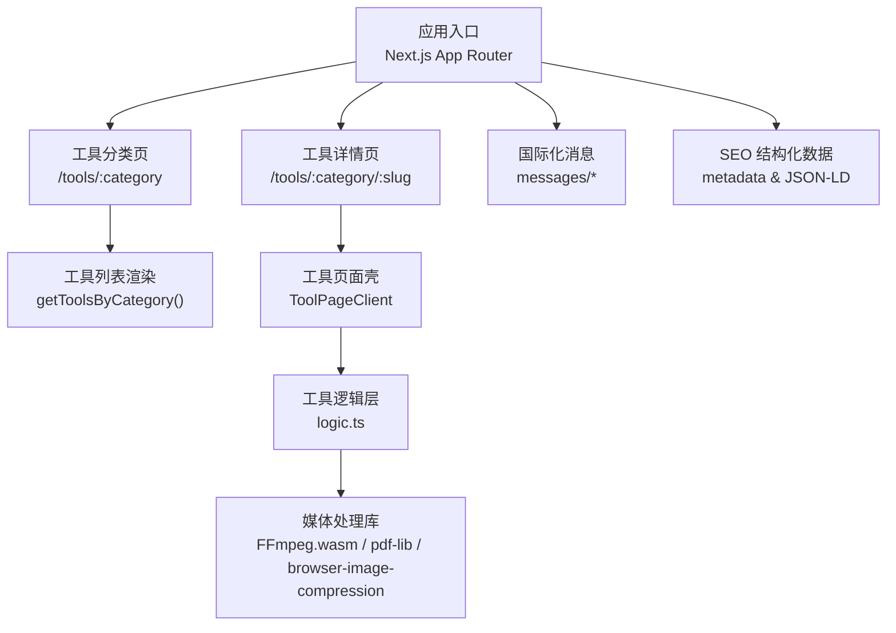
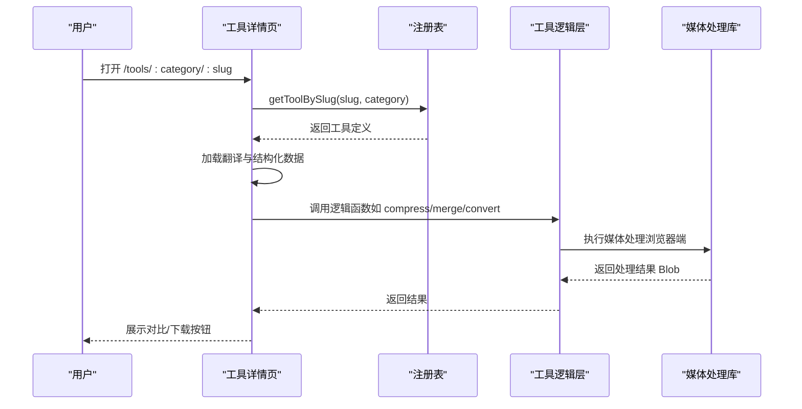
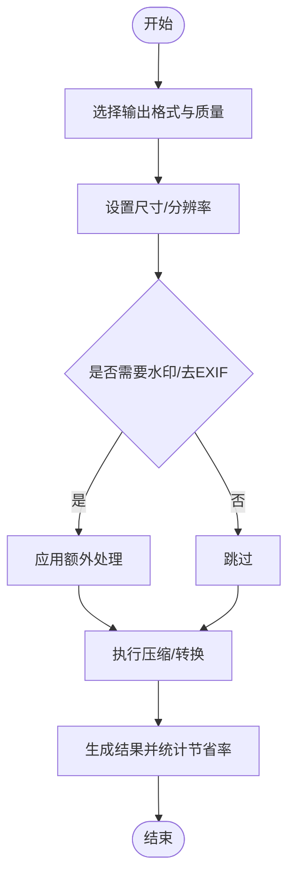
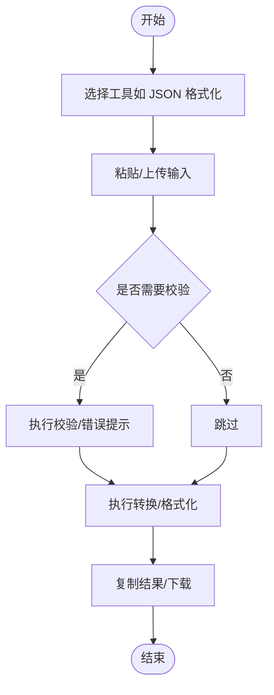
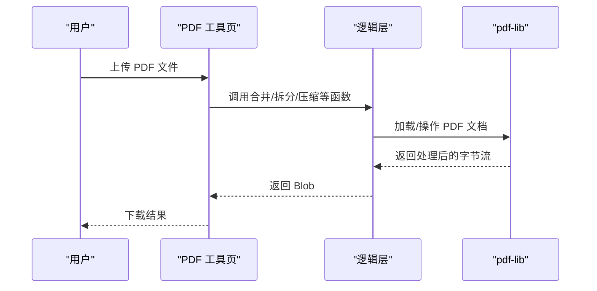
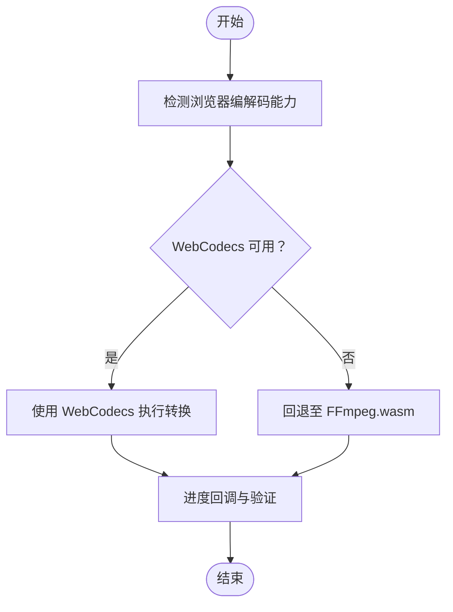
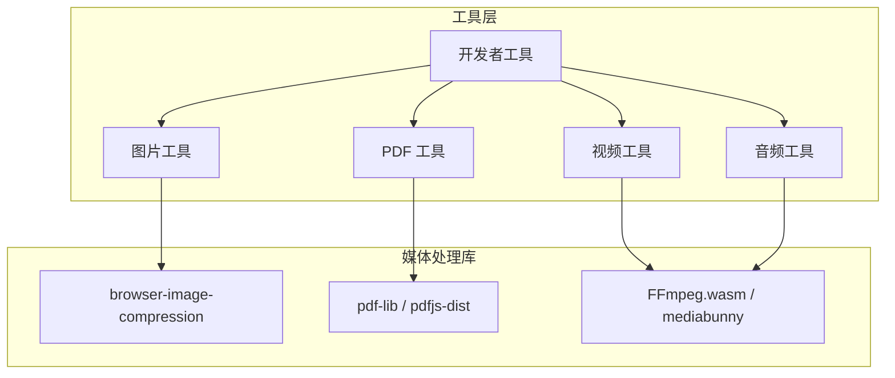

# 60个工具生态

<cite>
**本文档引用的文件**
- [README.md](file://README.md)
- [package.json](file://package.json)
- [src/lib/registry/index.ts](file://src/lib/registry/index.ts)
- [src/lib/registry/types.ts](file://src/lib/registry/types.ts)
- [src/lib/registry/categories.ts](file://src/lib/registry/categories.ts)
- [src/app/[locale]/tools/[category]/page.tsx](file://src/app/[locale]/tools/[category]/page.tsx)
- [src/app/[locale]/tools/[category]/[slug]/page.tsx](file://src/app/[locale]/tools/[category]/[slug]/page.tsx)
- [src/tools/image/compress/logic.ts](file://src/tools/image/compress/logic.ts)
- [src/tools/pdf/merge/logic.ts](file://src/tools/pdf/merge/logic.ts)
- [src/tools/video/compress/logic.ts](file://src/tools/video/compress/logic.ts)
- [src/tools/audio/convert/logic.ts](file://src/tools/audio/convert/logic.ts)
- [src/tools/developer/json-formatter/logic.ts](file://src/tools/developer/json-formatter/logic.ts)
- [src/tools/image/compress/index.ts](file://src/tools/image/compress/index.ts)
- [src/tools/pdf/merge/index.ts](file://src/tools/pdf/merge/index.ts)
</cite>

## 目录
1. [简介](#简介)
2. [项目结构](#项目结构)
3. [核心组件](#核心组件)
4. [架构总览](#架构总览)
5. [详细组件分析](#详细组件分析)
6. [依赖关系分析](#依赖关系分析)
7. [性能考量](#性能考量)
8. [故障排除指南](#故障排除指南)
9. [结论](#结论)
10. [附录](#附录)

## 简介
PrivaDeck 是一个浏览器端多媒体工具箱，所有文件处理均在本地完成，实现零上传、零服务器的隐私优先设计。项目提供 60 个工具，覆盖五大分类：图片处理（17 个）、开发者工具（17 个）、PDF 处理（14 个）、视频处理（8 个）、音频处理（4 个）。通过 FFmpeg.wasm、pdf-lib、pdfjs-dist、browser-image-compression 等技术栈，结合多语言国际化与 PWA 支持，为用户提供离线可用、高性能、易用的在线工具生态。

## 项目结构
项目采用 Next.js App Router + 静态生成（SSG）架构，工具模块按类别组织，配套国际化消息与 SEO 结构化数据生成。核心目录与职责如下：
- src/lib/registry：工具注册表与类型定义，统一管理工具元数据与路由参数生成
- src/tools：五大分类工具的具体实现，每个工具包含 index.ts（定义）、{Name}.tsx（客户端组件）、logic.ts（纯处理函数）
- src/app：页面层，负责路由、静态参数生成、SEO 元数据与结构化数据注入
- src/components：共享 UI 组件与工具页面外壳
- messages：21 种语言的翻译文件，覆盖通用与各分类工具文案

图表来源
- [src/app/[locale]/tools/[category]/page.tsx](file://src/app/[locale]/tools/[category]/page.tsx#L14-L31)
- [src/app/[locale]/tools/[category]/[slug]/page.tsx](file://src/app/[locale]/tools/[category]/[slug]/page.tsx#L13-L31)
- [src/lib/registry/index.ts:135-155](file://src/lib/registry/index.ts#L135-L155)

章节来源
- [README.md:55-78](file://README.md#L55-L78)
- [src/app/[locale]/tools/[category]/page.tsx:14-L31](file://src/app/[locale]/tools/[category]/page.tsx#L14-L31)
- [src/app/[locale]/tools/[category]/[slug]/page.tsx:13-L31](file://src/app/[locale]/tools/[category]/[slug]/page.tsx#L13-L31)

## 核心组件
- 工具注册表：集中管理工具元数据（slug、category、icon、featured 等），提供按分类检索、按 slug 查询、推荐工具筛选等能力
- 工具页面壳：负责加载工具组件、注入结构化数据、预取 FFmpeg 资源（如需要）
- 工具逻辑层：封装纯函数处理流程，屏蔽媒体库差异，统一返回 Blob 输出
- 国际化与 SEO：按工具维度动态加载翻译，生成面包屑、FAQ 等结构化数据

章节来源
- [src/lib/registry/index.ts:66-137](file://src/lib/registry/index.ts#L66-L137)
- [src/lib/registry/types.ts:5-16](file://src/lib/registry/types.ts#L5-L16)
- [src/app/[locale]/tools/[category]/[slug]/page.tsx:78-L107](file://src/app/[locale]/tools/[category]/[slug]/page.tsx#L78-L107)

## 架构总览
工具生态以“注册表 + 页面壳 + 逻辑层”的分层架构运行。页面层根据路由参数从注册表解析工具定义，动态加载组件与翻译，并在需要时预取 FFmpeg 资源。逻辑层通过浏览器端媒体库执行转换、压缩、合并等操作，最终返回 Blob 文件供下载。

图表来源
- [src/app/[locale]/tools/[category]/[slug]/page.tsx:41-L44](file://src/app/[locale]/tools/[category]/[slug]/page.tsx#L41-L44)
- [src/lib/registry/index.ts:139-147](file://src/lib/registry/index.ts#L139-L147)
- [src/tools/image/compress/logic.ts:83-123](file://src/tools/image/compress/logic.ts#L83-L123)

## 详细组件分析

### 图片处理（17 个工具）
- 设计逻辑：围绕“压缩、格式转换、尺寸调整、裁剪、水印、去 EXIF、滤镜/特效”等高频需求构建，强调易用性与批量处理能力
- 重要工具与功能：
  - 图片压缩：支持多种输出格式（JPEG/PNG/WEBP/AVIF），提供质量、大小、分辨率预设与自定义选项，计算节省率
  - 格式转换：在浏览器内完成格式互转，保持像素精度
  - 尺寸调整与裁剪：支持固定宽高比与最大边限制
  - 水印与去 EXIF：保护隐私与版权
  - 滤镜与特效：灰度、马赛克、圆形裁剪等
- 使用场景：社交媒体配图、网页资源优化、批量图片处理、隐私保护

图表来源
- [src/tools/image/compress/logic.ts:26-34](file://src/tools/image/compress/logic.ts#L26-L34)
- [src/tools/image/compress/logic.ts:83-123](file://src/tools/image/compress/logic.ts#L83-L123)

章节来源
- [README.md:20](file://README.md#L20)
- [src/tools/image/compress/logic.ts:1-135](file://src/tools/image/compress/logic.ts#L1-L135)
- [src/tools/image/compress/index.ts:3-34](file://src/tools/image/compress/index.ts#L3-L34)

### 开发者工具（17 个工具）
- 设计逻辑：聚焦文本与数据格式处理，提供常用开发辅助能力，强调准确性与可读性
- 重要工具与功能：
  - JSON 格式化/压缩/校验：支持缩进控制与错误提示
  - Base64 编解码：便捷的数据传输与嵌入
  - 正则测试器：可视化匹配与替换
  - OCR 文字识别：提取图片中的文本
  - 哈希生成：MD5/SHA 等摘要算法
  - 时间戳转换：人类可读与机器可读时间互转
  - 颜色格式转换：RGB/HSL/HEX 等
  - Markdown 预览：实时渲染
  - 文本差异对比：变更追踪
  - CSV/JSON/YAML 转换：数据交换
- 使用场景：API 调试、配置文件管理、数据清洗与转换、文档编写与审阅

图表来源
- [src/tools/developer/json-formatter/logic.ts:7-14](file://src/tools/developer/json-formatter/logic.ts#L7-L14)

章节来源
- [README.md:21](file://README.md#L21)
- [src/tools/developer/json-formatter/logic.ts:1-33](file://src/tools/developer/json-formatter/logic.ts#L1-L33)

### PDF 处理（14 个工具）
- 设计逻辑：围绕“合并、拆分、压缩、转图片、提取文本/图片、旋转/裁剪、页码/水印、电子签名”等办公高频需求构建
- 重要工具与功能：
  - 合并与拆分：支持多文件合并与指定页范围拆分
  - 压缩：降低文件体积，保持可读性
  - 转图片：整页或选区导出为图片
  - 提取文本与图片：内容二次利用
  - 旋转与裁剪：修正页面方向与布局
  - 页码与水印：批量标注与版权保护
  - 电子签名：无纸化签署流程
- 使用场景：合同归档、报告整理、教学课件制作、合规审计

图表来源
- [src/tools/pdf/merge/logic.ts:3-17](file://src/tools/pdf/merge/logic.ts#L3-L17)

章节来源
- [README.md:22](file://README.md#L22)
- [src/tools/pdf/merge/logic.ts:1-24](file://src/tools/pdf/merge/logic.ts#L1-L24)
- [src/tools/pdf/merge/index.ts:3-34](file://src/tools/pdf/merge/index.ts#L3-L34)

### 视频处理（8 个工具）
- 设计逻辑：优先保证浏览器端性能与兼容性，自动选择 WebCodecs 或 FFmpeg.wasm，兼顾质量与速度
- 重要工具与功能：
  - 剪辑：精确裁剪起止时间
  - 压缩：基于 CRF 与分辨率的智能压缩
  - 转 GIF/WebP：轻量动图与现代编码
  - 格式转换：MP4/AAC 等主流封装
  - 旋转与尺寸调整：适配不同展示场景
  - 静音：去除音频轨道
  - 信息查询：帧率、分辨率、时长等
- 使用场景：短视频创作、直播回放、教学视频、社交媒体素材

图表来源
- [src/tools/video/compress/logic.ts:85-110](file://src/tools/video/compress/logic.ts#L85-L110)
- [src/tools/video/compress/logic.ts:203-256](file://src/tools/video/compress/logic.ts#L203-L256)

章节来源
- [README.md:23](file://README.md#L23)
- [src/tools/video/compress/logic.ts:1-257](file://src/tools/video/compress/logic.ts#L1-L257)

### 音频处理（4 个工具）
- 设计逻辑：提供基础的剪辑、格式转换、提取与音量调节，满足日常音频编辑需求
- 重要工具与功能：
  - 剪辑：截取片段
  - 转换：MP3/WAV/OGG/AAC/FLAC 等格式互转
  - 提取：从视频中分离音频轨
  - 音量：提升或降低音量
- 使用场景：播客制作、音乐整理、视频配音、音频备份

章节来源
- [README.md:24](file://README.md#L24)
- [src/tools/audio/convert/logic.ts:1-35](file://src/tools/audio/convert/logic.ts#L1-L35)

### 工具分类与排序策略
- 分类依据：媒体类型与用途划分，确保同类工具聚类展示，便于发现与对比
- 排序策略：首页“精选工具”优先展示高频使用工具；分类页按使用频率与功能相关性排列
- 相关性：通过 relatedSlugs 关联工具，引导用户组合使用

章节来源
- [src/lib/registry/index.ts:66-133](file://src/lib/registry/index.ts#L66-L133)
- [src/lib/registry/types.ts:14-15](file://src/lib/registry/types.ts#L14-L15)
- [src/tools/image/compress/index.ts:33](file://src/tools/image/compress/index.ts#L33)
- [src/tools/pdf/merge/index.ts:33](file://src/tools/pdf/merge/index.ts#L33)

### 工具选择指南与组合建议
- 图片处理：优先使用“压缩”进行体积优化，再用“格式转换”适配平台要求；需要隐私保护时配合“去 EXIF”
- PDF 处理：先“合并”再“拆分”，配合“压缩”减小体积；需要展示时用“转图片”或“提取文本”
- 视频处理：先“剪辑”再“压缩”，根据平台选择“转 GIF/WebP”；需要静音或重新编码时分别使用对应工具
- 音频处理：先“提取”音频轨，再“转换”为目标格式；最后用“音量”微调
- 开发者工具：使用“JSON 格式化/校验”与“正则测试器”提高调试效率；“OCR”用于扫描件文字提取

## 依赖关系分析
- 媒体处理依赖：图片压缩依赖 browser-image-compression；PDF 处理依赖 pdf-lib 与 pdfjs-dist；视频/音频处理依赖 FFmpeg.wasm 与 mediabunny
- 运行时依赖：Next.js 16、next-intl（21 语言）、Tailwind CSS v4、React 19
- 工具注册与路由：通过注册表统一管理工具元数据，页面层按需加载组件与翻译

图表来源
- [package.json:11-32](file://package.json#L11-L32)
- [src/tools/image/compress/logic.ts:1](file://src/tools/image/compress/logic.ts#L1)
- [src/tools/pdf/merge/logic.ts:1](file://src/tools/pdf/merge/logic.ts#L1)
- [src/tools/video/compress/logic.ts:1](file://src/tools/video/compress/logic.ts#L1)
- [src/tools/audio/convert/logic.ts:1](file://src/tools/audio/convert/logic.ts#L1)

章节来源
- [package.json:11-32](file://package.json#L11-L32)
- [README.md:26-33](file://README.md#L26-L33)

## 性能考量
- 浏览器端处理：所有工具在本地执行，避免网络延迟与隐私风险
- 自适应路径：视频处理优先尝试 WebCodecs，失败时回退 FFmpeg.wasm，兼顾性能与兼容性
- 资源预取：工具详情页按需预取 FFmpeg 资源，减少首次执行等待
- 压缩策略：图片压缩提供多预设与自定义选项，视频压缩基于 CRF 与分辨率智能估算码率

章节来源
- [src/app/[locale]/tools/[category]/[slug]/page.tsx:94-L99](file://src/app/[locale]/tools/[category]/[slug]/page.tsx#L94-L99)
- [src/tools/video/compress/logic.ts:85-110](file://src/tools/video/compress/logic.ts#L85-L110)

## 故障排除指南
- FFmpeg 资源加载失败：确认网络可达与跨域设置；检查预取链接有效性
- WebCodecs 不支持：浏览器不支持特定编解码时会抛出错误，系统会回退至 FFmpeg.wasm；若仍失败，检查输入格式与浏览器版本
- 处理超时或内存不足：尝试降低分辨率或压缩质量；分批处理大文件
- PDF 解析异常：确保 PDF 文件完整且未加密；必要时使用“压缩”修复文件结构

章节来源
- [src/app/[locale]/tools/[category]/[slug]/page.tsx:94-L99](file://src/app/[locale]/tools/[category]/[slug]/page.tsx#L94-L99)
- [src/tools/video/compress/logic.ts:92-108](file://src/tools/video/compress/logic.ts#L92-L108)

## 结论
PrivaDeck 通过清晰的工具分类、完善的注册表与页面壳、以及强大的浏览器端媒体处理能力，构建了覆盖广泛、易于使用的 60 个工具生态。其隐私优先、离线可用、多语言与 SEO 友好的特性，使其适用于个人用户与企业办公的多样化场景。建议用户根据工作流选择工具组合，充分利用“精选工具”与“相关工具”推荐，提升处理效率与一致性。

## 附录
- 工具更新机制：新增工具需在注册表中注册、在多语言翻译中补充文案，并在分类页与工具页生成静态参数
- 扩展性说明：工具采用“index.ts + {Name}.tsx + logic.ts”的标准结构，便于快速扩展与维护；媒体处理逻辑集中在 logic.ts，便于单元测试与性能优化

章节来源
- [README.md:80-84](file://README.md#L80-L84)
- [src/lib/registry/index.ts:135-163](file://src/lib/registry/index.ts#L135-L163)
- [src/app/[locale]/tools/[category]/page.tsx:14-L22](file://src/app/[locale]/tools/[category]/page.tsx#L14-L22)
- [src/app/[locale]/tools/[category]/[slug]/page.tsx:13-L22](file://src/app/[locale]/tools/[category]/[slug]/page.tsx#L13-L22)