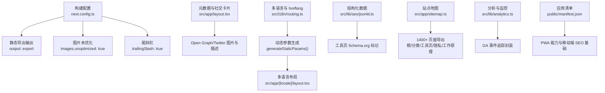
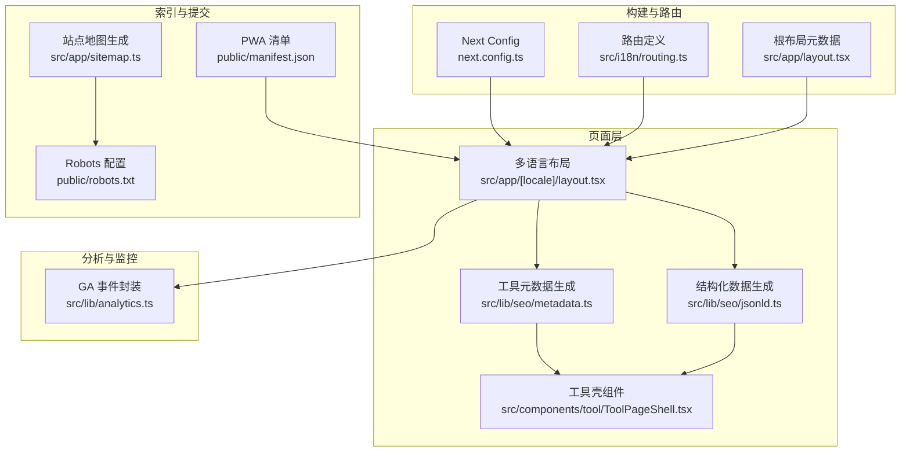
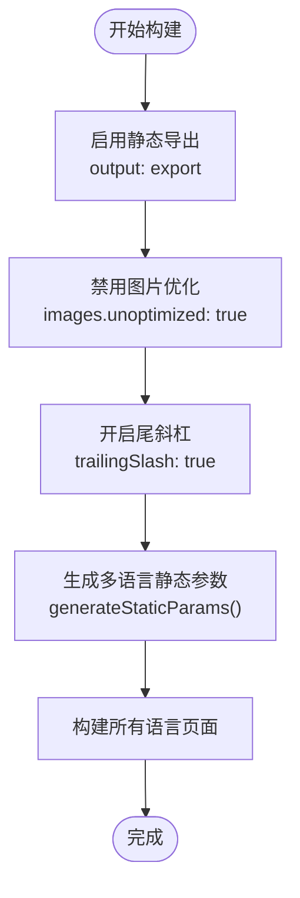
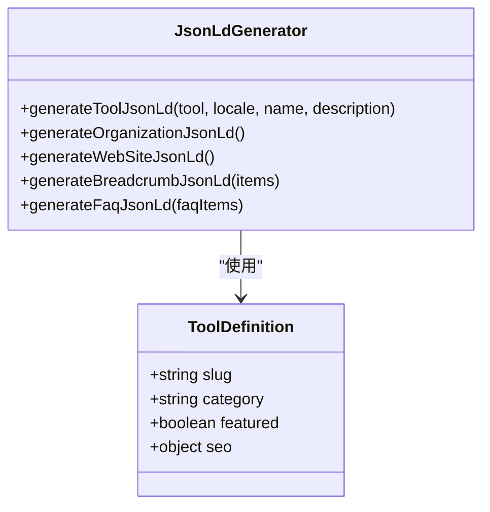
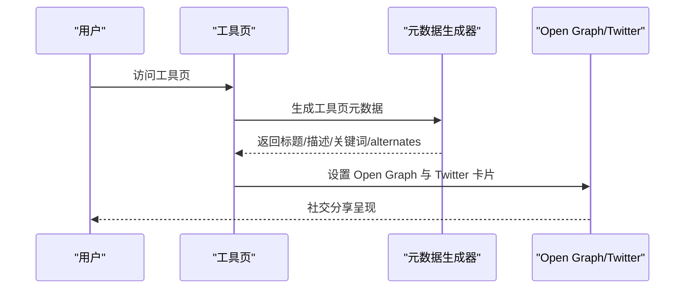
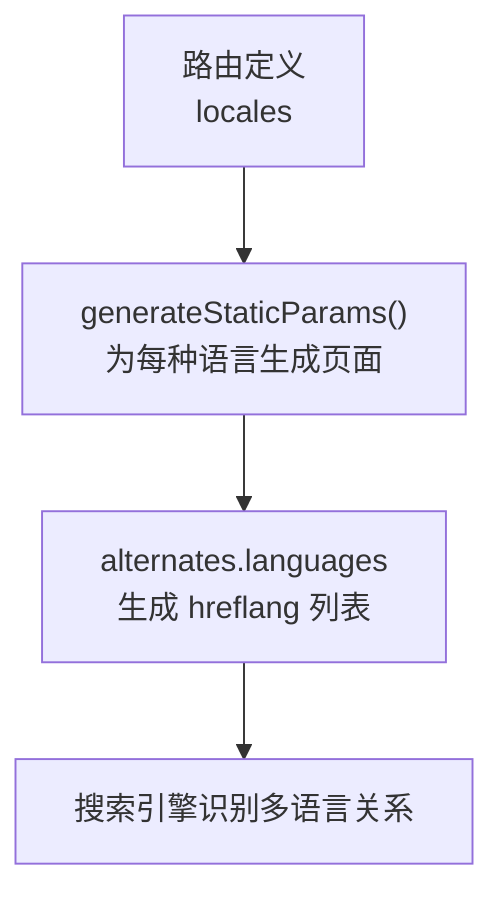
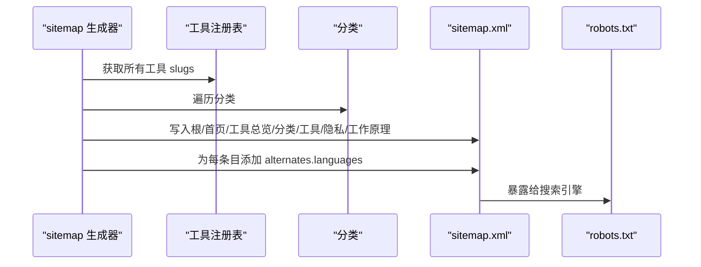
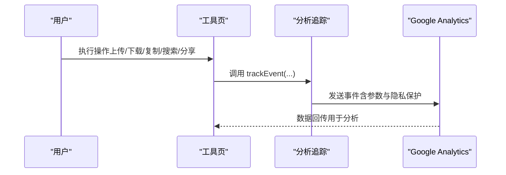
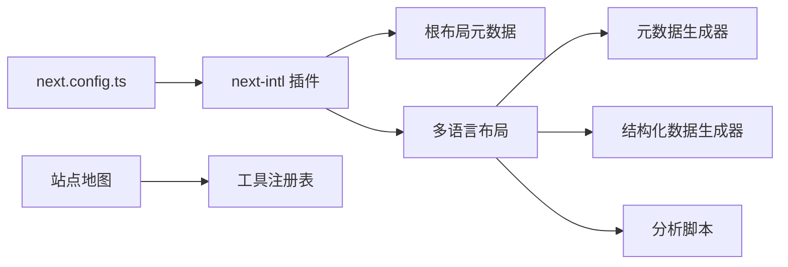

# SEO友好性

<cite>
**本文引用的文件**
- [next.config.ts](file://next.config.ts)
- [public/robots.txt](file://public/robots.txt)
- [public/manifest.json](file://public/manifest.json)
- [src/app/sitemap.ts](file://src/app/sitemap.ts)
- [src/app/layout.tsx](file://src/app/layout.tsx)
- [src/app/[locale]/layout.tsx](file://src/app/[locale]/layout.tsx)
- [src/lib/seo/metadata.ts](file://src/lib/seo/metadata.ts)
- [src/lib/seo/jsonld.ts](file://src/lib/seo/jsonld.ts)
- [src/lib/analytics.ts](file://src/lib/analytics.ts)
- [src/lib/registry/index.ts](file://src/lib/registry/index.ts)
- [src/i18n/routing.ts](file://src/i18n/routing.ts)
- [src/components/tool/ToolPageShell.tsx](file://src/components/tool/ToolPageShell.tsx)
</cite>

## 目录
1. [简介](#简介)
2. [项目结构](#项目结构)
3. [核心组件](#核心组件)
4. [架构总览](#架构总览)
5. [详细组件分析](#详细组件分析)
6. [依赖关系分析](#依赖关系分析)
7. [性能考量](#性能考量)
8. [故障排查指南](#故障排查指南)
9. [结论](#结论)
10. [附录](#附录)

## 简介
本文件系统性阐述 PrivaDeck 的 SEO 友好性设计与实现，覆盖静态生成（SSG）导出策略、结构化数据（Schema.org）、元数据与社交卡片、hreflang 多语言策略、站点地图生成与提交、性能监控与分析（含 Google Analytics 集成），以及搜索引擎优化最佳实践与排名建议。PrivaDeck 采用 Next.js SSG 导出模式，结合多语言路由与本地化元数据生成，确保 1400+ 页面在静态环境下仍具备良好的可发现性与可索引性。

## 项目结构
围绕 SEO 的关键目录与文件如下：
- 构建配置：Next.js SSG 导出、图片未优化、尾斜杠
- 元数据与社交卡片：根布局与多语言布局中的全局元信息
- 结构化数据：工具页 Schema.org 标记生成器
- 多语言与 hreflang：路由定义与动态参数生成
- 站点地图：动态生成 1400+ 页面的 sitemap
- 分析与监控：GA ID 注入与事件追踪封装
- 应用清单：PWA 清单用于移动端体验与 SEO 基础

图表来源
- [next.config.ts:1-13](file://next.config.ts#L1-L13)
- [src/app/layout.tsx:1-48](file://src/app/layout.tsx#L1-L48)
- [src/app/[locale]/layout.tsx:1-77](file://src/app/[locale]/layout.tsx#L1-L77)
- [src/lib/seo/jsonld.ts:1-90](file://src/lib/seo/jsonld.ts#L1-L90)
- [src/app/sitemap.ts:1-97](file://src/app/sitemap.ts#L1-L97)
- [src/lib/analytics.ts:1-138](file://src/lib/analytics.ts#L1-L138)
- [public/manifest.json:1-29](file://public/manifest.json#L1-L29)

章节来源
- [next.config.ts:1-13](file://next.config.ts#L1-L13)
- [src/app/layout.tsx:1-48](file://src/app/layout.tsx#L1-L48)
- [src/app/[locale]/layout.tsx:1-77](file://src/app/[locale]/layout.tsx#L1-L77)
- [src/lib/seo/jsonld.ts:1-90](file://src/lib/seo/jsonld.ts#L1-L90)
- [src/app/sitemap.ts:1-97](file://src/app/sitemap.ts#L1-L97)
- [src/lib/analytics.ts:1-138](file://src/lib/analytics.ts#L1-L138)
- [public/manifest.json:1-29](file://public/manifest.json#L1-L29)

## 核心组件
- 静态生成（SSG）与导出
  - 使用 Next.js SSG 导出模式，生成纯静态文件，便于 CDN 分发与搜索引擎抓取。
  - 关闭图片优化以避免服务端处理，统一使用未优化图片，减少构建复杂度。
  - 尾斜杠策略确保 URL 规范化，降低重复内容风险。
- 全局元数据与社交卡片
  - 根布局集中定义站点标题模板、描述、Open Graph 默认图与 Twitter 卡片，确保所有页面继承一致的品牌形象。
- 结构化数据（Schema.org）
  - 工具页生成工具型应用的结构化数据，包含名称、描述、URL、操作系统要求、权限声明、作者与价格信息。
  - 提供组织、网站、面包屑与 FAQ 的结构化数据生成器，便于在合适页面补充丰富摘要。
- 多语言与 hreflang
  - 定义支持的语言列表与默认语言，通过动态参数生成每个语言的静态页面。
  - 在工具页与分类页生成完整的 hreflang 列表，含 x-default 指向。
- 站点地图
  - 动态生成包含根页、首页、工具总览、分类页、工具页、隐私政策、工作原理等的 sitemap，并为每条目注入 alternates.languages。
- 分析与监控（GA）
  - 在多语言布局中按环境变量注入 GA ID，初始化 gtag；提供事件追踪封装，记录用户行为与错误，同时进行隐私保护（截断长字符串）。
- PWA 清单
  - 提供 manifest.json，增强移动端体验与安装能力，间接提升 SEO 基础质量。

章节来源
- [next.config.ts:1-13](file://next.config.ts#L1-L13)
- [src/app/layout.tsx:1-48](file://src/app/layout.tsx#L1-L48)
- [src/lib/seo/jsonld.ts:1-90](file://src/lib/seo/jsonld.ts#L1-L90)
- [src/i18n/routing.ts:1-18](file://src/i18n/routing.ts#L1-L18)
- [src/app/sitemap.ts:1-97](file://src/app/sitemap.ts#L1-L97)
- [src/lib/analytics.ts:1-138](file://src/lib/analytics.ts#L1-L138)
- [public/manifest.json:1-29](file://public/manifest.json#L1-L29)

## 架构总览
下图展示 SEO 相关模块之间的交互关系：构建配置驱动静态导出；多语言路由与动态参数生成页面；元数据与结构化数据在页面层注入；站点地图统一导出；分析脚本在运行时收集行为数据。

图表来源
- [next.config.ts:1-13](file://next.config.ts#L1-L13)
- [src/i18n/routing.ts:1-18](file://src/i18n/routing.ts#L1-L18)
- [src/app/layout.tsx:1-48](file://src/app/layout.tsx#L1-L48)
- [src/app/[locale]/layout.tsx:1-77](file://src/app/[locale]/layout.tsx#L1-L77)
- [src/lib/seo/metadata.ts:1-99](file://src/lib/seo/metadata.ts#L1-L99)
- [src/lib/seo/jsonld.ts:1-90](file://src/lib/seo/jsonld.ts#L1-L90)
- [src/components/tool/ToolPageShell.tsx:1-54](file://src/components/tool/ToolPageShell.tsx#L1-L54)
- [src/app/sitemap.ts:1-97](file://src/app/sitemap.ts#L1-L97)
- [public/robots.txt:1-5](file://public/robots.txt#L1-L5)
- [public/manifest.json:1-29](file://public/manifest.json#L1-L29)
- [src/lib/analytics.ts:1-138](file://src/lib/analytics.ts#L1-L138)

## 详细组件分析

### 静态生成（SSG）与导出策略
- 导出模式：启用静态导出，生成可在任意静态托管平台部署的纯 HTML/CSS/JS 文件，有利于搜索引擎抓取与 CDN 加速。
- 图片策略：关闭图片优化，统一使用未优化图片，简化构建流程，避免服务端处理带来的 SEO 风险。
- URL 规范化：开启尾斜杠，确保路径一致性，降低重复内容与 404 风险。
- 多语言静态参数：通过动态参数生成每个语言的静态页面，保证每种语言都有独立可索引的页面集合。

图表来源
- [next.config.ts:1-13](file://next.config.ts#L1-L13)
- [src/app/[locale]/layout.tsx:28-30](file://src/app/[locale]/layout.tsx#L28-L30)

章节来源
- [next.config.ts:1-13](file://next.config.ts#L1-L13)
- [src/app/[locale]/layout.tsx:28-30](file://src/app/[locale]/layout.tsx#L28-L30)

### 结构化数据（Schema.org）实现
- 工具页标记：为工具页生成工具型应用的结构化数据，包含名称、描述、URL、操作系统要求、权限声明、作者与价格信息，提升搜索结果的丰富性。
- 组织与网站：提供组织与网站的结构化数据生成器，便于在首页或相关页面补充品牌信息。
- 面包屑与 FAQ：提供面包屑与 FAQ 的结构化数据生成器，帮助搜索引擎理解页面层级与常见问题。

图表来源
- [src/lib/seo/jsonld.ts:1-90](file://src/lib/seo/jsonld.ts#L1-L90)
- [src/lib/registry/index.ts:135-164](file://src/lib/registry/index.ts#L135-L164)

章节来源
- [src/lib/seo/jsonld.ts:1-90](file://src/lib/seo/jsonld.ts#L1-L90)
- [src/lib/registry/index.ts:135-164](file://src/lib/registry/index.ts#L135-L164)

### 元数据与社交分享卡片
- 全局元数据：根布局集中定义站点标题模板、描述、Open Graph 默认图与 Twitter 卡片，确保所有页面继承一致的品牌形象。
- 工具页与分类页元数据：通过异步翻译加载工具与分类的本地化标题、描述与关键词，生成 Open Graph 与 Twitter 卡片，确保社交分享的一致性。
- Canonical 与 hreflang：在工具页与分类页生成 canonical 与完整 hreflang 列表，含 x-default 指向，避免重复内容并明确首选语言版本。

图表来源
- [src/lib/seo/metadata.ts:14-57](file://src/lib/seo/metadata.ts#L14-L57)
- [src/app/layout.tsx:23-38](file://src/app/layout.tsx#L23-L38)

章节来源
- [src/lib/seo/metadata.ts:14-57](file://src/lib/seo/metadata.ts#L14-L57)
- [src/app/layout.tsx:10-39](file://src/app/layout.tsx#L10-L39)

### hreflang 多语言 SEO 策略
- 语言列表与默认语言：定义支持的语言列表与默认语言，确保路由与链接正确指向目标语言。
- 动态参数生成：通过 generateStaticParams 为每个语言生成静态页面，保证每种语言都有独立可索引页面。
- hreflang 生成：在工具页与分类页生成完整的 hreflang 列表，含 x-default 指向 en 版本，确保搜索引擎正确识别多语言版本关系。

图表来源
- [src/i18n/routing.ts:1-18](file://src/i18n/routing.ts#L1-L18)
- [src/app/[locale]/layout.tsx:28-30](file://src/app/[locale]/layout.tsx#L28-L30)
- [src/lib/seo/metadata.ts:30-41](file://src/lib/seo/metadata.ts#L30-L41)

章节来源
- [src/i18n/routing.ts:1-18](file://src/i18n/routing.ts#L1-L18)
- [src/app/[locale]/layout.tsx:28-30](file://src/app/[locale]/layout.tsx#L28-L30)
- [src/lib/seo/metadata.ts:30-41](file://src/lib/seo/metadata.ts#L30-L41)

### 站点地图生成机制与提交
- 动态生成：根据工具注册表与分类生成包含根页、首页、工具总览、分类页、工具页、隐私政策、工作原理等的 sitemap。
- alternates.languages：为每条目注入语言变体链接，与 hreflang 策略保持一致。
- 提交流程：robots.txt 指定 sitemap 地址，搜索引擎可自动发现并抓取。

图表来源
- [src/app/sitemap.ts:23-96](file://src/app/sitemap.ts#L23-L96)
- [src/lib/registry/index.ts:153-155](file://src/lib/registry/index.ts#L153-L155)
- [public/robots.txt:1-5](file://public/robots.txt#L1-L5)

章节来源
- [src/app/sitemap.ts:1-97](file://src/app/sitemap.ts#L1-L97)
- [src/lib/registry/index.ts:153-155](file://src/lib/registry/index.ts#L153-L155)
- [public/robots.txt:1-5](file://public/robots.txt#L1-L5)

### SEO 性能监控与分析
- GA 集成：在多语言布局中按环境变量注入 GA ID，初始化 gtag，确保所有页面统一采集。
- 事件追踪：提供事件参数接口与隐私保护（截断敏感字段），记录文件上传/下载、复制点击、搜索查询/选择、相关工具点击、FAQ 展开、主题切换、语言切换、分享点击、处理完成/错误等。
- 工具页便捷工厂：为工具页提供便捷的事件追踪工厂，自动携带工具 slug 与 category，便于后续分析。

图表来源
- [src/app/[locale]/layout.tsx:62-72](file://src/app/[locale]/layout.tsx#L62-L72)
- [src/lib/analytics.ts:106-137](file://src/lib/analytics.ts#L106-L137)

章节来源
- [src/app/[locale]/layout.tsx:15-16](file://src/app/[locale]/layout.tsx#L15-L16)
- [src/app/[locale]/layout.tsx:62-72](file://src/app/[locale]/layout.tsx#L62-L72)
- [src/lib/analytics.ts:1-138](file://src/lib/analytics.ts#L1-L138)

### 移动端适配与 PWA 基础
- viewport 与主题色：根布局设置 viewport，确保移动端缩放与主题色一致。
- PWA 清单：提供 manifest.json，包含名称、描述、图标、主题色、背景色与类别，提升移动端安装与展示体验，间接改善 SEO 基础质量。

章节来源
- [src/app/layout.tsx:4-8](file://src/app/layout.tsx#L4-L8)
- [public/manifest.json:1-29](file://public/manifest.json#L1-L29)

## 依赖关系分析
- 构建配置依赖 next-intl 插件，配合 SSG 导出与多语言静态参数生成。
- 站点地图依赖工具注册表与分类，确保导出页面覆盖完整。
- 元数据与结构化数据依赖翻译命名空间与路由 locale，保证每种语言的页面具备正确的标题、描述与链接。
- 分析脚本依赖环境变量注入 GA ID，确保运行时可采集数据。

图表来源
- [next.config.ts:1-13](file://next.config.ts#L1-L13)
- [src/app/layout.tsx:10-39](file://src/app/layout.tsx#L10-L39)
- [src/app/[locale]/layout.tsx:15-16](file://src/app/[locale]/layout.tsx#L15-L16)
- [src/lib/seo/metadata.ts:14-57](file://src/lib/seo/metadata.ts#L14-L57)
- [src/lib/seo/jsonld.ts:5-32](file://src/lib/seo/jsonld.ts#L5-L32)
- [src/app/sitemap.ts:23-96](file://src/app/sitemap.ts#L23-L96)
- [src/lib/registry/index.ts:135-164](file://src/lib/registry/index.ts#L135-L164)
- [src/lib/analytics.ts:106-137](file://src/lib/analytics.ts#L106-L137)

章节来源
- [next.config.ts:1-13](file://next.config.ts#L1-L13)
- [src/app/layout.tsx:10-39](file://src/app/layout.tsx#L10-L39)
- [src/app/[locale]/layout.tsx:15-16](file://src/app/[locale]/layout.tsx#L15-L16)
- [src/lib/seo/metadata.ts:14-57](file://src/lib/seo/metadata.ts#L14-L57)
- [src/lib/seo/jsonld.ts:5-32](file://src/lib/seo/jsonld.ts#L5-L32)
- [src/app/sitemap.ts:23-96](file://src/app/sitemap.ts#L23-L96)
- [src/lib/registry/index.ts:135-164](file://src/lib/registry/index.ts#L135-L164)
- [src/lib/analytics.ts:106-137](file://src/lib/analytics.ts#L106-L137)

## 性能考量
- 静态导出与 CDN：利用 SSG 导出与 CDN 缓存，显著降低服务器压力与首屏加载时间。
- 图片与资源：未优化图片减少构建复杂度，但需确保图片尺寸与格式合理，避免过大体积影响加载。
- 事件追踪最小化：仅在运行时注入 GA 脚本，避免阻塞渲染；事件参数进行隐私保护与长度截断。
- 多语言静态参数：提前生成所有语言页面，避免运行时路由解析带来的延迟。

## 故障排查指南
- GA 未生效
  - 检查环境变量是否符合 GA ID 格式；确认多语言布局已注入脚本。
- 多语言页面缺失
  - 确认 generateStaticParams 是否返回所有语言；检查路由定义中的 locales。
- 站点地图不完整
  - 确认工具注册表与分类是否正确；检查 alternates.languages 生成逻辑。
- 社交卡片异常
  - 检查元数据生成器中的标题、描述与图片 URL；确认 Open Graph 与 Twitter 字段正确设置。
- PWA 清单未被识别
  - 确认 manifest.json 路径与内容有效；确保站点可从根路径访问。

章节来源
- [src/app/[locale]/layout.tsx:15-16](file://src/app/[locale]/layout.tsx#L15-L16)
- [src/app/[locale]/layout.tsx:62-72](file://src/app/[locale]/layout.tsx#L62-L72)
- [src/app/[locale]/layout.tsx:28-30](file://src/app/[locale]/layout.tsx#L28-L30)
- [src/i18n/routing.ts:1-18](file://src/i18n/routing.ts#L1-L18)
- [src/app/sitemap.ts:23-96](file://src/app/sitemap.ts#L23-L96)
- [src/lib/seo/metadata.ts:14-57](file://src/lib/seo/metadata.ts#L14-L57)
- [public/manifest.json:1-29](file://public/manifest.json#L1-L29)

## 结论
PrivaDeck 通过 Next.js SSG 导出、完善的多语言路由与静态参数生成、结构化数据与元数据策略、以及 GA 事件追踪，构建了面向搜索引擎与用户的全面 SEO 方案。结合站点地图与 robots.txt 提交，可有效提升可发现性与索引质量。建议持续关注加载性能、社交卡片一致性与多语言覆盖完整性，以进一步优化排名与用户体验。

## 附录
- SEO 最佳实践与排名建议
  - 内容与结构：确保工具页标题、描述与关键词准确反映功能；使用面包屑与 FAQ 结构化数据增强可理解性。
  - 技术 SEO：保持 URL 规范化（尾斜杠）、canonical 与 hreflang 正确；定期更新站点地图并提交至搜索引擎。
  - 性能：优先使用静态资源与 CDN；控制图片体积与格式；减少运行时脚本阻塞。
  - 分析：基于 GA 事件追踪用户行为，识别高价值页面与转化路径，指导内容与导航优化。
  - 移动端：确保 viewport 与 PWA 清单配置正确，提升移动端体验与安装率，间接改善 SEO。