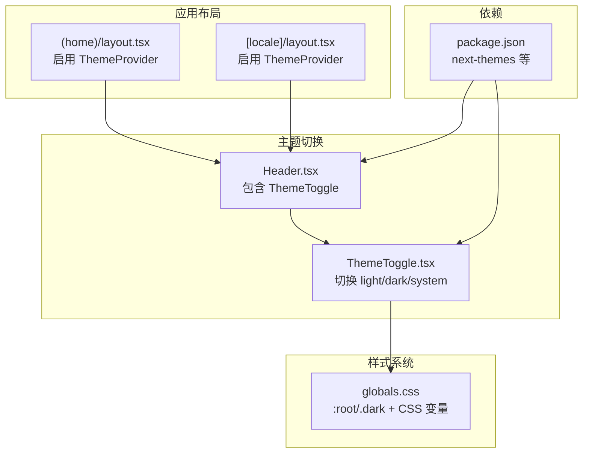
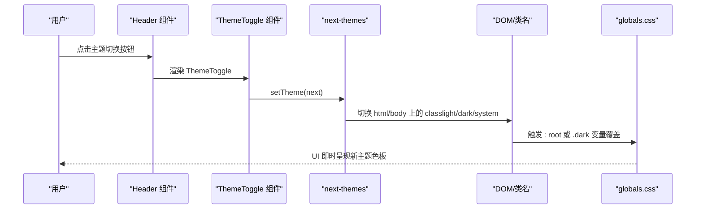
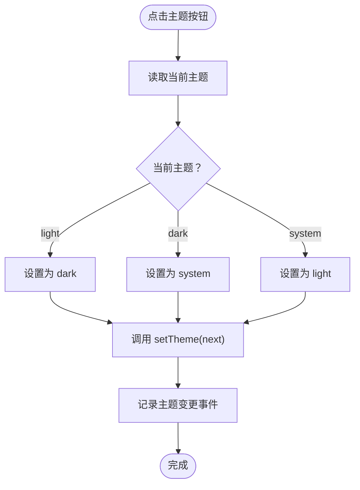
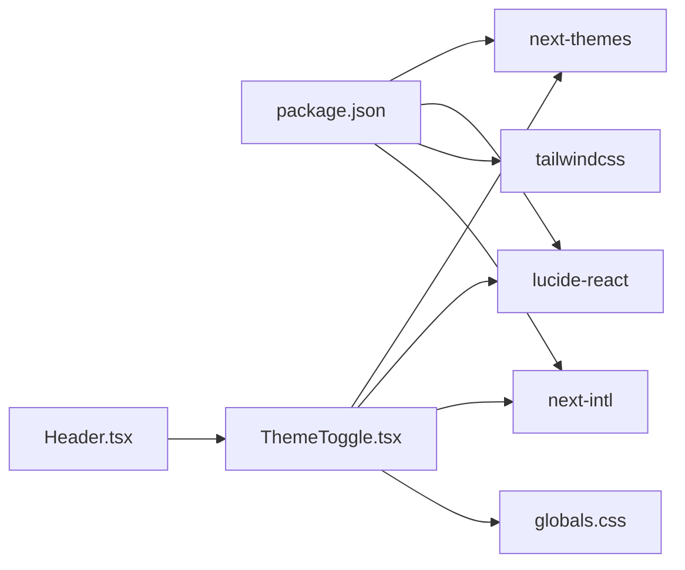

# 暗色模式

<cite>
**本文引用的文件**
- [ThemeToggle.tsx](file://src/components/shared/ThemeToggle.tsx)
- [globals.css](file://src/app/globals.css)
- [layout.tsx（首页）](file://src/app/(home)/layout.tsx)
- [layout.tsx（多语言）](file://src/app/[locale]/layout.tsx)
- [Header.tsx](file://src/components/layout/Header.tsx)
- [common.json（英文）](file://messages/en/common.json)
- [package.json](file://package.json)
- [logic.ts（颜色转换）](file://src/tools/developer/color-converter/logic.ts)
</cite>

## 目录
1. [简介](#简介)
2. [项目结构](#项目结构)
3. [核心组件](#核心组件)
4. [架构总览](#架构总览)
5. [详细组件分析](#详细组件分析)
6. [依赖关系分析](#依赖关系分析)
7. [性能考量](#性能考量)
8. [故障排查指南](#故障排查指南)
9. [结论](#结论)
10. [附录](#附录)

## 简介
本文件围绕 PrivaDeck 的暗色模式特性进行系统化说明，涵盖自动检测机制、手动切换实现、视觉设计原则、性能优化策略、主题定制与品牌适配建议，以及暗色模式下的用户体验与无障碍设计要点。PrivaDeck 使用 next-themes 提供的主题系统，结合 Tailwind/Vanilla CSS 变量实现轻量、可扩展的主题切换，并通过 CSS 动画与渐变提升交互体验。

## 项目结构
与暗色模式相关的关键文件分布如下：
- 主题提供与自动检测：根布局中启用 ThemeProvider，默认“system”，并允许跟随系统设置
- 主题切换入口：Header 中的 ThemeToggle 按钮
- 样式与变量：全局 CSS 定义 CSS 变量与 .dark 选择器
- 国际化文案：用于按钮可访问性标签与提示文本
- 依赖：next-themes、lucide-react、Tailwind CSS

图表来源
- [layout.tsx（首页）](file://src/app/(home)/layout.tsx#L40-L47)
- [layout.tsx（多语言）:54-61](file://src/app/[locale]/layout.tsx#L54-L61)
- [Header.tsx:107-108](file://src/components/layout/Header.tsx#L107-L108)
- [ThemeToggle.tsx:9-35](file://src/components/shared/ThemeToggle.tsx#L9-L35)
- [globals.css:21-57](file://src/app/globals.css#L21-L57)
- [package.json](file://package.json#L24)

章节来源
- [layout.tsx（首页）](file://src/app/(home)/layout.tsx#L38-L61)
- [layout.tsx（多语言）:52-76](file://src/app/[locale]/layout.tsx#L52-L76)
- [Header.tsx:54-115](file://src/components/layout/Header.tsx#L54-L115)
- [ThemeToggle.tsx:9-35](file://src/components/shared/ThemeToggle.tsx#L9-L35)
- [globals.css:1-128](file://src/app/globals.css#L1-L128)
- [package.json:11-32](file://package.json#L11-L32)

## 核心组件
- 主题提供者（ThemeProvider）
  - 在根布局中启用，属性为 class，初始默认值为 system，允许跟随系统设置
- 主题切换按钮（ThemeToggle）
  - 基于 next-themes 的 useTheme 钩子读取当前主题并设置下一主题
  - 切换顺序：light → dark → system → light（循环）
  - 图标随当前主题变化（太阳/月亮/监视器），并提供可访问性标签
- 全局样式（globals.css）
  - 定义 CSS 变量（背景、前景、主色、卡片、边框等）
  - 通过 :root 和 .dark 两套变量实现明暗主题
  - 提供动画与渐变变量，增强过渡与视觉层次

章节来源
- [layout.tsx（首页）](file://src/app/(home)/layout.tsx#L40-L47)
- [layout.tsx（多语言）:54-61](file://src/app/[locale]/layout.tsx#L54-L61)
- [ThemeToggle.tsx:9-35](file://src/components/shared/ThemeToggle.tsx#L9-L35)
- [globals.css:21-57](file://src/app/globals.css#L21-L57)

## 架构总览
下图展示从用户点击到主题生效的端到端流程，包括自动检测与手动切换路径。

图表来源
- [Header.tsx:107-108](file://src/components/layout/Header.tsx#L107-L108)
- [ThemeToggle.tsx:25-34](file://src/components/shared/ThemeToggle.tsx#L25-L34)
- [layout.tsx（首页）](file://src/app/(home)/layout.tsx#L40)
- [layout.tsx（多语言）](file://src/app/[locale]/layout.tsx#L54)
- [globals.css:3-57](file://src/app/globals.css#L3-L57)

## 详细组件分析

### 自动检测机制（系统主题跟随）
- 默认策略
  - ThemeProvider 的 defaultTheme 设为 system，表示优先使用系统深色偏好
  - 当用户系统处于深色模式时，页面将默认采用暗色主题
- 实现位置
  - 根布局中 ThemeProvider 的 attribute 为 class，配合 CSS 变量与 .dark 选择器工作
- 用户体验
  - 初次加载即反映系统偏好，无需额外操作
  - 若用户手动切换，将覆盖系统偏好；再次切换可回到 system

章节来源
- [layout.tsx（首页）](file://src/app/(home)/layout.tsx#L40)
- [layout.tsx（多语言）](file://src/app/[locale]/layout.tsx#L54)
- [globals.css:3-57](file://src/app/globals.css#L3-L57)

### 手动切换功能与交互设计
- 切换逻辑
  - 循环顺序：light → dark → system → light
  - 图标动态变化：太阳（light）、月亮（dark）、监视器（system）
  - 可访问性：按钮带有 aria-label，文案来自国际化资源，包含目标主题名称
- 数据追踪
  - 点击时记录事件（主题变更），便于后续分析用户偏好
- 交互细节
  - 首屏防闪烁：客户端挂载后才渲染按钮，避免 SSR 与 CSR 不一致导致的闪烁
  - 轻量过渡：基于 CSS 变量与 Tailwind 类，无复杂动画开销

图表来源
- [ThemeToggle.tsx:21-29](file://src/components/shared/ThemeToggle.tsx#L21-L29)
- [common.json（英文）](file://messages/en/common.json#L41)

章节来源
- [ThemeToggle.tsx:9-35](file://src/components/shared/ThemeToggle.tsx#L9-L35)
- [common.json（英文）](file://messages/en/common.json#L41)

### 视觉设计原则与色彩体系
- 色彩变量
  - 全局定义背景、前景、主色、卡片、边框、强调色等变量
  - light 与 dark 各自维护一套变量，确保对比度与可读性
- 对比度与可读性
  - 暗色模式下前景与背景对比度更高，保证文字清晰
  - 卡片与容器使用不同层级的阴影与背景，形成信息层级
- 渐变与高光
  - 主色支持线性渐变与脉冲高光动画，提升品牌感与交互反馈
- 字体与排版
  - 通过 CSS 变量统一字体族，确保跨主题一致性

章节来源
- [globals.css:5-57](file://src/app/globals.css#L5-L57)

### 动画与过渡效果
- 关键帧与类
  - 提供淡入、缩放淡入、指示器动画与脉冲高光等关键帧
  - 通过 CSS 类复用，减少重复定义
- 减少运动偏好
  - 遵循 prefers-reduced-motion：当用户偏好减少动画时，禁用部分动画类

章节来源
- [globals.css:65-127](file://src/app/globals.css#L65-L127)

### 主题切换的性能优化策略
- CSS 变量驱动
  - 通过 :root 与 .dark 切换变量，避免重排与重绘成本
- 最小化 JS 干预
  - next-themes 负责类名切换，样式层仅依赖 CSS 变量
- 首屏安全
  - ThemeToggle 在客户端挂载后再渲染，避免 SSR 与 CSR 差异导致的闪烁
- 动画降级
  - 在减少动画偏好下自动降级，兼顾性能与体验

章节来源
- [ThemeToggle.tsx:12-19](file://src/components/shared/ThemeToggle.tsx#L12-L19)
- [globals.css:122-127](file://src/app/globals.css#L122-L127)

### 主题定制指南与品牌适配建议
- 品牌主色适配
  - 修改 --primary 与 --primary-foreground 变量即可调整品牌主色与反色
  - 暗色模式下的主色与高光变量需保持视觉一致性
- 卡片与边框
  - 调整 --card 与 --border 变量，确保在不同背景下仍有足够对比度
- 渐变与高光
  - 通过 --gradient-primary 与 --glow-primary 变量统一品牌视觉元素
- 可访问性校验
  - 使用颜色对比度工具验证 WCAG 对比度要求
  - 可参考颜色转换工具（RGB/HSL/HEX）辅助设计与校验

章节来源
- [globals.css:21-57](file://src/app/globals.css#L21-L57)
- [logic.ts（颜色转换）:1-113](file://src/tools/developer/color-converter/logic.ts#L1-L113)

### 无障碍设计与用户体验优化
- 可访问性标签
  - 按钮 aria-label 包含目标主题名称，帮助屏幕阅读器用户理解状态
- 键盘与快捷键
  - 页面提供全局 Ctrl+K 快捷键打开搜索，提升整体可用性
- 减少动画偏好
  - 自动检测并降级动画，尊重用户偏好
- 语言与文案
  - 国际化资源提供“切换到 {theme} 主题”等文案，确保多语言场景下的一致体验

章节来源
- [ThemeToggle.tsx:29-31](file://src/components/shared/ThemeToggle.tsx#L29-L31)
- [Header.tsx:24-33](file://src/components/layout/Header.tsx#L24-L33)
- [common.json（英文）](file://messages/en/common.json#L41)

## 依赖关系分析
- next-themes
  - 提供主题状态管理与类名切换能力
- lucide-react
  - 提供太阳、月亮、监视器图标，直观表达主题状态
- Tailwind CSS
  - 与 CSS 变量协同，提供便捷的样式组合与响应式能力
- next-intl
  - 提供国际化文案，支撑可访问性标签与提示文本

图表来源
- [package.json](file://package.json#L24)
- [Header.tsx](file://src/components/layout/Header.tsx#L7)
- [ThemeToggle.tsx:3-4](file://src/components/shared/ThemeToggle.tsx#L3-L4)

章节来源
- [package.json:11-32](file://package.json#L11-L32)
- [Header.tsx:1-14](file://src/components/layout/Header.tsx#L1-L14)
- [ThemeToggle.tsx:1-8](file://src/components/shared/ThemeToggle.tsx#L1-L8)

## 性能考量
- 变量驱动的样式切换
  - 通过 CSS 变量而非 JS 动态样式，降低重绘与回流
- 动画降级
  - 在减少动画偏好下禁用部分动画，减少不必要的计算
- 首屏渲染
  - 客户端挂载后渲染按钮，避免 SSR 与 CSR 不一致导致的闪烁
- 体积与依赖
  - 仅引入必要依赖，避免冗余包体

章节来源
- [globals.css:122-127](file://src/app/globals.css#L122-L127)
- [ThemeToggle.tsx:12-19](file://src/components/shared/ThemeToggle.tsx#L12-L19)

## 故障排查指南
- 切换无效或不生效
  - 检查根布局是否正确启用 ThemeProvider，且 attribute 为 class
  - 确认浏览器未禁用 CSS 变量或第三方样式冲突
- SSR 与 CSR 不一致
  - 确保 ThemeToggle 在客户端挂载后再渲染，避免首屏闪烁
- 动画异常
  - 检查是否启用了减少动画偏好，或存在自定义 CSS 覆盖
- 可访问性问题
  - 确认 aria-label 文案正确，主题切换后标签应更新为目标主题

章节来源
- [layout.tsx（首页）](file://src/app/(home)/layout.tsx#L40)
- [layout.tsx（多语言）](file://src/app/[locale]/layout.tsx#L54)
- [ThemeToggle.tsx:12-19](file://src/components/shared/ThemeToggle.tsx#L12-L19)

## 结论
PrivaDeck 的暗色模式通过 next-themes 与 CSS 变量实现了简洁高效的切换机制：自动跟随系统偏好，同时提供手动切换与可访问性支持。样式层采用变量与动画的组合，在保证视觉体验的同时兼顾性能与可维护性。建议在品牌适配时关注对比度与动画偏好，确保在不同设备与用户需求下均能提供一致、舒适的使用体验。

## 附录
- 相关实现文件路径
  - 主题提供与自动检测：[layout.tsx（首页）](file://src/app/(home)/layout.tsx#L40-L47)、[layout.tsx（多语言）:54-61](file://src/app/[locale]/layout.tsx#L54-L61)
  - 主题切换按钮：[ThemeToggle.tsx:9-35](file://src/components/shared/ThemeToggle.tsx#L9-L35)
  - 全局样式与变量：[globals.css:1-128](file://src/app/globals.css#L1-L128)
  - 国际化文案：[common.json（英文）](file://messages/en/common.json#L41)
  - 依赖声明：[package.json](file://package.json#L24)
  - 颜色转换工具（辅助设计）：[logic.ts（颜色转换）:1-113](file://src/tools/developer/color-converter/logic.ts#L1-L113)