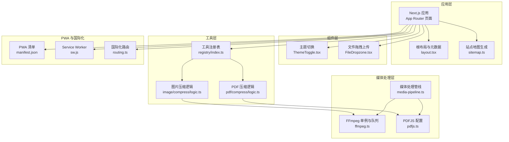
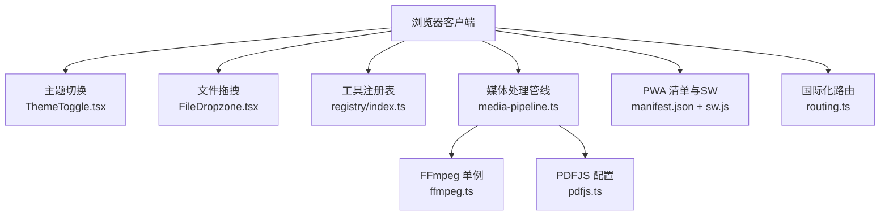
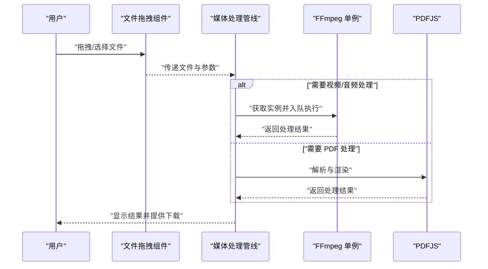
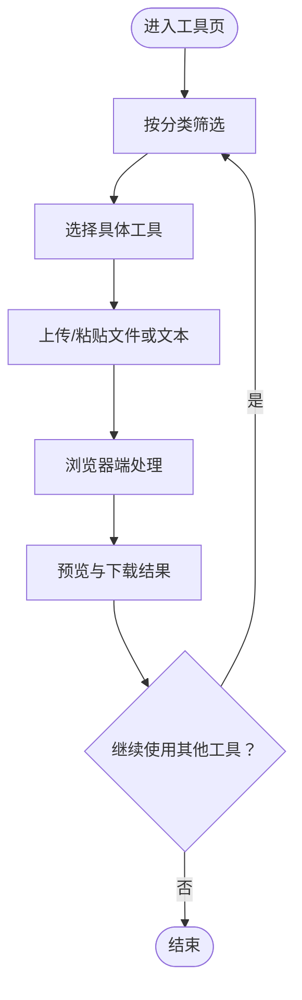
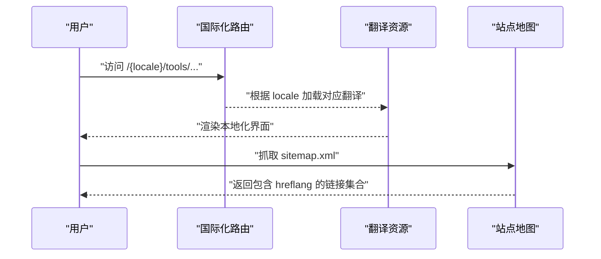
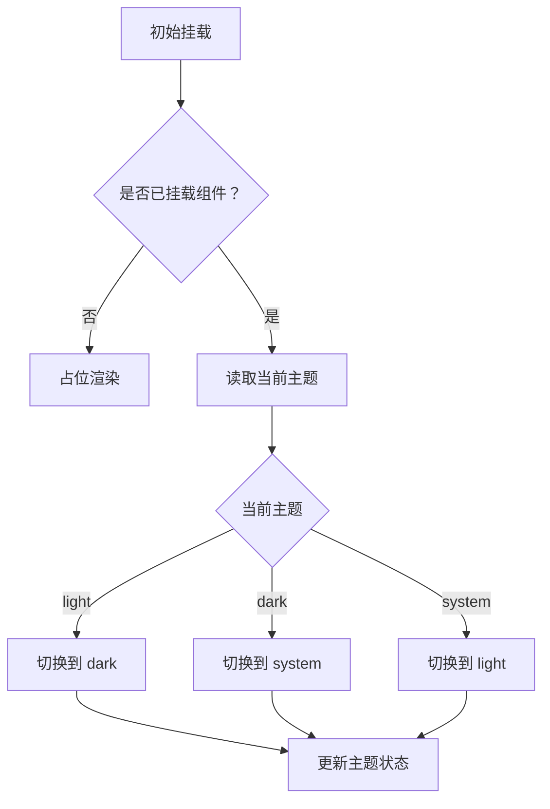
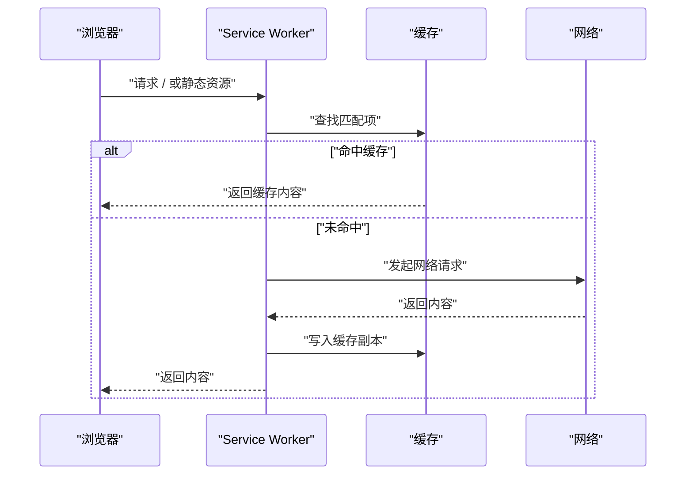
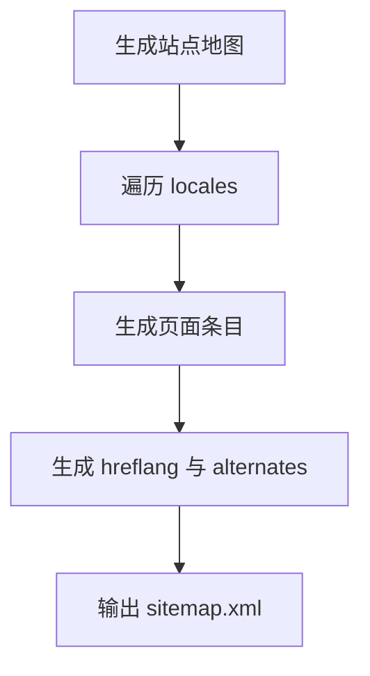
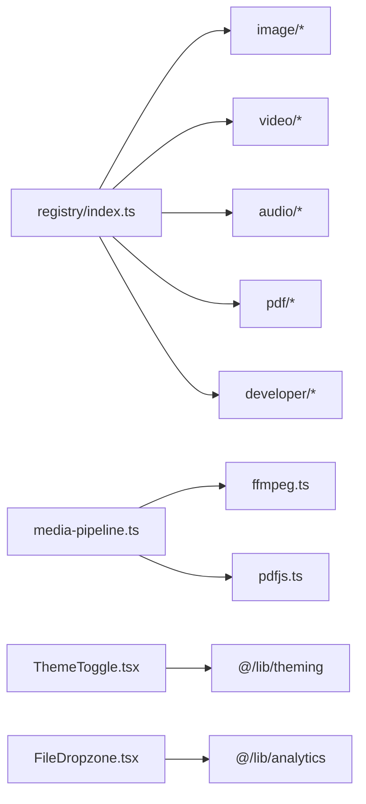

# 核心特性

<cite>
**本文引用的文件**
- [README.md](file://README.md)
- [package.json](file://package.json)
- [src/app/layout.tsx](file://src/app/layout.tsx)
- [public/manifest.json](file://public/manifest.json)
- [public/sw.js](file://public/sw.js)
- [src/components/shared/ThemeToggle.tsx](file://src/components/shared/ThemeToggle.tsx)
- [src/i18n/routing.ts](file://src/i18n/routing.ts)
- [src/lib/registry/index.ts](file://src/lib/registry/index.ts)
- [src/lib/ffmpeg.ts](file://src/lib/ffmpeg.ts)
- [src/app/sitemap.ts](file://src/app/sitemap.ts)
- [src/tools/image/compress/logic.ts](file://src/tools/image/compress/logic.ts)
- [src/tools/pdf/compress/logic.ts](file://src/tools/pdf/compress/logic.ts)
- [src/lib/media-pipeline.ts](file://src/lib/media-pipeline.ts)
- [src/components/shared/FileDropzone.tsx](file://src/components/shared/FileDropzone.tsx)
- [src/lib/pdfjs.ts](file://src/lib/pdfjs.ts)
</cite>

## 目录
1. [简介](#简介)
2. [项目结构](#项目结构)
3. [核心组件](#核心组件)
4. [架构总览](#架构总览)
5. [详细组件分析](#详细组件分析)
6. [依赖关系分析](#依赖关系分析)
7. [性能考量](#性能考量)
8. [故障排除指南](#故障排除指南)
9. [结论](#结论)
10. [附录](#附录)

## 简介
本文件聚焦 PrivaDeck 媒体工具箱的六大核心特性：隐私优先（零上传、零服务器）、60个工具覆盖五大分类、21种语言支持、暗色模式、离线可用性、SEO友好性。我们将从技术实现原理、用户体验优势与实际应用场景三个维度展开，并结合仓库中的真实源码路径进行说明。

## 项目结构
PrivaDeck 基于 Next.js App Router 与静态生成（SSG）构建，采用多语言与 PWA 能力，配合浏览器端媒体处理库实现“零上传、零服务器”的隐私优先方案。关键目录与职责概览如下：
- src/app：页面与元数据配置，包含根布局、sitemap 生成与国际化路由
- src/components/shared：通用 UI 组件，如主题切换、文件拖拽、下载按钮等
- src/tools：五大分类下的60个工具模块，每个工具包含定义、客户端组件与纯逻辑处理
- src/lib：工具注册表、FFmpeg 单例、媒体处理管线、PDFJS 配置等
- public：PWA 清单与 Service Worker，负责离线缓存策略
- messages：21 种语言的翻译资源

图表来源
- [src/app/layout.tsx:1-48](file://src/app/layout.tsx#L1-L48)
- [src/app/sitemap.ts:1-97](file://src/app/sitemap.ts#L1-L97)
- [src/components/shared/ThemeToggle.tsx:1-36](file://src/components/shared/ThemeToggle.tsx#L1-L36)
- [src/components/shared/FileDropzone.tsx:1-144](file://src/components/shared/FileDropzone.tsx#L1-L144)
- [src/lib/registry/index.ts:1-164](file://src/lib/registry/index.ts#L1-L164)
- [src/lib/ffmpeg.ts:1-144](file://src/lib/ffmpeg.ts#L1-L144)
- [src/lib/media-pipeline.ts:1-105](file://src/lib/media-pipeline.ts#L1-L105)
- [src/lib/pdfjs.ts:1-16](file://src/lib/pdfjs.ts#L1-L16)
- [public/manifest.json:1-29](file://public/manifest.json#L1-L29)
- [public/sw.js:1-93](file://public/sw.js#L1-L93)
- [src/i18n/routing.ts:1-18](file://src/i18n/routing.ts#L1-L18)

章节来源
- [README.md:55-78](file://README.md#L55-L78)

## 核心组件
- 工具注册表：集中管理五大分类下的60个工具元数据与分组查询接口，支撑工具页导航与动态路由生成
- 媒体处理管线：基于 WebCodecs 的硬件加速优先路径，兼容性不足时回退至 FFmpeg.wasm
- FFmpeg 单例与队列：懒加载、单实例、串行队列执行，避免并发冲突与内存拷贝
- PDFJS 配置：按需设置 worker 源，保障 PDF 解析在浏览器内完成
- 主题切换：基于 next-themes 实现 light/dark/system 三态循环切换与无障碍标签
- 文件拖拽：直观的本地上传交互，强调“文件不离开设备”的隐私承诺
- PWA 清单与 Service Worker：声明式安装与离线缓存策略，支持静态资源与 FFmpeg 资源持久缓存
- 国际化路由：21 种语言的 locales 列表与默认语言配置，结合翻译资源实现全球化访问

章节来源
- [src/lib/registry/index.ts:135-164](file://src/lib/registry/index.ts#L135-L164)
- [src/lib/media-pipeline.ts:7-105](file://src/lib/media-pipeline.ts#L7-L105)
- [src/lib/ffmpeg.ts:10-144](file://src/lib/ffmpeg.ts#L10-L144)
- [src/lib/pdfjs.ts:3-13](file://src/lib/pdfjs.ts#L3-L13)
- [src/components/shared/ThemeToggle.tsx:9-35](file://src/components/shared/ThemeToggle.tsx#L9-L35)
- [src/components/shared/FileDropzone.tsx:42-144](file://src/components/shared/FileDropzone.tsx#L42-L144)
- [public/manifest.json:1-29](file://public/manifest.json#L1-L29)
- [public/sw.js:1-93](file://public/sw.js#L1-L93)
- [src/i18n/routing.ts:3-17](file://src/i18n/routing.ts#L3-L17)

## 架构总览
下图展示 PrivaDeck 的核心运行时架构：浏览器端处理链路、PWA 缓存与国际化路由协同工作，确保隐私、性能与可访问性。

图表来源
- [src/components/shared/ThemeToggle.tsx:9-35](file://src/components/shared/ThemeToggle.tsx#L9-L35)
- [src/components/shared/FileDropzone.tsx:42-144](file://src/components/shared/FileDropzone.tsx#L42-L144)
- [src/lib/registry/index.ts:135-164](file://src/lib/registry/index.ts#L135-L164)
- [src/lib/media-pipeline.ts:7-105](file://src/lib/media-pipeline.ts#L7-L105)
- [src/lib/ffmpeg.ts:10-144](file://src/lib/ffmpeg.ts#L10-L144)
- [src/lib/pdfjs.ts:3-13](file://src/lib/pdfjs.ts#L3-L13)
- [public/manifest.json:1-29](file://public/manifest.json#L1-L29)
- [public/sw.js:1-93](file://public/sw.js#L1-L93)
- [src/i18n/routing.ts:3-17](file://src/i18n/routing.ts#L3-L17)

## 详细组件分析

### 隐私优先：零上传、零服务器
- 技术实现原理
  - 浏览器端处理：图片压缩、PDF 处理、视频/音频处理均在浏览器内完成，不涉及任何服务器请求
  - FFmpeg.wasm：通过懒加载与单例模式初始化，使用 WORKERFS 直接挂载输入文件，避免内存复制；操作通过串行队列执行，保证稳定性
  - PDFJS：按需设置 worker 源，PDF 解析与渲染完全在浏览器内完成
  - 文件拖拽：组件明确提示“文件不离开设备”，增强用户信任
- 用户体验优势
  - 无需注册、无需登录，即开即用
  - 显著降低隐私风险，适合处理敏感内容
- 实际应用场景
  - 压缩图片以节省存储空间
  - 将 PDF 转换为图片或提取文本
  - 对视频进行剪辑、压缩、格式转换等
- 最佳实践
  - 使用 FileDropzone 进行安全上传
  - 优先选择硬件加速路径（若可用），以获得更快响应
  - 处理完成后及时清理浏览器缓存与下载结果

图表来源
- [src/components/shared/FileDropzone.tsx:55-76](file://src/components/shared/FileDropzone.tsx#L55-L76)
- [src/lib/media-pipeline.ts:59-91](file://src/lib/media-pipeline.ts#L59-L91)
- [src/lib/ffmpeg.ts:105-143](file://src/lib/ffmpeg.ts#L105-L143)
- [src/lib/pdfjs.ts:3-13](file://src/lib/pdfjs.ts#L3-L13)

章节来源
- [src/lib/ffmpeg.ts:10-144](file://src/lib/ffmpeg.ts#L10-L144)
- [src/tools/image/compress/logic.ts:83-123](file://src/tools/image/compress/logic.ts#L83-L123)
- [src/tools/pdf/compress/logic.ts:12-66](file://src/tools/pdf/compress/logic.ts#L12-L66)
- [src/components/shared/FileDropzone.tsx:137-140](file://src/components/shared/FileDropzone.tsx#L137-L140)

### 60个工具覆盖五大分类
- 工具数量与分布
  - 图片：17 个（格式转换、压缩、裁剪、去 EXIF、拼图、加水印等）
  - 开发者：17 个（JSON 格式化、Base64、正则测试、OCR、哈希生成等）
  - PDF：14 个（合并、拆分、压缩、转图片、提取文本、电子签名等）
  - 视频：8 个（剪辑、压缩、转 GIF、格式转换、静音等）
  - 音频：4 个（剪辑、格式转换、提取音频、音量调整）
- 技术实现要点
  - 工具注册表统一导出与查询，便于导航与动态路由生成
  - 每个工具包含定义、客户端组件与纯逻辑处理，便于扩展与维护
- 用户体验优势
  - 一站式解决媒体与文档处理需求
  - 通过“精选”与“非精选”分组，帮助用户快速定位常用工具
- 实际应用场景
  - 日常办公：PDF 合并与压缩、图片批量处理
  - 内容创作：视频格式转换、音频提取与音量调整
  - 开发辅助：JSON/XML/YAML 转换、正则测试、时间戳生成

图表来源
- [src/lib/registry/index.ts:135-164](file://src/lib/registry/index.ts#L135-L164)

章节来源
- [README.md:16-24](file://README.md#L16-L24)
- [src/lib/registry/index.ts:66-133](file://src/lib/registry/index.ts#L66-L133)

### 21种语言支持
- 技术实现原理
  - 国际化路由：定义 locales 列表与默认语言，支持直排（RTL）语言标识
  - 翻译资源：messages 下按语言组织 common.json 与各分类工具翻译
  - 动态路由：页面路径包含 locale 前缀，sitemap 自动生成 hreflang
- 用户体验优势
  - 全球用户可按母语访问，降低语言门槛
  - 自动语言识别与手动切换结合，兼顾便捷性
- 实际应用场景
  - 不同地区用户访问相同工具，界面与文案自动适配
  - SEO 优化：多语言 hreflang 提升搜索引擎索引质量

图表来源
- [src/i18n/routing.ts:3-17](file://src/i18n/routing.ts#L3-L17)
- [src/app/sitemap.ts:23-96](file://src/app/sitemap.ts#L23-L96)

章节来源
- [src/i18n/routing.ts:3-17](file://src/i18n/routing.ts#L3-L17)
- [src/app/sitemap.ts:10-21](file://src/app/sitemap.ts#L10-L21)

### 暗色模式
- 技术实现原理
  - 基于 next-themes 的主题状态管理，支持 light、dark、system 三态循环切换
  - 主题切换按钮具备无障碍标签与点击事件追踪
- 用户体验优势
  - 减少夜间使用眩光，提升长时间使用的舒适度
  - 自动跟随系统偏好，亦可手动固定
- 实际应用场景
  - 夜间编辑图片或视频时减少眼部疲劳
  - 低光照环境下进行 PDF 阅读与标注

图表来源
- [src/components/shared/ThemeToggle.tsx:9-35](file://src/components/shared/ThemeToggle.tsx#L9-L35)

章节来源
- [src/components/shared/ThemeToggle.tsx:9-35](file://src/components/shared/ThemeToggle.tsx#L9-L35)

### 离线可用性
- 技术实现原理
  - PWA 清单：声明名称、图标、启动路径与显示模式
  - Service Worker：对 FFmpeg wasm 资源进行永久缓存，HTML 采用网络优先策略，静态资源采用缓存优先策略
  - 缓存策略：区分 HTML、静态资源与 FFmpeg 资源，确保首次加载与后续离线访问的稳定性
- 用户体验优势
  - 安装后可在无网络环境下继续使用核心工具
  - 首次加载后，后续访问速度显著提升
- 实际应用场景
  - 飞机上或偏远地区使用工具
  - 网络不稳定环境下的重复访问

图表来源
- [public/sw.js:30-92](file://public/sw.js#L30-L92)

章节来源
- [public/manifest.json:1-29](file://public/manifest.json#L1-L29)
- [public/sw.js:1-93](file://public/sw.js#L1-L93)

### SEO 友好性
- 技术实现原理
  - 静态生成：sitemap 动态生成所有语言与路径，包含 hreflang 与 alternates
  - 结构化数据：根布局配置 Open Graph 与 Twitter Card 元数据
  - 多语言覆盖：为每个 locale 生成独立页面与链接集合
- 用户体验优势
  - 更高的搜索引擎可见性与索引质量
  - 社交分享时呈现统一的品牌形象
- 实际应用场景
  - 面向不同国家/地区的自然搜索流量增长
  - 社交媒体分享时提升点击率与转化率

图表来源
- [src/app/sitemap.ts:23-96](file://src/app/sitemap.ts#L23-L96)

章节来源
- [src/app/layout.tsx:10-39](file://src/app/layout.tsx#L10-L39)
- [src/app/sitemap.ts:23-96](file://src/app/sitemap.ts#L23-L96)

## 依赖关系分析
- 组件耦合
  - 工具注册表与各工具模块松耦合，仅通过定义导出，便于扩展
  - 媒体处理管线与 FFmpeg/PDFJS 解耦，通过统一接口调用
- 外部依赖
  - FFmpeg.wasm、pdf-lib、pdfjs-dist、browser-image-compression 等均为浏览器端库
  - next-themes 提供主题管理，next-intl 提供国际化能力
- 潜在循环依赖
  - 当前结构清晰，未发现循环依赖迹象

图表来源
- [src/lib/registry/index.ts:1-164](file://src/lib/registry/index.ts#L1-L164)
- [src/lib/media-pipeline.ts:1-105](file://src/lib/media-pipeline.ts#L1-L105)
- [src/lib/ffmpeg.ts:1-144](file://src/lib/ffmpeg.ts#L1-L144)
- [src/lib/pdfjs.ts:1-16](file://src/lib/pdfjs.ts#L1-L16)
- [src/components/shared/ThemeToggle.tsx:3-7](file://src/components/shared/ThemeToggle.tsx#L3-L7)
- [src/components/shared/FileDropzone.tsx:7](file://src/components/shared/FileDropzone.tsx#L7)

章节来源
- [package.json:11-32](file://package.json#L11-L32)

## 性能考量
- 媒体处理性能
  - WebCodecs 优先：在支持的浏览器中启用硬件加速，显著降低 CPU 占用与处理时间
  - FFmpeg 回退：当 WebCodecs 不可用或遇到不受支持的编解码器时，自动回退至 FFmpeg.wasm
  - 串行队列：通过 Promise 队列串行执行 FFmpeg 操作，避免并发冲突与内存峰值
- 资源加载性能
  - PWA 缓存：静态资源与 FFmpeg 资源持久缓存，减少重复下载
  - 站点地图：静态生成，避免运行时计算开销
- 最佳实践
  - 优先使用硬件加速路径（若可用）
  - 控制输入文件尺寸与分辨率，以缩短处理时间
  - 合理选择压缩质量与目标格式，平衡体积与画质

章节来源
- [src/lib/media-pipeline.ts:7-105](file://src/lib/media-pipeline.ts#L7-L105)
- [src/lib/ffmpeg.ts:75-82](file://src/lib/ffmpeg.ts#L75-L82)
- [public/sw.js:30-92](file://public/sw.js#L30-L92)

## 故障排除指南
- FFmpeg 初始化失败
  - 现象：处理流程中断或报错
  - 排查：确认网络可达与缓存命中；检查控制台错误信息
  - 处理：刷新页面重试，或切换到受支持的浏览器
- WebCodecs 不可用或编解码器不受支持
  - 现象：无法使用硬件加速，或出现无声/黑屏等异常
  - 排查：确认浏览器版本与平台支持情况
  - 处理：等待自动回退至 FFmpeg；必要时安装相关扩展（如 HEVC 扩展）
- PDF 处理异常
  - 现象：PDF 解析失败或空白页
  - 排查：检查 PDF 文件完整性与版本兼容性
  - 处理：尝试更换 PDF 版本或使用其他工具
- PWA 缓存问题
  - 现象：离线不可用或页面加载缓慢
  - 排查：检查 Service Worker 是否激活与缓存是否过期
  - 处理：清除缓存或重新安装 PWA

章节来源
- [src/lib/ffmpeg.ts:20-28](file://src/lib/ffmpeg.ts#L20-L28)
- [src/lib/media-pipeline.ts:32-53](file://src/lib/media-pipeline.ts#L32-L53)
- [src/lib/pdfjs.ts:3-13](file://src/lib/pdfjs.ts#L3-L13)
- [public/sw.js:11-28](file://public/sw.js#L11-L28)

## 结论
PrivaDeck 通过浏览器端媒体处理、完善的 PWA 能力与多语言支持，实现了“隐私优先、离线可用、SEO 友好”的综合体验。六大核心特性相互协同：隐私优先确保用户数据安全，60个工具覆盖常见场景，21种语言提升全球可达性，暗色模式改善视觉体验，离线可用性增强稳定性，SEO 友好性扩大可见性。结合本文的技术实现与最佳实践，用户可在不牺牲隐私的前提下高效完成各类媒体与文档处理任务。

## 附录
- 快速开始与构建
  - 安装依赖、启动开发服务器、构建静态站点与代码检查的命令行步骤
- 项目结构与扩展
  - 新增工具的规范：定义、组件与逻辑分离，注册表导入与翻译资源完善

章节来源
- [README.md:35-53](file://README.md#L35-L53)