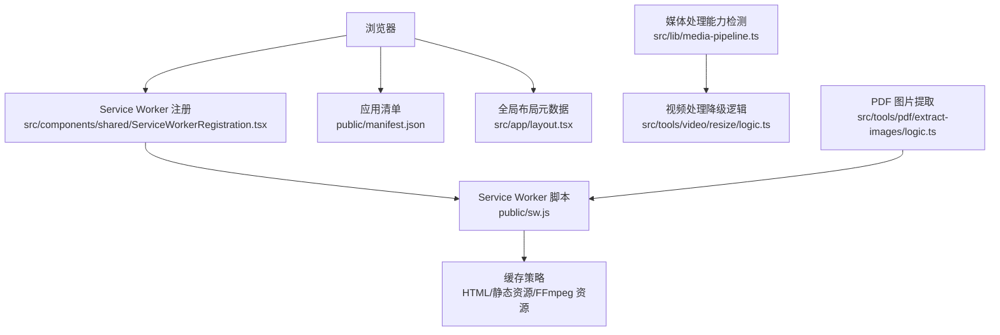
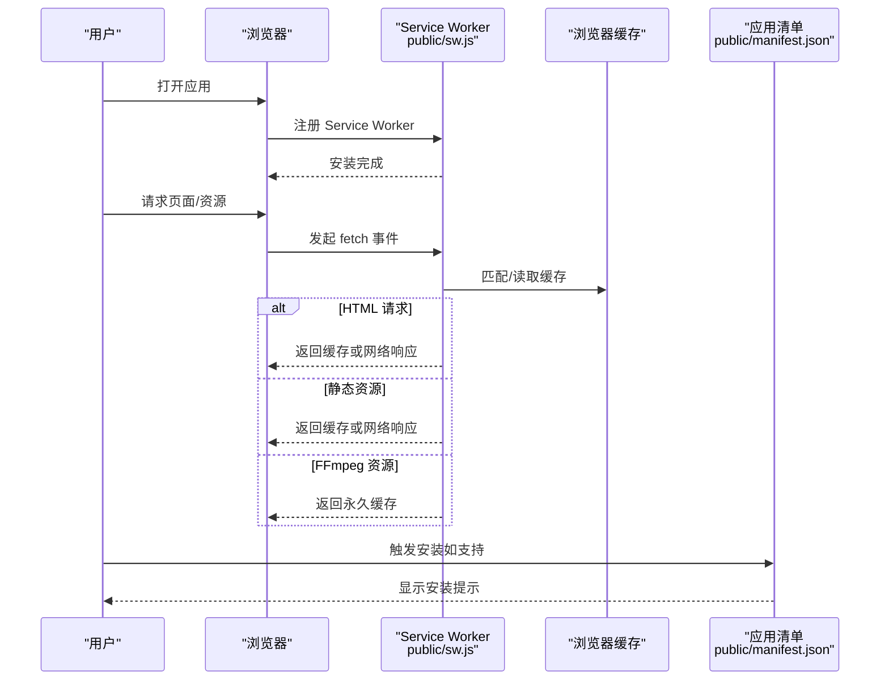
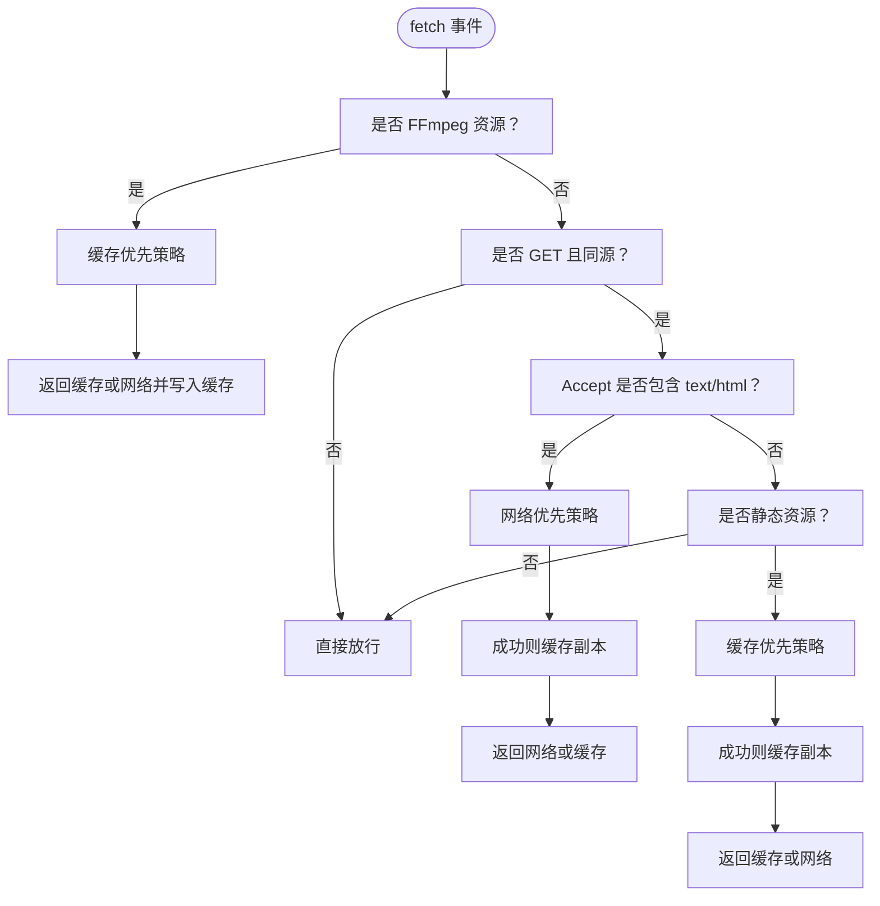
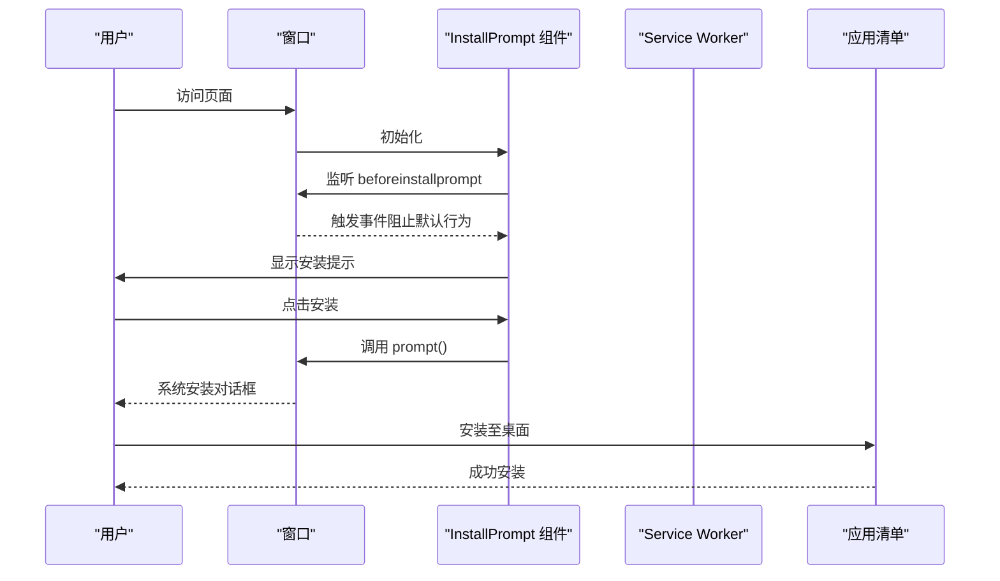
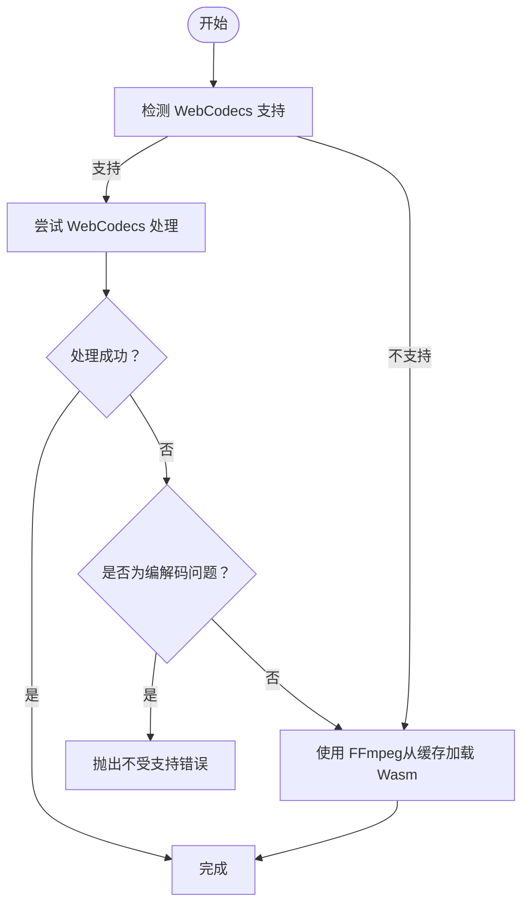
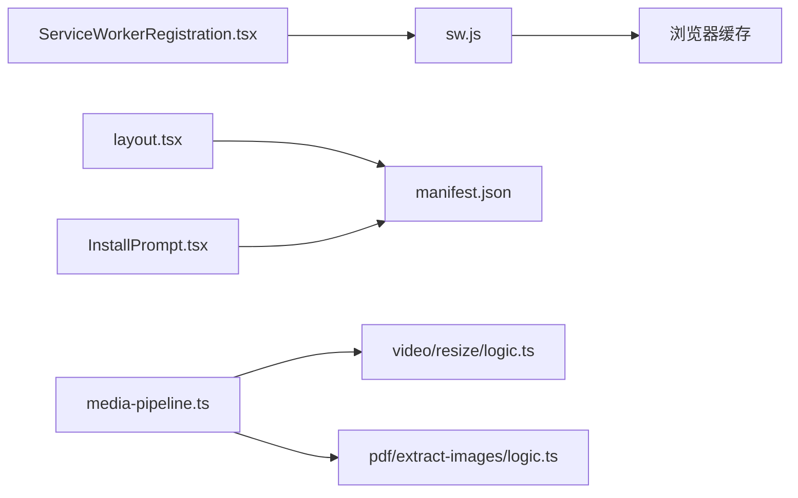

# 离线可用性

<cite>
**本文引用的文件**
- [public/sw.js](file://public/sw.js)
- [public/manifest.json](file://public/manifest.json)
- [src/components/shared/ServiceWorkerRegistration.tsx](file://src/components/shared/ServiceWorkerRegistration.tsx)
- [src/components/shared/InstallPrompt.tsx](file://src/components/shared/InstallPrompt.tsx)
- [src/app/layout.tsx](file://src/app/layout.tsx)
- [next.config.ts](file://next.config.ts)
- [src/lib/media-pipeline.ts](file://src/lib/media-pipeline.ts)
- [src/tools/video/resize/logic.ts](file://src/tools/video/resize/logic.ts)
- [src/tools/pdf/extract-images/logic.ts](file://src/tools/pdf/extract-images/logic.ts)
</cite>

## 目录
1. [简介](#简介)
2. [项目结构](#项目结构)
3. [核心组件](#核心组件)
4. [架构总览](#架构总览)
5. [详细组件分析](#详细组件分析)
6. [依赖关系分析](#依赖关系分析)
7. [性能考量](#性能考量)
8. [故障排查指南](#故障排查指南)
9. [结论](#结论)
10. [附录](#附录)

## 简介
本章节概述 PrivaDeck 的 PWA 离线可用性设计目标与整体思路：通过 Service Worker 实现静态资源与媒体处理依赖的离线缓存；借助 Web App Manifest 提升安装体验；结合 WebCodecs/FFmpeg 双轨路径在无网络环境下尽可能提供本地化处理能力；并通过安装提示与降级策略保障用户在弱网或离线场景下的基本使用体验。

## 项目结构
围绕 PWA 离线能力的关键目录与文件如下：
- Service Worker 与缓存策略：public/sw.js
- 应用清单与安装元数据：public/manifest.json
- 客户端注册与安装提示：src/components/shared/ServiceWorkerRegistration.tsx、src/components/shared/InstallPrompt.tsx
- 全局元数据与 Apple WebApp 配置：src/app/layout.tsx
- 构建导出配置（静态站点生成）：next.config.ts
- 媒体处理能力检测与降级逻辑：src/lib/media-pipeline.ts、src/tools/video/resize/logic.ts、src/tools/pdf/extract-images/logic.ts

**图表来源**
- [src/components/shared/ServiceWorkerRegistration.tsx:1-16](file://src/components/shared/ServiceWorkerRegistration.tsx#L1-L16)
- [public/sw.js:1-93](file://public/sw.js#L1-L93)
- [public/manifest.json:1-29](file://public/manifest.json#L1-L29)
- [src/app/layout.tsx:1-48](file://src/app/layout.tsx#L1-L48)
- [src/lib/media-pipeline.ts:1-105](file://src/lib/media-pipeline.ts#L1-L105)
- [src/tools/video/resize/logic.ts:1-36](file://src/tools/video/resize/logic.ts#L1-L36)
- [src/tools/pdf/extract-images/logic.ts:53-88](file://src/tools/pdf/extract-images/logic.ts#L53-L88)

**章节来源**
- [public/sw.js:1-93](file://public/sw.js#L1-L93)
- [public/manifest.json:1-29](file://public/manifest.json#L1-L29)
- [src/components/shared/ServiceWorkerRegistration.tsx:1-16](file://src/components/shared/ServiceWorkerRegistration.tsx#L1-L16)
- [src/components/shared/InstallPrompt.tsx:1-71](file://src/components/shared/InstallPrompt.tsx#L1-L71)
- [src/app/layout.tsx:1-48](file://src/app/layout.tsx#L1-L48)
- [next.config.ts:1-13](file://next.config.ts#L1-L13)
- [src/lib/media-pipeline.ts:1-105](file://src/lib/media-pipeline.ts#L1-L105)
- [src/tools/video/resize/logic.ts:1-36](file://src/tools/video/resize/logic.ts#L1-L36)
- [src/tools/pdf/extract-images/logic.ts:53-88](file://src/tools/pdf/extract-images/logic.ts#L53-L88)

## 核心组件
- Service Worker 缓存与路由：负责 HTML 网络优先、静态资源缓存优先、以及 FFmpeg Wasm 永久缓存策略，并在激活阶段清理旧缓存。
- 应用清单与安装：定义主题色、图标、启动路径与独立展示模式，提升桌面安装体验。
- 安装提示组件：在合适的时机弹出安装引导，避免打扰用户且可永久关闭。
- 媒体处理双轨路径：优先使用 WebCodecs（硬件加速），不支持或不兼容时回退到 FFmpeg（通过 Service Worker 缓存的 Wasm 资源）。
- 构建导出配置：采用静态导出，便于在无服务器环境下部署与离线分发。

**章节来源**
- [public/sw.js:1-93](file://public/sw.js#L1-L93)
- [public/manifest.json:1-29](file://public/manifest.json#L1-L29)
- [src/components/shared/InstallPrompt.tsx:1-71](file://src/components/shared/InstallPrompt.tsx#L1-L71)
- [src/lib/media-pipeline.ts:1-105](file://src/lib/media-pipeline.ts#L1-L105)
- [next.config.ts:1-13](file://next.config.ts#L1-L13)

## 架构总览
下图展示了 PWA 离线可用性的端到端流程：浏览器加载页面 → 注册 Service Worker → 根据请求类型选择缓存策略 → 在线失败时回退到缓存 → 用户可安装应用以获得更原生体验。

**图表来源**
- [public/sw.js:1-93](file://public/sw.js#L1-L93)
- [public/manifest.json:1-29](file://public/manifest.json#L1-L29)
- [src/components/shared/ServiceWorkerRegistration.tsx:1-16](file://src/components/shared/ServiceWorkerRegistration.tsx#L1-L16)

## 详细组件分析

### Service Worker 与缓存策略
- 版本化缓存命名：HTML、静态资源、FFmpeg 资源分别使用独立缓存空间，便于版本控制与清理。
- 安装与激活：
  - 安装阶段跳过等待，尽快启用新 SW。
  - 激活阶段清理旧缓存键，释放存储空间，并立即接管所有客户端。
- 请求路由与策略：
  - FFmpeg 资源（含版本号 URL）：缓存优先，首次获取后写入永久缓存，保证后续离线可用。
  - HTML：网络优先，失败时回退到缓存，保持页面内容新鲜度。
  - 静态资源（JS/CSS/图片/字体等）：缓存优先，提升二次访问速度。
  - 非 GET 或跨域请求：直接放行，避免不必要的拦截。
- 错误处理：网络失败时返回缓存或错误响应，避免崩溃。

**图表来源**
- [public/sw.js:30-92](file://public/sw.js#L30-L92)

**章节来源**
- [public/sw.js:1-93](file://public/sw.js#L1-L93)

### 应用清单与安装体验
- 清单字段：名称、短名、描述、启动路径、独立展示模式、主题色、背景色、多尺寸图标与分类。
- 安装提示组件：
  - 监听 beforeinstallprompt 事件，延迟显示安装按钮。
  - 支持“稍后提醒”（写入本地存储标记，不再显示）。
  - 调用 prompt() 弹出系统安装对话框。
- 全局元数据：设置 manifest 链接与 Apple WebApp 相关配置，增强 iOS 安装与全屏体验。

**图表来源**
- [src/components/shared/InstallPrompt.tsx:14-71](file://src/components/shared/InstallPrompt.tsx#L14-L71)
- [public/manifest.json:1-29](file://public/manifest.json#L1-L29)
- [src/app/layout.tsx:10-16](file://src/app/layout.tsx#L10-L16)

**章节来源**
- [public/manifest.json:1-29](file://public/manifest.json#L1-L29)
- [src/components/shared/InstallPrompt.tsx:1-71](file://src/components/shared/InstallPrompt.tsx#L1-L71)
- [src/app/layout.tsx:1-48](file://src/app/layout.tsx#L1-L48)

### 媒体处理能力与离线降级
- 能力检测：通过 WebCodecs 接口存在性判断是否支持硬件加速解码/编码。
- 降级策略：
  - WebCodecs 不可用或不支持特定编解码时，回退到 FFmpeg。
  - 对于某些高复杂度编解码（如部分 H.265/HEVC、VP9、AV1），即使 WebCodecs 可用也可能因性能问题而直接抛出“不受支持”错误，避免劣质体验。
  - FFmpeg 通过 Service Worker 缓存的 Wasm 资源运行，确保离线可用。
- PDF 图片提取：在 pdfjs v5 主路径中优先使用 ImageBitmap，回退到网络拉取或像素数据绘制，减少外部依赖。

**图表来源**
- [src/lib/media-pipeline.ts:7-104](file://src/lib/media-pipeline.ts#L7-L104)
- [src/tools/video/resize/logic.ts:12-36](file://src/tools/video/resize/logic.ts#L12-L36)
- [public/sw.js:33-49](file://public/sw.js#L33-L49)

**章节来源**
- [src/lib/media-pipeline.ts:1-105](file://src/lib/media-pipeline.ts#L1-L105)
- [src/tools/video/resize/logic.ts:1-36](file://src/tools/video/resize/logic.ts#L1-L36)
- [src/tools/pdf/extract-images/logic.ts:53-88](file://src/tools/pdf/extract-images/logic.ts#L53-L88)
- [public/sw.js:1-93](file://public/sw.js#L1-L93)

### 构建与部署导出
- 使用静态导出（export 输出），便于在无服务器环境部署与离线分发。
- 关闭图片优化以避免构建期额外处理，配合 Service Worker 缓存策略提升加载性能。

**章节来源**
- [next.config.ts:6-10](file://next.config.ts#L6-L10)

## 依赖关系分析
- 组件耦合：
  - ServiceWorkerRegistration 仅负责注册 SW，不直接参与业务逻辑，耦合度低。
  - InstallPrompt 依赖浏览器 beforeinstallprompt 事件，交互友好但非关键路径。
  - 媒体处理逻辑与能力检测解耦，便于按需替换实现。
- 外部依赖：
  - FFmpeg Wasm 通过 CDN 引入，Service Worker 缓存后可在离线使用。
  - pdfjs v5 的 ImageBitmap 路径为主，降低网络依赖。
- 潜在循环依赖：未发现明显循环；各模块职责清晰。

**图表来源**
- [src/components/shared/ServiceWorkerRegistration.tsx:1-16](file://src/components/shared/ServiceWorkerRegistration.tsx#L1-L16)
- [public/sw.js:1-93](file://public/sw.js#L1-L93)
- [src/app/layout.tsx:10-16](file://src/app/layout.tsx#L10-L16)
- [public/manifest.json:1-29](file://public/manifest.json#L1-L29)
- [src/components/shared/InstallPrompt.tsx:1-71](file://src/components/shared/InstallPrompt.tsx#L1-L71)
- [src/lib/media-pipeline.ts:1-105](file://src/lib/media-pipeline.ts#L1-L105)
- [src/tools/video/resize/logic.ts:1-36](file://src/tools/video/resize/logic.ts#L1-L36)
- [src/tools/pdf/extract-images/logic.ts:53-88](file://src/tools/pdf/extract-images/logic.ts#L53-L88)

**章节来源**
- [src/components/shared/ServiceWorkerRegistration.tsx:1-16](file://src/components/shared/ServiceWorkerRegistration.tsx#L1-L16)
- [src/components/shared/InstallPrompt.tsx:1-71](file://src/components/shared/InstallPrompt.tsx#L1-L71)
- [src/lib/media-pipeline.ts:1-105](file://src/lib/media-pipeline.ts#L1-L105)
- [src/tools/video/resize/logic.ts:1-36](file://src/tools/video/resize/logic.ts#L1-L36)
- [src/tools/pdf/extract-images/logic.ts:53-88](file://src/tools/pdf/extract-images/logic.ts#L53-L88)

## 性能考量
- 缓存策略优化：
  - HTML 网络优先，确保内容新鲜；静态资源缓存优先，显著降低带宽与延迟。
  - FFmpeg Wasm 永久缓存，避免重复下载，提升媒体处理首开性能。
- 存储管理：
  - 激活阶段清理旧缓存键，防止缓存膨胀。
- 能力检测与降级：
  - 优先使用 WebCodecs，充分利用硬件加速；对不支持或性能不佳的编解码直接降级到 FFmpeg，避免卡顿。
- 构建优化：
  - 静态导出减少运行时开销；禁用图片优化降低构建复杂度。

[本节为通用指导，无需具体文件引用]

## 故障排查指南
- Service Worker 未注册：
  - 检查浏览器是否支持 serviceWorker，确认注册调用未被静默失败。
  - 确认 sw.js 路径正确且可访问。
- 安装提示不出现：
  - 确认 beforeinstallprompt 事件触发条件满足（非移动设备、满足显示条件）。
  - 检查本地存储是否设置了“已关闭”标记。
- 离线无法加载页面：
  - 检查 HTML 缓存是否命中；若网络失败，应回退到缓存。
  - 确认缓存键未被清理（激活阶段会清理旧键）。
- 媒体处理失败：
  - 若 WebCodecs 抛出“不受支持”错误，确认是否为特定编解码导致；必要时引导用户安装系统扩展或改用其他格式。
  - 确认 FFmpeg Wasm 已被缓存，离线可正常加载。

**章节来源**
- [src/components/shared/ServiceWorkerRegistration.tsx:1-16](file://src/components/shared/ServiceWorkerRegistration.tsx#L1-L16)
- [src/components/shared/InstallPrompt.tsx:1-71](file://src/components/shared/InstallPrompt.tsx#L1-L71)
- [public/sw.js:15-28](file://public/sw.js#L15-L28)
- [src/lib/media-pipeline.ts:28-53](file://src/lib/media-pipeline.ts#L28-L53)

## 结论
PrivaDeck 通过 Service Worker 的精细化缓存策略、完善的安装体验与媒体处理能力的双轨降级，实现了在弱网与离线场景下的稳定可用性。结合静态导出与浏览器缓存，用户可在无网络情况下仍获得流畅的本地化处理与浏览体验。

[本节为总结，无需具体文件引用]

## 附录

### 浏览器与平台支持
- Service Worker 与缓存 API：现代浏览器普遍支持，建议在主流桌面与移动端验证。
- 安装体验：依赖浏览器的 Web App 安装机制，iOS Safari 与 Android Chrome 表现较好。
- WebCodecs：较新的 Chromium/Firefox/WebKit 支持度逐步提升，Windows 平台可考虑安装 HEVC 扩展以改善 H.265 解码。
- FFmpeg Wasm：通过 CDN 引入并在 Service Worker 中缓存，离线可用。

[本节为通用说明，无需具体文件引用]