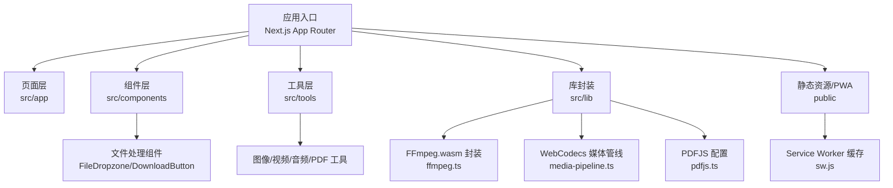
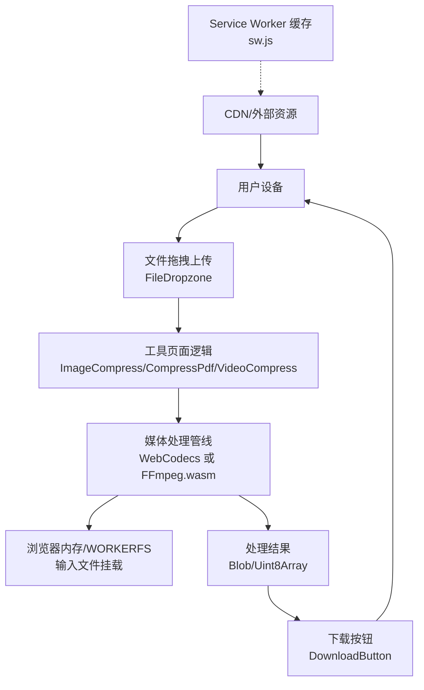
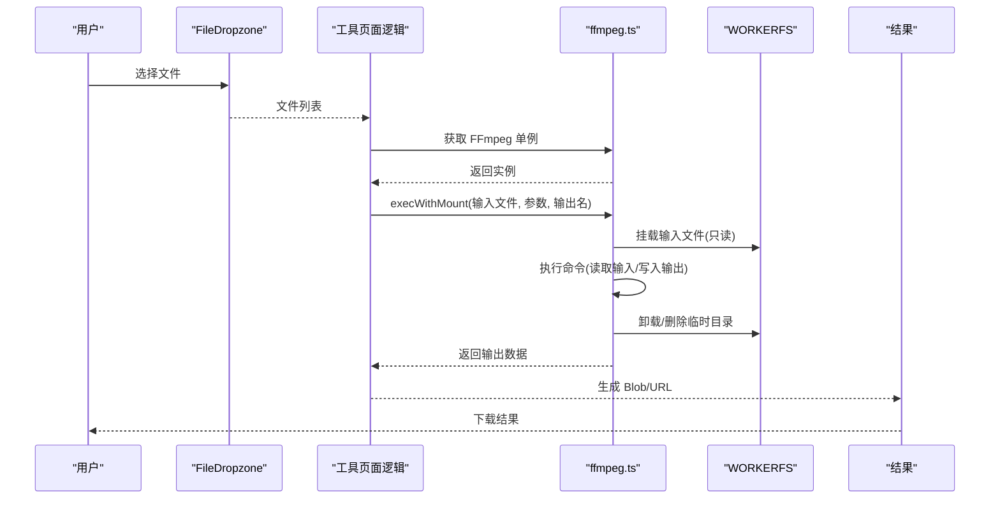
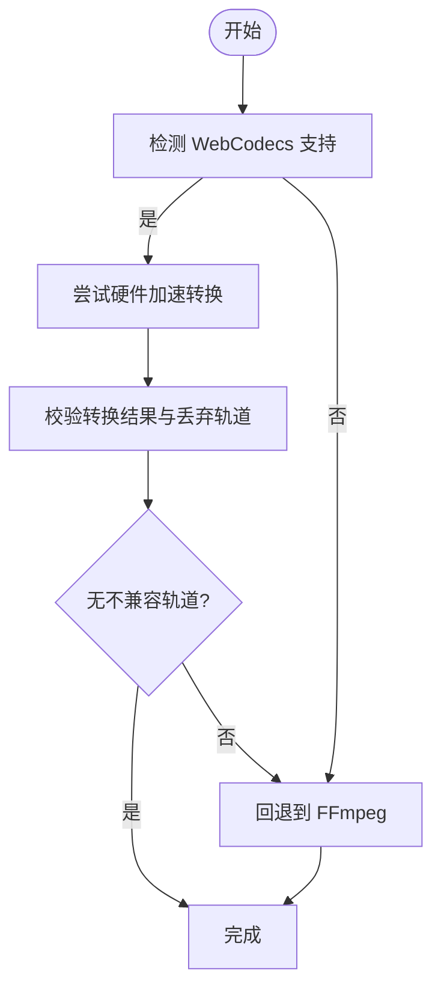
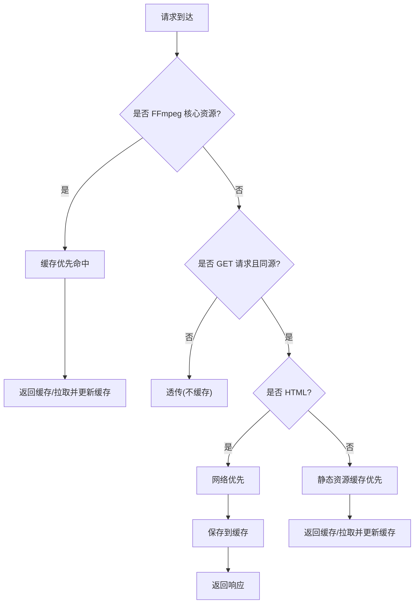
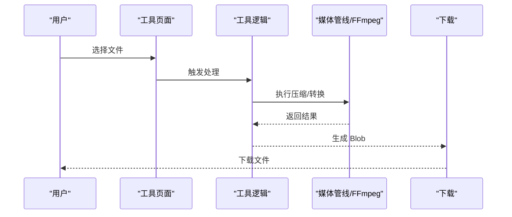
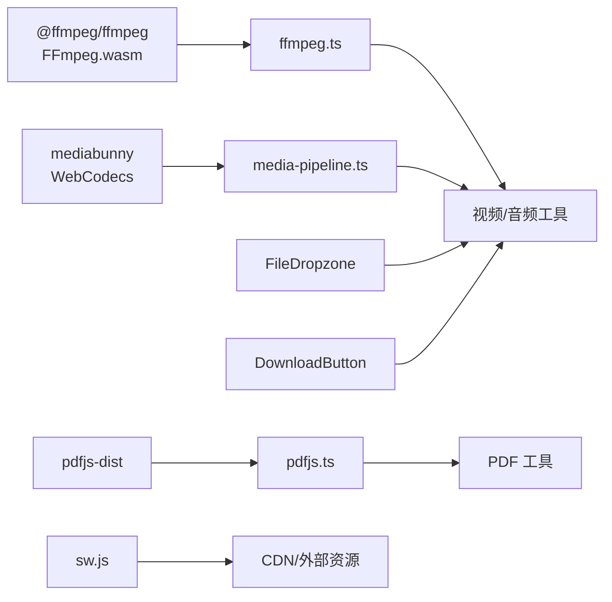

# 隐私优先

<cite>
**本文引用的文件**
- [README.md](file://README.md)
- [package.json](file://package.json)
- [src/app/[locale]/privacy/page.tsx](file://src/app/[locale]/privacy/page.tsx)
- [src/lib/ffmpeg.ts](file://src/lib/ffmpeg.ts)
- [src/lib/media-pipeline.ts](file://src/lib/media-pipeline.ts)
- [src/lib/pdfjs.ts](file://src/lib/pdfjs.ts)
- [public/sw.js](file://public/sw.js)
- [src/components/shared/FileDropzone.tsx](file://src/components/shared/FileDropzone.tsx)
- [src/components/shared/DownloadButton.tsx](file://src/components/shared/DownloadButton.tsx)
- [src/tools/image/compress/ImageCompress.tsx](file://src/tools/image/compress/ImageCompress.tsx)
- [src/tools/pdf/compress/CompressPdf.tsx](file://src/tools/pdf/compress/CompressPdf.tsx)
- [src/tools/video/compress/VideoCompress.tsx](file://src/tools/video/compress/VideoCompress.tsx)
- [src/lib/analytics.ts](file://src/lib/analytics.ts)
- [patches/@ffmpeg__ffmpeg@0.12.15.patch](file://patches/@ffmpeg__ffmpeg@0.12.15.patch)
</cite>

## 目录
1. [简介](#简介)
2. [项目结构](#项目结构)
3. [核心组件](#核心组件)
4. [架构总览](#架构总览)
5. [详细组件分析](#详细组件分析)
6. [依赖关系分析](#依赖关系分析)
7. [性能考量](#性能考量)
8. [故障排除指南](#故障排除指南)
9. [结论](#结论)
10. [附录](#附录)

## 简介
本文件围绕 PrivaDeck 的“隐私优先”设计进行系统化阐述，聚焦于“所有文件处理均在浏览器端完成、零上传、零服务器”的核心承诺。文档从技术架构、数据流、隐私保护措施与最佳实践等维度，结合仓库中的真实实现，解释 WebAssembly、本地存储、PWA 缓存、浏览器原生编解码能力等关键技术如何协同工作，确保用户文件在设备内完成处理与下载，不进入任何服务器。

## 项目结构
PrivaDeck 采用 Next.js App Router + 静态导出，前端工具链以浏览器原生能力与 WebAssembly 为核心，配合 PWA Service Worker 实现离线可用与资源缓存。关键目录与职责概览如下：
- src/app：页面与路由（含多语言）
- src/components：通用 UI 组件（文件拖拽、下载按钮、结果展示等）
- src/tools：各工具的客户端组件与逻辑封装
- src/lib：媒体处理库封装（FFmpeg.wasm、MediaPipeline、pdfjs）、分析埋点
- public：静态资源与 SW
- patches：对第三方包的补丁以适配打包器

图表来源
- [README.md:55-78](file://README.md#L55-L78)
- [package.json:11-32](file://package.json#L11-L32)

章节来源
- [README.md:55-78](file://README.md#L55-L78)
- [package.json:11-32](file://package.json#L11-L32)

## 核心组件
- 浏览器端媒体处理
  - FFmpeg.wasm：通过 WebAssembly 加载核心，使用 WORKERFS 挂载输入文件，避免内存复制，执行完成后清理临时文件。
  - WebCodecs 媒体管线：在支持的浏览器上利用硬件加速进行解码/编码，不支持时回退至 FFmpeg。
- PWA 与本地缓存
  - Service Worker 对 FFmpeg 核心与静态资源进行持久缓存，提升离线可用性与加载速度。
- 文件交互与隐私提示
  - 文件拖拽上传组件明确标注“隐私提示”，下载按钮仅触发浏览器下载，不上传。
- 分析埋点与隐私
  - 使用 GA4 事件追踪，但对敏感字段进行截断，避免记录文件名等信息。

章节来源
- [src/lib/ffmpeg.ts:10-144](file://src/lib/ffmpeg.ts#L10-L144)
- [src/lib/media-pipeline.ts:7-105](file://src/lib/media-pipeline.ts#L7-L105)
- [public/sw.js:1-93](file://public/sw.js#L1-L93)
- [src/components/shared/FileDropzone.tsx:137-140](file://src/components/shared/FileDropzone.tsx#L137-L140)
- [src/components/shared/DownloadButton.tsx:27-44](file://src/components/shared/DownloadButton.tsx#L27-L44)
- [src/lib/analytics.ts:106-124](file://src/lib/analytics.ts#L106-L124)

## 架构总览
下图展示了“零上传、零服务器”的端到端流程：用户文件始终驻留在浏览器内存与本地磁盘，处理引擎在浏览器内运行，最终以下载形式返回给用户。

图表来源
- [src/components/shared/FileDropzone.tsx:55-76](file://src/components/shared/FileDropzone.tsx#L55-L76)
- [src/tools/image/compress/ImageCompress.tsx:138-178](file://src/tools/image/compress/ImageCompress.tsx#L138-L178)
- [src/tools/pdf/compress/CompressPdf.tsx:28-45](file://src/tools/pdf/compress/CompressPdf.tsx#L28-L45)
- [src/tools/video/compress/VideoCompress.tsx:76-105](file://src/tools/video/compress/VideoCompress.tsx#L76-L105)
- [src/lib/ffmpeg.ts:99-143](file://src/lib/ffmpeg.ts#L99-L143)
- [src/lib/media-pipeline.ts:7-14](file://src/lib/media-pipeline.ts#L7-L14)
- [public/sw.js:30-92](file://public/sw.js#L30-L92)

## 详细组件分析

### FFmpeg.wasm 流程与数据隔离
- 单实例与串行队列：通过单例与 Promise 队列保证 FFmpeg WASM 的单线程执行，避免并发挂载冲突。
- WORKERFS 挂载：将 File 对象以只读方式挂载到虚拟文件系统，避免拷贝到 MEMFS，降低峰值内存占用。
- 进度回调与清理：原子设置进度监听，在任务结束后清理挂载点与临时文件，确保无残留。
- 打包兼容：通过补丁禁用打包器对核心模块的动态导入，确保 Web Worker 正常加载。

图表来源
- [src/lib/ffmpeg.ts:10-39](file://src/lib/ffmpeg.ts#L10-L39)
- [src/lib/ffmpeg.ts:99-143](file://src/lib/ffmpeg.ts#L99-L143)
- [src/components/shared/DownloadButton.tsx:27-44](file://src/components/shared/DownloadButton.tsx#L27-L44)

章节来源
- [src/lib/ffmpeg.ts:70-82](file://src/lib/ffmpeg.ts#L70-L82)
- [src/lib/ffmpeg.ts:99-143](file://src/lib/ffmpeg.ts#L99-L143)
- [patches/@ffmpeg__ffmpeg@0.12.15.patch:1-14](file://patches/@ffmpeg__ffmpeg@0.12.15.patch#L1-L14)

### WebCodecs 媒体管线与回退策略
- 能力检测：在支持 Video/Audio 编解码器的现代浏览器上启用硬件加速路径。
- 轨道校验：严格检查转换过程中是否丢弃关键轨道（尤其是视频解码相关原因），若发现不兼容则抛错并回退到 FFmpeg。
- 平台提示：在 Windows + Chromium 场景提示安装 HEVC 扩展以改善 H.265 解码体验。

图表来源
- [src/lib/media-pipeline.ts:7-14](file://src/lib/media-pipeline.ts#L7-L14)
- [src/lib/media-pipeline.ts:59-91](file://src/lib/media-pipeline.ts#L59-L91)
- [src/lib/media-pipeline.ts:98-104](file://src/lib/media-pipeline.ts#L98-L104)

章节来源
- [src/lib/media-pipeline.ts:28-53](file://src/lib/media-pipeline.ts#L28-L53)
- [src/lib/media-pipeline.ts:59-91](file://src/lib/media-pipeline.ts#L59-L91)

### PWA 与 Service Worker 缓存策略
- 永久缓存：对 FFmpeg 核心资源（包含版本号）进行永久缓存，减少重复下载。
- HTML 策略：HTML 采用网络优先，保持内容新鲜；失败时回退到缓存。
- 静态资源：JS/CSS/媒体等静态资源采用缓存优先策略，提升二次加载速度。
- 清理策略：激活阶段清理旧缓存，确保磁盘占用可控。

图表来源
- [public/sw.js:30-92](file://public/sw.js#L30-L92)

章节来源
- [public/sw.js:1-93](file://public/sw.js#L1-L93)

### 文件处理工具的隐私实现
- 图像压缩：在客户端逐张压缩，结果以 Blob 形式供下载，不上传。
- PDF 压缩：仅在浏览器内读取/写入，最终以 Blob 下载。
- 视频压缩：根据简单/高级模式生成参数，调用媒体管线或 FFmpeg，完成后以 Blob 下载。

图表来源
- [src/tools/image/compress/ImageCompress.tsx:138-178](file://src/tools/image/compress/ImageCompress.tsx#L138-L178)
- [src/tools/pdf/compress/CompressPdf.tsx:28-45](file://src/tools/pdf/compress/CompressPdf.tsx#L28-L45)
- [src/tools/video/compress/VideoCompress.tsx:76-105](file://src/tools/video/compress/VideoCompress.tsx#L76-L105)

章节来源
- [src/tools/image/compress/ImageCompress.tsx:138-178](file://src/tools/image/compress/ImageCompress.tsx#L138-L178)
- [src/tools/pdf/compress/CompressPdf.tsx:28-45](file://src/tools/pdf/compress/CompressPdf.tsx#L28-L45)
- [src/tools/video/compress/VideoCompress.tsx:76-105](file://src/tools/video/compress/VideoCompress.tsx#L76-L105)

### 隐私政策与透明度
- 核心承诺：不上传、本地存储、开源、无日志、透明。
- 使用说明：三步解释“如何工作”，强调文件在本地处理。
- 第三方声明：明确不使用第三方分析脚本，仅在启用 GA4 时进行有限事件追踪。

章节来源
- [src/app/[locale]/privacy/page.tsx:62-145](file://src/app/[locale]/privacy/page.tsx#L62-L145)

### 分析埋点与隐私保护
- 事件参数：对上传/下载/错误等事件进行参数化追踪。
- 隐私策略：对长字符串（如错误信息、搜索词）进行截断，避免记录文件名等敏感信息。
- 工具级追踪器：按工具维度记录处理耗时与错误，便于质量监控而不暴露用户数据。

章节来源
- [src/lib/analytics.ts:106-137](file://src/lib/analytics.ts#L106-L137)

## 依赖关系分析
- 媒体处理依赖
  - FFmpeg.wasm：用于视频/音频处理，核心通过 CDN 加载并在浏览器内初始化。
  - MediaPipeline：在支持的浏览器上使用 WebCodecs，否则回退到 FFmpeg。
  - pdfjs：配置 PDF.js Worker，用于 PDF 内容处理。
- 工具与组件
  - 各工具页面仅负责 UI 与参数收集，具体处理委托给 lib 层封装。
  - FileDropzone/DownloadButton 仅负责文件交互与下载触发，不上传。
- PWA 与缓存
  - Service Worker 对 FFmpeg 核心与静态资源进行缓存，提升离线可用性。

图表来源
- [package.json:11-32](file://package.json#L11-L32)
- [src/lib/ffmpeg.ts:10-39](file://src/lib/ffmpeg.ts#L10-L39)
- [src/lib/media-pipeline.ts:7-14](file://src/lib/media-pipeline.ts#L7-L14)
- [src/lib/pdfjs.ts:3-13](file://src/lib/pdfjs.ts#L3-L13)

章节来源
- [package.json:11-32](file://package.json#L11-L32)
- [src/lib/ffmpeg.ts:10-39](file://src/lib/ffmpeg.ts#L10-L39)
- [src/lib/media-pipeline.ts:7-14](file://src/lib/media-pipeline.ts#L7-L14)
- [src/lib/pdfjs.ts:3-13](file://src/lib/pdfjs.ts#L3-L13)

## 性能考量
- 内存优化
  - 使用 WORKERFS 挂载输入文件，避免将 File 拷贝到 MEMFS，显著降低峰值内存。
  - 处理完成后立即删除 MEMFS 中的输出文件，释放内存。
- 并发与稳定性
  - 通过 Promise 队列串行化 FFmpeg 操作，避免并发挂载导致的冲突。
- 硬件加速
  - 在支持的浏览器上优先使用 WebCodecs，充分利用硬件解码/编码能力，缩短处理时间。
- 离线与缓存
  - Service Worker 对 FFmpeg 核心与静态资源进行缓存，减少网络依赖与重复下载。

章节来源
- [src/lib/ffmpeg.ts:75-82](file://src/lib/ffmpeg.ts#L75-L82)
- [src/lib/ffmpeg.ts:129-132](file://src/lib/ffmpeg.ts#L129-L132)
- [src/lib/media-pipeline.ts:7-14](file://src/lib/media-pipeline.ts#L7-L14)
- [public/sw.js:30-92](file://public/sw.js#L30-L92)

## 故障排除指南
- FFmpeg 初始化失败
  - 现象：获取 FFmpeg 单例时报错。
  - 排查：确认网络可达、CDN 资源可访问；查看控制台错误堆栈。
  - 处理：清理缓存后重试；必要时回退到 WebCodecs。
- 进度回调异常
  - 现象：进度条不更新或异常。
  - 排查：确认在队列任务中正确设置/清除进度处理器。
  - 处理：检查任务是否被中断或提前退出。
- 不支持的视频编解码
  - 现象：提示不支持的视频编解码器。
  - 排查：确认浏览器是否支持目标编解码；在 Windows + Chromium 上考虑安装 HEVC 扩展。
  - 处理：改用其他编解码或回退到 FFmpeg。
- 下载失败
  - 现象：点击下载无响应或报错。
  - 排查：确认结果为 Blob 或数据 URL；检查浏览器下载权限。
  - 处理：刷新页面重新生成结果；更换浏览器或关闭广告拦截器。

章节来源
- [src/lib/ffmpeg.ts:20-28](file://src/lib/ffmpeg.ts#L20-L28)
- [src/lib/ffmpeg.ts:41-58](file://src/lib/ffmpeg.ts#L41-L58)
- [src/lib/media-pipeline.ts:48-53](file://src/lib/media-pipeline.ts#L48-L53)
- [src/lib/media-pipeline.ts:98-104](file://src/lib/media-pipeline.ts#L98-L104)
- [src/components/shared/DownloadButton.tsx:27-44](file://src/components/shared/DownloadButton.tsx#L27-L44)

## 结论
PrivaDeck 通过“浏览器端处理 + WebAssembly + PWA 缓存 + 严格的隐私策略”实现了真正的“零上传、零服务器”。文件从进入页面到完成处理与下载，全程不离开用户设备；同时通过硬件加速与缓存优化保障性能。配套的隐私政策与透明度页面进一步强化了用户信任。对于开发者而言，该架构提供了清晰的扩展点与最佳实践参考。

## 附录
- 实际使用场景示例
  - 图像压缩：在“图像压缩”工具中选择图片，设置质量与尺寸，处理完成后直接下载压缩结果，不上传至任何服务器。
  - PDF 压缩：在“PDF 压缩”工具中拖入 PDF，选择压缩强度，完成后下载压缩后的 PDF。
  - 视频压缩：在“视频压缩”工具中上传视频，选择简单或高级模式，完成后下载压缩后的视频。
- 隐私政策解读
  - 不上传：所有处理在浏览器内完成，文件不会离开设备。
  - 无日志：不记录用户操作日志，仅在启用 GA4 时进行有限事件追踪，并对敏感字段进行截断。
  - 透明：隐私政策页面明确列出核心承诺与使用说明。
- 安全最佳实践
  - 仅在可信网络环境下使用，避免公共 Wi-Fi 的中间人风险。
  - 定期更新浏览器，确保 WebCodecs 与 WebAssembly 的最新安全补丁。
  - 如需处理敏感文件，可在离线环境或受控设备上操作。
  - 关注 Service Worker 缓存清理，避免长期保存处理结果。

章节来源
- [src/app/[locale]/privacy/page.tsx:62-145](file://src/app/[locale]/privacy/page.tsx#L62-L145)
- [src/tools/image/compress/ImageCompress.tsx:138-178](file://src/tools/image/compress/ImageCompress.tsx#L138-L178)
- [src/tools/pdf/compress/CompressPdf.tsx:28-45](file://src/tools/pdf/compress/CompressPdf.tsx#L28-L45)
- [src/tools/video/compress/VideoCompress.tsx:76-105](file://src/tools/video/compress/VideoCompress.tsx#L76-L105)