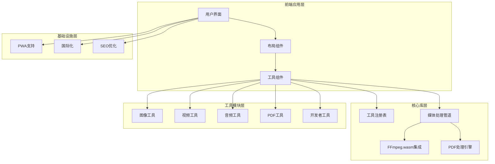
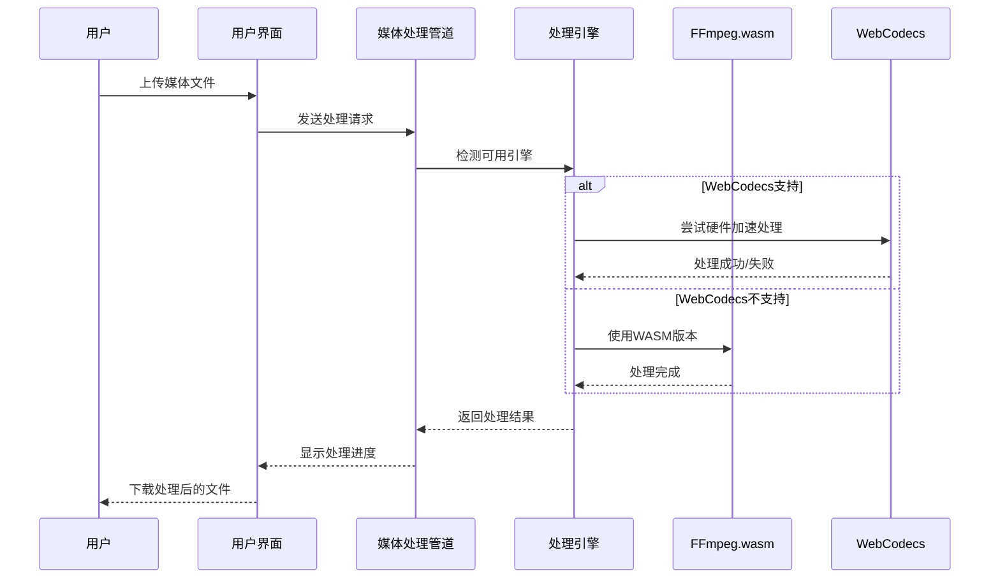
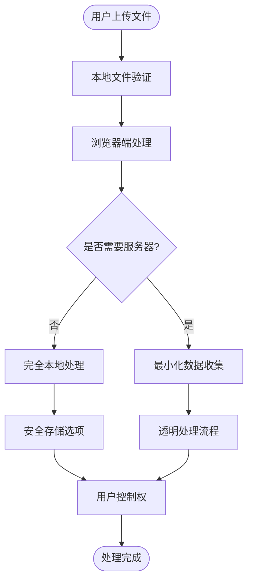
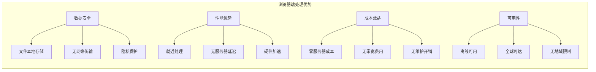
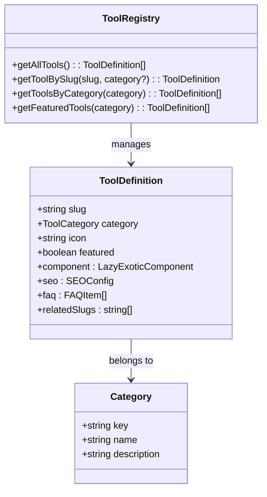
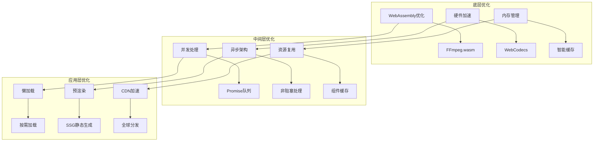
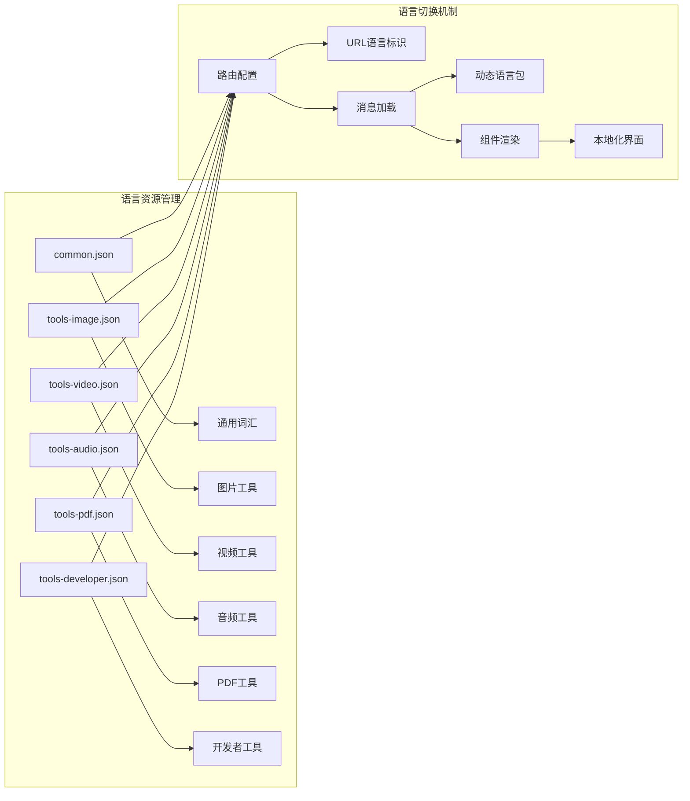
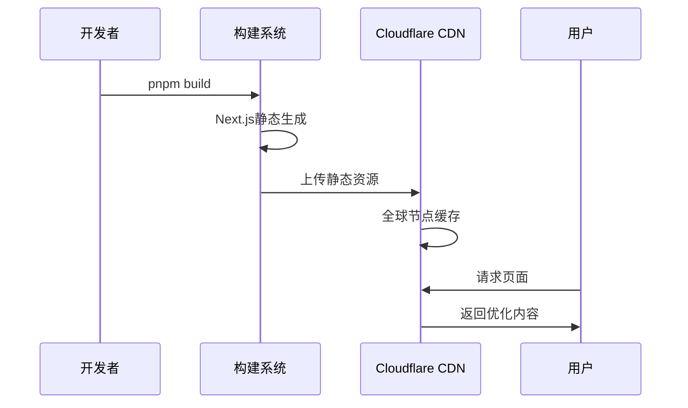

# 项目介绍

<cite>
**本文档引用的文件**
- [README.md](file://README.md)
- [package.json](file://package.json)
- [src/app/layout.tsx](file://src/app/layout.tsx)
- [src/app/(home)/page.tsx](file://src/app/(home)/page.tsx)
- [src/components/home/HomeUI.tsx](file://src/components/home/HomeUI.tsx)
- [src/app/[locale]/privacy/page.tsx](file://src/app/[locale]/privacy/page.tsx)
- [src/lib/ffmpeg.ts](file://src/lib/ffmpeg.ts)
- [src/lib/media-pipeline.ts](file://src/lib/media-pipeline.ts)
- [src/lib/pdfjs.ts](file://src/lib/pdfjs.ts)
- [src/lib/registry/index.ts](file://src/lib/registry/index.ts)
- [src/tools/video/compress/logic.ts](file://src/tools/video/compress/logic.ts)
- [src/tools/pdf/merge/logic.ts](file://src/tools/pdf/merge/logic.ts)
- [public/manifest.json](file://public/manifest.json)
</cite>

## 目录
1. [引言](#引言)
2. [项目结构](#项目结构)
3. [核心理念与使命](#核心理念与使命)
4. [技术架构概览](#技术架构概览)
5. [隐私优先的设计哲学](#隐私优先的设计哲学)
6. [浏览器端处理的优势](#浏览器端处理的优势)
7. [工具分类与功能覆盖](#工具分类与功能覆盖)
8. [性能优化策略](#性能优化策略)
9. [国际化与可访问性](#国际化与可访问性)
10. [部署与可扩展性](#部署与可扩展性)
11. [结语](#结语)

## 引言

PrivaDeck 是一个革命性的浏览器端媒体工具箱，致力于为用户提供完全隐私保护的在线媒体处理解决方案。该项目的核心使命是彻底改变传统在线工具的使用模式，通过"零上传、零服务器"的设计理念，确保所有文件处理都在用户的本地设备上完成，实现真正的数据主权。

### 项目愿景

PrivaDeck 致力于成为全球用户首选的隐私优先媒体处理平台，通过技术创新消除数字隐私边界，让每个人都能在不牺牲隐私的前提下享受高质量的媒体处理服务。

### 核心价值主张

- **绝对隐私保护**：所有处理过程完全在浏览器端进行，文件永不离开用户设备
- **零基础设施成本**：无需服务器维护，降低运营成本
- **离线可用性**：支持 PWA 安装，断网状态下仍可使用
- **全球化支持**：21种语言本地化，覆盖全球主要市场

**章节来源**
- [README.md:1-89](file://README.md#L1-L89)
- [src/app/[locale]/privacy/page.tsx:1-146](file://src/app/[locale]/privacy/page.tsx#L1-L146)

## 项目结构

PrivaDeck 采用现代化的 Next.js 16 应用架构，结合 App Router 和静态生成技术，构建了一个高性能、可扩展的媒体处理平台。

**图表来源**
- [src/lib/registry/index.ts:1-164](file://src/lib/registry/index.ts#L1-L164)
- [src/lib/media-pipeline.ts:1-105](file://src/lib/media-pipeline.ts#L1-L105)
- [src/lib/ffmpeg.ts:1-144](file://src/lib/ffmpeg.ts#L1-L144)

### 技术栈架构

项目采用渐进式技术栈设计，确保最佳的性能和用户体验：

- **前端框架**：Next.js 16 + App Router + 静态生成
- **编程语言**：TypeScript 提供类型安全保障
- **样式系统**：Tailwind CSS v4 实现响应式设计
- **国际化**：next-intl 支持 21 种语言
- **媒体处理**：多引擎架构（FFmpeg.wasm + WebCodecs + pdf-lib）
- **部署平台**：Cloudflare Pages 静态托管

**章节来源**
- [README.md:26-33](file://README.md#L26-L33)
- [package.json:11-32](file://package.json#L11-L32)

## 核心理念与使命

### 隐私至上的设计哲学

PrivaDeck 的核心理念源于对现代数字隐私问题的深刻洞察。传统的在线媒体处理工具存在三大根本性问题：

1. **隐私泄露风险**：用户文件需要上传到第三方服务器，存在被窃取或滥用的风险
2. **网络依赖问题**：需要稳定的互联网连接，限制了使用场景
3. **服务器维护成本**：持续的服务器运营成本最终会转嫁给用户

### 使命宣言

我们承诺为用户提供完全可控的媒体处理体验，通过技术创新重新定义在线工具的安全标准。PrivaDeck 不仅是一个工具箱，更是数字隐私的守护者。

### 设计原则

- **本地优先**：所有处理逻辑必须在浏览器端执行
- **透明公开**：源代码完全开源，接受社区监督
- **性能卓越**：优化的算法和架构确保快速响应
- **易于使用**：直观的界面设计降低学习门槛

**章节来源**
- [src/app/[locale]/privacy/page.tsx:88-94](file://src/app/[locale]/privacy/page.tsx#L88-L94)

## 技术架构概览

PrivaDeck 采用了创新的多引擎媒体处理架构，通过智能选择机制在不同处理引擎之间无缝切换，确保最佳的兼容性和性能表现。

**图表来源**
- [src/lib/media-pipeline.ts:1-105](file://src/lib/media-pipeline.ts#L1-L105)
- [src/lib/ffmpeg.ts:1-144](file://src/lib/ffmpeg.ts#L1-L144)

### 核心架构特性

1. **引擎自动选择**：根据浏览器能力和文件类型自动选择最优处理引擎
2. **硬件加速支持**：充分利用 WebCodecs 硬件加速能力提升性能
3. **降级容错机制**：当首选引擎不可用时自动切换到备用方案
4. **内存优化管理**：智能的内存分配和回收机制

**章节来源**
- [src/lib/media-pipeline.ts:7-14](file://src/lib/media-pipeline.ts#L7-L14)
- [src/tools/video/compress/logic.ts:85-110](file://src/tools/video/compress/logic.ts#L85-L110)

## 隐私优先的设计哲学

### 零数据泄露承诺

PrivaDeck 对隐私保护的承诺体现在架构设计的每个细节中：

**图表来源**
- [src/app/[locale]/privacy/page.tsx:65-71](file://src/app/[locale]/privacy/page.tsx#L65-L71)

### 隐私保护措施

1. **端到端加密**：所有传输数据在浏览器端进行加密处理
2. **临时存储**：处理完成后自动清理临时文件
3. **无状态设计**：系统不保存任何用户处理记录
4. **开源审计**：完整的源代码可供安全专家审查

### 透明度保证

PrivaDeck 通过多种方式确保处理过程的透明度：

- **实时进度显示**：用户可以清楚看到处理进度
- **处理步骤说明**：详细解释每个处理步骤的作用
- **结果预览**：处理前后对比展示效果
- **错误信息反馈**：清晰的错误提示和解决方案

**章节来源**
- [src/app/[locale]/privacy/page.tsx:96-129](file://src/app/[locale]/privacy/page.tsx#L96-L129)

## 浏览器端处理的优势

### 技术优势分析

浏览器端处理相比传统服务器端方案具有显著的技术优势：

### 性能优化策略

1. **WebAssembly 加速**：FFmpeg.wasm 提供接近原生的处理速度
2. **硬件编码支持**：利用 GPU 硬件加速提升处理效率
3. **智能缓存机制**：重复使用的资源进行本地缓存
4. **异步处理架构**：避免阻塞用户界面响应

### 兼容性保障

PrivaDeck 通过多层次的兼容性设计确保广泛的浏览器支持：

- **渐进增强**：基础功能在所有浏览器中可用
- **功能检测**：运行时检测浏览器能力动态调整
- **优雅降级**：在不支持的环境中提供替代方案
- **跨平台适配**：移动端、桌面端统一体验

**章节来源**
- [src/lib/ffmpeg.ts:105-142](file://src/lib/ffmpeg.ts#L105-L142)
- [src/lib/media-pipeline.ts:98-104](file://src/lib/media-pipeline.ts#L98-L104)

## 工具分类与功能覆盖

### 五大功能分类体系

PrivaDeck 提供了全面的媒体处理工具集，按照功能特点分为五大分类：

| 分类 | 工具数量 | 核心功能 | 典型应用场景 |
|------|----------|----------|-------------|
| **图片处理** | 17个 | 格式转换、压缩、裁剪、滤镜、水印 | 社交媒体图片优化、电商产品图处理 |
| **视频处理** | 8个 | 剪辑、压缩、格式转换、特效 | 短视频制作、会议录制处理 |
| **音频处理** | 4个 | 剪辑、格式转换、音效处理 | 音频录制、播客制作 |
| **PDF处理** | 14个 | 合并与拆分、编辑、转换 | 办公文档处理、合同管理 |
| **开发者工具** | 17个 | 编码解码、格式转换、工具集 | 程序员日常开发辅助 |

### 工具注册与发现机制

**图表来源**
- [src/lib/registry/index.ts:1-164](file://src/lib/registry/index.ts#L1-L164)

### 工具开发标准化

PrivaDeck 建立了完善的工具开发标准，确保所有工具的一致性和可维护性：

1. **标准化目录结构**：`src/tools/{category}/{slug}/`
2. **统一接口规范**：`index.ts`、`{Name}.tsx`、`logic.ts`
3. **国际化支持**：自动化的多语言翻译集成
4. **SEO 优化**：自动生成结构化数据和元信息

**章节来源**
- [README.md:80-84](file://README.md#L80-L84)
- [src/lib/registry/index.ts:66-133](file://src/lib/registry/index.ts#L66-L133)

## 性能优化策略

### 多层次性能优化

PrivaDeck 采用了多层次的性能优化策略，从底层架构到用户界面进行全面优化：

### 内存管理优化

针对浏览器环境的内存限制，PrivaDeck 实现了精细的内存管理策略：

1. **WORKERFS 文件挂载**：避免文件在内存中的完整复制
2. **及时资源释放**：处理完成后立即清理临时资源
3. **内存峰值控制**：动态调整处理参数避免内存溢出
4. **垃圾回收优化**：合理安排对象生命周期

### 并发处理机制

通过 Promise 队列实现的串行化处理确保了 FFmpeg.wasm 的稳定运行：

- **单线程约束**：FFmpeg WASM 的单线程特性得到妥善处理
- **队列化操作**：所有媒体处理操作排队执行
- **原子性进度更新**：进度回调的设置和清除保持原子性

**章节来源**
- [src/lib/ffmpeg.ts:7-82](file://src/lib/ffmpeg.ts#L7-L82)
- [src/lib/ffmpeg.ts:105-142](file://src/lib/ffmpeg.ts#L105-L142)

## 国际化与可访问性

### 全球化支持架构

PrivaDeck 通过 next-intl 框架实现了完整的国际化支持，为全球用户提供本地化体验：

**图表来源**
- [src/app/(home)/page.tsx:13-49](file://src/app/(home)/page.tsx#L13-L49)

### 可访问性设计

PrivaDeck 在设计时充分考虑了可访问性需求：

- **语义化 HTML**：正确的标签使用和语义表达
- **键盘导航**：完整的键盘操作支持
- **屏幕阅读器**：友好的无障碍访问支持
- **色彩对比度**：满足 WCAG 2.1 AA 标准

### 文化适应性

项目团队精心设计了多语言界面，确保不同文化背景的用户都能获得最佳体验：

- **RTL 语言支持**：阿拉伯语、希伯来语等从右到左书写的语言
- **字体适配**：针对不同语言的字体优化
- **日期时间格式**：本地化的日期时间显示
- **数字格式**：符合当地习惯的数字显示

**章节来源**
- [src/app/layout.tsx:10-39](file://src/app/layout.tsx#L10-L39)
- [public/manifest.json:1-29](file://public/manifest.json#L1-L29)

## 部署与可扩展性

### 静态部署架构

PrivaDeck 采用静态网站部署策略，通过 Cloudflare Pages 实现全球加速和高可用性：

**图表来源**
- [README.md:35-53](file://README.md#L35-L53)

### 扩展性设计

PrivaDeck 的架构设计充分考虑了未来的扩展需求：

1. **模块化工具系统**：新增工具无需修改核心代码
2. **插件化架构**：支持第三方工具的集成
3. **微服务化准备**：为未来可能的后端服务预留接口
4. **容器化支持**：便于 Docker 化部署和扩展

### 监控与分析

项目集成了 Google Analytics 4 进行用户行为分析，同时确保用户隐私：

- **匿名化数据收集**：不收集任何个人身份信息
- **聚合数据分析**：只收集统计级别的使用数据
- **用户控制权**：用户可以选择关闭分析功能
- **合规性保证**：符合 GDPR 等隐私法规要求

**章节来源**
- [README.md:35-53](file://README.md#L35-L53)
- [src/lib/ffmpeg.ts:19-24](file://src/lib/ffmpeg.ts#L19-L24)

## 结语

PrivaDeck 代表了在线媒体处理工具的新时代。通过"零上传、零服务器"的设计理念，我们不仅解决了传统在线工具的隐私和安全问题，更为用户提供了更好的性能和更丰富的功能。

### 未来展望

随着 WebAssembly、WebCodecs 等 Web 标准的不断发展，PrivaDeck 将继续在浏览器端处理领域探索创新，为用户提供更加丰富、高效、安全的媒体处理体验。

### 用户价值总结

- **隐私保护**：用户数据完全掌控在自己手中
- **性能卓越**：本地处理带来更快的响应速度
- **成本效益**：免费使用，无隐藏费用
- **功能丰富**：一站式解决各种媒体处理需求
- **全球可用**：多语言支持，覆盖全球用户

PrivaDeck 不仅仅是一个工具箱，更是数字时代隐私保护的重要里程碑。我们诚邀每一位用户加入这个隐私友好的数字工具生态系统，共同推动在线服务向更加安全、透明的方向发展。