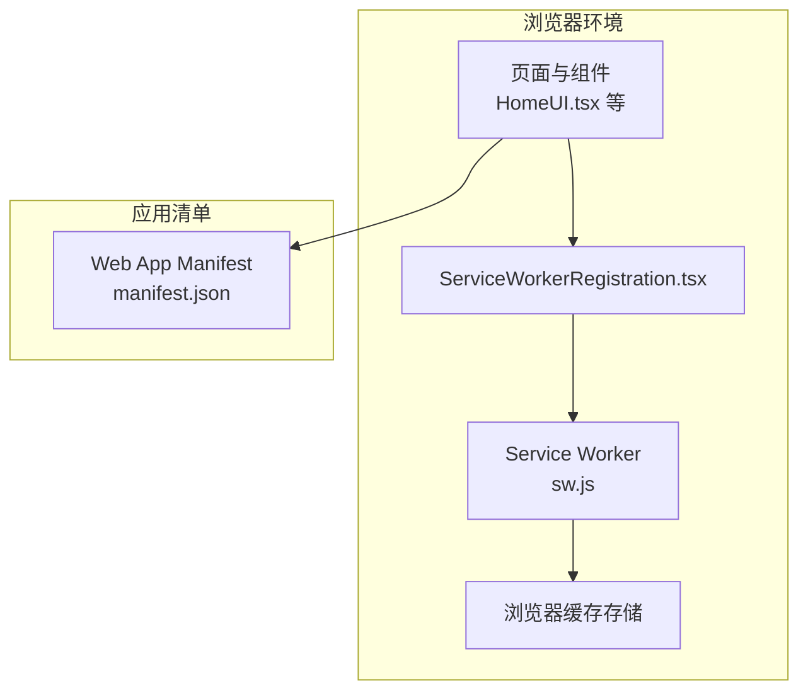
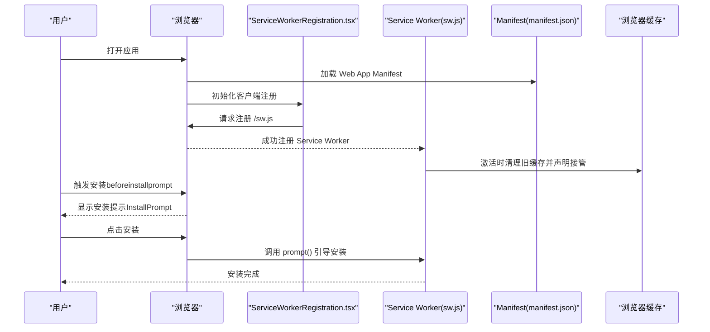
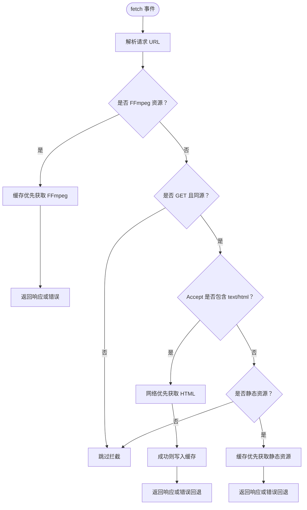
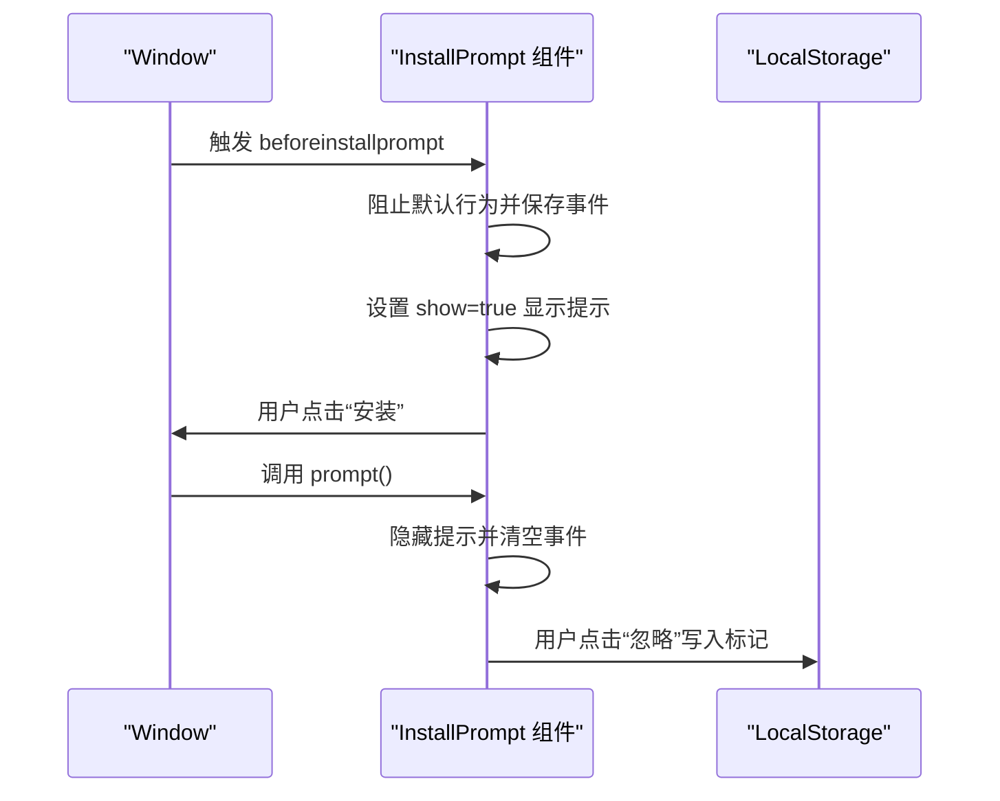
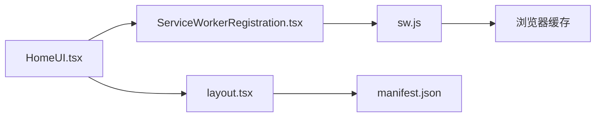

# PWA架构

<cite>
**本文引用的文件**
- [public/sw.js](file://public/sw.js)
- [public/manifest.json](file://public/manifest.json)
- [src/components/shared/InstallPrompt.tsx](file://src/components/shared/InstallPrompt.tsx)
- [src/components/shared/ServiceWorkerRegistration.tsx](file://src/components/shared/ServiceWorkerRegistration.tsx)
- [src/app/layout.tsx](file://src/app/layout.tsx)
- [src/app/globals.css](file://src/app/globals.css)
- [src/app/(home)/page.tsx](file://src/app/(home)/page.tsx)
- [src/components/home/HomeUI.tsx](file://src/components/home/HomeUI.tsx)
- [package.json](file://package.json)
</cite>

## 目录
1. [简介](#简介)
2. [项目结构](#项目结构)
3. [核心组件](#核心组件)
4. [架构总览](#架构总览)
5. [详细组件分析](#详细组件分析)
6. [依赖关系分析](#依赖关系分析)
7. [性能考虑](#性能考虑)
8. [故障排查指南](#故障排查指南)
9. [结论](#结论)
10. [附录](#附录)

## 简介
本文件系统化梳理 PrivaDeck 的渐进式 Web 应用（PWA）架构与实现细节，覆盖 Service Worker 注册与缓存策略、Web App Manifest 配置与应用安装机制、InstallPrompt 安装提示组件的工作原理、离线可用性与更新通知机制，并提供架构图与安装流程图，帮助开发者快速理解并优化 PrivaDeck 的 PWA 能力。

## 项目结构
PrivaDeck 的 PWA 相关能力由以下模块协同实现：
- Service Worker：位于 public/sw.js，负责静态资源与动态内容的缓存策略、版本清理与激活。
- Manifest：位于 public/manifest.json，定义应用名称、图标、启动路径与显示模式等。
- 客户端注册：src/components/shared/ServiceWorkerRegistration.tsx 在客户端注册 SW。
- 安装提示：src/components/shared/InstallPrompt.tsx 捕获 beforeinstallprompt 事件并引导用户安装。
- 元数据与视口：src/app/layout.tsx 提供 manifest 引用与 Apple WebApp 配置；全局样式 src/app/globals.css 提供主题色与动画。
- 页面入口：src/app/(home)/page.tsx 与 src/components/home/HomeUI.tsx 展示首页与导航，体现 PWA 的可安装性与离线体验。

**图表来源**
- [src/components/shared/ServiceWorkerRegistration.tsx:1-16](file://src/components/shared/ServiceWorkerRegistration.tsx#L1-L16)
- [public/sw.js:1-93](file://public/sw.js#L1-L93)
- [public/manifest.json:1-29](file://public/manifest.json#L1-L29)
- [src/app/layout.tsx:1-48](file://src/app/layout.tsx#L1-L48)

**章节来源**
- [src/app/layout.tsx:1-48](file://src/app/layout.tsx#L1-L48)
- [src/app/globals.css:1-128](file://src/app/globals.css#L1-L128)
- [public/manifest.json:1-29](file://public/manifest.json#L1-L29)
- [src/components/shared/ServiceWorkerRegistration.tsx:1-16](file://src/components/shared/ServiceWorkerRegistration.tsx#L1-L16)
- [public/sw.js:1-93](file://public/sw.js#L1-L93)

## 核心组件
- Service Worker 缓存策略：按资源类型采用不同策略（永久缓存 FFmpeg、HTML 网络优先、静态资源缓存优先），并在激活时清理旧缓存。
- Web App Manifest：定义应用名称、图标、启动路径与显示模式，支持 standalone 显示。
- 安装提示组件：监听 beforeinstallprompt 事件，弹出安装提示，允许用户选择安装或稍后提醒。
- 客户端注册：在浏览器支持的前提下，注册 /sw.js 并静默处理失败场景。
- 视口与元数据：设置主题色、Apple WebApp 标志与 manifest 引用，提升安装体验与外观一致性。

**章节来源**
- [public/sw.js:1-93](file://public/sw.js#L1-L93)
- [public/manifest.json:1-29](file://public/manifest.json#L1-L29)
- [src/components/shared/InstallPrompt.tsx:1-71](file://src/components/shared/InstallPrompt.tsx#L1-L71)
- [src/components/shared/ServiceWorkerRegistration.tsx:1-16](file://src/components/shared/ServiceWorkerRegistration.tsx#L1-L16)
- [src/app/layout.tsx:1-48](file://src/app/layout.tsx#L1-L48)

## 架构总览
下图展示了从页面加载到安装与离线访问的完整流程：

**图表来源**
- [src/components/shared/ServiceWorkerRegistration.tsx:1-16](file://src/components/shared/ServiceWorkerRegistration.tsx#L1-L16)
- [public/sw.js:1-93](file://public/sw.js#L1-L93)
- [public/manifest.json:1-29](file://public/manifest.json#L1-L29)
- [src/components/shared/InstallPrompt.tsx:1-71](file://src/components/shared/InstallPrompt.tsx#L1-L71)

## 详细组件分析

### Service Worker 缓存策略与控制逻辑
- 缓存命名：维护三个独立缓存空间，分别用于应用资源、静态资源与 FFmpeg 核心资源，便于版本化与清理。
- 安装阶段：调用 skipWaiting，确保新 SW 尽快生效。
- 激活阶段：遍历现有缓存键，删除非当前版本的缓存，随后 claim 控制所有客户端，避免旧缓存滞留。
- 请求拦截：
  - FFmpeg 永久缓存：对指定 URL 前缀采用缓存优先策略，首次请求成功后写入缓存，保证离线可用。
  - HTML 网络优先：对 text/html 类型采用网络优先策略，失败时回退到缓存，保持页面内容新鲜度。
  - 静态资源缓存优先：对 JS/CSS/图片/字体等静态资源采用缓存优先策略，提升二次加载速度。
  - 跨域与非 GET：跳过跨域请求与非 GET 请求，避免安全与兼容性问题。
- 错误处理：对网络失败场景返回错误响应或缓存回退，增强鲁棒性。

**图表来源**
- [public/sw.js:30-92](file://public/sw.js#L30-L92)

**章节来源**
- [public/sw.js:1-93](file://public/sw.js#L1-L93)

### Web App Manifest 配置与应用安装机制
- 关键字段：name、short_name、description、start_url、display、theme_color、background_color、icons、categories。
- 图标集：提供 192x192、512x512 及 maskable 类型图标，满足不同设备与系统样式需求。
- 安装触发：浏览器在合适时机（如用户交互后）触发 beforeinstallprompt 事件，InstallPrompt 组件捕获并展示安装按钮。
- 独立显示：display 设置为 standalone，安装后以独立应用形态运行，提升沉浸感。

**章节来源**
- [public/manifest.json:1-29](file://public/manifest.json#L1-L29)
- [src/components/shared/InstallPrompt.tsx:1-71](file://src/components/shared/InstallPrompt.tsx#L1-L71)

### InstallPrompt 安装提示组件
- 事件监听：在组件挂载时监听 window.beforeinstallprompt，阻止默认行为并保存事件对象。
- 用户选择：提供“安装”与“忽略”两个操作；点击安装会调用事件的 prompt 方法，引导系统显示安装对话框；点击忽略将把用户选择持久化到本地存储，避免重复打扰。
- 交互样式：底部固定提示条，包含隐私保护图标与多语言文案，配合动画提升用户体验。

**图表来源**
- [src/components/shared/InstallPrompt.tsx:19-43](file://src/components/shared/InstallPrompt.tsx#L19-L43)

**章节来源**
- [src/components/shared/InstallPrompt.tsx:1-71](file://src/components/shared/InstallPrompt.tsx#L1-L71)

### Service Worker 注册与生命周期
- 客户端注册：在浏览器支持的情况下，通过 navigator.serviceWorker.register 注册 /sw.js，失败时静默处理，不影响主流程。
- 生命周期：install 阶段跳过等待，activate 阶段清理旧缓存并 claim，fetch 阶段根据规则拦截请求并返回缓存或网络响应。

**章节来源**
- [src/components/shared/ServiceWorkerRegistration.tsx:1-16](file://src/components/shared/ServiceWorkerRegistration.tsx#L1-L16)
- [public/sw.js:11-28](file://public/sw.js#L11-L28)

### 离线可用性与更新通知
- 离线可用性：通过缓存优先策略（静态资源）与网络优先策略（HTML）结合，确保页面与资源在离线或弱网环境下仍可加载。
- 更新通知：当前实现未显式暴露更新事件；可在业务层通过 SW 的 update 或自定义消息通道实现更新提示。

**章节来源**
- [public/sw.js:30-92](file://public/sw.js#L30-L92)

### 视口与元数据配置
- 视口：设置 themeColor、设备宽度与初始缩放，提升移动端加载与渲染体验。
- 元数据：通过 metadataBase、manifest、appleWebApp 等字段完善 SEO 与 WebApp 行为，增强安装与外观一致性。

**章节来源**
- [src/app/layout.tsx:4-39](file://src/app/layout.tsx#L4-L39)

## 依赖关系分析
- 组件耦合：ServiceWorkerRegistration 仅负责注册，不直接参与缓存策略；InstallPrompt 依赖浏览器事件，不依赖具体 SW 实现细节。
- 外部依赖：项目使用 Next.js 16 与 React 19，未引入额外 PWA 工具库，核心能力由原生 Service Worker 与 Manifest 提供。
- 版本与缓存：SW 使用版本化的缓存名，确保升级时清理旧缓存；FFmpeg 资源通过固定 URL 前缀进行永久缓存。

**图表来源**
- [src/components/shared/ServiceWorkerRegistration.tsx:1-16](file://src/components/shared/ServiceWorkerRegistration.tsx#L1-L16)
- [public/sw.js:1-93](file://public/sw.js#L1-L93)
- [src/app/layout.tsx:1-48](file://src/app/layout.tsx#L1-L48)
- [src/components/home/HomeUI.tsx:1-150](file://src/components/home/HomeUI.tsx#L1-L150)

**章节来源**
- [package.json:1-45](file://package.json#L1-L45)
- [src/components/shared/ServiceWorkerRegistration.tsx:1-16](file://src/components/shared/ServiceWorkerRegistration.tsx#L1-L16)
- [public/sw.js:1-93](file://public/sw.js#L1-L93)
- [src/app/layout.tsx:1-48](file://src/app/layout.tsx#L1-L48)
- [src/components/home/HomeUI.tsx:1-150](file://src/components/home/HomeUI.tsx#L1-L150)

## 性能考虑
- 缓存策略优化
  - 静态资源：继续采用缓存优先，结合版本化资源 URL 与 Service Worker 缓存，显著降低带宽与延迟。
  - HTML：网络优先策略有助于保持内容新鲜，但需注意弱网下的回退路径。
  - FFmpeg：固定前缀的永久缓存策略合理，建议在升级版本时调整缓存名以强制更新。
- 资源体积与加载
  - 合理拆分与懒加载工具组件，减少首屏负担。
  - 利用现代图片格式（如 AVIF/WebP）与压缩策略，进一步优化传输体积。
- 运行时性能
  - 减少不必要的重渲染，利用 React 19 的并发特性与 Suspense。
  - 在工具页面中对计算密集型任务（如媒体处理）采用 Web Workers 或异步执行，避免阻塞主线程。

## 故障排查指南
- Service Worker 无法注册
  - 确认浏览器支持 navigator.serviceWorker，检查 /sw.js 路径与部署状态。
  - 查看控制台错误信息，确认 HTTPS 环境（localhost 可例外）。
- 安装提示不出现
  - beforeinstallprompt 事件需在合适的用户交互后触发，确保在用户操作后监听并保存事件。
  - 检查 LocalStorage 中的忽略标记，必要时清除以重新显示提示。
- 缓存命中异常
  - 激活阶段会清理旧缓存，若发现资源未更新，确认缓存名版本与请求 URL 是否匹配。
  - 对于 FFmpeg 等外部资源，确认 URL 前缀与缓存策略一致。
- 离线页面加载失败
  - 检查 HTML 的网络优先策略与缓存回退逻辑，确保在无网络时能正确回退到缓存。

**章节来源**
- [src/components/shared/ServiceWorkerRegistration.tsx:7-11](file://src/components/shared/ServiceWorkerRegistration.tsx#L7-L11)
- [src/components/shared/InstallPrompt.tsx:19-43](file://src/components/shared/InstallPrompt.tsx#L19-L43)
- [public/sw.js:15-28](file://public/sw.js#L15-L28)
- [public/sw.js:57-69](file://public/sw.js#L57-L69)

## 结论
PrivaDeck 的 PWA 架构以最小化第三方依赖的方式，通过原生 Service Worker 与 Manifest 实现了稳定的离线能力与良好的安装体验。核心优势在于：
- 清晰的缓存分层与版本化管理，保障资源稳定与可更新；
- 精准的安装提示机制，尊重用户选择并提供隐私保护语义；
- 与 Next.js 16 的无缝集成，兼顾开发效率与运行性能。

建议后续在业务层补充更新通知机制与更细粒度的缓存失效策略，持续优化用户体验与性能表现。

## 附录
- 相关实现文件路径
  - Service Worker：[public/sw.js](file://public/sw.js)
  - Manifest：[public/manifest.json](file://public/manifest.json)
  - 安装提示组件：[src/components/shared/InstallPrompt.tsx](file://src/components/shared/InstallPrompt.tsx)
  - 客户端注册：[src/components/shared/ServiceWorkerRegistration.tsx](file://src/components/shared/ServiceWorkerRegistration.tsx)
  - 元数据与视口：[src/app/layout.tsx](file://src/app/layout.tsx)
  - 全局样式：[src/app/globals.css](file://src/app/globals.css)
  - 首页入口与 UI：[src/app/(home)/page.tsx](file://src/app/(home)/page.tsx)、[src/components/home/HomeUI.tsx](file://src/components/home/HomeUI.tsx)
  - 依赖信息：[package.json](file://package.json)