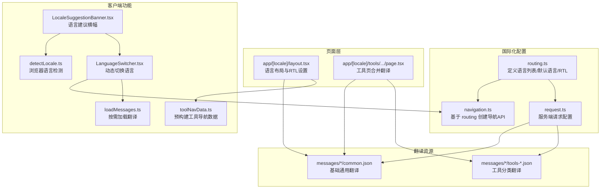
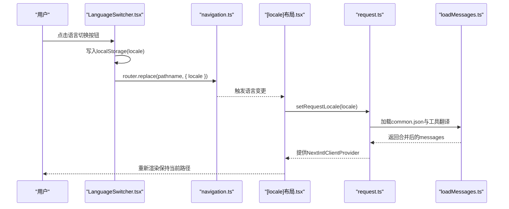
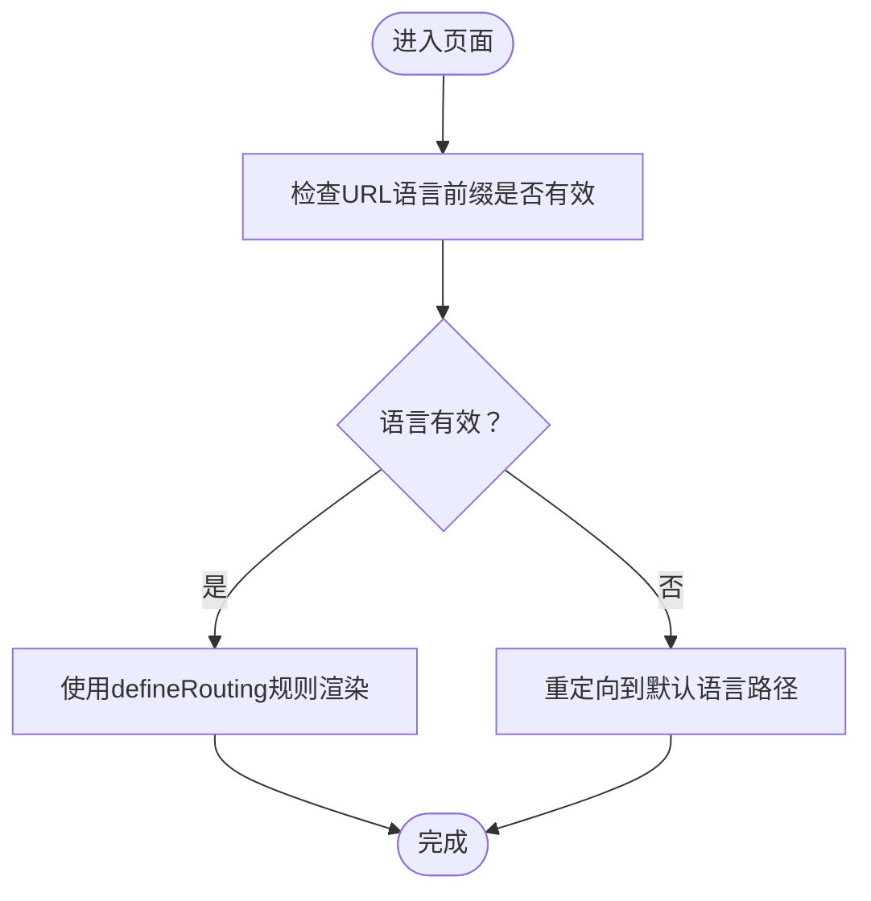
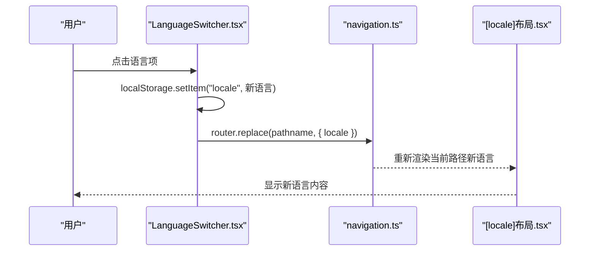
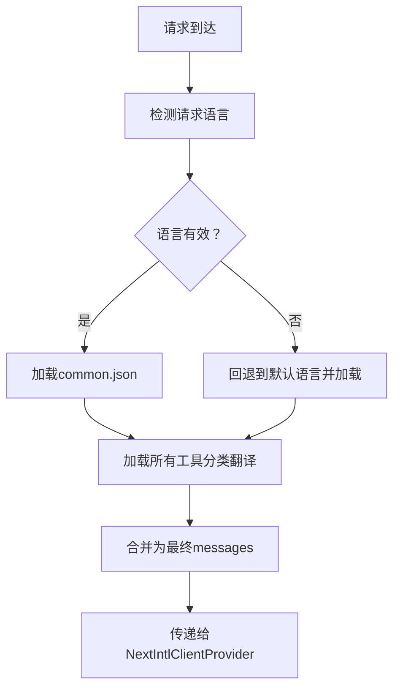
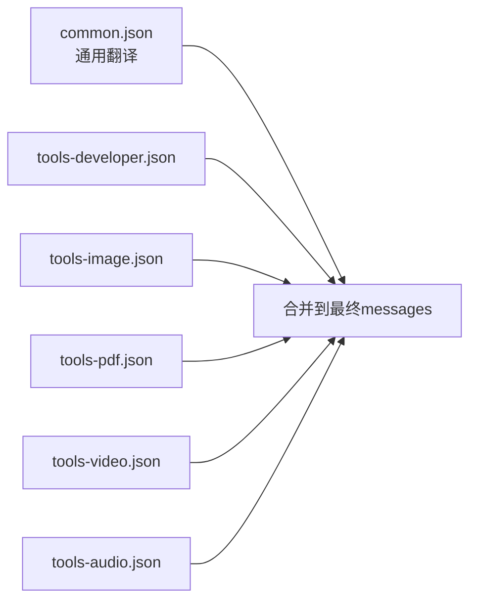
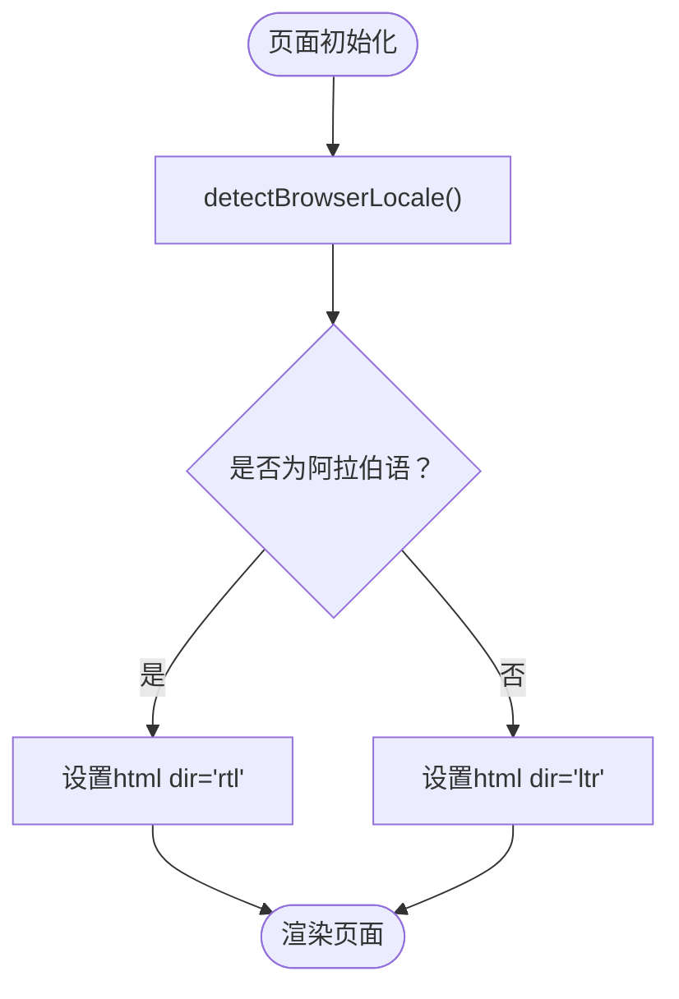
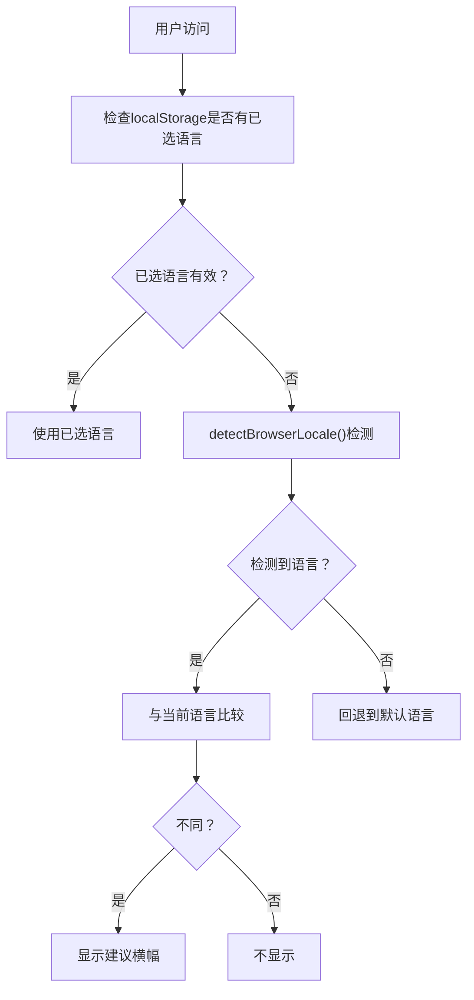
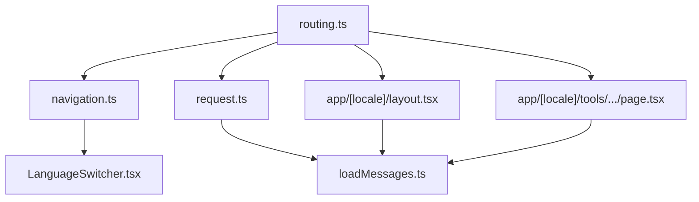

# 国际化架构

<cite>
**本文档引用的文件**
- [routing.ts](file://src/i18n/routing.ts)
- [navigation.ts](file://src/i18n/navigation.ts)
- [request.ts](file://src/i18n/request.ts)
- [loadMessages.ts](file://src/lib/i18n/loadMessages.ts)
- [LanguageSwitcher.tsx](file://src/components/shared/LanguageSwitcher.tsx)
- [[locale]布局.tsx](file://src/app/[locale]/layout.tsx)
- [工具页面.tsx](file://src/app/[locale]/tools/[category]/[slug]/page.tsx)
- [detectLocale.ts](file://src/lib/i18n/detectLocale.ts)
- [LocaleSuggestionBanner.tsx](file://src/components/shared/LocaleSuggestionBanner.tsx)
- [toolNavData.ts](file://src/lib/i18n/toolNavData.ts)
- [common.json（英语）](file://messages/en/common.json)
- [tools-audio.json（英语）](file://messages/en/tools-audio.json)
- [common.json（阿拉伯语）](file://messages/ar/common.json)
- [tools-image.json（阿拉伯语）](file://messages/ar/tools-image.json)
- [languageNames.ts](file://src/lib/i18n/languageNames.ts)
- [next.config.ts](file://next.config.ts)
</cite>

## 目录
1. [简介](#简介)
2. [项目结构](#项目结构)
3. [核心组件](#核心组件)
4. [架构总览](#架构总览)
5. [详细组件分析](#详细组件分析)
6. [依赖关系分析](#依赖关系分析)
7. [性能考虑](#性能考虑)
8. [故障排除指南](#故障排除指南)
9. [结论](#结论)

## 简介
本文件为 PrivaDeck 的国际化架构技术文档，围绕 next-intl 的集成方式、动态语言切换机制、翻译资源管理、路由国际化与 URL 路径语言切换、navigation.ts 中的语言导航逻辑、routing.ts 中的路由配置策略、翻译文件组织结构（common.json 基础翻译与 tools-*.json 工具特定翻译）、RTL 语言支持、语言检测与回退机制进行深入解析，并提供国际化流程图与翻译资源管理示意图，帮助开发者快速理解与维护多语言系统。

## 项目结构
PrivaDeck 的国际化相关代码主要分布在以下位置：
- 国际化配置与导航：src/i18n/
- 翻译资源：messages/{lang}/
- 页面布局与工具页：src/app/[locale]/*
- 客户端语言切换组件：src/components/shared/LanguageSwitcher.tsx
- 语言检测与建议横幅：src/lib/i18n/detectLocale.ts、src/components/shared/LocaleSuggestionBanner.tsx
- 工具导航数据构建：src/lib/i18n/toolNavData.ts
- 翻译加载工具：src/lib/i18n/loadMessages.ts
- Next.js 配置：next.config.ts

**图表来源**
- [routing.ts:1-18](file://src/i18n/routing.ts#L1-L18)
- [navigation.ts:1-6](file://src/i18n/navigation.ts#L1-L6)
- [request.ts:1-20](file://src/i18n/request.ts#L1-L20)
- [loadMessages.ts:1-56](file://src/lib/i18n/loadMessages.ts#L1-L56)
- [LanguageSwitcher.tsx:1-74](file://src/components/shared/LanguageSwitcher.tsx#L1-L74)
- [[locale]布局.tsx](file://src/app/[locale]/layout.tsx#L1-L77)
- [工具页面.tsx:1-109](file://src/app/[locale]/tools/[category]/[slug]/page.tsx#L1-L109)
- [detectLocale.ts:1-58](file://src/lib/i18n/detectLocale.ts#L1-L58)
- [LocaleSuggestionBanner.tsx:1-104](file://src/components/shared/LocaleSuggestionBanner.tsx#L1-L104)
- [toolNavData.ts:1-42](file://src/lib/i18n/toolNavData.ts#L1-L42)

**章节来源**
- [routing.ts:1-18](file://src/i18n/routing.ts#L1-L18)
- [navigation.ts:1-6](file://src/i18n/navigation.ts#L1-L6)
- [request.ts:1-20](file://src/i18n/request.ts#L1-L20)
- [loadMessages.ts:1-56](file://src/lib/i18n/loadMessages.ts#L1-L56)
- [LanguageSwitcher.tsx:1-74](file://src/components/shared/LanguageSwitcher.tsx#L1-L74)
- [[locale]布局.tsx](file://src/app/[locale]/layout.tsx#L1-L77)
- [工具页面.tsx:1-109](file://src/app/[locale]/tools/[category]/[slug]/page.tsx#L1-L109)
- [detectLocale.ts:1-58](file://src/lib/i18n/detectLocale.ts#L1-L58)
- [LocaleSuggestionBanner.tsx:1-104](file://src/components/shared/LocaleSuggestionBanner.tsx#L1-L104)
- [toolNavData.ts:1-42](file://src/lib/i18n/toolNavData.ts#L1-L42)
- [next.config.ts:1-12](file://next.config.ts#L1-L12)

## 核心组件
- 路由国际化配置（routing.ts）
  - 定义支持的语言列表、默认语言、RTL 语言集合，并通过 next-intl 的 defineRouting 构建路由规则。
- 导航 API（navigation.ts）
  - 基于 routing 创建 Link、redirect、usePathname、useRouter、getPathname 等客户端/服务端导航工具。
- 服务端请求配置（request.ts）
  - 在服务端根据请求语言检测与回退，加载 common.json 与所有工具分类的翻译，合并后提供给客户端。
- 翻译加载工具（loadMessages.ts）
  - 提供按需加载 common、单分类、全部工具分类翻译的能力，避免不必要的资源加载。
- 语言切换组件（LanguageSwitcher.tsx）
  - 客户端语言切换器，记录用户选择、调用 router.replace 进行无刷新跳转，并写入本地存储。
- 语言检测与建议横幅（detectLocale.ts、LocaleSuggestionBanner.tsx）
  - 浏览器语言检测与回退策略，以及语言建议横幅的显示/隐藏与跳转逻辑。
- 工具导航数据构建（toolNavData.ts）
  - 服务端预构建工具导航数据，避免将完整 toolNames 翻译序列化到 RSC payload。
- 页面布局与工具页（[locale]布局.tsx、工具页面.tsx）
  - 在语言布局中设置 html dir 属性以支持 RTL；在工具页中按需合并 common 与单分类翻译。

**章节来源**
- [routing.ts:1-18](file://src/i18n/routing.ts#L1-L18)
- [navigation.ts:1-6](file://src/i18n/navigation.ts#L1-L6)
- [request.ts:1-20](file://src/i18n/request.ts#L1-L20)
- [loadMessages.ts:1-56](file://src/lib/i18n/loadMessages.ts#L1-L56)
- [LanguageSwitcher.tsx:1-74](file://src/components/shared/LanguageSwitcher.tsx#L1-L74)
- [detectLocale.ts:1-58](file://src/lib/i18n/detectLocale.ts#L1-L58)
- [LocaleSuggestionBanner.tsx:1-104](file://src/components/shared/LocaleSuggestionBanner.tsx#L1-L104)
- [toolNavData.ts:1-42](file://src/lib/i18n/toolNavData.ts#L1-L42)
- [[locale]布局.tsx](file://src/app/[locale]/layout.tsx#L1-L77)
- [工具页面.tsx:1-109](file://src/app/[locale]/tools/[category]/[slug]/page.tsx#L1-L109)

## 架构总览
PrivaDeck 的国际化采用 next-intl 的约定式路由与服务端配置相结合的方式：
- 路由层：通过 [routing.ts:1-18](file://src/i18n/routing.ts#L1-L18) 定义语言列表与默认语言，生成可识别语言前缀的 URL 结构。
- 导航层：通过 [navigation.ts:1-6](file://src/i18n/navigation.ts#L1-L6) 暴露 Link/redirect/useRouter 等 API，统一语言切换与路径处理。
- 服务端：通过 [request.ts:1-20](file://src/i18n/request.ts#L1-L20) 在 SSR/SSG 场景下加载对应语言的翻译资源，确保首屏渲染正确。
- 客户端：通过 [LanguageSwitcher.tsx:1-74](file://src/components/shared/LanguageSwitcher.tsx#L1-L74) 实现无刷新语言切换，结合 [loadMessages.ts:1-56](file://src/lib/i18n/loadMessages.ts#L1-L56) 按需加载翻译。
- 页面层：在 [app/[locale]/layout.tsx](file://src/app/[locale]/layout.tsx#L1-L77) 设置 html dir 属性以支持 RTL；在工具页 [工具页面.tsx:1-109](file://src/app/[locale]/tools/[category]/[slug]/page.tsx#L1-L109) 合并 common 与单分类翻译。

**图表来源**
- [LanguageSwitcher.tsx:1-74](file://src/components/shared/LanguageSwitcher.tsx#L1-L74)
- [navigation.ts:1-6](file://src/i18n/navigation.ts#L1-L6)
- [[locale]布局.tsx](file://src/app/[locale]/layout.tsx#L1-L77)
- [request.ts:1-20](file://src/i18n/request.ts#L1-L20)
- [loadMessages.ts:1-56](file://src/lib/i18n/loadMessages.ts#L1-L56)

**章节来源**
- [routing.ts:1-18](file://src/i18n/routing.ts#L1-L18)
- [navigation.ts:1-6](file://src/i18n/navigation.ts#L1-L6)
- [request.ts:1-20](file://src/i18n/request.ts#L1-L20)
- [LanguageSwitcher.tsx:1-74](file://src/components/shared/LanguageSwitcher.tsx#L1-L74)
- [[locale]布局.tsx](file://src/app/[locale]/layout.tsx#L1-L77)
- [loadMessages.ts:1-56](file://src/lib/i18n/loadMessages.ts#L1-L56)

## 详细组件分析

### 路由国际化与 URL 语言切换（routing.ts 与 navigation.ts）
- 语言定义与默认值
  - 语言列表包含 20+ 种语言，覆盖全球主要地区变体；默认语言为英语。
  - RTL 语言集合仅包含阿拉伯语，用于后续设置 html dir="rtl"。
- 路由规则
  - 使用 defineRouting 生成基于语言前缀的路由规则，例如 /{locale}/tools/{category}/{slug}。
- 导航 API
  - createNavigation(routing) 暴露 Link、redirect、usePathname、useRouter、getPathname，统一语言切换与路径生成。

**图表来源**
- [routing.ts:1-18](file://src/i18n/routing.ts#L1-L18)
- [navigation.ts:1-6](file://src/i18n/navigation.ts#L1-L6)

**章节来源**
- [routing.ts:1-18](file://src/i18n/routing.ts#L1-L18)
- [navigation.ts:1-6](file://src/i18n/navigation.ts#L1-L6)

### 动态语言切换机制（LanguageSwitcher.tsx）
- 用户交互
  - 点击语言切换按钮后，记录目标语言到 localStorage，并调用 router.replace 将当前路径替换为新语言版本。
- 切换流程
  - 通过 useRouter/usePathname 获取当前路径，调用 router.replace 并传入 { locale } 参数，实现无刷新语言切换。
- 事件追踪
  - 切换时记录分析事件，便于后续行为分析。

**图表来源**
- [LanguageSwitcher.tsx:1-74](file://src/components/shared/LanguageSwitcher.tsx#L1-L74)
- [navigation.ts:1-6](file://src/i18n/navigation.ts#L1-L6)
- [[locale]布局.tsx](file://src/app/[locale]/layout.tsx#L1-L77)

**章节来源**
- [LanguageSwitcher.tsx:1-74](file://src/components/shared/LanguageSwitcher.tsx#L1-L74)
- [navigation.ts:1-6](file://src/i18n/navigation.ts#L1-L6)

### 翻译资源管理（request.ts 与 loadMessages.ts）
- 服务端加载策略
  - request.ts 在服务端根据请求语言检测与回退，加载 common.json 与所有工具分类翻译，合并后提供给客户端。
- 按需加载
  - loadMessages.ts 提供 loadCommonMessages、loadCategoryMessages、loadAllToolMessages，避免一次性加载所有翻译造成体积膨胀。
- 工具页合并
  - 工具页面按需只加载当前分类翻译，并与 common 合并，减少传输与内存占用。

**图表来源**
- [request.ts:1-20](file://src/i18n/request.ts#L1-L20)
- [loadMessages.ts:1-56](file://src/lib/i18n/loadMessages.ts#L1-L56)
- [工具页面.tsx:1-109](file://src/app/[locale]/tools/[category]/[slug]/page.tsx#L1-L109)

**章节来源**
- [request.ts:1-20](file://src/i18n/request.ts#L1-L20)
- [loadMessages.ts:1-56](file://src/lib/i18n/loadMessages.ts#L1-L56)
- [工具页面.tsx:1-109](file://src/app/[locale]/tools/[category]/[slug]/page.tsx#L1-L109)

### 翻译文件组织结构（common.json 与 tools-*.json）
- common.json（基础翻译）
  - 包含通用文案、导航、分类描述、首页、页脚、隐私政策、使用说明等跨页面内容。
- tools-*.json（工具特定翻译）
  - 按工具分类拆分，包含各工具的名称、描述、SEO 元数据、FAQ、SEO 内容等。
- 示例参考
  - 英语与阿拉伯语的 common.json 与 tools-*.json 文件展示了基础翻译与工具翻译的结构差异。

**图表来源**
- [common.json（英语）:1-508](file://messages/en/common.json#L1-L508)
- [tools-audio.json（英语）:1-191](file://messages/en/tools-audio.json#L1-L191)
- [common.json（阿拉伯语）](file://messages/ar/common.json)
- [tools-image.json（阿拉伯语）:310-328](file://messages/ar/tools-image.json#L310-L328)

**章节来源**
- [common.json（英语）:1-508](file://messages/en/common.json#L1-L508)
- [tools-audio.json（英语）:1-191](file://messages/en/tools-audio.json#L1-L191)
- [common.json（阿拉伯语）](file://messages/ar/common.json)
- [tools-image.json（阿拉伯语）:310-328](file://messages/ar/tools-image.json#L310-L328)

### RTL 语言支持（阿拉伯语）
- 语言检测与回退
  - detectLocale.ts 对浏览器语言进行匹配，若未命中则回退到默认语言。
- RTL 设置
  - [locale]布局.tsx 在 html 上设置 dir={rtlLocales.includes(locale) ? "rtl" : "ltr"}，实现阿拉伯语等 RTL 语言的文本方向控制。
- 语言名称映射
  - languageNames.ts 提供每种语言的人类可读名称，用于 UI 展示。

**图表来源**
- [detectLocale.ts:1-58](file://src/lib/i18n/detectLocale.ts#L1-L58)
- [[locale]布局.tsx](file://src/app/[locale]/layout.tsx#L1-L77)
- [languageNames.ts:1-26](file://src/lib/i18n/languageNames.ts#L1-L26)

**章节来源**
- [detectLocale.ts:1-58](file://src/lib/i18n/detectLocale.ts#L1-L58)
- [[locale]布局.tsx](file://src/app/[locale]/layout.tsx#L1-L77)
- [languageNames.ts:1-26](file://src/lib/i18n/languageNames.ts#L1-L26)

### 语言检测与回退机制
- 浏览器语言检测
  - detectLocale.ts 优先尝试精确匹配、区域模式匹配、中文特殊处理（简繁）、葡萄牙语默认（巴西），最后回退到默认语言。
- 建议横幅
  - LocaleSuggestionBanner.tsx 基于 detectLocale.ts 的结果，在用户未选择语言且未关闭横幅时展示语言切换建议，并在点击时更新路径语言前缀。

**图表来源**
- [detectLocale.ts:1-58](file://src/lib/i18n/detectLocale.ts#L1-L58)
- [LocaleSuggestionBanner.tsx:1-104](file://src/components/shared/LocaleSuggestionBanner.tsx#L1-L104)

**章节来源**
- [detectLocale.ts:1-58](file://src/lib/i18n/detectLocale.ts#L1-L58)
- [LocaleSuggestionBanner.tsx:1-104](file://src/components/shared/LocaleSuggestionBanner.tsx#L1-L104)

### 工具导航数据构建（toolNavData.ts）
- 目标
  - 在服务端构建预翻译的工具导航数据，避免将完整 toolNames 翻译序列化到 RSC payload，降低传输与内存开销。
- 实现
  - 使用 next-intl/server 的 getTranslations 获取工具名称与描述的翻译，并在需要时回退到英文版本以保证显示一致性。

**章节来源**
- [toolNavData.ts:1-42](file://src/lib/i18n/toolNavData.ts#L1-L42)

## 依赖关系分析
- 组件耦合
  - routing.ts 是核心，navigation.ts、request.ts、[locale]布局.tsx、工具页面.tsx、LanguageSwitcher.tsx 等均依赖其导出的路由规则与类型。
  - loadMessages.ts 作为翻译加载工具被 request.ts 与页面层复用，降低重复加载与合并逻辑。
- 外部依赖
  - next-intl 提供路由、导航、服务端配置与客户端 Provider 的能力。
  - Next.js 静态导出配置（next.config.ts）与国际化插件配合，确保多语言静态站点的正确输出。

**图表来源**
- [routing.ts:1-18](file://src/i18n/routing.ts#L1-L18)
- [navigation.ts:1-6](file://src/i18n/navigation.ts#L1-L6)
- [request.ts:1-20](file://src/i18n/request.ts#L1-L20)
- [loadMessages.ts:1-56](file://src/lib/i18n/loadMessages.ts#L1-L56)
- [[locale]布局.tsx](file://src/app/[locale]/layout.tsx#L1-L77)
- [工具页面.tsx:1-109](file://src/app/[locale]/tools/[category]/[slug]/page.tsx#L1-L109)
- [LanguageSwitcher.tsx:1-74](file://src/components/shared/LanguageSwitcher.tsx#L1-L74)

**章节来源**
- [routing.ts:1-18](file://src/i18n/routing.ts#L1-L18)
- [navigation.ts:1-6](file://src/i18n/navigation.ts#L1-L6)
- [request.ts:1-20](file://src/i18n/request.ts#L1-L20)
- [loadMessages.ts:1-56](file://src/lib/i18n/loadMessages.ts#L1-L56)
- [[locale]布局.tsx](file://src/app/[locale]/layout.tsx#L1-L77)
- [工具页面.tsx:1-109](file://src/app/[locale]/tools/[category]/[slug]/page.tsx#L1-L109)
- [LanguageSwitcher.tsx:1-74](file://src/components/shared/LanguageSwitcher.tsx#L1-L74)

## 性能考虑
- 按需加载翻译
  - 使用 loadMessages.ts 的按需加载策略，避免一次性加载所有工具翻译，减少初始包体积与内存占用。
- 服务端合并
  - request.ts 在服务端合并 common 与工具翻译，确保首屏渲染正确，同时避免客户端重复合并。
- 工具页优化
  - 工具页面仅加载当前分类翻译并与 common 合并，进一步降低网络与内存压力。
- 静态导出与预构建
  - next.config.ts 配置静态导出与国际化插件，提升构建效率与运行时性能。

## 故障排除指南
- 语言切换无效
  - 检查 LanguageSwitcher.tsx 是否正确调用 router.replace 并传入 { locale }。
  - 确认 navigation.ts 的 createNavigation(routing) 是否正确初始化。
- 404 或路径错误
  - 确认 routing.ts 中的 locales 列表包含目标语言，且 URL 语言前缀与之匹配。
- 翻译缺失或错乱
  - 检查 request.ts 是否正确加载 common.json 与工具翻译并合并。
  - 确认工具页面是否按需加载了正确的分类翻译。
- RTL 显示异常
  - 检查 [locale]布局.tsx 是否正确设置了 html dir 属性。
  - 确认 detectLocale.ts 的语言检测逻辑与预期一致。

**章节来源**
- [LanguageSwitcher.tsx:1-74](file://src/components/shared/LanguageSwitcher.tsx#L1-L74)
- [navigation.ts:1-6](file://src/i18n/navigation.ts#L1-L6)
- [routing.ts:1-18](file://src/i18n/routing.ts#L1-L18)
- [request.ts:1-20](file://src/i18n/request.ts#L1-L20)
- [[locale]布局.tsx](file://src/app/[locale]/layout.tsx#L1-L77)
- [工具页面.tsx:1-109](file://src/app/[locale]/tools/[category]/[slug]/page.tsx#L1-L109)

## 结论
PrivaDeck 的国际化架构通过 next-intl 的路由与服务端配置，结合客户端语言切换组件与按需翻译加载策略，实现了高效、可扩展的多语言支持。路由层以语言前缀驱动 URL，导航层统一语言切换逻辑，服务端负责翻译合并与首屏渲染，页面层按需加载与缓存翻译，RTL 支持通过语言检测与 html dir 属性实现。整体架构清晰、模块职责明确，便于维护与扩展。