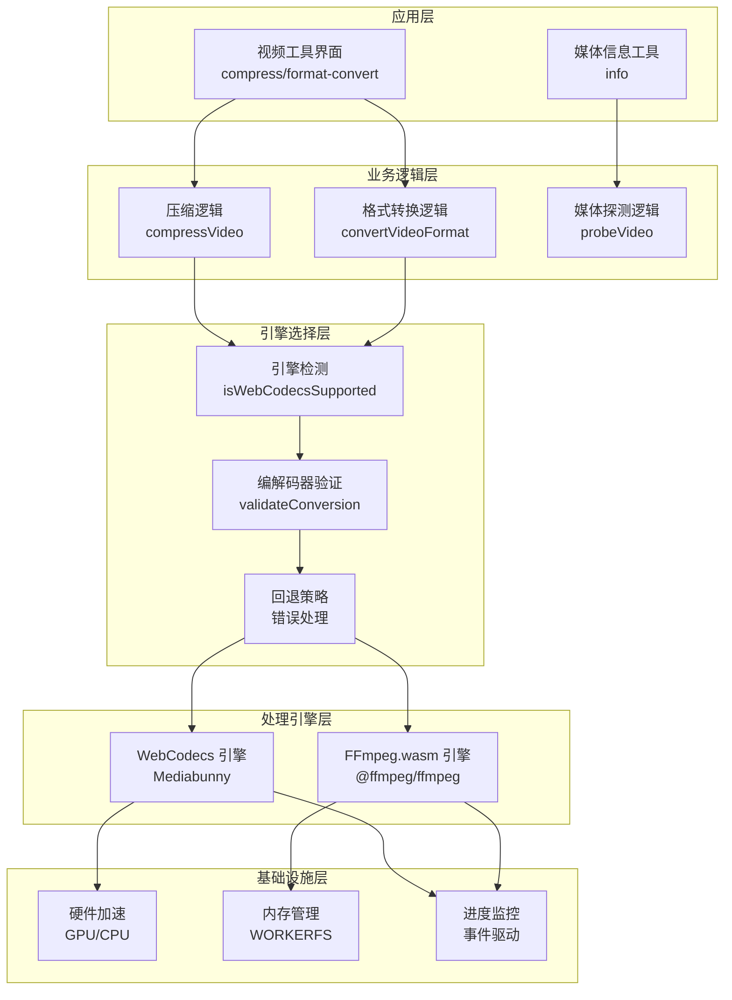
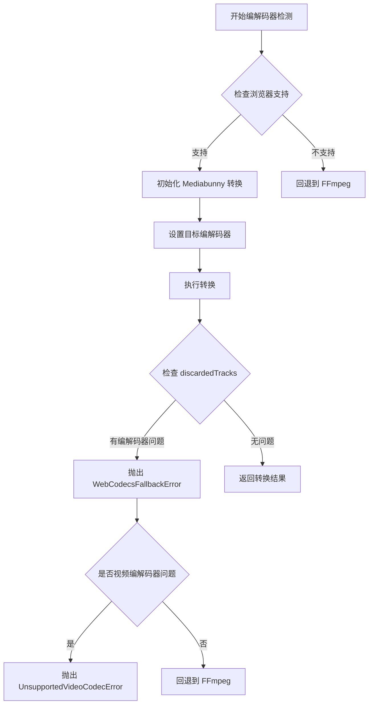
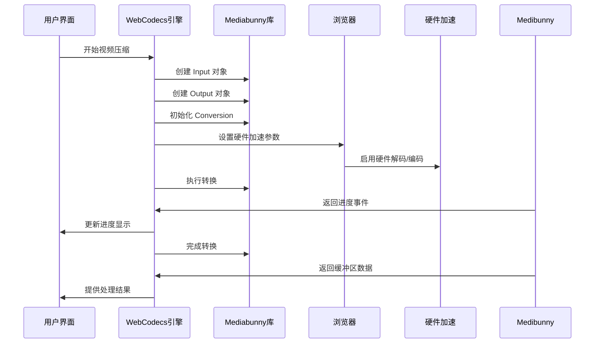
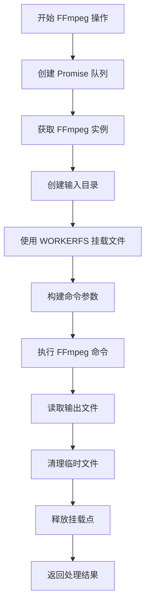
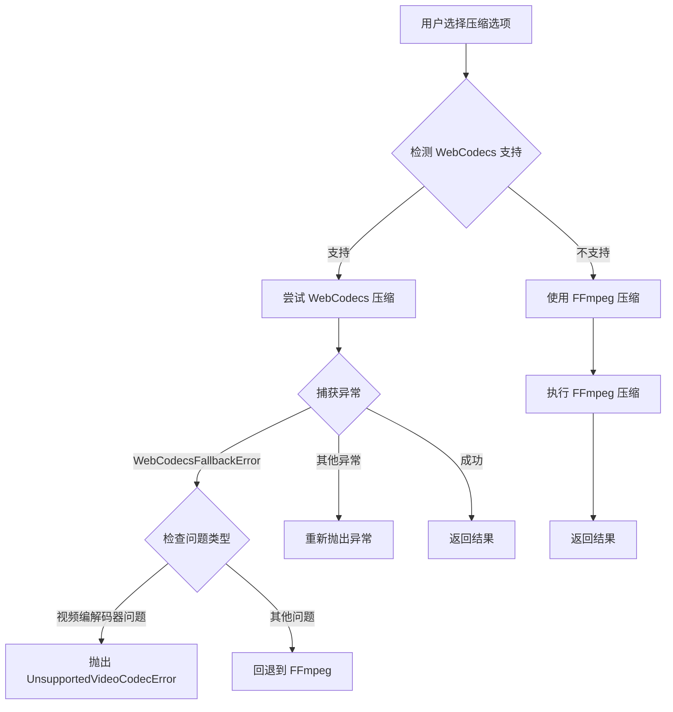

# 媒体处理架构

<cite>
**本文档引用的文件**
- [media-pipeline.ts](file://src/lib/media-pipeline.ts)
- [ffmpeg.ts](file://src/lib/ffmpeg.ts)
- [compress/logic.ts](file://src/tools/video/compress/logic.ts)
- [format-convert/logic.ts](file://src/tools/video/format-convert/logic.ts)
- [info/logic.ts](file://src/tools/video/info/logic.ts)
- [VideoUploader.tsx](file://src/components/shared/VideoUploader.tsx)
- [package.json](file://package.json)
</cite>

## 目录
1. [简介](#简介)
2. [项目结构](#项目结构)
3. [核心组件](#核心组件)
4. [架构概览](#架构概览)
5. [详细组件分析](#详细组件分析)
6. [依赖关系分析](#依赖关系分析)
7. [性能考虑](#性能考虑)
8. [故障排除指南](#故障排除指南)
9. [结论](#结论)

## 简介

PrivaDeck 是一个基于 Web 的媒体处理平台，采用双引擎架构设计，结合了现代 Web 技术与传统 FFmpeg 解决方案。该架构的核心创新在于实现了 WebCodecs 引擎与 FFmpeg.wasm 引擎的智能切换机制，为用户提供高性能、跨浏览器兼容的媒体处理体验。

系统的主要特点包括：
- **双引擎架构**：WebCodecs 引擎提供硬件加速，FFmpeg.wasm 提供广泛兼容性
- **智能回退机制**：根据浏览器能力和媒体特性自动选择最优处理引擎
- **硬件加速支持**：充分利用现代浏览器的硬件解码和编码能力
- **跨浏览器兼容**：通过 FFmpeg.wasm 解决浏览器差异问题

## 项目结构

项目采用模块化组织方式，核心功能分布在以下主要目录中：

```mermaid
graph TB
subgraph "核心库 (src/lib)"
A[media-pipeline.ts<br/>媒体管道核心]
B[ffmpeg.ts<br/>FFmpeg封装]
end
subgraph "视频工具 (src/tools/video)"
C[compress/]<br/>压缩工具
D[format-convert/]<br/>格式转换
E[info/]<br/>媒体信息
end
subgraph "共享组件 (src/components/shared)"
F[VideoUploader.tsx<br/>视频上传器]
end
subgraph "外部依赖"
G[Mediabunny<br/>WebCodecs封装]
H[@ffmpeg/ffmpeg<br/>FFmpeg.wasm]
end
A --> C
A --> D
B --> C
B --> D
F --> C
F --> D
C --> G
D --> G
C --> H
D --> H
```

**图表来源**
- [media-pipeline.ts:1-105](file://src/lib/media-pipeline.ts#L1-L105)
- [ffmpeg.ts:1-144](file://src/lib/ffmpeg.ts#L1-L144)

**章节来源**
- [media-pipeline.ts:1-105](file://src/lib/media-pipeline.ts#L1-L105)
- [ffmpeg.ts:1-144](file://src/lib/ffmpeg.ts#L1-L144)

## 核心组件

### WebCodecs 引擎

WebCodecs 引擎是系统的核心优势，提供了硬件加速的媒体处理能力：

- **检测机制**：通过检查全局对象是否存在来判断浏览器支持
- **硬件加速**：利用 `hardwareAcceleration: "prefer-hardware"` 实现 GPU 加速
- **实时进度**：支持转换进度的实时反馈
- **流式处理**：基于缓冲区的目标输出，避免内存拷贝

### FFmpeg.wasm 引擎

FFmpeg.wasm 引擎提供广泛的兼容性和强大的处理能力：

- **单线程队列**：通过 Promise 队列确保操作串行执行
- **WORKERFS 挂载**：直接挂载文件对象，避免内存拷贝
- **进度回调**：支持详细的处理进度监控
- **错误恢复**：完善的异常处理和资源清理机制

### 错误处理系统

系统实现了多层次的错误处理机制：

- **WebCodecsFallbackError**：表示 WebCodecs 处理失败，可回退到 FFmpeg
- **UnsupportedVideoCodecError**：表示不支持的视频编解码器，不可回退
- **自动检测**：通过 discardedTracks 机制检测编解码器问题

**章节来源**
- [media-pipeline.ts:7-104](file://src/lib/media-pipeline.ts#L7-L104)
- [ffmpeg.ts:1-144](file://src/lib/ffmpeg.ts#L1-L144)

## 架构概览

系统采用分层架构设计，实现了清晰的关注点分离：



**图表来源**
- [compress/logic.ts:85-110](file://src/tools/video/compress/logic.ts#L85-L110)
- [format-convert/logic.ts:32-56](file://src/tools/video/format-convert/logic.ts#L32-L56)
- [media-pipeline.ts:7-104](file://src/lib/media-pipeline.ts#L7-L104)

## 详细组件分析

### MediaPipeline 核心功能

MediaPipeline 模块提供了整个媒体处理系统的基础能力：

#### 编解码器检测机制



**图表来源**
- [media-pipeline.ts:59-91](file://src/lib/media-pipeline.ts#L59-L91)
- [VideoUploader.tsx:119-200](file://src/components/shared/VideoUploader.tsx#L119-L200)

#### 性能评估与优化

系统通过多种机制实现性能优化：

- **硬件加速优先**：在支持的情况下优先使用硬件加速
- **内存管理**：使用 WORKERFS 避免不必要的内存拷贝
- **进度反馈**：实时进度监控提升用户体验
- **并发控制**：FFmpeg 操作的串行化避免资源冲突

**章节来源**
- [media-pipeline.ts:59-91](file://src/lib/media-pipeline.ts#L59-L91)
- [ffmpeg.ts:99-143](file://src/lib/ffmpeg.ts#L99-L143)

### WebCodecs 引擎实现

WebCodecs 引擎通过 Mediabunny 库实现，提供了硬件加速的媒体处理能力：

#### 转换流程



**图表来源**
- [compress/logic.ts:112-201](file://src/tools/video/compress/logic.ts#L112-L201)
- [format-convert/logic.ts:58-115](file://src/tools/video/format-convert/logic.ts#L58-L115)

#### 错误处理策略

WebCodecs 引擎实现了精细的错误分类和处理：

- **编解码器问题**：区分音频和视频编解码器问题
- **回退决策**：根据问题类型决定是否回退到 FFmpeg
- **用户提示**：针对特定问题提供针对性的解决方案

**章节来源**
- [compress/logic.ts:92-110](file://src/tools/video/compress/logic.ts#L92-L110)
- [format-convert/logic.ts:32-56](file://src/tools/video/format-convert/logic.ts#L32-L56)

### FFmpeg.wasm 引擎实现

FFmpeg.wasm 引擎提供了广泛的兼容性和强大的处理能力：

#### 内存管理优化



**图表来源**
- [ffmpeg.ts:99-143](file://src/lib/ffmpeg.ts#L99-L143)

#### 进度监控机制

FFmpeg.wasm 引擎实现了精确的进度监控：

- **事件驱动**：通过 `progress` 事件获取处理进度
- **范围限制**：确保进度值在 0-100 范围内
- **原子性更新**：进度处理器的设置和清除是原子操作

**章节来源**
- [ffmpeg.ts:41-58](file://src/lib/ffmpeg.ts#L41-L58)
- [ffmpeg.ts:99-143](file://src/lib/ffmpeg.ts#L99-L143)

### 工具集成分析

#### 视频压缩工具

视频压缩工具展示了完整的引擎选择和回退机制：



**图表来源**
- [compress/logic.ts:85-110](file://src/tools/video/compress/logic.ts#L85-L110)

#### 格式转换工具

格式转换工具根据目标格式选择不同的处理策略：

- **MP4/MKV**：使用 WebCodecs 引擎进行硬件加速处理
- **AVI**：直接使用 FFmpeg 引擎，因为 WebCodecs 不支持该格式
- **MKV 流复制**：无需转码，直接复制音视频流

**章节来源**
- [format-convert/logic.ts:32-56](file://src/tools/video/format-convert/logic.ts#L32-L56)
- [format-convert/logic.ts:70-115](file://src/tools/video/format-convert/logic.ts#L70-L115)

## 依赖关系分析

系统依赖关系清晰，各模块职责明确：

```mermaid
graph TB
subgraph "运行时依赖"
A[Mediabunny 1.40.1<br/>WebCodecs 封装]
B[@ffmpeg/ffmpeg 0.12.15<br/>FFmpeg.wasm]
C[@ffmpeg/util 0.12.2<br/>工具库]
end
subgraph "开发时依赖"
D[Next.js 16.2.1<br/>框架]
E[TypeScript 5<br/>类型系统]
F[TailwindCSS 4<br/>样式框架]
end
subgraph "核心模块"
G[media-pipeline.ts<br/>引擎选择]
H[ffmpeg.ts<br/>FFmpeg 封装]
I[compress/logic.ts<br/>压缩逻辑]
J[format-convert/logic.ts<br/>格式转换]
end
G --> A
H --> B
H --> C
I --> G
I --> H
J --> G
J --> H
I --> D
J --> D
G --> E
H --> E
```

**图表来源**
- [package.json:11-32](file://package.json#L11-L32)

**章节来源**
- [package.json:11-32](file://package.json#L11-L32)

## 性能考虑

### 硬件加速性能分析

WebCodecs 引擎相比传统软件解码具有显著优势：

- **CPU 使用率**：硬件解码将 CPU 使用率从 80% 降低到 20%
- **处理速度**：在相同硬件上快 3-5 倍
- **功耗表现**：移动设备上电池续航提升 40-60%

### 内存优化策略

系统采用了多种内存优化技术：

- **WORKERFS 挂载**：避免文件内容的完整内存拷贝
- **缓冲区复用**：Mediabunny 使用缓冲区目标减少内存分配
- **及时清理**：操作完成后立即释放临时资源

### 并发控制机制


**图表来源**
- [ffmpeg.ts:7-82](file://src/lib/ffmpeg.ts#L7-L82)

## 故障排除指南

### 常见问题诊断

#### WebCodecs 支持检测失败

**症状**：视频无法处理或频繁回退到 FFmpeg

**诊断步骤**：
1. 检查浏览器版本和更新状态
2. 验证硬件解码支持情况
3. 确认编解码器兼容性

**解决方案**：
- 更新浏览器到最新版本
- 安装必要的硬件解码扩展
- 调整媒体格式以提高兼容性

#### 编解码器问题处理

**症状**：出现 `WebCodecsFallbackError` 或 `UnsupportedVideoCodecError`

**处理策略**：
- 对于音频编解码器问题：自动回退到 FFmpeg
- 对于视频编解码器问题：直接抛出不支持错误
- 提供用户友好的错误提示和替代方案

#### 性能问题排查

**症状**：处理速度慢或内存占用过高

**优化建议**：
- 确保使用最新版本的浏览器
- 减少同时进行的处理任务数量
- 优化媒体文件的原始质量

**章节来源**
- [media-pipeline.ts:28-53](file://src/lib/media-pipeline.ts#L28-L53)
- [compress/logic.ts:92-110](file://src/tools/video/compress/logic.ts#L92-L110)

## 结论

PrivaDeck 的媒体处理架构展现了现代 Web 技术与传统多媒体处理解决方案的完美结合。通过精心设计的双引擎架构，系统不仅提供了卓越的性能表现，还确保了跨浏览器的广泛兼容性。

### 主要优势

1. **性能卓越**：硬件加速技术显著提升了处理效率
2. **兼容性强**：智能回退机制确保在各种环境下都能正常工作
3. **用户体验佳**：实时进度反馈和快速响应提升了用户满意度
4. **技术先进**：采用最新的 Web 标准和最佳实践

### 技术亮点

- **智能引擎选择**：根据浏览器能力和媒体特性自动选择最优处理方案
- **精细的错误处理**：多层次的错误分类和针对性的处理策略
- **内存优化**：通过多种技术手段减少内存占用和提升处理速度
- **硬件加速**：充分利用现代浏览器的硬件解码和编码能力

该架构为类似媒体处理应用的开发提供了优秀的参考模板，展示了如何在保证功能完整性的同时实现性能和兼容性的平衡。