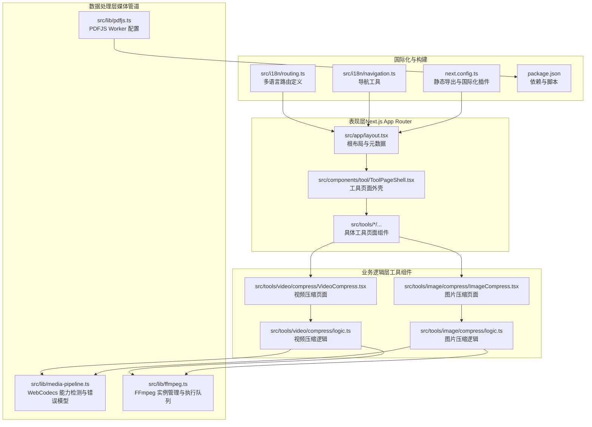
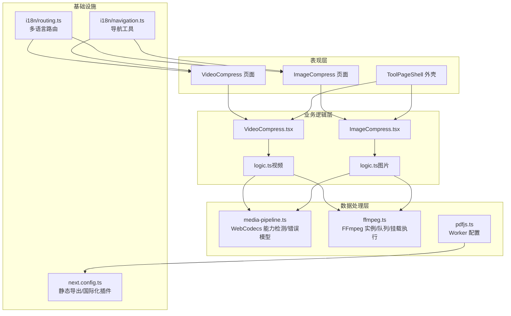
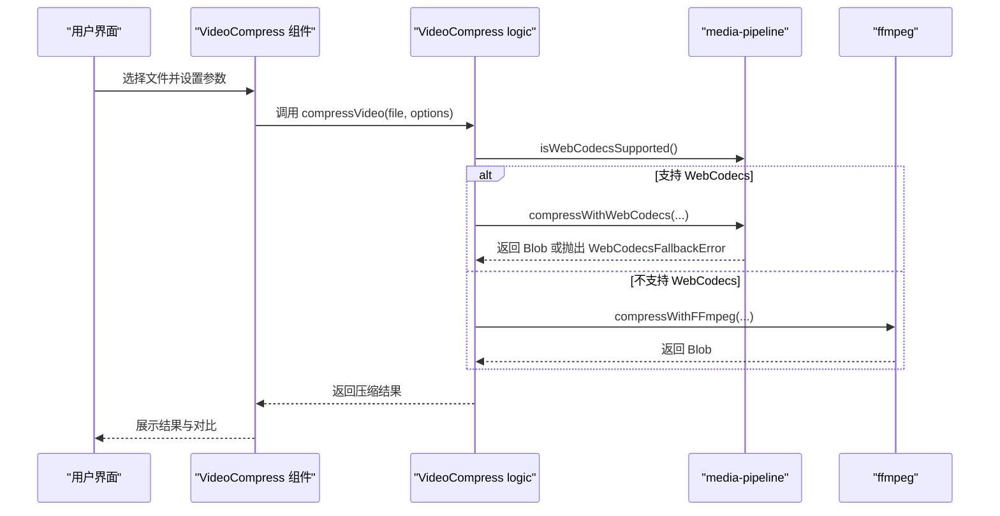
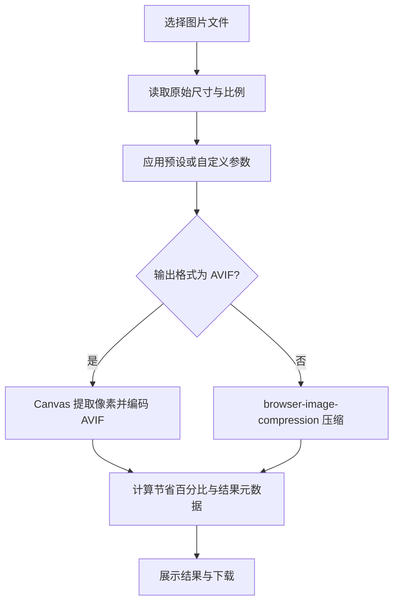
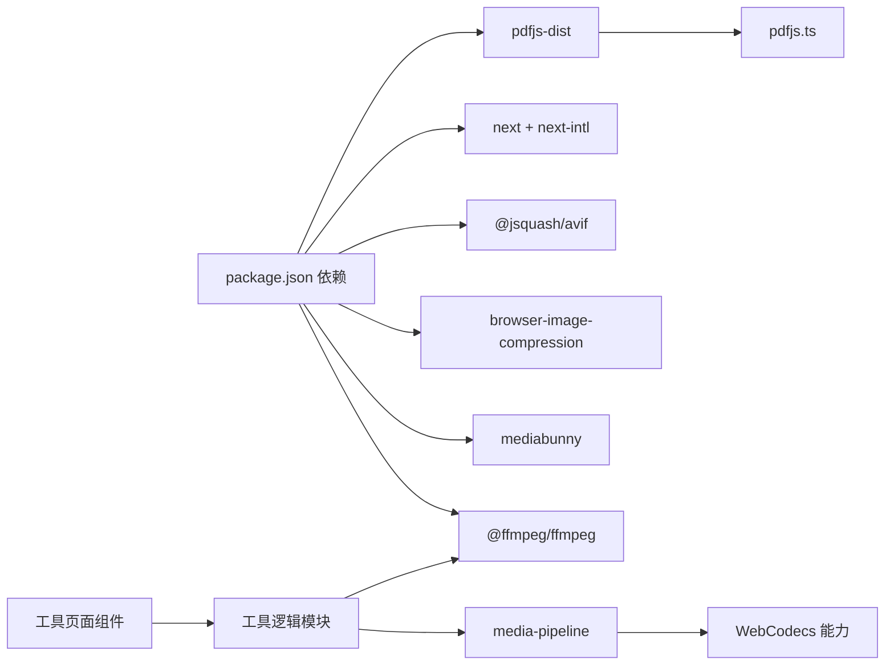

# 整体架构设计

<cite>
**本文档引用的文件**
- [package.json](file://package.json)
- [next.config.ts](file://next.config.ts)
- [src/lib/media-pipeline.ts](file://src/lib/media-pipeline.ts)
- [src/lib/ffmpeg.ts](file://src/lib/ffmpeg.ts)
- [src/i18n/routing.ts](file://src/i18n/routing.ts)
- [src/app/layout.tsx](file://src/app/layout.tsx)
- [src/components/tool/ToolPageShell.tsx](file://src/components/tool/ToolPageShell.tsx)
- [src/tools/video/compress/VideoCompress.tsx](file://src/tools/video/compress/VideoCompress.tsx)
- [src/tools/video/compress/logic.ts](file://src/tools/video/compress/logic.ts)
- [src/tools/image/compress/ImageCompress.tsx](file://src/tools/image/compress/ImageCompress.tsx)
- [src/tools/image/compress/logic.ts](file://src/tools/image/compress/logic.ts)
- [src/i18n/navigation.ts](file://src/i18n/navigation.ts)
- [src/lib/pdfjs.ts](file://src/lib/pdfjs.ts)
</cite>

## 目录
1. [引言](#引言)
2. [项目结构](#项目结构)
3. [核心组件](#核心组件)
4. [架构总览](#架构总览)
5. [详细组件分析](#详细组件分析)
6. [依赖分析](#依赖分析)
7. [性能考虑](#性能考虑)
8. [故障排除指南](#故障排除指南)
9. [结论](#结论)
10. [附录](#附录)

## 引言
本文件为 PrivaDeck 媒体工具箱的整体架构设计文档，聚焦于分层架构、组件化与模块化设计、双引擎架构（WebCodecs + FFmpeg）以及多语言路由与静态生成能力。文档旨在帮助开发者与产品人员快速理解系统的职责划分、数据流与控制流，并提供可操作的优化建议与排障指引。

## 项目结构
PrivaDeck 采用 Next.js App Router 驱动的前端应用，结合工具目录化的模块化组织方式。项目结构遵循“表现层（App Router）—业务逻辑层（工具组件）—数据处理层（媒体管道）”的分层设计，辅以国际化与静态导出配置。

**图示来源**
- [src/app/layout.tsx:1-48](file://src/app/layout.tsx#L1-L48)
- [src/components/tool/ToolPageShell.tsx:1-54](file://src/components/tool/ToolPageShell.tsx#L1-L54)
- [src/tools/video/compress/VideoCompress.tsx:1-536](file://src/tools/video/compress/VideoCompress.tsx#L1-L536)
- [src/tools/image/compress/ImageCompress.tsx:1-373](file://src/tools/image/compress/ImageCompress.tsx#L1-L373)
- [src/tools/video/compress/logic.ts:1-257](file://src/tools/video/compress/logic.ts#L1-L257)
- [src/tools/image/compress/logic.ts:1-135](file://src/tools/image/compress/logic.ts#L1-L135)
- [src/lib/media-pipeline.ts:1-105](file://src/lib/media-pipeline.ts#L1-L105)
- [src/lib/ffmpeg.ts:1-144](file://src/lib/ffmpeg.ts#L1-L144)
- [src/lib/pdfjs.ts:1-16](file://src/lib/pdfjs.ts#L1-L16)
- [src/i18n/routing.ts:1-18](file://src/i18n/routing.ts#L1-L18)
- [src/i18n/navigation.ts:1-6](file://src/i18n/navigation.ts#L1-L6)
- [next.config.ts:1-13](file://next.config.ts#L1-L13)
- [package.json:1-45](file://package.json#L1-L45)

**章节来源**
- [package.json:1-45](file://package.json#L1-L45)
- [next.config.ts:1-13](file://next.config.ts#L1-L13)
- [src/app/layout.tsx:1-48](file://src/app/layout.tsx#L1-L48)
- [src/i18n/routing.ts:1-18](file://src/i18n/routing.ts#L1-L18)

## 核心组件
- 表现层（Next.js App Router）
  - 根布局与元数据：统一站点标题、描述、OpenGraph 图像与 Twitter 卡片配置。
  - 工具页面外壳：封装工具页标题、隐私指示器、功能卡片与描述等通用 UI 结构。
- 业务逻辑层（工具组件）
  - 视频压缩：支持简单/高级模式，参数化 CRF、分辨率、帧率、音频码率与最大码率；具备进度反馈与结果对比。
  - 图片压缩：支持预设与自定义质量、最大尺寸、输出格式与 EXIF 保留；批量处理与逐项结果展示。
- 数据处理层（媒体管道）
  - WebCodecs 管道：基于 Mediabunny 的硬件加速编解码，自动回退至 FFmpeg。
  - FFmpeg 管道：WASM 加载、WORKERFS 挂载、串行执行队列、进度事件监听。
  - PDFJS：按需加载并配置 Worker，避免全局污染。
- 国际化与构建
  - 多语言路由：显式声明可用语言与默认语言，支持 RTL 语言标记。
  - 导航工具：基于路由配置生成 Link、redirect、usePathname 等工具。
  - 静态导出：禁用图片优化、尾斜杠与静态导出，便于离线部署。

**章节来源**
- [src/app/layout.tsx:1-48](file://src/app/layout.tsx#L1-L48)
- [src/components/tool/ToolPageShell.tsx:1-54](file://src/components/tool/ToolPageShell.tsx#L1-L54)
- [src/tools/video/compress/VideoCompress.tsx:1-536](file://src/tools/video/compress/VideoCompress.tsx#L1-L536)
- [src/tools/image/compress/ImageCompress.tsx:1-373](file://src/tools/image/compress/ImageCompress.tsx#L1-L373)
- [src/lib/media-pipeline.ts:1-105](file://src/lib/media-pipeline.ts#L1-L105)
- [src/lib/ffmpeg.ts:1-144](file://src/lib/ffmpeg.ts#L1-L144)
- [src/lib/pdfjs.ts:1-16](file://src/lib/pdfjs.ts#L1-L16)
- [src/i18n/routing.ts:1-18](file://src/i18n/routing.ts#L1-L18)
- [src/i18n/navigation.ts:1-6](file://src/i18n/navigation.ts#L1-L6)
- [next.config.ts:1-13](file://next.config.ts#L1-L13)

## 架构总览
系统采用“表现层 + 业务逻辑层 + 数据处理层”的三层架构，配合双引擎媒体处理策略与国际化静态导出能力，实现高性能、可扩展与隐私优先的在线媒体工具平台。

**图示来源**
- [src/tools/video/compress/VideoCompress.tsx:1-536](file://src/tools/video/compress/VideoCompress.tsx#L1-L536)
- [src/tools/image/compress/ImageCompress.tsx:1-373](file://src/tools/image/compress/ImageCompress.tsx#L1-L373)
- [src/tools/video/compress/logic.ts:1-257](file://src/tools/video/compress/logic.ts#L1-L257)
- [src/tools/image/compress/logic.ts:1-135](file://src/tools/image/compress/logic.ts#L1-L135)
- [src/lib/media-pipeline.ts:1-105](file://src/lib/media-pipeline.ts#L1-L105)
- [src/lib/ffmpeg.ts:1-144](file://src/lib/ffmpeg.ts#L1-L144)
- [src/lib/pdfjs.ts:1-16](file://src/lib/pdfjs.ts#L1-L16)
- [src/i18n/routing.ts:1-18](file://src/i18n/routing.ts#L1-L18)
- [src/i18n/navigation.ts:1-6](file://src/i18n/navigation.ts#L1-L6)
- [next.config.ts:1-13](file://next.config.ts#L1-L13)

## 详细组件分析

### 双引擎架构（WebCodecs + FFmpeg）
- 设计理念
  - WebCodecs 作为首选路径，利用浏览器硬件加速与原生编解码能力，降低内存占用与 CPU 开销。
  - 对于不支持或存在编解码问题的场景，系统通过错误模型进行安全回退至 FFmpeg，确保兼容性与稳定性。
- 关键机制
  - 能力检测：在运行时判断 VideoEncoder/Decoder 与 AudioEncoder/Decoder 是否可用。
  - 错误模型：区分“可回退”与“不可回退”的编解码问题；对视频硬解码失败（如 HEVC/VP9/AV1）直接抛出不可回退错误，避免劣质回退。
  - 进度回调：WebCodecs 通过转换对象的进度事件驱动 UI 进度条；FFmpeg 通过事件监听器映射到 0-100 的整数进度。
  - 执行队列：FFmpeg 使用 Promise 队列串行执行，避免并发挂载点冲突与 WASM 单线程限制。
  - WORKERFS 挂载：直接从 File 对象挂载输入，避免内存复制，提升大文件处理效率。
- 典型流程（视频压缩）

**图示来源**
- [src/tools/video/compress/VideoCompress.tsx:1-536](file://src/tools/video/compress/VideoCompress.tsx#L1-L536)
- [src/tools/video/compress/logic.ts:1-257](file://src/tools/video/compress/logic.ts#L1-L257)
- [src/lib/media-pipeline.ts:1-105](file://src/lib/media-pipeline.ts#L1-L105)
- [src/lib/ffmpeg.ts:1-144](file://src/lib/ffmpeg.ts#L1-L144)

**章节来源**
- [src/lib/media-pipeline.ts:1-105](file://src/lib/media-pipeline.ts#L1-L105)
- [src/lib/ffmpeg.ts:1-144](file://src/lib/ffmpeg.ts#L1-L144)
- [src/tools/video/compress/logic.ts:1-257](file://src/tools/video/compress/logic.ts#L1-L257)
- [src/tools/video/compress/VideoCompress.tsx:1-536](file://src/tools/video/compress/VideoCompress.tsx#L1-L536)

### 组件化与模块化设计
- 组件化
  - 工具页面外壳 ToolPageShell 将工具页的通用结构（标题、隐私指示器、功能卡片、描述等）抽象为可复用组件，降低重复代码。
  - 视频/图片工具各自维护独立的页面组件与逻辑模块，保持关注点分离。
- 模块化
  - 工具按类别组织（audio/image/pdf/video），每个工具包含页面组件、逻辑模块与索引文件，便于新增与维护。
  - 逻辑模块内部进一步拆分：参数校验、格式解析、调用链封装与 UI 交互，增强内聚与可测试性。
- 动态扩展
  - 新增工具时，仅需在对应目录下添加页面组件与逻辑模块，并在路由层级中自然暴露，无需修改核心路由配置。

**章节来源**
- [src/components/tool/ToolPageShell.tsx:1-54](file://src/components/tool/ToolPageShell.tsx#L1-L54)
- [src/tools/video/compress/VideoCompress.tsx:1-536](file://src/tools/video/compress/VideoCompress.tsx#L1-L536)
- [src/tools/image/compress/ImageCompress.tsx:1-373](file://src/tools/image/compress/ImageCompress.tsx#L1-L373)

### 多语言路由与静态生成
- 多语言路由
  - 显式声明可用语言列表与默认语言，支持部分语言（如阿拉伯语）的 RTL 标记。
  - 基于 next-intl 的路由定义与导航工具，保证链接与重定向的一致性。
- 静态生成
  - 配置静态导出（export），禁用图片优化与尾斜杠，适配离线部署与 CDN 分发。
  - 国际化插件与静态导出协同工作，确保多语言页面在构建期生成。

**图示来源**
- [src/i18n/routing.ts:1-18](file://src/i18n/routing.ts#L1-L18)
- [src/i18n/navigation.ts:1-6](file://src/i18n/navigation.ts#L1-L6)
- [next.config.ts:1-13](file://next.config.ts#L1-L13)

**章节来源**
- [src/i18n/routing.ts:1-18](file://src/i18n/routing.ts#L1-L18)
- [src/i18n/navigation.ts:1-6](file://src/i18n/navigation.ts#L1-L6)
- [next.config.ts:1-13](file://next.config.ts#L1-L13)

### 数据流与处理流程（图片压缩）

**图示来源**
- [src/tools/image/compress/ImageCompress.tsx:1-373](file://src/tools/image/compress/ImageCompress.tsx#L1-L373)
- [src/tools/image/compress/logic.ts:1-135](file://src/tools/image/compress/logic.ts#L1-L135)

**章节来源**
- [src/tools/image/compress/ImageCompress.tsx:1-373](file://src/tools/image/compress/ImageCompress.tsx#L1-L373)
- [src/tools/image/compress/logic.ts:1-135](file://src/tools/image/compress/logic.ts#L1-L135)

## 依赖分析
- 外部依赖
  - 媒体处理：@ffmpeg/ffmpeg、mediabunny、browser-image-compression、@jsquash/avif、tesseract.js、pdfjs-dist。
  - 框架与工具：next、next-intl、react、react-dom、lucide-react、fflate、heic2any、js-yaml。
- 内部依赖
  - 工具页面组件依赖对应的逻辑模块；逻辑模块依赖媒体管道库；媒体管道库依赖 FFmpeg 与 WebCodecs 能力检测。
- 潜在风险
  - FFmpeg WASM 单线程与并发挂载点冲突：通过 Promise 队列串行化解决。
  - WebCodecs 编解码失败：通过错误模型区分可回退与不可回退场景，避免劣质回退。

**图示来源**
- [package.json:1-45](file://package.json#L1-L45)
- [src/lib/media-pipeline.ts:1-105](file://src/lib/media-pipeline.ts#L1-L105)
- [src/lib/ffmpeg.ts:1-144](file://src/lib/ffmpeg.ts#L1-L144)
- [src/lib/pdfjs.ts:1-16](file://src/lib/pdfjs.ts#L1-L16)

**章节来源**
- [package.json:1-45](file://package.json#L1-L45)
- [src/lib/media-pipeline.ts:1-105](file://src/lib/media-pipeline.ts#L1-L105)
- [src/lib/ffmpeg.ts:1-144](file://src/lib/ffmpeg.ts#L1-L144)

## 性能考虑
- WebCodecs 优先策略
  - 利用硬件加速减少 CPU 占用，适合常见编解码场景；对不支持或不可回退的编解码问题直接中断，避免劣化体验。
- FFmpeg 优化
  - 使用 WORKERFS 挂载避免内存复制；通过串行队列防止并发冲突；进度事件映射到 UI，提升感知性能。
- 图片压缩
  - AVIF 编码前先按目标尺寸缩放，减少像素处理量；浏览器压缩库启用 Web Worker 与合适的初始质量。
- 构建与部署
  - 静态导出减少首屏等待；禁用图片优化避免额外转换开销；尾斜杠与本地化资源打包提升 CDN 友好性。

[本节为通用性能指导，不直接分析具体文件]

## 故障排除指南
- WebCodecs 不可用
  - 现象：工具提示不支持当前环境。
  - 排查：确认浏览器支持 Video/Audio Encoder/Decoder；若为 Windows + Chromium，可提示安装 HEVC 扩展。
- 视频编解码不受支持
  - 现象：抛出不可回退错误，提示视频编解码器不受支持。
  - 排查：确认源视频是否为 H.265/VP9/AV1 等不受支持的编解码器；必要时引导用户更换源文件或使用外部工具转码。
- FFmpeg 加载失败
  - 现象：初始化失败或无法获取实例。
  - 排查：检查 CDN 可达性与网络策略；确认 SharedArrayBuffer 支持（跨源隔离要求）。
- PDFJS Worker 未加载
  - 现象：PDF 相关功能异常。
  - 排查：确认 Worker 路径正确且已按需配置；避免重复初始化导致的资源冲突。

**章节来源**
- [src/lib/media-pipeline.ts:1-105](file://src/lib/media-pipeline.ts#L1-L105)
- [src/lib/ffmpeg.ts:1-144](file://src/lib/ffmpeg.ts#L1-L144)
- [src/lib/pdfjs.ts:1-16](file://src/lib/pdfjs.ts#L1-L16)

## 结论
PrivaDeck 通过清晰的三层架构与双引擎媒体处理策略，在保障隐私与性能的同时实现了高度模块化与可扩展性。Next.js App Router 与国际化配置提供了良好的用户体验与部署灵活性；WebCodecs 与 FFmpeg 的智能回退机制确保了跨浏览器兼容性与处理质量。未来可在工具注册表系统与更细粒度的错误分类上进一步增强扩展性与可观测性。

[本节为总结性内容，不直接分析具体文件]

## 附录
- 关键术语
  - WebCodecs：浏览器原生编解码 API，支持硬件加速。
  - FFmpeg.wasm：在浏览器中运行的 FFmpeg，通过 WASM 与虚拟文件系统实现。
  - WORKERFS：FFmpeg 的文件系统挂载方式，支持直接从 File 对象读取。
  - 静态导出：构建时生成静态页面，适合离线部署与 CDN 分发。

[本节为概念性内容，不直接分析具体文件]