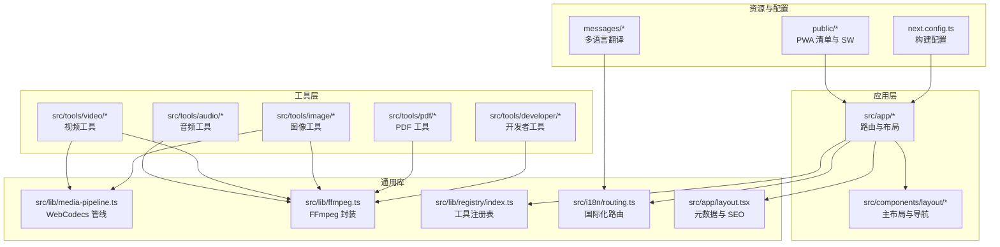
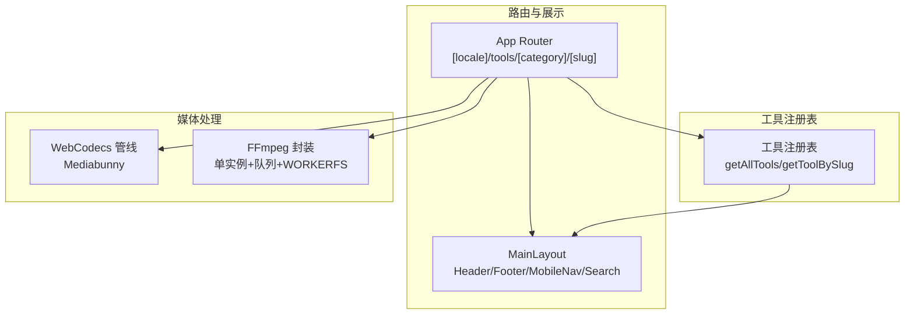
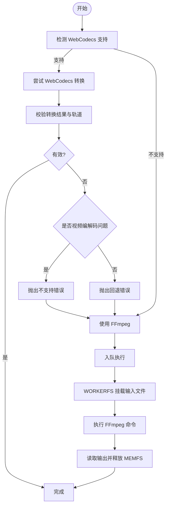
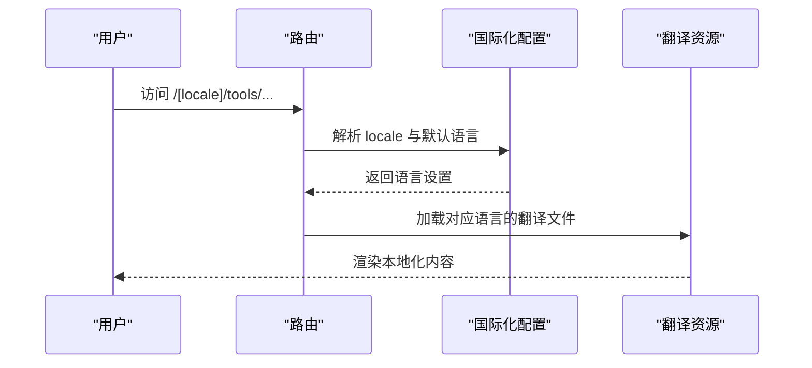
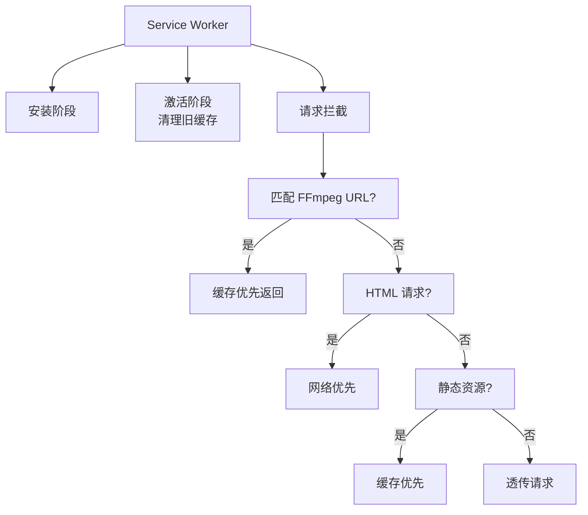
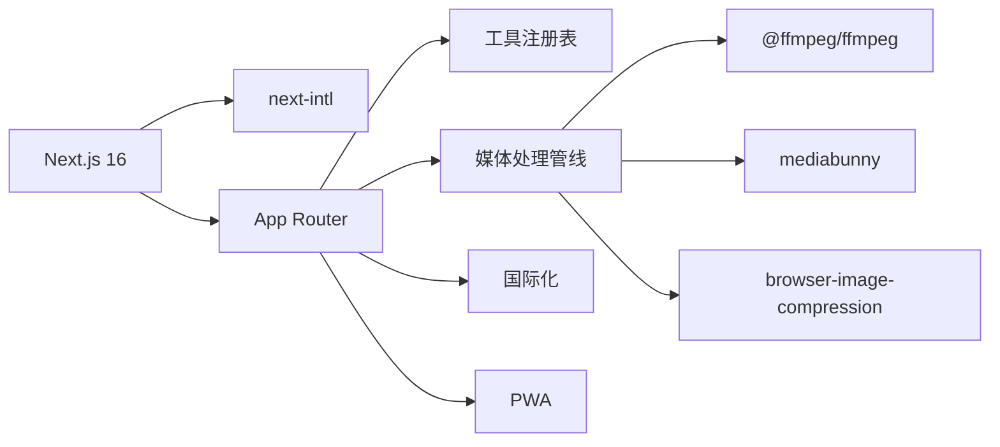

# 项目架构

<cite>
**本文档引用的文件**
- [package.json](file://package.json)
- [next.config.ts](file://next.config.ts)
- [src/lib/media-pipeline.ts](file://src/lib/media-pipeline.ts)
- [src/lib/ffmpeg.ts](file://src/lib/ffmpeg.ts)
- [src/lib/registry/index.ts](file://src/lib/registry/index.ts)
- [src/lib/registry/types.ts](file://src/lib/registry/types.ts)
- [src/i18n/routing.ts](file://src/i18n/routing.ts)
- [src/app/layout.tsx](file://src/app/layout.tsx)
- [public/sw.js](file://public/sw.js)
- [src/tools/audio/convert/logic.ts](file://src/tools/audio/convert/logic.ts)
- [src/tools/image/compress/logic.ts](file://src/tools/image/compress/logic.ts)
- [src/components/layout/MainLayout.tsx](file://src/components/layout/MainLayout.tsx)
</cite>

## 目录
1. [引言](#引言)
2. [项目结构](#项目结构)
3. [核心组件](#核心组件)
4. [架构总览](#架构总览)
5. [详细组件分析](#详细组件分析)
6. [依赖分析](#依赖分析)
7. [性能考虑](#性能考虑)
8. [故障排除指南](#故障排除指南)
9. [结论](#结论)
10. [附录](#附录)

## 引言
本项目为 PrivaDeck 媒体工具箱，采用 Next.js App Router 架构，结合 WebCodecs 与 FFmpeg 双引擎媒体处理管线，通过工具注册表实现模块化扩展，并提供多语言国际化与 PWA 能力。本文档从架构设计、组件关系、数据流与处理逻辑、性能优化与错误处理等方面进行系统化梳理，帮助开发者快速理解并高效扩展系统。

## 项目结构
项目采用基于功能域的分层组织方式：
- 应用层：Next.js App Router 页面与布局，负责路由、元数据与 PWA 集成
- 工具层：按领域划分的工具模块（音频、视频、图像、PDF、开发者工具），每个工具包含页面组件与业务逻辑
- 通用库：媒体处理管线、FFmpeg 封装、国际化路由、工具注册表、SEO 辅助等
- 资源与配置：国际化翻译资源、PWA 清单与 Service Worker、构建配置



**图表来源**
- [src/app/layout.tsx:1-48](file://src/app/layout.tsx#L1-L48)
- [src/lib/registry/index.ts:1-164](file://src/lib/registry/index.ts#L1-L164)
- [src/i18n/routing.ts:1-18](file://src/i18n/routing.ts#L1-L18)
- [next.config.ts:1-13](file://next.config.ts#L1-L13)

**章节来源**
- [package.json:1-45](file://package.json#L1-L45)
- [next.config.ts:1-13](file://next.config.ts#L1-L13)
- [src/app/layout.tsx:1-48](file://src/app/layout.tsx#L1-L48)

## 核心组件
- 双引擎媒体处理管线
  - WebCodecs 管线：基于 Mediabunny 的硬件加速编解码，优先使用；不支持时回退到 FFmpeg
  - FFmpeg 封装：单实例、串行队列执行，WORKERFS 挂载避免内存拷贝，进度事件统一处理
- 工具注册表系统
  - 统一声明工具元数据与懒加载组件，按分类聚合，支持特性筛选与相关工具推荐
- 国际化系统
  - 基于 next-intl 的路由国际化，支持动态语言切换、翻译资源管理与 RTL 语言标识
- PWA 与 SEO
  - Service Worker 缓存策略、Manifest 集成、静态导出与 Open Graph/Twitter 元数据

**章节来源**
- [src/lib/media-pipeline.ts:1-105](file://src/lib/media-pipeline.ts#L1-L105)
- [src/lib/ffmpeg.ts:1-144](file://src/lib/ffmpeg.ts#L1-L144)
- [src/lib/registry/index.ts:1-164](file://src/lib/registry/index.ts#L1-L164)
- [src/i18n/routing.ts:1-18](file://src/i18n/routing.ts#L1-L18)
- [src/app/layout.tsx:10-39](file://src/app/layout.tsx#L10-L39)
- [public/sw.js:1-93](file://public/sw.js#L1-L93)

## 架构总览
系统采用“路由驱动 + 工具注册表 + 双引擎媒体处理”的架构模式：
- 路由层：Next.js App Router 支持多语言路径与静态生成，工具页面按 [category]/[slug] 结构组织
- 工具层：每个工具仅注册元数据与懒加载组件，实际渲染在客户端按需加载
- 处理层：根据浏览器能力自动选择 WebCodecs 或 FFmpeg；对 FFmpeg 使用串行队列与 WORKERFS 提升性能与稳定性
- 展示层：主布局提供全局导航、搜索与移动端菜单，配合主题切换与安装提示



**图表来源**
- [src/app/layout.tsx:1-48](file://src/app/layout.tsx#L1-L48)
- [src/lib/registry/index.ts:135-164](file://src/lib/registry/index.ts#L135-L164)
- [src/lib/media-pipeline.ts:7-14](file://src/lib/media-pipeline.ts#L7-L14)
- [src/lib/ffmpeg.ts:10-39](file://src/lib/ffmpeg.ts#L10-L39)

## 详细组件分析

### 媒体处理管线（WebCodecs + FFmpeg）
- 能力检测与回退策略
  - 通过检测 WebCodecs 编解码器存在性决定是否启用硬件加速
  - 对不可解码的视频编码或转换无效的情况抛出自定义错误，触发 FFmpeg 回退
  - 在 Windows + Chromium 浏览器上建议安装 HEVC 扩展以获得硬件解码
- 性能优化
  - FFmpeg 单实例加载，串行队列执行，避免并发冲突
  - 使用 WORKERFS 直接挂载输入文件，避免内存复制；完成后立即释放 MEMFS 输出
  - 进度事件统一转换为 0-100 的整数回调
- 错误处理
  - 加载失败时清理实例并重新抛出异常
  - 轨道丢弃与转换有效性校验，确保音视频完整性



**图表来源**
- [src/lib/media-pipeline.ts:7-105](file://src/lib/media-pipeline.ts#L7-L105)
- [src/lib/ffmpeg.ts:75-144](file://src/lib/ffmpeg.ts#L75-L144)

**章节来源**
- [src/lib/media-pipeline.ts:1-105](file://src/lib/media-pipeline.ts#L1-L105)
- [src/lib/ffmpeg.ts:1-144](file://src/lib/ffmpeg.ts#L1-L144)

### 工具注册表系统
- 设计目标
  - 将工具的元数据与组件懒加载解耦，便于维护与扩展
  - 按类别聚合工具，支持特性筛选、相关工具推荐与全量 slug 列表
- 关键接口
  - 获取全部工具、按 slug/分类查询、按分类筛选特性/非特性工具、生成所有 slug
- 工具定义结构
  - 包含 slug、分类、图标、是否特性、组件懒加载函数、SEO 结构化数据类型、FAQ 与相关工具列表

```mermaid
classDiagram
class ToolDefinition {
+string slug
+ToolCategory category
+string icon
+boolean featured
+component() Promise
+seo
+faq[]
+relatedSlugs[]
}
class Registry {
+getAllTools() ToolDefinition[]
+getToolBySlug(slug, category?) ToolDefinition
+getToolsByCategory(category) ToolDefinition[]
+getFeaturedTools(category) ToolDefinition[]
+getNonFeaturedTools(category) ToolDefinition[]
+getAllSlugs() {category, slug}[]
}
Registry --> ToolDefinition : "管理"
```

**图表来源**
- [src/lib/registry/types.ts:3-21](file://src/lib/registry/types.ts#L3-L21)
- [src/lib/registry/index.ts:135-164](file://src/lib/registry/index.ts#L135-L164)

**章节来源**
- [src/lib/registry/index.ts:1-164](file://src/lib/registry/index.ts#L1-L164)
- [src/lib/registry/types.ts:1-21](file://src/lib/registry/types.ts#L1-L21)

### 国际化系统（多语言与 RTL）
- 路由国际化
  - 定义支持的语言列表、默认语言与 RTL 语言集合
  - 基于 next-intl 的路由规则，页面路径包含 locale 片段
- 动态语言切换
  - 通过路由跳转与语言切换组件实现无刷新切换
- 翻译资源管理
  - 按语言与工具域划分 JSON 文件，按需加载
- RTL 支持
  - 通过路由配置标记 RTL 语言，用于样式与布局适配



**图表来源**
- [src/i18n/routing.ts:1-18](file://src/i18n/routing.ts#L1-L18)
- [src/app/layout.tsx:10-39](file://src/app/layout.tsx#L10-L39)

**章节来源**
- [src/i18n/routing.ts:1-18](file://src/i18n/routing.ts#L1-L18)

### PWA 与离线可用性
- Service Worker 缓存策略
  - 永久缓存 FFmpeg 核心文件（版本化 URL）
  - HTML 采用网络优先策略，保持内容新鲜
  - 静态资源采用缓存优先策略
- Manifest 集成
  - 在根布局中声明 manifest 与 Apple WebApp 元数据
- 静态导出
  - 构建配置开启静态导出，利于边缘部署与离线访问



**图表来源**
- [public/sw.js:1-93](file://public/sw.js#L1-L93)
- [src/app/layout.tsx:10-39](file://src/app/layout.tsx#L10-L39)
- [next.config.ts:6-10](file://next.config.ts#L6-L10)

**章节来源**
- [public/sw.js:1-93](file://public/sw.js#L1-L93)
- [src/app/layout.tsx:10-39](file://src/app/layout.tsx#L10-L39)
- [next.config.ts:1-13](file://next.config.ts#L1-L13)

### SEO 优化策略
- 结构化元数据
  - 设置站点标题模板、描述、Open Graph 图片与 Twitter 卡片
  - 指定 manifest 与 Apple WebApp 标识
- 路由与静态生成
  - 使用 App Router 与静态导出，提升首屏性能与可抓取性
- 内容组织
  - 工具页面结构清晰，FAQ 与相关工具增强用户体验与可发现性

**章节来源**
- [src/app/layout.tsx:10-39](file://src/app/layout.tsx#L10-L39)
- [next.config.ts:6-10](file://next.config.ts#L6-L10)

### 主布局与导航
- 全局快捷键
  - Ctrl/Cmd + K 打开搜索对话框
- 移动端体验
  - 移动导航抽屉与底部页脚，适配小屏设备
- 工具导航上下文
  - 提供工具导航数据上下文，支持多语言导航项

**章节来源**
- [src/components/layout/MainLayout.tsx:1-57](file://src/components/layout/MainLayout.tsx#L1-L57)

## 依赖分析
- 核心依赖
  - Next.js 16 与 next-intl 实现 App Router 与国际化
  - @ffmpeg/ffmpeg 与 @ffmpeg/util 提供 FFmpeg WebAssembly 能力
  - mediabunny 与 browser-image-compression 提供 WebCodecs 与图像压缩
  - pdfjs-dist、pdf-lib、tesseract.js 等处理 PDF 与 OCR
- 开发与构建
  - Tailwind CSS v4、ESLint、TypeScript 配置
  - next.config.ts 启用静态导出与图片优化关闭



**图表来源**
- [package.json:11-32](file://package.json#L11-L32)
- [next.config.ts:1-13](file://next.config.ts#L1-13)

**章节来源**
- [package.json:1-45](file://package.json#L1-L45)
- [next.config.ts:1-13](file://next.config.ts#L1-L13)

## 性能考虑
- 媒体处理
  - WebCodecs 优先：利用硬件加速，降低 CPU 占用
  - FFmpeg 串行队列：避免并发冲突，保证稳定性
  - WORKERFS 挂载：零拷贝读取输入文件，减少内存峰值
  - 进度回调：统一为百分比整数，便于 UI 响应
- 资源加载
  - Service Worker 缓存 FFmpeg 核心文件，显著降低二次加载时间
  - 静态导出与缓存优先策略，提升首屏与离线可用性
- 图像处理
  - 预设质量与尺寸参数，平衡体积与画质
  - AVIF 编码路径与 Web Worker 压缩，减少主线程阻塞

**章节来源**
- [src/lib/media-pipeline.ts:7-105](file://src/lib/media-pipeline.ts#L7-L105)
- [src/lib/ffmpeg.ts:75-144](file://src/lib/ffmpeg.ts#L75-L144)
- [public/sw.js:30-92](file://public/sw.js#L30-L92)
- [src/tools/image/compress/logic.ts:26-135](file://src/tools/image/compress/logic.ts#L26-L135)

## 故障排除指南
- WebCodecs 回退
  - 现象：转换失败或轨道被丢弃
  - 处理：捕获自定义回退错误后自动切换至 FFmpeg
  - 建议：检查源媒体编解码器兼容性，必要时引导安装 HEVC 扩展
- FFmpeg 加载失败
  - 现象：初始化异常或实例状态异常
  - 处理：清理实例与加载状态，重新抛出错误以便上层捕获
- 进度回调异常
  - 现象：进度值越界或未触发
  - 处理：统一转换为 0-100 的整数回调，确保 UI 正常更新
- Service Worker 缓存命中问题
  - 现象：离线无法加载或内容陈旧
  - 处理：确认缓存键与版本号一致，激活阶段清理旧缓存

**章节来源**
- [src/lib/media-pipeline.ts:28-91](file://src/lib/media-pipeline.ts#L28-L91)
- [src/lib/ffmpeg.ts:14-39](file://src/lib/ffmpeg.ts#L14-L39)
- [src/lib/ffmpeg.ts:41-58](file://src/lib/ffmpeg.ts#L41-L58)
- [public/sw.js:11-28](file://public/sw.js#L11-L28)

## 结论
本项目通过“路由驱动 + 工具注册表 + 双引擎媒体处理”的架构，实现了高可扩展性与高性能的媒体工具平台。WebCodecs 与 FFmpeg 的智能回退策略兼顾了现代浏览器的硬件加速与广泛兼容性；工具注册表简化了模块化扩展；国际化与 PWA 能力提升了全球化与离线可用性。整体设计在保证隐私与性能的同时，提供了良好的开发体验与可维护性。

## 附录
- 工具示例
  - 音频转换：基于 FFmpeg 的格式转换，支持多种音频编码参数
  - 图像压缩：内置预设与 AVIF 编码路径，兼顾体积与画质
- 配置参考
  - 构建配置：静态导出、图片优化关闭、尾斜杠
  - 国际化：语言列表、默认语言、RTL 标记

**章节来源**
- [src/tools/audio/convert/logic.ts:21-34](file://src/tools/audio/convert/logic.ts#L21-L34)
- [src/tools/image/compress/logic.ts:83-123](file://src/tools/image/compress/logic.ts#L83-L123)
- [next.config.ts:6-10](file://next.config.ts#L6-L10)
- [src/i18n/routing.ts:3-12](file://src/i18n/routing.ts#L3-L12)