# 项目概述

<cite>
**本文档引用的文件**
- [README.md](file://README.md)
- [package.json](file://package.json)
- [next.config.ts](file://next.config.ts)
- [src/app/layout.tsx](file://src/app/layout.tsx)
- [src/lib/ffmpeg.ts](file://src/lib/ffmpeg.ts)
- [src/lib/pdfjs.ts](file://src/lib/pdfjs.ts)
- [src/i18n/routing.ts](file://src/i18n/routing.ts)
- [src/components/shared/ThemeToggle.tsx](file://src/components/shared/ThemeToggle.tsx)
- [public/manifest.json](file://public/manifest.json)
- [messages/en/common.json](file://messages/en/common.json)
- [src/lib/registry/index.ts](file://src/lib/registry/index.ts)
- [src/tools/image/format-converter/index.ts](file://src/tools/image/format-converter/index.ts)
- [src/tools/video/compress/index.ts](file://src/tools/video/compress/index.ts)
- [tsconfig.json](file://tsconfig.json)
</cite>

## 目录
1. [项目简介](#项目简介)
2. [项目结构](#项目结构)
3. [核心特性](#核心特性)
4. [技术架构](#技术架构)
5. [工具分类体系](#工具分类体系)
6. [国际化与本地化](#国际化与本地化)
7. [隐私保护设计](#隐私保护设计)
8. [性能优化策略](#性能优化策略)
9. [快速开始指南](#快速开始指南)
10. [架构设计理念](#架构设计理念)
11. [总结](#总结)

## 项目简介

PrivaDeck 是一个革命性的浏览器端媒体处理工具箱，致力于为用户提供完全隐私保护的在线工具服务。该项目的核心理念是"零上传、零服务器"，所有文件处理均在用户的本地浏览器中完成，确保用户数据的绝对安全和隐私。

### 核心价值主张

PrivaDeck 重新定义了在线媒体工具的概念，通过以下创新特性为用户带来前所未有的使用体验：

- **完全本地处理**：所有媒体转换、编辑和处理操作都在用户的浏览器中执行，文件永远不会离开用户的设备
- **隐私优先**：基于静态网站架构，无任何服务器端数据收集或存储
- **即时响应**：利用现代 Web 技术实现接近原生应用的处理速度
- **离线可用**：支持 PWA 安装，即使在网络连接不稳定的情况下也能正常工作

### 项目愿景

PrivaDeck 致力于成为浏览器端媒体处理的标杆项目，证明现代 Web 技术足以胜任复杂的媒体处理任务，同时确保用户数据的完全控制权。

## 项目结构

项目采用现代化的 Next.js 16 App Router 架构，遵循功能模块化的组织原则，实现了高度的可维护性和扩展性。

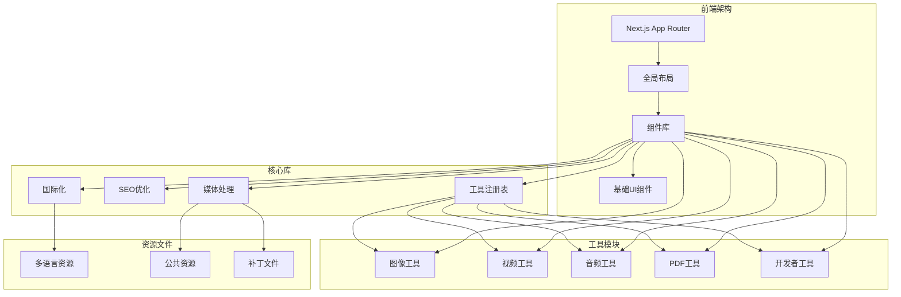

**图表来源**
- [src/lib/registry/index.ts:1-164](file://src/lib/registry/index.ts#L1-L164)
- [src/app/layout.tsx:1-48](file://src/app/layout.tsx#L1-L48)

### 目录结构特点

项目采用按功能域划分的目录结构，每个工具类别都有独立的命名空间，便于维护和扩展：

- **src/app/**：Next.js App Router 页面和布局
- **src/components/**：可复用的 React 组件
- **src/tools/**：按功能分类的工具模块
- **src/lib/**：核心库和工具函数
- **messages/**：多语言翻译资源文件
- **public/**：静态公共资源

**章节来源**
- [README.md:55-78](file://README.md#L55-L78)
- [package.json:1-45](file://package.json#L1-L45)

## 核心特性

PrivaDeck 通过精心设计的功能组合，为用户提供了全面而专业的媒体处理解决方案。

### 隐私优先设计

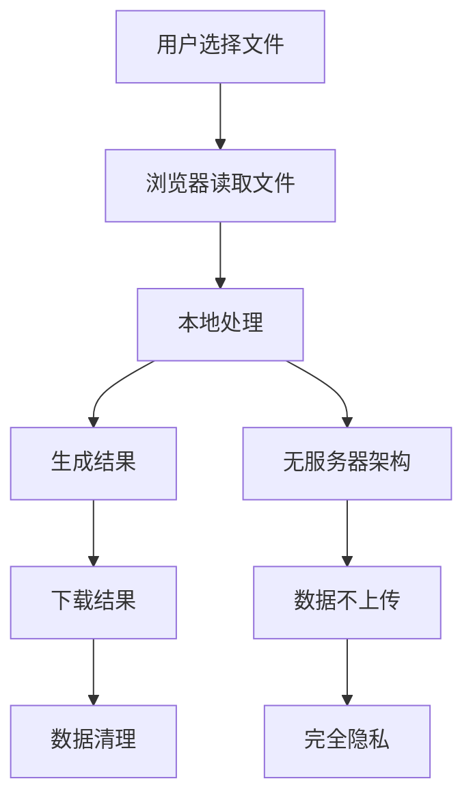

**图表来源**
- [messages/en/common.json:152-199](file://messages/en/common.json#L152-L199)

### 功能矩阵

| 特性类别 | 核心能力 | 技术实现 |
|---------|---------|----------|
| **媒体处理** | 图像、视频、音频、PDF 转换 | FFmpeg.wasm、pdf-lib、浏览器 API |
| **多语言支持** | 21 种语言界面 | next-intl 国际化框架 |
| **视觉体验** | 暗色模式、响应式设计 | Tailwind CSS、next-themes |
| **离线能力** | PWA 支持、缓存机制 | Service Worker、Manifest |
| **SEO 优化** | 结构化数据、hreflang | Next.js SSG、元数据管理 |

### 工具数量统计

项目包含超过 60 个专业工具，按功能分类如下：

- **图像工具**：17 个专业图像处理工具
- **开发者工具**：17 个实用开发辅助工具  
- **PDF 工具**：14 个 PDF 处理功能
- **视频工具**：8 个视频编辑功能
- **音频工具**：4 个音频处理功能

**章节来源**
- [README.md:7-33](file://README.md#L7-L33)
- [README.md:16-24](file://README.md#L16-L24)

## 技术架构

PrivaDeck 采用现代前端技术栈，结合创新的架构设计，实现了高性能、高可靠性的浏览器端媒体处理平台。

### 技术栈概览

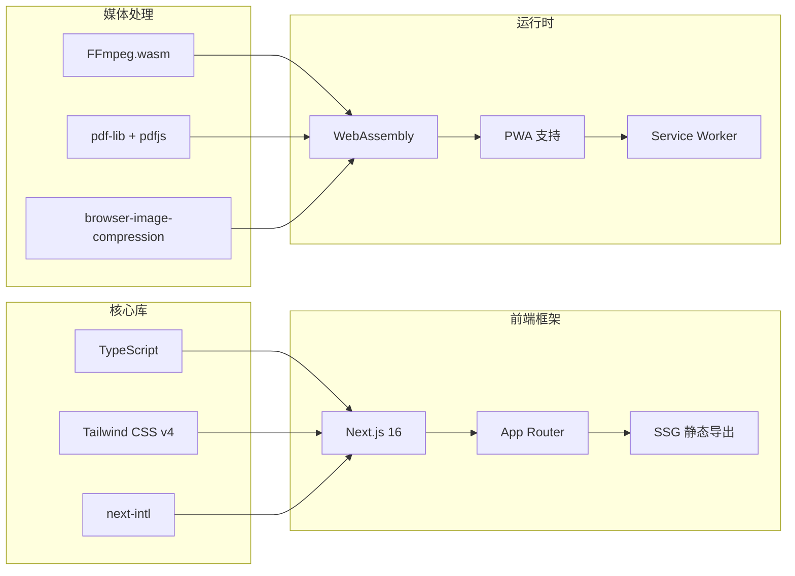

**图表来源**
- [package.json:11-32](file://package.json#L11-L32)
- [next.config.ts:1-30](file://next.config.ts#L1-L30)

### 架构设计原则

1. **零服务器依赖**：完全基于静态网站生成，无任何后端服务
2. **浏览器原生能力**：充分利用现代浏览器提供的强大 API
3. **WebAssembly 性能**：通过 FFmpeg.wasm 实现接近原生的处理速度
4. **渐进式增强**：支持 PWA，提供离线工作能力
5. **模块化设计**：清晰的组件分离和工具注册机制

### 关键技术选型

- **Next.js 16 App Router**：提供现代化的路由和页面架构
- **TypeScript**：增强代码质量和开发体验
- **Tailwind CSS v4**：快速构建响应式用户界面
- **FFmpeg.wasm**：实现浏览器端视频/音频处理
- **pdf-lib + pdfjs-dist**：提供 PDF 处理能力
- **next-intl**：支持 21 种语言的国际化方案

**章节来源**
- [README.md:26-33](file://README.md#L26-L33)
- [package.json:11-32](file://package.json#L11-L32)

## 工具分类体系

PrivaDeck 的工具分类体现了专业性和用户体验的双重考虑，每个分类都针对特定的使用场景和技能需求。

### 分类架构设计

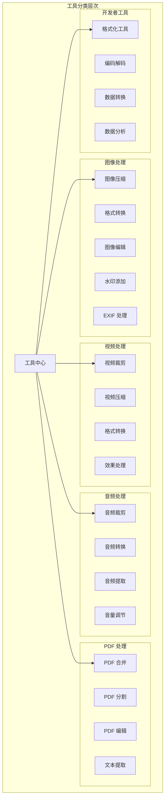

**图表来源**
- [src/lib/registry/index.ts:66-133](file://src/lib/registry/index.ts#L66-L133)

### 工具注册机制

项目采用集中式的工具注册表，实现了工具的统一管理和动态加载：

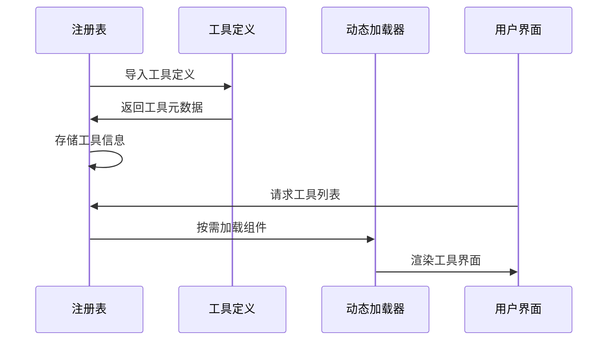

**图表来源**
- [src/lib/registry/index.ts:1-164](file://src/lib/registry/index.ts#L1-L164)

### 工具元数据结构

每个工具都包含完整的元数据定义，支持 SEO 优化和用户引导：

- **slug**：工具的唯一标识符
- **category**：所属功能分类
- **icon**：界面图标标识
- **featured**：是否为推荐工具
- **seo**：SEO 结构化数据配置
- **faq**：常见问题配置
- **relatedSlugs**：相关工具推荐

**章节来源**
- [src/lib/registry/index.ts:1-164](file://src/lib/registry/index.ts#L1-L164)
- [src/tools/image/format-converter/index.ts:1-28](file://src/tools/image/format-converter/index.ts#L1-L28)
- [src/tools/video/compress/index.ts:1-49](file://src/tools/video/compress/index.ts#L1-L49)

## 国际化与本地化

PrivaDeck 提供了全面的国际化支持，覆盖 21 种语言和地区设置，为全球用户提供本地化的使用体验。

### 语言支持矩阵

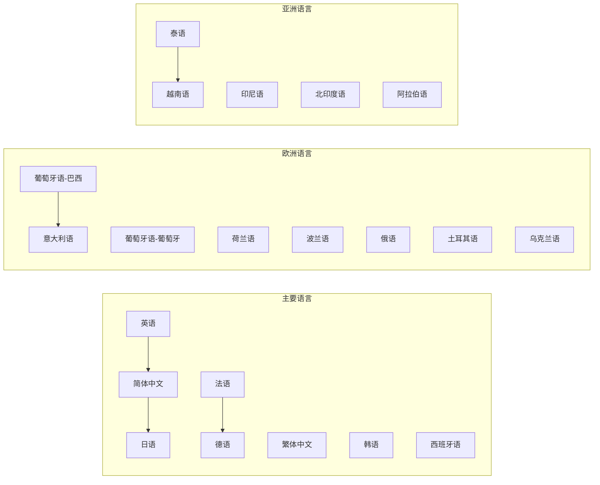

**图表来源**
- [src/i18n/routing.ts:3-8](file://src/i18n/routing.ts#L3-L8)

### 国际化架构

项目采用 next-intl 框架实现多语言支持，具有以下特点：

1. **路由级国际化**：通过 URL 路径区分不同语言版本
2. **动态语言切换**：支持运行时语言切换和主题切换
3. **文化适配**：支持从右到左的语言布局（如阿拉伯语）
4. **SEO 友好**：为每种语言生成独立的页面和 hreflang 标签

### 本地化资源配置

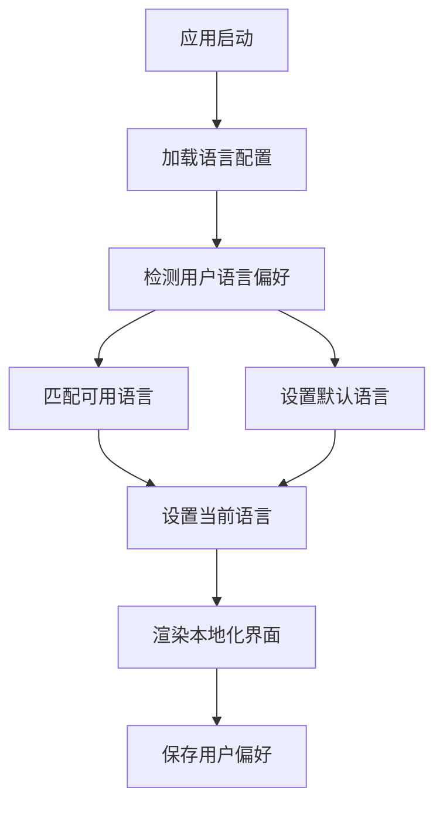

**图表来源**
- [src/i18n/routing.ts:1-18](file://src/i18n/routing.ts#L1-L18)

### 多语言资源管理

项目使用结构化的 JSON 文件管理多语言资源，每个语言都有完整的资源文件：

- **common.json**：通用界面文本和功能描述
- **tools-分类.json**：各工具类别的专用文本
- **工具名称.json**：单个工具的详细说明和帮助文本

**章节来源**
- [src/i18n/routing.ts:1-18](file://src/i18n/routing.ts#L1-L18)
- [messages/en/common.json:1-508](file://messages/en/common.json#L1-L508)

## 隐私保护设计

PrivaDeck 将隐私保护作为设计的核心原则，通过技术架构和功能设计确保用户数据的完全安全。

### 零数据泄露架构

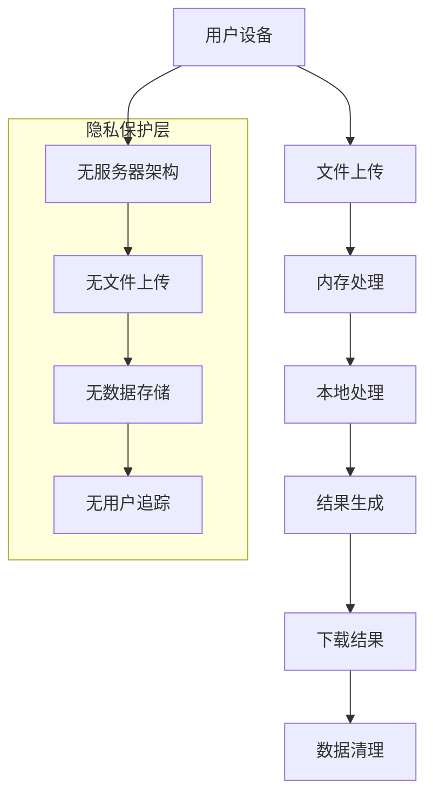

**图表来源**
- [messages/en/common.json:152-199](file://messages/en/common.json#L152-L199)

### 数据流安全设计

1. **端到端加密**：所有处理过程都在用户浏览器中完成
2. **内存安全**：处理后的数据仅存在于内存中，不会持久化
3. **网络隔离**：工具页面完全静态化，无需网络请求
4. **第三方资源最小化**：仅加载必要的 WebAssembly 库

### 隐私声明要点

- **无文件上传**：文件从未离开用户设备
- **无服务器存储**：不使用任何数据库或服务器存储
- **无用户追踪**：不使用 Cookie 或本地存储进行用户追踪
- **开源透明**：完整的源代码可供审查验证

**章节来源**
- [messages/en/common.json:152-199](file://messages/en/common.json#L152-L199)

## 性能优化策略

PrivaDeck 采用了多层次的性能优化策略，确保在各种设备和网络条件下都能提供流畅的用户体验。

### WebAssembly 性能优化

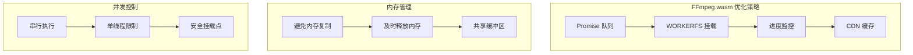

**图表来源**
- [src/lib/ffmpeg.ts:7-82](file://src/lib/ffmpeg.ts#L7-L82)

### 核心优化技术

1. **Promise 队列管理**：确保 FFmpeg 操作的串行执行，避免并发冲突
2. **WORKERFS 挂载**：直接挂载文件对象，避免内存中的完整文件复制
3. **进度回调优化**：精确的进度监控和回调管理
4. **内存及时释放**：处理完成后立即释放 MEMFS 中的临时文件

### 静态生成优化

项目采用 Next.js 的静态生成（SSG）策略，实现了以下性能优势：

- **预渲染页面**：所有工具页面在构建时预渲染，减少运行时计算
- **CDN 分发**：静态资源通过 CDN 加速分发
- **零服务器负载**：完全静态的页面结构，无需服务器端渲染
- **SEO 友好**：自动生成的 sitemap 和结构化数据

### 缓存策略

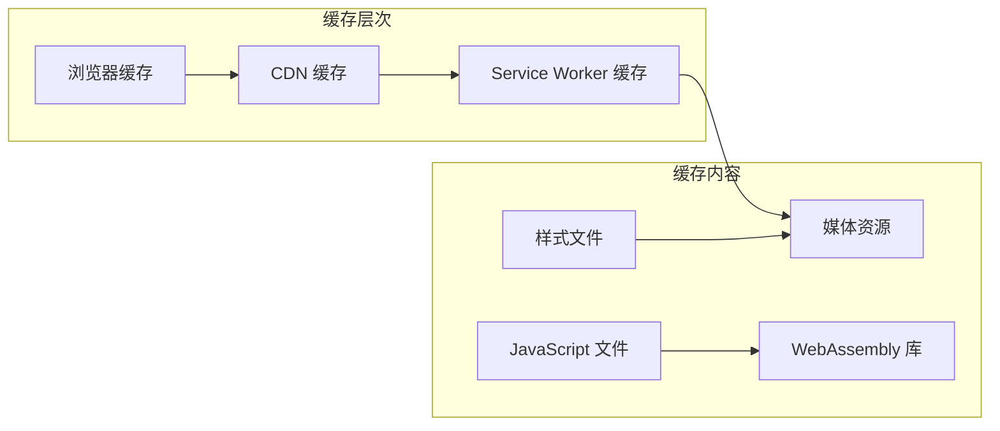

**图表来源**
- [next.config.ts:6-9](file://next.config.ts#L6-L9)

**章节来源**
- [src/lib/ffmpeg.ts:1-144](file://src/lib/ffmpeg.ts#L1-L144)
- [next.config.ts:1-30](file://next.config.ts#L1-L30)

## 快速开始指南

本指南将帮助您快速搭建 PrivaDeck 开发环境，开始参与项目开发或部署生产环境。

### 环境要求

- **Node.js**：版本 18 或更高版本
- **包管理器**：推荐使用 pnpm（版本 8 或更高）
- **操作系统**：Windows、macOS 或 Linux
- **内存**：建议至少 8GB RAM（处理大型媒体文件时）

### 开发环境搭建

#### 1. 项目克隆与依赖安装

```bash
# 克隆项目仓库
git clone https://github.com/your-repo/media_toolbox.git
cd media_toolbox

# 安装项目依赖
pnpm install
```

#### 2. 启动开发服务器

```bash
# 启动开发服务器（使用 Turbopack）
pnpm dev
```

开发服务器启动后，访问 `http://localhost:3000` 查看应用。

#### 3. 构建静态站点

```bash
# 构建生产环境静态站点
pnpm build
```

构建产物输出到 `out/` 目录，可直接部署到 Cloudflare Pages 等静态托管服务。

#### 4. 代码质量检查

```bash
# 运行 ESLint 代码检查
pnpm lint
```

### 生产环境部署

#### 静态托管部署

PrivaDeck 设计为完全静态的网站，支持多种静态托管服务：

```bash
# 1. 构建静态站点
pnpm build

# 2. 部署到 Cloudflare Pages
# 在 Cloudflare Dashboard 中选择 out/ 目录

# 3. 或部署到其他静态托管服务
# 直接上传 out/ 目录的内容
```

#### PWA 功能验证

```bash
# 1. 访问应用
# 2. 打开浏览器开发者工具
# 3. 检查 Application 标签页
# 4. 验证 Service Worker 状态
# 5. 测试离线功能
```

### 开发工作流程

#### 添加新工具的完整流程

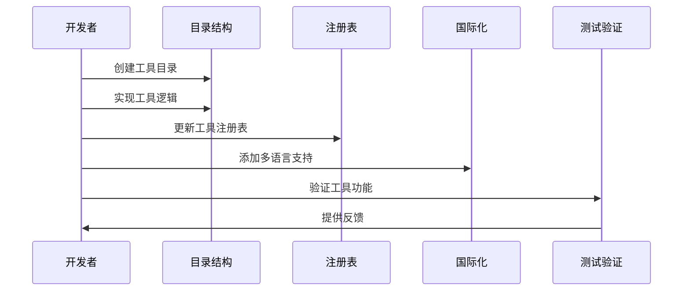

**图表来源**
- [README.md:80-84](file://README.md#L80-L84)

#### 工具开发规范

1. **目录结构**：`src/tools/{分类}/{slug}/`
2. **文件命名**：`index.ts`（工具定义）、`{Name}.tsx`（组件）、`logic.ts`（处理逻辑）
3. **注册机制**：在注册表中添加工具定义
4. **国际化**：在所有 21 种语言中添加对应的翻译键值

**章节来源**
- [README.md:35-53](file://README.md#L35-L53)
- [README.md:80-84](file://README.md#L80-L84)

## 架构设计理念

PrivaDeck 的架构设计体现了现代前端工程的最佳实践，通过精心的设计决策实现了功能完整性、性能优化和用户体验的平衡。

### 整体设计理念

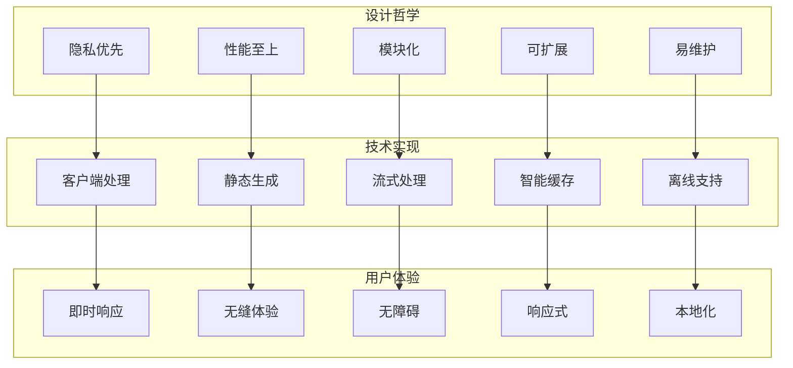

### 核心设计原则

#### 1. 隐私至上的架构设计

- **零服务器依赖**：完全基于静态网站生成
- **本地处理优先**：所有计算在用户设备上完成
- **数据最小化**：仅传输必要的处理参数
- **透明度保证**：完整的源代码和处理流程

#### 2. 性能优化的工程实践

- **静态生成**：预渲染所有页面，减少运行时开销
- **懒加载策略**：按需加载工具组件和资源
- **缓存机制**：多层缓存策略提升重复访问速度
- **资源优化**：压缩和优化所有静态资源

#### 3. 可扩展的模块化架构

- **工具注册表**：统一的工具管理和发现机制
- **分类化组织**：按功能域划分的清晰目录结构
- **接口标准化**：统一的工具开发和集成接口
- **插件化扩展**：支持新增工具类型的灵活机制

### 技术债务管理

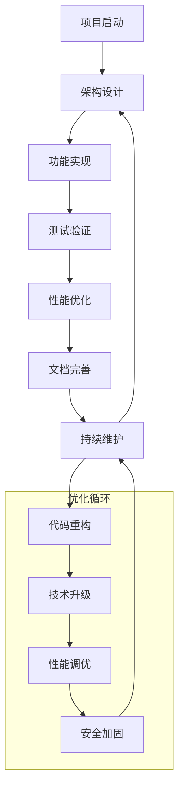

### 社区贡献指南

项目欢迎社区贡献，提供了完善的开发和贡献流程：

1. **问题报告**：详细的 bug 报告模板和重现步骤
2. **功能请求**：标准化的功能请求流程和优先级评估
3. **代码贡献**：清晰的代码规范和审查流程
4. **文档改进**：多语言文档的协作编辑机制

**章节来源**
- [tsconfig.json:1-35](file://tsconfig.json#L1-L35)
- [src/app/layout.tsx:1-48](file://src/app/layout.tsx#L1-L48)

## 总结

PrivaDeck 代表了浏览器端媒体处理技术的发展方向，通过创新的架构设计和技术选型，成功地将复杂的媒体处理功能带到了用户的浏览器中。

### 项目成就

- **技术突破**：证明了浏览器端处理复杂媒体任务的可行性
- **隐私典范**：为数字隐私保护提供了实际的解决方案
- **性能标杆**：展示了现代 Web 技术的强大性能潜力
- **用户体验**：提供了接近原生应用的使用体验

### 未来展望

PrivaDeck 的发展将继续围绕以下几个方向：

1. **技术演进**：跟进最新的 Web 技术标准和最佳实践
2. **功能扩展**：持续增加新的工具和功能模块
3. **性能优化**：不断提升处理速度和资源利用率
4. **生态建设**：建立更完善的开发者和用户社区

### 对开发者的启示

PrivaDeck 为前端开发者提供了宝贵的实践经验：

- **浏览器能力认知**：充分了解现代浏览器的强大功能
- **性能优化策略**：掌握客户端性能优化的各种技术手段
- **架构设计思维**：学习如何设计可扩展的前端架构
- **用户体验设计**：理解如何在技术限制下提供优秀的用户体验

PrivaDeck 不仅仅是一个媒体处理工具箱，更是现代前端技术应用的典范，为整个行业展示了浏览器端应用的巨大潜力和价值。